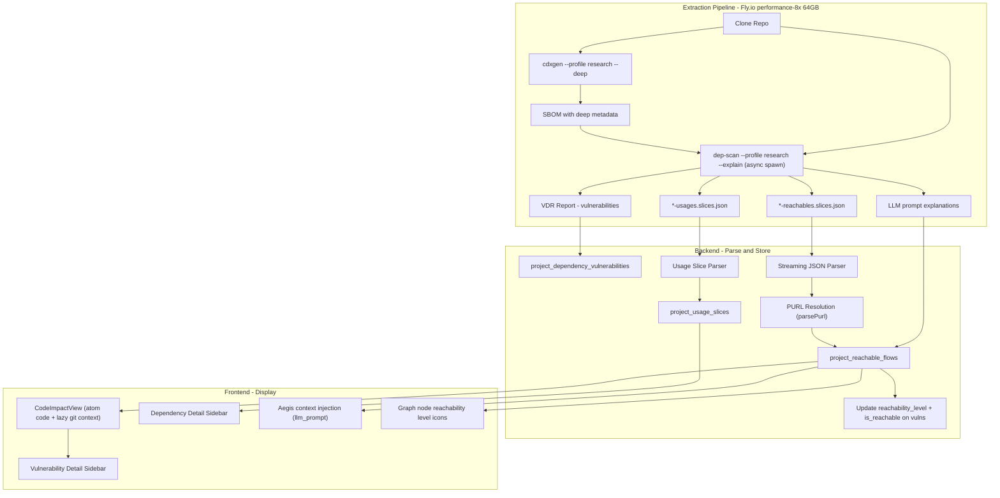

## Phase 6B: Code-Level Reachability Engine

**Goal:** Unlock deep code-level reachability analysis by leveraging dep-scan's built-in research profile and the atom static analysis engine. This transforms our current module-level reachability ("Your code imports lodash") into source-to-sink data-flow tracing ("User input from req.body flows through processInput() into lodash.merge(), which has a prototype pollution vulnerability"). All without building custom call graph tools from scratch -- dep-scan + atom already does this; we just need to enable and parse it.

**Timeline:** ~3-4 weeks. The heavy lifting (call graph generation, data-flow analysis, code slicing) is already implemented in dep-scan/atom. Our work is: enable the research profile, parse output files, store results, display in UI.

**Relationship to Phase 6:** Phase 6 (Security Tab UI) works with the basic `depscan:insights` reachability initially. Phase 6B enhances Phase 6 by feeding deep data-flow reachability into the vulnerability detail sidebar (6D), dependency sidebar (6E), Aegis copilot (6G), and graph node enrichment (6A). The sidebars are designed to progressively show more detail as reachability data becomes available.

### How dep-scan Research Profile Works

dep-scan has two modes. We currently run basic mode (just vulnerability matching). Research mode activates the **atom** engine (Apache 2.0, from the AppThreat project) which performs:

1. **Code slicing**: Parses the entire codebase into an intermediate representation (IR)
2. **Call graph construction**: Maps function-to-function calls across user code AND into dependencies
3. **Data-flow analysis**: Traces data from "sources" (framework entry points like HTTP request params, form data, route handlers) through the code into "sinks" (external library function calls)
4. **Reachability determination**: Cross-references reachable library sinks against the vulnerability database. If user-controlled data can reach a function in a vulnerable package, it's flagged as reachable.

This is fundamentally different from the Endor Labs / Snyk approach (which requires a pre-curated database of "CVE X affects function Y"). dep-scan traces ALL data flows from sources to sinks automatically. No manual curation needed. If a vulnerability exists in a package and your code sends data into that package, it's detected.

**Important caveat:** Without a CVE-to-function mapping database (deferred to a future enhancement), "data_flow" means "user-controlled data reaches the package," not necessarily the specific vulnerable function within that package. The UI must clearly communicate this distinction to avoid over-promising. See the Reachability Depth Levels section below.

### Reachability Depth Levels

```
Level 1: "lodash has CVE-XXXX"                    <-- dep-scan basic (what we have now)
Level 2: "Your code imports lodash"                <-- depscan:insights (what we have now)
Level 3: "You use lodash.merge() via alias '_'"    <-- atom usages slices (Phase 6B)
Level 4: "req.body -> processInput() -> _.merge()" <-- atom reachables slices (Phase 6B)
Level 5: "Here's your code in context"             <-- lazy code context via git provider (Phase 6B)
```

Phase 6B takes us from Level 2 to Level 5.

**Mapping to `reachability_level` column on `project_dependency_vulnerabilities`:**

| Level | Column value | Meaning | Source |
|-------|-------------|---------|--------|
| 1 | `unreachable` | Package not imported at all | No `depscan:insights` match |
| 2 | `module` | Package is imported | `depscan:insights` starts with "Used in" |
| 3 | `function` | Specific functions from the package are called | atom usage slices resolve method names |
| 4 | `data_flow` | User-controlled data flows INTO the package | atom reachable flows (but specific vulnerable function unknown without CVE-to-function mapping) |
| 5 | `confirmed` | Reserved for future CVE-to-function mapping | Not used in Phase 6B |

### Architecture Overview




### 6B-A: Enable Research Profile in Pipeline

**Change in** [pipeline.ts](backend/extraction-worker/src/pipeline.ts):

**cdxgen: keep separate step, add research flags.** We keep the existing separate cdxgen invocation (the pipeline needs the SBOM parsed before dep-scan runs). Add research profile flags so cdxgen generates enhanced metadata that atom needs:

```typescript
const cdxgenArgs = [
  '-o', sbomPath,
  '--profile', 'research',
  '--deep',
  '-t', ecosystem,
  workspaceRoot,
];
```

**cdxgen timeout increase:** Bump from 5 min to 15 min. Research profile SBOM generation takes longer due to deep metadata collection:

```typescript
execSync(cdxgenCmd, {
  stdio: 'pipe',
  timeout: 15 * 60 * 1000, // 15 min (up from 5 min)
  maxBuffer: 50 * 1024 * 1024,
});
```

**dep-scan: add research profile, KEEP VDRAnalyzer.** The `--vulnerability-analyzer VDRAnalyzer` flag is NOT implied by `--profile research` -- removing it could change vulnerability matching behavior. Keep it alongside the new flags:

```typescript
const depScanArgs = [
  '--profile', 'research',
  '--bom', bomArg,
  '--reports-dir', outArg,
  '-t', ecosystem,
  '--no-banner',
  '--vulnerability-analyzer', 'VDRAnalyzer',
  '--explain',
  '--explanation-mode', 'LLMPrompts',
];
```

The `--profile research` flag tells dep-scan to:

1. Run atom to create code slices, call graphs, and data-flow analysis using the SBOM from cdxgen
2. Compute reachable flows using the FrameworkReachability algorithm (default)
3. Output `*-reachables.slices.json` and `*-usages.slices.json` alongside the normal VDR report

The `--explain --explanation-mode LLMPrompts` flags generate AI-ready prompt text for each reachable vulnerability, stored in the reports directory.

**CRITICAL: Switch `spawnSync` to async `spawn()`.** The current `spawnSync` call blocks the entire Node.js event loop. With a 3-hour timeout, this means:
- No heartbeats sent (extraction worker sends heartbeats every 60s)
- After 5 minutes without heartbeat, the recovery cron marks the job as stuck and restarts it
- The blocked process can't handle graceful shutdown signals

Replace with async `spawn()`:

```typescript
function runDepScan(
  depScanExe: string,
  args: string[],
  cwd: string,
  logger: ExtractionLogger,
  heartbeat: () => Promise<void>,
  timeoutMs: number = 180 * 60 * 1000, // 3 hours max
): Promise<{ stdout: string; stderr: string; exitCode: number }> {
  return new Promise((resolve, reject) => {
    const child = spawn(depScanExe, args, { cwd, stdio: 'pipe' });
    let stdout = '';
    let stderr = '';
    const startTime = Date.now();

    child.stdout.on('data', (data) => {
      stdout += data.toString();
      logger.log('depscan', data.toString().trim());
    });
    child.stderr.on('data', (data) => {
      stderr += data.toString();
    });

    // Heartbeat + progress ticker every 60s
    const heartbeatInterval = setInterval(async () => {
      try {
        await heartbeat();
        const elapsed = Math.round((Date.now() - startTime) / 60000);
        logger.log('depscan', `Atom analysis in progress (${elapsed} min elapsed)...`);
      } catch {}
    }, 60_000);

    const timeout = setTimeout(() => {
      child.kill('SIGTERM');
      clearInterval(heartbeatInterval);
      reject(new Error(`dep-scan timed out after ${timeoutMs / 60000} min`));
    }, timeoutMs);

    child.on('close', (code) => {
      clearInterval(heartbeatInterval);
      clearTimeout(timeout);
      resolve({ stdout, stderr, exitCode: code ?? 1 });
    });

    child.on('error', (err) => {
      clearInterval(heartbeatInterval);
      clearTimeout(timeout);
      reject(err);
    });
  });
}
```

**Pin dep-scan version** in the extraction worker Dockerfile to a tested version. Atom's output format (reachables/usages slices) is not formally versioned and could change between dep-scan releases. Example:

```dockerfile
RUN pip install owasp-depscan==5.x.x
```

The exact version should be verified against the reachables/usages slice format documented in this plan before pinning.

**Machine sizing:** The Fly.io extraction machines are `performance-8x` with 64GB RAM (updated in Phase 2). This accommodates atom's memory requirements: 32GB minimum for medium projects, 64GB for large codebases. The performance (dedicated) CPU tier ensures consistent throughput for the compute-heavy static analysis.

### 6B-B: PURL Resolution Utility

**New file:** [backend/extraction-worker/src/purl.ts](backend/extraction-worker/src/purl.ts)

dep-scan's reachable flows reference dependencies by Package URL (PURL), e.g., `pkg:npm/lodash@4.17.15`. Our database stores dependencies by `name` + `version` as separate columns. A PURL parser bridges this gap.

**PURL spec format:** `pkg:type/namespace/name@version?qualifiers#subpath`

```typescript
export interface ParsedPurl {
  ecosystem: string;  // 'npm', 'pypi', 'maven', 'golang', 'cargo', etc.
  name: string;       // decoded package name (e.g., '@angular/core')
  version: string;    // exact version string
  namespace?: string; // Maven groupId, npm scope, etc.
  qualifiers?: Record<string, string>;
}

const PURL_TYPE_TO_ECOSYSTEM: Record<string, string> = {
  npm: 'npm',
  pypi: 'pypi',
  maven: 'maven',
  golang: 'golang',
  cargo: 'cargo',
  gem: 'gem',
  composer: 'composer',
  pub: 'pub',
  hex: 'hex',
  swift: 'swift',
  nuget: 'nuget',
};

export function parsePurl(purl: string): ParsedPurl | null {
  // Format: pkg:type/namespace/name@version?qualifiers#subpath
  if (!purl.startsWith('pkg:')) return null;

  try {
    const withoutScheme = purl.slice(4);
    const [typeAndPath, ...rest] = withoutScheme.split('?');
    const hashIdx = typeAndPath.indexOf('#');
    const pathPart = hashIdx >= 0 ? typeAndPath.slice(0, hashIdx) : typeAndPath;

    const slashIdx = pathPart.indexOf('/');
    if (slashIdx < 0) return null;

    const purlType = pathPart.slice(0, slashIdx);
    const ecosystem = PURL_TYPE_TO_ECOSYSTEM[purlType];
    if (!ecosystem) return null;

    let remainder = decodeURIComponent(pathPart.slice(slashIdx + 1));
    const atIdx = remainder.lastIndexOf('@');
    if (atIdx < 0) return null;

    const version = remainder.slice(atIdx + 1);
    const nameWithNamespace = remainder.slice(0, atIdx);

    // Handle namespaced packages
    let name: string;
    let namespace: string | undefined;

    if (purlType === 'maven') {
      // Maven: pkg:maven/org.apache/commons-lang3@3.12 -> org.apache:commons-lang3
      const parts = nameWithNamespace.split('/');
      if (parts.length === 2) {
        namespace = parts[0];
        name = `${parts[0]}:${parts[1]}`;
      } else {
        name = nameWithNamespace;
      }
    } else if (purlType === 'npm' && nameWithNamespace.includes('/')) {
      // npm scoped: pkg:npm/%40angular/core@15 -> @angular/core
      const parts = nameWithNamespace.split('/');
      namespace = parts[0];
      name = `${parts[0]}/${parts.slice(1).join('/')}`;
    } else {
      name = nameWithNamespace;
    }

    return { ecosystem, name, version, namespace };
  } catch {
    return null;
  }
}
```

**Dependency resolution:** After parsing, resolve against the `dependencies` table:

```typescript
export async function resolvePurlToDependencyId(
  supabase: SupabaseClient,
  parsed: ParsedPurl,
): Promise<string | null> {
  const { data } = await supabase
    .from('dependencies')
    .select('id')
    .eq('name', parsed.name)
    .limit(1)
    .single();
  return data?.id ?? null;
}
```

When a PURL doesn't match any known dependency, log a warning and store the flow with `dependency_id = null`. This is expected for transitive dependencies that haven't been populated yet.

### 6B-C: Parse Reachable Flows

After dep-scan completes, look for `*-reachables.slices.json` in the reports directory. Each file contains an array of reachable flow entries:

```json
[
  {
    "flows": [
      {
        "id": 44,
        "label": "METHOD_PARAMETER_IN",
        "name": "req",
        "fullName": "",
        "signature": "",
        "isExternal": false,
        "code": "req",
        "typeFullName": "express.Request",
        "parentMethodName": "processInput",
        "parentMethodSignature": "void(express.Request,express.Response)",
        "parentFileName": "src/api/handler.ts",
        "parentPackageName": "com.example.app",
        "parentClassName": "handler",
        "lineNumber": 40,
        "columnNumber": 2,
        "tags": "framework-input"
      },
      {
        "id": 88,
        "label": "CALL",
        "name": "merge",
        "fullName": "lodash.merge",
        "isExternal": true,
        "code": "_.merge({}, data)",
        "typeFullName": "lodash",
        "parentMethodName": "processInput",
        "parentFileName": "src/api/handler.ts",
        "lineNumber": 42,
        "tags": ""
      }
    ],
    "purls": [
      "pkg:npm/lodash@4.17.15"
    ]
  }
]
```

Each entry contains:

- `flows[]`: Ordered array of nodes tracing the data flow from source to sink. Each node has: file path, line number, column, method name, class name, code snippet, whether the call is external (library), and tags (e.g. "framework-input" for entry points).
- `purls[]`: The Package URLs of the dependencies reached by this flow. Resolved to `dependency_id` via `parsePurl()`.

**New database table:**

```sql
CREATE TABLE project_reachable_flows (
  id UUID PRIMARY KEY DEFAULT uuid_generate_v4(),
  project_id UUID NOT NULL REFERENCES projects(id) ON DELETE CASCADE,
  extraction_run_id TEXT NOT NULL,
  purl TEXT NOT NULL,
  dependency_id UUID REFERENCES dependencies(id),
  flow_nodes JSONB NOT NULL,
  -- Array of flow nodes: [{ id, label, name, fullName, isExternal, code,
  --   typeFullName, parentMethodName, parentMethodSignature, parentFileName,
  --   parentPackageName, parentClassName, lineNumber, columnNumber, tags }]
  entry_point_file TEXT,
  entry_point_method TEXT,
  entry_point_line INTEGER,
  entry_point_tag TEXT, -- 'framework-input', 'route-handler', etc.
  sink_file TEXT,
  sink_method TEXT,
  sink_line INTEGER,
  sink_is_external BOOLEAN DEFAULT true,
  flow_length INTEGER, -- number of nodes in the flow
  llm_prompt TEXT, -- LLM-ready prompt text from dep-scan --explanation-mode LLMPrompts
  created_at TIMESTAMPTZ DEFAULT NOW(),
  UNIQUE(project_id, extraction_run_id, purl, entry_point_file, entry_point_line, sink_method)
);

CREATE INDEX idx_prf_project_purl ON project_reachable_flows(project_id, purl);
CREATE INDEX idx_prf_project_dep ON project_reachable_flows(project_id, dependency_id);
CREATE INDEX idx_prf_project_entry ON project_reachable_flows(project_id, entry_point_file);
CREATE INDEX idx_prf_run ON project_reachable_flows(extraction_run_id);
```

Key schema differences from original plan:
- `extraction_run_id` enables stale data cleanup (matching Semgrep/TruffleHog pattern)
- `UNIQUE` constraint enables proper upsert with `onConflict`
- `dependency_id` FK resolved from PURL at parse time via `parsePurl()`
- `llm_prompt` stores LLM-ready context per flow (consumed by Aegis)

**Parsing logic in pipeline.ts:**

For files under 50MB, synchronous `JSON.parse` is acceptable. For larger files (common in large Java projects), use the `stream-json` package to avoid loading the entire file into memory:

```typescript
import { parser } from 'stream-json';
import { streamArray } from 'stream-json/streamers/StreamArray';

async function parseReachableFlows(
  reportsDir: string,
  projectId: string,
  runId: string,
  supabase: SupabaseClient,
  logger: ExtractionLogger,
): Promise<void> {
  const reachableFiles = fs.readdirSync(reportsDir)
    .filter(f => f.endsWith('-reachables.slices.json'));

  if (reachableFiles.length === 0) {
    logger.log('reachability', 'No reachable slices found -- skipping deep reachability');
    return;
  }

  let totalFlows = 0;
  let skippedFlows = 0;
  let unmatchedPurls = 0;

  for (const rf of reachableFiles) {
    const filePath = path.join(reportsDir, rf);
    const fileSize = fs.statSync(filePath).size;

    let slices: any[];
    if (fileSize > 50 * 1024 * 1024) {
      // Streaming parse for large files (>50MB)
      slices = await streamParseJsonArray(filePath);
    } else {
      try {
        slices = JSON.parse(fs.readFileSync(filePath, 'utf8'));
      } catch (err) {
        logger.log('reachability', `Failed to parse ${rf}: ${err}. Skipping.`);
        continue;
      }
    }

    if (!Array.isArray(slices)) {
      logger.log('reachability', `${rf} is not an array. Skipping.`);
      continue;
    }

    const batch: any[] = [];

    for (const slice of slices) {
      if (!slice.flows?.length || !slice.purls?.length) {
        skippedFlows++;
        continue;
      }
      if (slice.flows.length < 2) {
        logger.log('reachability', `Skipping flow with ${slice.flows.length} node(s) -- need >= 2`);
        skippedFlows++;
        continue;
      }

      const firstNode = slice.flows[0];
      const lastNode = slice.flows[slice.flows.length - 1];

      for (const purl of slice.purls) {
        if (!purl || typeof purl !== 'string') continue;
        const parsed = parsePurl(purl);
        let dependencyId: string | null = null;
        if (parsed) {
          dependencyId = await resolvePurlToDependencyId(supabase, parsed);
          if (!dependencyId) {
            unmatchedPurls++;
          }
        }

        batch.push({
          project_id: projectId,
          extraction_run_id: runId,
          purl,
          dependency_id: dependencyId,
          flow_nodes: slice.flows,
          entry_point_file: firstNode.parentFileName ?? null,
          entry_point_method: firstNode.parentMethodName ?? null,
          entry_point_line: firstNode.lineNumber ?? null,
          entry_point_tag: firstNode.tags || null,
          sink_file: lastNode.parentFileName ?? null,
          sink_method: lastNode.fullName || lastNode.name || null,
          sink_line: lastNode.lineNumber ?? null,
          sink_is_external: lastNode.isExternal ?? true,
          flow_length: slice.flows.length,
          llm_prompt: null, // populated in LLM prompt matching pass
        });
        totalFlows++;
      }
    }

    // Upsert in batches of 100
    for (let i = 0; i < batch.length; i += 100) {
      const chunk = batch.slice(i, i + 100);
      await supabase.from('project_reachable_flows').upsert(chunk, {
        onConflict: 'project_id,extraction_run_id,purl,entry_point_file,entry_point_line,sink_method',
      });
    }
  }

  logger.log('reachability', `Parsed ${totalFlows} reachable flows (${skippedFlows} skipped, ${unmatchedPurls} unmatched PURLs)`);
}
```

**Update reachability level on vulnerabilities:**

After parsing flows, cross-reference with `project_dependency_vulnerabilities` to upgrade `reachability_level`:

```sql
ALTER TABLE project_dependency_vulnerabilities
  ADD COLUMN IF NOT EXISTS reachability_level TEXT DEFAULT NULL,
  -- NULL = not yet analyzed, 'unreachable', 'module', 'function', 'data_flow', 'confirmed'
  ADD COLUMN IF NOT EXISTS reachability_details JSONB;
  -- { flow_count: 3, entry_points: ['handler.ts:40', 'api.ts:15'],
  --   sink_methods: ['lodash.merge'], tags: ['framework-input'] }
```

**Migration for `is_reachable` boolean:** The existing `is_reachable BOOLEAN` column is kept for backward compatibility. After setting `reachability_level`, derive `is_reachable` from it:

```typescript
// is_reachable = true when level is anything other than 'unreachable'
const isReachable = reachabilityLevel !== 'unreachable';
```

The frontend's `reachableVulns()` function continues to work unchanged via `is_reachable`. New Phase 6B UI uses `reachability_level` for tiered display.

**Reachability level assignment algorithm:**

```typescript
async function updateReachabilityLevels(
  projectId: string,
  supabase: SupabaseClient,
): Promise<void> {
  // 1. Get all project_dependency_vulnerabilities for this project
  const { data: pdvs } = await supabase
    .from('project_dependency_vulnerabilities')
    .select('id, project_dependency_id, osv_id')
    .eq('project_id', projectId);

  // 2. Get all project_dependencies to map dep_id -> dependency_id
  const { data: pds } = await supabase
    .from('project_dependencies')
    .select('id, dependency_id')
    .eq('project_id', projectId);

  const depIdMap = new Map(pds?.map(pd => [pd.id, pd.dependency_id]) ?? []);

  // 3. Get all reachable flows for this project (latest run)
  const { data: flows } = await supabase
    .from('project_reachable_flows')
    .select('dependency_id, entry_point_file, entry_point_line, entry_point_tag, sink_method')
    .eq('project_id', projectId);

  // 4. Index flows by dependency_id
  const flowsByDep = new Map<string, typeof flows>();
  for (const flow of flows ?? []) {
    if (!flow.dependency_id) continue;
    const existing = flowsByDep.get(flow.dependency_id) ?? [];
    existing.push(flow);
    flowsByDep.set(flow.dependency_id, existing);
  }

  // 5. Get usage slices for 'function' level detection
  const { data: usages } = await supabase
    .from('project_usage_slices')
    .select('target_type, resolved_method')
    .eq('project_id', projectId);

  const usedTypes = new Set(usages?.map(u => u.target_type).filter(Boolean) ?? []);

  // 6. For each vulnerability, determine level
  for (const pdv of pdvs ?? []) {
    const dependencyId = depIdMap.get(pdv.project_dependency_id);
    if (!dependencyId) continue;

    const matchingFlows = flowsByDep.get(dependencyId) ?? [];

    let level: string;
    let details: any = null;

    if (matchingFlows.length > 0) {
      const hasFrameworkInput = matchingFlows.some(f => f.entry_point_tag === 'framework-input');
      level = hasFrameworkInput ? 'data_flow' : 'data_flow';
      // NOTE: 'confirmed' reserved for future CVE-to-function mapping
      details = {
        flow_count: matchingFlows.length,
        entry_points: matchingFlows.map(f => `${f.entry_point_file}:${f.entry_point_line}`),
        sink_methods: [...new Set(matchingFlows.map(f => f.sink_method).filter(Boolean))],
        tags: [...new Set(matchingFlows.map(f => f.entry_point_tag).filter(Boolean))],
      };
    } else {
      // Check usage slices for 'function' level
      // (dependency name matches a target_type in usage slices)
      const { data: dep } = await supabase
        .from('dependencies')
        .select('name')
        .eq('id', dependencyId)
        .single();

      if (dep && usedTypes.has(dep.name)) {
        level = 'function';
      } else {
        level = 'module'; // fallback: basic depscan:insights level
      }
    }

    const isReachable = level !== 'unreachable';

    await supabase
      .from('project_dependency_vulnerabilities')
      .update({ reachability_level: level, reachability_details: details, is_reachable: isReachable })
      .eq('id', pdv.id);
  }
}
```

### 6B-D: Parse Usage Slices

dep-scan also outputs `*-usages.slices.json` files. These tell us HOW each library is used -- actual usage locations, resolved method names, and type information.

Usages slice format:

```json
{
  "objectSlices": [
    {
      "fullName": "handler.processInput:void(Request,Response)",
      "fileName": "src/api/handler.ts",
      "lineNumber": 40,
      "usages": [
        {
          "targetObj": {
            "name": "merge",
            "typeFullName": "lodash",
            "lineNumber": 42,
            "label": "LOCAL"
          },
          "invokedCalls": [
            {
              "callName": "merge",
              "resolvedMethod": "lodash.merge",
              "lineNumber": 42
            }
          ]
        }
      ]
    }
  ],
  "userDefinedTypes": [
    {
      "name": "handler",
      "fields": [],
      "procedures": [
        {
          "callName": "processInput",
          "paramTypes": ["Request", "Response"],
          "returnType": "void",
          "lineNumber": 40
        }
      ]
    }
  ]
}
```

**New database table:**

```sql
CREATE TABLE project_usage_slices (
  id UUID PRIMARY KEY DEFAULT uuid_generate_v4(),
  project_id UUID NOT NULL REFERENCES projects(id) ON DELETE CASCADE,
  extraction_run_id TEXT NOT NULL,
  file_path TEXT NOT NULL,
  line_number INTEGER NOT NULL,
  containing_method TEXT,
  target_name TEXT NOT NULL,
  target_type TEXT,
  resolved_method TEXT,
  usage_label TEXT,
  ecosystem TEXT,
  created_at TIMESTAMPTZ DEFAULT NOW(),
  UNIQUE(project_id, file_path, line_number, target_name)
);

CREATE INDEX idx_pus_project_type ON project_usage_slices(project_id, target_type);
CREATE INDEX idx_pus_project_file ON project_usage_slices(project_id, file_path);
CREATE INDEX idx_pus_run ON project_usage_slices(extraction_run_id);
```

Key schema difference from original plan: `extraction_run_id` added for stale data cleanup.

**Relationship with existing oxc-parser AST pipeline:** The existing oxc-parser pipeline (`project_dependency_functions`, `project_dependency_files`) **continues to run**. It is actively consumed by the frontend (import counts, file lists in dependency sidebars, supply chain tab). Usage slices are **supplementary** data providing richer context (resolved method names, type info) that powers Phase 6B UI. Consolidation of the two systems is a follow-up task after Phase 6B ships.

### 6B-E: Code Context and CodeImpactView

**Goal:** Display actual source code showing the vulnerability in context. Users see exactly where in their code the vulnerability is exploitable.

**Security decision: NO source code stored in the database.** Storing raw source code in DB tables is a security risk -- if the database is breached, attackers get actual source code that may contain API keys, business logic, or credentials. Instead, we use a two-tier approach:

**Tier 1 (always available):** Atom's `code` field is already stored in `flow_nodes` JSONB on `project_reachable_flows`. This provides the 1-line code snippet at each flow node. The `CodeImpactView` component renders these inline snippets with syntax highlighting. No additional DB storage needed.

**Tier 2 (on-demand, lazy):** When a user clicks "Show expanded context" on a flow node, the frontend calls a new endpoint that fetches the surrounding 5 lines via the git provider API (GitHub/GitLab/Bitbucket file content endpoint). This uses the existing [git-provider.ts](backend/src/lib/git-provider.ts) infrastructure. Response is NOT cached in DB -- it's fetched fresh each time (fast, <500ms per file).

**New endpoint:** `GET /api/organizations/:orgId/projects/:projectId/reachable-flows/:flowId/code-context?step=0`

- `step` parameter selects which flow node to expand (0 = entry point, N = last node)
- Uses the project's connected repo integration to fetch file content at the specified path + line range
- Returns `{ filePath, startLine, endLine, code, language }` or 404 if flow/step not found
- Rate-limited to 30 req/min per user (prevents bulk source code exfiltration)
- Auth: requires project membership (any role)
- If the repo integration is disconnected or the file doesn't exist, return 404 with appropriate message

**Frontend: `CodeImpactView.tsx` component:**

```
Affected Code -- DATA FLOW TRACED

  YOUR CODE (entry point: framework-input)
  +-- src/api/handler.ts:42 -- processInput()
  | 42 |   const merged = _.merge({}, data);    <-- calls vulnerable function
  +----
  [Show expanded context]

       | user input flows into lodash.merge()
       v

  VULNERABLE DEPENDENCY
  +-- lodash (via pkg:npm/lodash@4.17.15)
  | 42 |   _.merge({}, data)                    <-- atom code field
  +----
  [Show expanded context]

  Risk: Data from req.body flows into lodash.merge().
        The specific vulnerable function may or may not be in this path.

  [Explain with Aegis]  [Fix with AI]
```

Built with:

- Syntax highlighting via `prism-react-renderer` or `shiki` (using atom's inline `code` fields)
- Line number gutter with highlighted call-site lines
- Call chain arrows between snippets
- Collapsible intermediate steps for long chains (>3 nodes)
- "framework-input" tag displayed as a badge on the entry point
- "Show expanded context" button triggers lazy fetch via git provider API
- Footer note: "Analysis may vary between runs" (atom is non-deterministic)

### 6B-F: LLMPrompts Integration for Aegis

dep-scan with `--explain --explanation-mode LLMPrompts` generates AI-ready prompt text for each reachable vulnerability. This is a direct feed into our Aegis Security Copilot.

The generated prompts include:

- Description of the data flow path
- Entry point and sink identification
- Vulnerable function context
- Suggested remediation directions

**Storage:** LLM prompts are stored in the `llm_prompt TEXT` column on `project_reachable_flows` (one prompt per flow). The pipeline parses the LLMPrompts output file and matches prompts to flows by PURL + entry point file/line.

**Access control:** LLM prompts are served only via the vulnerability detail endpoint (`GET /api/.../vulnerabilities/:osvId/detail`), which requires project membership. No separate endpoint needed. When a user opens the Aegis copilot panel for a specific vulnerability, the prompt is injected into the Aegis context automatically.

### 6B-G: Updated Depscore Calculation

The depscore formula in [depscore.ts](backend/extraction-worker/src/depscore.ts) currently uses `isReachable: boolean`. Phase 6B introduces tiered reachability weights:

```typescript
const REACHABILITY_LEVEL_WEIGHTS: Record<string, number> = {
  confirmed: 1.0,
  data_flow: 0.9,
  function: 0.7,
  module: 0.5,
  // 'unreachable' uses per-tier formula (existing logic)
};

export interface DepscoreContext {
  cvss: number;
  epss: number;
  cisaKev: boolean;
  isReachable: boolean;       // kept for backward compat
  reachabilityLevel?: string; // new: takes priority when present
  assetTier: AssetTier;
  tierMultiplier?: number;
  tierRank?: number;
  isDirect?: boolean;
  isDevDependency?: boolean;
  isMalicious?: boolean;
  packageScore?: number | null;
}

export function calculateDepscore(ctx: DepscoreContext): number {
  // ... existing baseImpact, threatMultiplier, tierWeight logic ...

  let reachabilityWeight: number;
  if (ctx.reachabilityLevel && ctx.reachabilityLevel !== 'unreachable') {
    reachabilityWeight = REACHABILITY_LEVEL_WEIGHTS[ctx.reachabilityLevel] ?? 0.5;
  } else if (ctx.reachabilityLevel === 'unreachable' || !ctx.isReachable) {
    // Existing per-tier unreachable formula
    reachabilityWeight = ctx.tierMultiplier != null
      ? 0.1 + 0.7 * (ctx.tierMultiplier / 1.5)
      : REACHABILITY_WEIGHT_UNREACHABLE[ctx.assetTier];
  } else {
    // Legacy: isReachable = true, no reachabilityLevel
    reachabilityWeight = 1.0;
  }

  // ... rest of calculation unchanged ...
}
```

When `reachabilityLevel` is present, it takes priority over `isReachable`. When absent (old data not yet re-extracted), the existing boolean logic is the fallback. This ensures backward compatibility.

### 6B-H: Integration with Phase 6 and Phase 7

**Phase 6 (Security Tab) enhancements when 6B data is available:**

- **Vulnerability nodes (6A)**: Reachability icon upgrades from binary (reachable/not) to tiered: "data_flow" (flow traced, orange shield), "function" (function used, yellow), "module" (basic import-level, gray), "unreachable" (dimmed). "confirmed" level reserved for future CVE-to-function mapping (green shield).
- **Vulnerability Detail Sidebar (6D)**: "Affected Code" section shows the full `CodeImpactView` component with flow path and atom code snippets (expandable context via git provider) instead of just a file list
- **Dependency Detail Sidebar (6E)**: Shows which specific functions are used from the package (from usage slices) and their vulnerability status
- **Aegis copilot (6G)**: Receives `llm_prompt` from `project_reachable_flows` for precise vulnerability explanations. Can say: "Your `processInput` function at `handler.ts:42` passes `req.body` directly to `lodash.merge()`, which has a prototype pollution vulnerability. The data flows through 2 intermediate calls."
- **Filtering (6C)**: Reachability filter gains new options: "Data flow traced" / "Function used" / "Module imported" / "Unreachable"
- **Depscore update**: See section 6B-G above for tiered weights

**Phase 7 (AI Fixing) enhancements:**

- Aider receives the full data-flow path as context: entry point file/line, each intermediate call, and the sink
- `llm_prompt` from dep-scan is passed directly to the Aider prompt for maximum context
- Fix strategies become smarter: if the flow shows user input reaching a vulnerable function, AI can suggest input validation at the entry point as an alternative to upgrading the package

### Supported Languages

atom (the engine behind dep-scan research mode) supports:

- **Java** (full support, most mature)
- **JavaScript** (full support)
- **TypeScript** (full support)
- **Python** (full support)
- **PHP** (supported, PHP 5.2-8.3)

This covers all the languages we currently support in our extraction pipeline. No additional tools need to be installed -- atom is bundled with dep-scan.

### Memory and Performance Considerations

- **FrameworkReachability** (default analyzer): 16-32GB RAM for medium projects, 32-64GB for large. Our `performance-8x` 64GB machines handle this comfortably.
- **SemanticReachability** (enhanced analyzer, optional): Requires 64GB+ and access to container SBOMs, OpenAPI specs, and multi-lifecycle BOMs. We start with FrameworkReachability and can offer SemanticReachability as a premium option later.
- **Atom code size limit**: Optimized for applications up to 100K LOC. For very large monorepos (>100K LOC), atom may produce partial results. This is acceptable -- partial reachability data is still vastly better than none. The UI should display a note when partial results are detected (e.g., large reachable slices file with many unresolved PURLs).
- **Extraction time increase**: Research mode adds ~5-15 minutes to the pipeline (atom analysis). Total extraction time becomes ~10-25 minutes for typical projects. The `performance-8x` machines with dedicated CPUs keep this reasonable.
- **Non-deterministic results**: Atom's slicing is optimized for constant-time performance and is non-deterministic. Repeated runs may yield slightly varying results. The UI shows a subtle "Analysis may vary between runs" footer note in CodeImpactView.
- **Large reachables files**: For large Java projects, `*-reachables.slices.json` can exceed 200MB. The pipeline uses `stream-json` for files >50MB and synchronous parse for smaller files.

### Post-Pipeline Finalization

After the full pipeline succeeds (`extraction_step = 'completed'`), run a cleanup pass for Phase 6B tables alongside existing Semgrep/TruffleHog cleanup:

```typescript
// Only runs after extraction_step = 'completed'
// ... existing Semgrep/TruffleHog cleanup ...

await supabase.from('project_reachable_flows')
  .delete()
  .eq('project_id', projectId)
  .neq('extraction_run_id', runId);

await supabase.from('project_usage_slices')
  .delete()
  .eq('project_id', projectId)
  .neq('extraction_run_id', runId);

log('finalize', 'Cleaned up stale reachability data from previous extraction runs');
```

This ensures that if extraction fails mid-pipeline (e.g., after reachable flow parsing but before usage slices), data from the previous successful run is preserved.

### Fallback Strategy

If atom fails (OOM, timeout, unsupported language feature), the pipeline falls back gracefully:

1. dep-scan still produces the VDR report with basic vulnerability data (VDRAnalyzer is kept in args)
2. The `depscan:insights` "Used in X" module-level reachability still works
3. Reachability level stays at `module` (or whatever the last successful run set) instead of upgrading to `data_flow`
4. Log the atom failure for debugging with details (exit code, stderr snippet)
5. **Existing reachability data from previous successful runs is preserved** -- the finalization step only runs after `extraction_step = 'completed'`, so old data is never deleted on failure

Check for atom success by verifying the `*-reachables.slices.json` file exists and is non-empty. If it's missing or empty, log a warning and skip the deep reachability parsing step.

```typescript
logger.log('reachability', 'Atom analysis failed or produced no output; preserving reachability data from previous run');
```

### Edge Case Handling Reference

| Edge Case | Behavior |
|-----------|----------|
| Flows with < 2 nodes | Skip, log warning "Skipping flow with N node(s) -- need >= 2" |
| Empty/null purls with valid flows | Skip, log warning with flow entry point details |
| PURL doesn't match any dependency | Store flow with `dependency_id = null`, log warning |
| URL-encoded PURL names | `parsePurl()` decodes (`%40` -> `@`) before matching |
| Reachables file > 50MB | Use `stream-json` streaming parser |
| Reachables file not valid JSON | Log error, skip deep reachability, fall back to module level |
| Monorepo scoping | Filter reachable flows to files within the project's `package_json_path` subtree |
| Concurrent extractions | Each extraction has unique `extraction_run_id`; finalization only deletes rows from OTHER run IDs |
| Reachability level downgrade | If previously `data_flow` but new run has no matching flow, level drops to `module` (set by the reachability update pass) |
| Non-deterministic results | Show "Analysis may vary between runs" note in CodeImpactView footer |
| atom OOM (exit code 137) | Log "dep-scan out of memory during atom analysis", fall back gracefully |
| dep-scan not installed | Log "dep-scan not installed", skip entire dep-scan step (existing behavior) |
| `reachability_level = NULL` | Existing projects not yet re-extracted. UI shows "Pending analysis" badge. Frontend treats as `module` for filtering |

### Migration Plan for Existing Projects

Existing projects (already extracted) will have:
- `reachability_level = NULL` on `project_dependency_vulnerabilities`
- `is_reachable` still populated from `depscan:insights` (existing behavior)
- No rows in `project_reachable_flows` or `project_usage_slices`

**No backfill needed.** `reachability_level = NULL` is treated as "pending analysis" in the UI (shows a subtle badge). The `is_reachable` boolean continues to work for backward-compatible filtering. On next extraction, the pipeline populates all Phase 6B data. Users can trigger re-extraction from Project Settings.

### Frontend API Additions

Add to [api.ts](frontend/src/lib/api.ts):

- `getReachableFlows(orgId, projectId, depId?, page?, perPage?)` -- `GET /api/organizations/:orgId/projects/:projectId/reachable-flows` with optional `?dependency_id=` filter and pagination
- `getUsageSlices(orgId, projectId, depId?, page?, perPage?)` -- `GET /api/organizations/:orgId/projects/:projectId/usage-slices` with optional `?target_type=` filter and pagination
- `getFlowCodeContext(orgId, projectId, flowId, stepIndex)` -- `GET /api/organizations/:orgId/projects/:projectId/reachable-flows/:flowId/code-context?step=N`

Backend endpoints (in [projects.ts](backend/src/routes/projects.ts)):

- `GET /api/.../reachable-flows` -- paginated, auth: project member. Optional filters: `dependency_id`, `entry_point_file`. Response: `{ data: [...], total, page, per_page }`
- `GET /api/.../usage-slices` -- paginated, auth: project member. Optional filters: `target_type`, `file_path`. Response: same shape.
- `GET /api/.../reachable-flows/:flowId/code-context` -- lazy code fetch via git provider. Auth: project member. Rate-limited 30/min/user.

### Future Enhancement: CVE-to-Function Mapping Database

dep-scan's source-to-sink approach works without knowing which SPECIFIC function has the CVE. However, adding a curated mapping of "CVE X affects function Y" would provide even more precise results (Endor Labs-level precision). This is a future enhancement:

- Build a `cve_affected_functions` table mapping OSV IDs to specific affected functions
- Populate from GHSA advisory text, NVD descriptions, fix commit diffs, and AI extraction
- When available, cross-reference atom's reachable flows against the mapping for `confirmed` level (vs. `data_flow` without the mapping)
- This is NOT required for Phase 6B -- the source-to-sink approach provides excellent results on its own
- When this ships, the `confirmed` level in `reachability_level` will be activated with its 1.0 depscore weight

### Phase 6B Test Suite

#### Backend Tests (`backend/src/__tests__/reachability-engine.test.ts`)

Tests 1-5 (Research Profile Pipeline):

1. dep-scan runs via async `spawn()` with `--profile research --vulnerability-analyzer VDRAnalyzer --explain --explanation-mode LLMPrompts` flags and produces `*-reachables.slices.json`
2. dep-scan runs with `--profile research` and produces `*-usages.slices.json`
3. Pipeline gracefully falls back when atom fails (no reachable slices produced); existing reachability data preserved
4. Pipeline handles empty reachable slices file (no reachable flows found)
5. cdxgen runs with `--profile research --deep` and 15-min timeout, produces enhanced SBOM
6. Heartbeats continue ticking during async dep-scan execution (not blocked by spawn)

Tests 7-11 (PURL Resolution):

7. `parsePurl('pkg:npm/lodash@4.17.15')` returns `{ ecosystem: 'npm', name: 'lodash', version: '4.17.15' }`
8. `parsePurl('pkg:npm/%40angular/core@15.0.0')` returns `{ ecosystem: 'npm', name: '@angular/core', version: '15.0.0' }`
9. `parsePurl('pkg:maven/org.apache/commons-lang3@3.12')` returns `{ ecosystem: 'maven', name: 'org.apache:commons-lang3', version: '3.12' }`
10. `parsePurl('invalid')` returns `null`; `parsePurl('')` returns `null`; `parsePurl('pkg:unknown/foo@1')` returns `null`
11. `resolvePurlToDependencyId` returns `null` for unmatched PURL, flow stored with `dependency_id = null`

Tests 12-17 (Reachable Flow Parsing):

12. Parse reachable flow with 2-node path (source -> sink) into correct DB rows with `extraction_run_id`
13. Parse reachable flow with 5+ nodes (multi-hop chain) preserving order in `flow_nodes` JSONB
14. Extract entry_point fields correctly from first flow node (handles null `parentFileName`, `lineNumber`)
15. Extract sink fields correctly from last flow node
16. Multiple purls in one flow create separate rows per purl, each with resolved `dependency_id`
17. Flow with 1 node is skipped with warning log; flow with 0 nodes is skipped

Tests 18-22 (Flow Validation and Large Files):

18. Invalid JSON in reachables file logs error and skips (no crash)
19. Reachables file >50MB is parsed with streaming parser without OOM
20. Flows with null/undefined fields in nodes are handled gracefully (null-safe extraction)
21. Non-array reachables content is skipped with warning
22. Empty purls array or null purl entries are skipped

Tests 23-27 (Usage Slice Parsing):

23. Parse objectSlices into project_usage_slices rows with correct file/line/method and `extraction_run_id`
24. Parse invokedCalls with resolved method names
25. Parse userDefinedTypes into correct derived-type usage records
26. Handle usages file with empty objectSlices array
27. Re-extraction upserts new usage data; stale data cleaned up in finalization

Tests 28-33 (Reachability Level Update):

28. Vulnerability with matching `dependency_id` in reachable flows: level upgrades from `module` to `data_flow`
29. Vulnerability with no matching flow but matching usage slice `target_type`: level set to `function`
30. Vulnerability with no matching flow or usage: level stays at `module`
31. Multiple flows for same dependency: `reachability_details` includes all entry points and sink methods
32. Reachability level downgrades on re-extraction when flows disappear (previously `data_flow` -> `module`)
33. `is_reachable` boolean is derived correctly: `true` for all levels except `unreachable`

Tests 34-36 (LLMPrompts):

34. LLMPrompts output is parsed and matched to flows by PURL + entry point, stored in `llm_prompt` column
35. Generated prompts include entry point and sink information
36. Prompts are returned in vulnerability detail endpoint for Aegis context

Tests 37-40 (Stale Data and Concurrency):

37. Post-pipeline finalization deletes `project_reachable_flows` from previous `extraction_run_id`
38. Post-pipeline finalization deletes `project_usage_slices` from previous `extraction_run_id`
39. Finalization does NOT run on pipeline failure (old data preserved)
40. Two extractions with different `extraction_run_id` do not interfere (concurrent safety)

Tests 41-43 (Depscore Update):

41. `calculateDepscore` with `reachabilityLevel: 'data_flow'` uses weight 0.9
42. `calculateDepscore` with `reachabilityLevel: 'function'` uses weight 0.7
43. `calculateDepscore` with only `isReachable: true` (no `reachabilityLevel`) still works with weight 1.0 (backward compat)

#### Frontend Tests (`frontend/src/__tests__/code-impact-view.test.ts`)

Tests 44-48 (CodeImpactView Component):

44. CodeImpactView renders atom `code` field from each flow node with syntax highlighting
45. CodeImpactView renders call chain arrows between flow nodes
46. "Show expanded context" button triggers lazy fetch to code-context endpoint
47. Intermediate steps (>3 nodes) are collapsible
48. "Explain with Aegis" button sends reachable flow context (including `llm_prompt`) to Aegis panel

Tests 49-51 (Code Context Endpoint Integration):

49. Code context endpoint returns file content for valid flow step
50. Code context endpoint returns 404 for non-existent flow ID or invalid step
51. Code context endpoint is rate limited to 30/min

#### Frontend Tests (`frontend/src/__tests__/reachability-filters.test.ts`)

Tests 52-55:

52. Reachability level filter "Data flow traced" shows only `data_flow` level vulnerabilities
53. Reachability level filter "Function used" shows `function` + `data_flow` levels
54. Vulnerability node icon reflects tiered reachability level (orange=data_flow, yellow=function, gray=module, dimmed=unreachable)
55. `reachability_level = NULL` (pending analysis) shows "Pending analysis" badge

### Recommended Implementation Order

1. Database migration SQL (`project_reachable_flows`, `project_usage_slices`, PDV column additions)
2. `parsePurl()` utility in `backend/extraction-worker/src/purl.ts` + unit tests
3. cdxgen research profile flags (`--profile research --deep`, 15-min timeout)
4. dep-scan async `spawn()` conversion with heartbeat + progress logging
5. Reachable flows parsing (streaming JSON, flow validation, PURL resolution, batch upsert)
6. Usage slices parsing (with `extraction_run_id`)
7. LLM prompt parsing + matching to flows
8. Reachability level update logic (`updateReachabilityLevels()`)
9. Depscore formula update (tiered `reachabilityLevel` weights with backward compat)
10. Post-pipeline finalization step (stale cleanup for flows + usage slices)
11. Backend API endpoints (reachable-flows, usage-slices, code-context)
12. Frontend API client additions in `api.ts`
13. CodeImpactView component (atom code fields + lazy git provider context)
14. Phase 6 sidebar integration (progressive enhancement)
15. Graph node reachability level icons
16. Filter bar reachability level options
17. Test suite (backend ~43 tests, frontend ~12 tests)

### Cost and Performance Impact

- **Machine cost**: `performance-8x` 64GB at $0.775/hr. A 15-minute extraction with deep analysis costs ~$0.19, a 25-minute extraction ~$0.32. With scale-to-zero, you only pay while the machine is running.
- **No additional tools**: atom is bundled with dep-scan. No JELLY, PyXray, PyCG, or tree-sitter installations needed. Docker image stays smaller. Only new npm dependency: `stream-json` for the extraction worker.
- **Storage**: Reachable flows and usage slices are moderate in size. A project with 50 reachable flows and 200 usage entries adds ~250 rows. Indexed on (project_id, purl) and (project_id, dependency_id) for fast queries.
- **Total extraction time**: ~10-25 minutes (up from ~5-15 minutes without research mode). Always-on for all projects. Acceptable for the quality of data produced.
- **No source code in DB**: Code snippets come from atom's inline `code` fields (already in JSONB) and on-demand git provider fetches. No `project_code_snippets` table.
