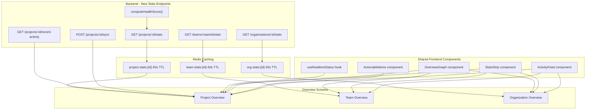

# Phase 10: Overview Screens Overhaul

## Current State

- **ProjectOverviewPage** ([ProjectOverviewPage.tsx](frontend/src/app/pages/ProjectOverviewPage.tsx), 348 lines): All stats and content use hardcoded `DUMMY_`* constants. Only real data is repo info and extraction status polling (3s interval).
- **OrganizationDetailPage** ([OrganizationDetailPage.tsx](frontend/src/app/pages/OrganizationDetailPage.tsx), 358 lines): Has `OrgGetStartedCard`, 4 basic stat cards, recent projects, quick actions, resources. Functional but shallow -- no security posture, no graph, no activity feed. Policy step in GetStartedCard still checks legacy `organization_policies.policy_code` instead of Phase 4 split tables.
- **TeamOverviewPage** ([TeamOverviewPage.tsx](frontend/src/app/pages/TeamOverviewPage.tsx), 174 lines): Only a single compliance status card. No activity feed, no security summary, no graph.
- **No Supabase real-time** subscriptions in the frontend ([supabase.ts](frontend/src/lib/supabase.ts) is initialized but only used for auth/storage). Exception: [SyncDetailSidebar.tsx](frontend/src/components/SyncDetailSidebar.tsx) subscribes to `extraction_logs`.
- **No chart library** -- only ReactFlow for graph visualizations.
- **`health_score`** column exists on `projects` but is initialized to `0` on creation and **never computed or updated** anywhere in the codebase.
- **`activities` table** has no `project_id` column -- project filtering requires `metadata->>'project_id'` with no index.

## Architecture




---

## Database

### Migration: `backend/database/phase10_gin_index.sql`

```sql
-- GIN index on activities.metadata for project-scoped activity queries
-- (activities has no project_id column; filtering uses metadata->>'project_id')
CREATE INDEX IF NOT EXISTS idx_activities_metadata ON activities USING GIN (metadata);
```

### `computeHealthScore()` utility

New file: `backend/src/lib/health-score.ts`

`health_score` is initialized to `0` on project creation ([projects.ts line 1012](backend/src/routes/projects.ts)) and never updated. This phase adds a `computeHealthScore(projectId)` function that writes to `projects.health_score`.

**Formula** (weighted 0-100):

| Component | Weight | Source | Score Logic |
|---|---|---|---|
| Compliance rate | 40% | `project_dependencies.policy_result->>'allowed'` count / total | 100 if all compliant, scales linearly |
| Inverse vuln severity | 30% | `project_dependency_vulnerabilities` (non-suppressed) | 100 if zero vulns, -25 per critical, -10 per high, -5 per medium, -1 per low (floor 0) |
| Dependency freshness | 20% | `project_dependencies.is_outdated` count / total | 100 if none outdated, scales linearly. If `is_outdated` not yet populated (Phase 3), default to 80. |
| Code findings | 10% | `project_semgrep_findings` + `project_secret_findings` counts | 100 if zero, -5 per semgrep finding, -10 per verified secret (floor 0) |

**Called from:**

- [backend/src/routes/workers.ts](backend/src/routes/workers.ts) -- after `populate-dependencies` callback completes and after `evaluateProjectPolicies()` runs
- The new `POST /sync` endpoint -- after extraction completes (via the same populate callback path)

### Existing tables used (no new columns)

- `projects` (`health_score`, `status_id`, `asset_tier_id`, `dependencies_count`)
- `project_dependencies` (`is_direct`, `policy_result`, `is_outdated`, `versions_behind`)
- `project_dependency_vulnerabilities` (`severity`, `depscore`, `is_reachable`, `suppressed`)
- `project_vulnerability_events` (`event_type`, `osv_id`, `metadata`, `created_at`)
- `project_repositories` (`status`, `extraction_step`, `updated_at`, `default_branch`)
- `extraction_jobs` (`status`, `project_id`, `organization_id`, `created_at`, `completed_at`, `error`)
- `activities` (`activity_type`, `metadata`, `created_at`) -- uses `metadata->>'project_id'` with new GIN index
- `organization_statuses` (`name`, `color`, `is_passing`)
- `organization_asset_tiers` (`name`, `color`)
- `organization_members` (for member count)
- `project_semgrep_findings`, `project_secret_findings` (for code finding counts)
- `dependency_vulnerabilities` (`osv_id`, `summary`) -- for top-5 vuln detail

---

## 10A: Backend Stats Endpoints

New endpoints in [backend/src/routes/projects.ts](backend/src/routes/projects.ts), [backend/src/routes/organizations.ts](backend/src/routes/organizations.ts), and [backend/src/routes/teams.ts](backend/src/routes/teams.ts).

### `GET /api/organizations/:orgId/projects/:projectId/stats`

Returns aggregated project dashboard data in a single call. **Cached 60s** via Redis key `project-stats:{projectId}`.

```typescript
{
  health_score: number;           // from projects.health_score (computed by computeHealthScore)
  status: {                       // from organization_statuses via projects.status_id
    id: string;
    name: string;                 // e.g. "Compliant", "Non-Compliant", "Under Review"
    color: string;
    is_passing: boolean;
  } | null;                       // null if status_id not set (policy not yet evaluated)
  asset_tier: {                   // from organization_asset_tiers via projects.asset_tier_id
    id: string;
    name: string;                 // e.g. "Crown Jewels", "External", "Internal"
    color: string;
  } | null;
  compliance: {
    percent: number;              // deps where policy_result->>'allowed' = 'true' / total * 100
    compliant: number;            // count of deps with policy_result.allowed = true
    failing: number;              // count of deps with policy_result.allowed = false
    not_evaluated: number;        // count of deps with no policy_result (policy never ran)
    total: number;
  };
  vulnerabilities: {
    total: number;
    critical: number;
    high: number;
    medium: number;
    low: number;
    reachable_count: number;
  };
  code_findings: {
    semgrep_count: number;        // from project_semgrep_findings
    secret_count: number;         // from project_secret_findings
    verified_secret_count: number;
  };
  dependencies: {
    total: number;
    direct: number;               // project_dependencies WHERE is_direct = true
    transitive: number;           // project_dependencies WHERE is_direct = false
    outdated: number;             // project_dependencies WHERE is_outdated = true (default 0 if column not populated)
  };
  sync: {
    status: string;               // from project_repositories.status
    extraction_step: string | null;
    last_synced: string | null;   // project_repositories.updated_at when status=ready
    last_error: string | null;    // from most recent extraction_jobs with status=failed
    branch: string;
  };
  action_items: Array<{
    type: 'critical_vuln' | 'high_vuln' | 'non_compliant' | 'policy_violation' | 'outdated_critical' | 'code_finding';
    title: string;
    description: string;
    count: number;
    link: string;                 // relative path to relevant tab
  }>;
  graph_deps: Array<{             // direct deps for OverviewGraph (avoids second API call)
    id: string;                   // dependency id
    name: string;
    worst_severity: 'critical' | 'high' | 'medium' | 'low' | 'none';
  }>;
}
```

**Data sources:**

- `projects` table for `health_score`, `status_id`, `asset_tier_id`
- `organization_statuses` joined via `status_id` for status object
- `organization_asset_tiers` joined via `asset_tier_id` for tier object
- `project_dependencies` with `policy_result` JSONB for compliance stats (Phase 4 engine -- NOT legacy `is_compliant`)
- `project_dependencies` grouped by `is_direct` for dep counts; `is_outdated` for outdated count
- `project_dependency_vulnerabilities` (WHERE `suppressed = false`) grouped by severity for vuln counts
- `project_semgrep_findings` count + `project_secret_findings` count/verified for code findings
- `project_repositories` for sync status + `extraction_jobs` for last error
- `project_dependencies` WHERE `is_direct = true` joined to `project_dependency_vulnerabilities` for `graph_deps` worst severity per dep
- Computed action items: critical/high vulns (with reachability), non-compliant deps (from `policy_result`), outdated critical packages, code findings above threshold

### `GET /api/organizations/:orgId/projects/:projectId/recent-activity`

Returns recent project activity from a **union of three data sources** (limit 20, ordered by `created_at DESC`):

```typescript
Array<{
  id: string;
  source: 'activity' | 'vuln_event' | 'extraction';
  type: 'sync_started' | 'sync_completed' | 'sync_failed' | 'vuln_discovered' | 'vuln_resolved' | 'policy_change' | 'team_assignment' | 'guardrail_update' | 'other';
  title: string;
  description: string;
  metadata: Record<string, any>;
  created_at: string;
}>
```

**Data sources (union query):**

1. `activities` WHERE `metadata->>'project_id' = projectId` -- manual actions like policy changes, team assignments, guardrail updates. Maps `activity_type` to `type` field.
2. `project_vulnerability_events` WHERE `project_id = projectId` -- vuln detected/resolved events. `event_type = 'detected'` -> `vuln_discovered`, `event_type = 'resolved'` -> `vuln_resolved`. Joins `dependency_vulnerabilities` for OSV ID and summary.
3. `extraction_jobs` WHERE `project_id = projectId` -- sync lifecycle. `status = 'processing'` -> `sync_started`, `status = 'completed'` -> `sync_completed`, `status = 'failed'` -> `sync_failed`. Uses `created_at` for start, `completed_at` for completion.

**NOT used:** `project_dependency_vulnerabilities` (wrong table for events), `dep_added`/`dep_removed` (events that don't exist in the codebase).

### `GET /api/organizations/:id/stats`

Org-level aggregated stats. **Cached 60s** via Redis key `org-stats:{orgId}`.

```typescript
{
  projects: {
    total: number;
    healthy: number;              // health_score >= 80
    at_risk: number;              // health_score 50-79
    critical: number;             // health_score < 50
    syncing_count: number;        // extraction_jobs WHERE status IN ('queued','processing') AND organization_id = orgId
  };
  vulnerabilities: {
    total: number;
    critical: number;
    high: number;
    medium: number;
    low: number;
  };
  code_findings: {
    semgrep_total: number;
    secret_total: number;
  };
  compliance: {
    percent: number;              // projects with is_passing status / total * 100
    status_distribution: Array<{  // full breakdown by org-defined statuses
      status_id: string;
      name: string;
      color: string;
      is_passing: boolean;
      count: number;
    }>;
  };
  top_vulnerabilities: Array<{    // top 5 critical vulns across all org projects
    osv_id: string;
    summary: string;
    severity: string;
    depscore: number;
    affected_project_count: number;
    worst_project: { id: string; name: string; };
  }>;
  dependencies_total: number;
  members_count: number;
}
```

**Data sources:**

- `projects` table for health score bands and total count
- `extraction_jobs` for `syncing_count`
- `project_dependency_vulnerabilities` (WHERE `suppressed = false`) aggregated across all org projects for vuln totals
- `project_dependency_vulnerabilities` WHERE `severity = 'critical'` ORDER BY `depscore DESC` LIMIT 5, joined to `dependency_vulnerabilities` for `osv_id` and `summary` -- for `top_vulnerabilities`
- `project_semgrep_findings` + `project_secret_findings` rolled up for code findings
- `organization_statuses` LEFT JOIN `projects` grouped by `status_id` for `status_distribution`
- `project_dependencies` summed for `dependencies_total`
- `organization_members` counted for `members_count`

### `GET /api/organizations/:orgId/teams/:teamId/stats`

Same shape as org stats but filtered to projects in the team (via `project_teams`). **Cached 60s** via Redis key `team-stats:{teamId}`.

Differences from org stats:

- `projects` filtered by `project_teams.team_id = teamId`
- `syncing_count` filtered to team project IDs
- `top_vulnerabilities` filtered to team project IDs
- `status_distribution` filtered to team projects
- `members_count` replaced by team `member_count` from `team_members`
- Same `code_findings` rollup but filtered to team projects

### `POST /api/organizations/:orgId/projects/:projectId/sync`

Retrigger extraction for a project.

**Permission:** `manage_teams_and_projects` or org owner (same gate as repository connect at [projects.ts](backend/src/routes/projects.ts)).

**Guards:**

- **400 Bad Request** if no `project_repositories` row exists (no repository connected). Message: "No repository connected to this project."
- **409 Conflict** if `extraction_jobs` has a row with `status IN ('queued', 'processing')` for this project. Message: "Extraction already in progress."
- **429 Too Many Requests** if Redis key `sync-cooldown:{projectId}` exists (60-second cooldown per project). Message: "Please wait before syncing again."

**Response:**

```typescript
{
  job_id: string;       // extraction_jobs.id
  status: 'queued';
}
```

Calls existing `queueExtractionJob()` from [redis.ts](backend/src/lib/redis.ts). Sets Redis key `sync-cooldown:{projectId}` with 60s TTL after successful queue.

### Caching Strategy

All stats endpoints use `getCached`/`setCached` from [cache.ts](backend/src/lib/cache.ts):

| Endpoint | Cache Key | TTL | Invalidation Triggers |
|---|---|---|---|
| Project stats | `project-stats:{projectId}` | 60s | Extraction completion, policy evaluation, vuln suppress/unsuppress |
| Org stats | `org-stats:{orgId}` | 60s | Any project extraction completion, policy evaluation |
| Team stats | `team-stats:{teamId}` | 60s | Team project extraction completion, policy evaluation |

Invalidation calls `invalidateCache(key)` at the same points where existing cache invalidation already occurs in [workers.ts](backend/src/routes/workers.ts) and [projects.ts](backend/src/routes/projects.ts).

---

## 10B: Shared Frontend Components

### `useRealtimeStatus` hook

New file: `frontend/src/hooks/useRealtimeStatus.ts`

Supabase real-time subscription on `project_repositories` table for a given project. Replaces the 3s polling in [ProjectOverviewPage.tsx lines 114-147](frontend/src/app/pages/ProjectOverviewPage.tsx).

```typescript
function useRealtimeStatus(projectId: string) {
  // Subscribe to postgres_changes on project_repositories
  // where project_id = projectId
  // Returns: { status, extractionStep, lastSynced, lastError, isLoading }
  // Auto-cleans up subscription on unmount
  // Falls back to 5s polling if real-time connection fails
}
```

Uses the existing Supabase client from [supabase.ts](frontend/src/lib/supabase.ts). Follows the same pattern as [SyncDetailSidebar.tsx lines 84-104](frontend/src/components/SyncDetailSidebar.tsx) which already subscribes to `extraction_logs`.

**Fallback:** If `supabase.channel().subscribe()` returns an error or timeout after 5s, switch to polling at 5s intervals (not 3s -- reduces server load).

### `OverviewGraph` component

New file: `frontend/src/components/OverviewGraph.tsx`

A lightweight ReactFlow mini-graph reusing the existing node/edge patterns from [ProjectVulnerabilitiesPage.tsx](frontend/src/app/pages/ProjectVulnerabilitiesPage.tsx). Three modes:

- **Project mode**: Center = project, ring = direct dependencies, colored by severity (green = clean, red = has critical vuln, orange = high, yellow = medium)
- **Team mode**: Center = team, ring = projects, colored by health score (green >= 80, yellow 50-79, red < 50)
- **Org mode**: Center = org, second ring = teams, outer ring = projects, all colored by health score

No vulnerability nodes, no transitive deps. Fast to load. Clickable nodes navigate to the relevant entity. Rendered inside a card with a "View full graph" link to the Security tab.

Reuses existing custom node types (`ProjectCenterNode` pattern from [ProjectCenterNode.tsx](frontend/src/components/ProjectCenterNode.tsx)) but simplified -- smaller nodes, no detail overlay.

**Data sources per mode:**

- **Project mode**: `graph_deps` array from the project stats endpoint response (no second API call needed)
- **Team mode**: projects list from `getProjects()` filtered by `team_ids` (already fetched by the team page)
- **Org mode**: teams from `getTeams()` + projects from `getProjects()` (already fetched by the org page)

**Node limits** (prevents unreadable graphs):

- Project mode: max 30 dep nodes. Show top 30 by worst severity. If more exist, add a "+N more" cluster node that links to the Dependencies tab.
- Team mode: max 20 project nodes. Show top 20 by worst health score. "+N more" cluster node linking to Projects tab.
- Org mode: max 8 teams + 25 projects total. Show teams with most projects first, top projects per team by worst health score. "+N more" cluster node for overflow.

**Lazy loading**: Render graph only when the card enters the viewport (IntersectionObserver). Show a static placeholder (muted graph icon + "Dependency graph" label) until visible. This prevents ReactFlow initialization cost on page load.

**Empty states:**

- Project mode with zero deps: centered Package icon + "No dependencies detected" text
- Team mode with zero projects: centered FolderKanban icon + "No projects assigned to this team"
- Org mode with zero projects: centered Building icon + "Create your first project to see the organization graph"

### `StatsStrip` component

New file: `frontend/src/components/StatsStrip.tsx`

Reusable horizontal strip of 4-5 stat cards. Each card: icon, label, value, optional sub-detail (e.g., severity breakdown dots or "X failing" text). Extracts the `StatCard` local component pattern from [OrganizationDetailPage.tsx lines 391-421](frontend/src/app/pages/OrganizationDetailPage.tsx) into a shared component.

No trend indicator -- no historical data exists to compare against. Can be added in a future phase when `security_debt_snapshots` (Phase 15) provides time-series data.

### `ActionableItems` component

New file: `frontend/src/components/ActionableItems.tsx`

Prioritized list of things needing attention (critical vulns, compliance issues, etc.). Each item has severity indicator, title, description, count, and click-to-navigate. Data comes from the `action_items` array in the stats response.

**Empty state**: When zero action items, show a green shield with "Everything looks good" message.

### `ActivityFeed` component

New file: `frontend/src/components/ActivityFeed.tsx`

Timeline of recent events with icon, description, timestamp. Click expands a slide-out sidebar for details (reuses the sidebar pattern from [OrganizationSettingsPage.tsx](frontend/src/app/pages/OrganizationSettingsPage.tsx) -- `aside` with `sticky top-24`).

**Sidebar content per activity type:**

| Activity Type | Sidebar Content |
|---|---|
| `sync_completed` | Extraction duration, dependencies found, vulnerabilities found, link to full logs (SyncDetailSidebar) |
| `sync_failed` | Error message, retry button (calls POST /sync), link to full logs |
| `sync_started` | Animated progress indicator, current extraction step (from real-time hook if available) |
| `vuln_discovered` | OSV ID, severity badge, affected package name + version, depscore, link to Security tab |
| `vuln_resolved` | Same fields as discovered + resolution method (fixed version, suppressed, etc.) |
| `policy_change` | Who changed it, code type (package_policy/project_status/pr_check), change message, link to Policies tab |
| Other manual activities | User avatar, full description, timestamp |

**Empty state**: Muted text "Activity will appear here after your first sync."

---

## 10C: Project Overview Page

**File:** [ProjectOverviewPage.tsx](frontend/src/app/pages/ProjectOverviewPage.tsx) -- full rewrite replacing all dummy data.

### Layout

```
+------------------------------------------------------------------+
| Header: Project Name | Framework | Status Badge | Tier Badge     |
|        Health Score Badge (0-100) | [Sync Button]                |
| Repo: org/repo-name  | Branch: main | Last synced: 2h ago       |
+------------------------------------------------------------------+
| [Creation Banner - shown during extraction with real-time status] |
| [Error Banner - shown if last extraction failed]                  |
+------------------------------------------------------------------+
| Stats Strip                                                       |
| [Health 87] [Status: Compliant] [Compliance 94%] [Vulns 12] [Deps 148] |
+------------------------------------------------------------------+
| Mini Graph (card)          | Actionable Items (card)             |
| ReactFlow: project +      | - 3 critical vulns (reachable)      |
| direct deps colored by    | - 5 non-compliant deps              |
| severity (max 30 nodes)   | - 2 outdated critical packages      |
|                           | - 1 policy violation                |
|                           | - 4 Semgrep findings                |
+------------------------------------------------------------------+
| Recent Activity                                                   |
| [Sync completed 2h ago] [CVE-2024-XXXX found] [Policy updated]  |
| Click any item -> slide-out sidebar with details                 |
+------------------------------------------------------------------+
```

### Key behaviors

- **Header badges**: Health score badge (0-100, circular, green >= 80, yellow 50-79, red < 50). Status label badge (colored pill from `organization_statuses` -- e.g., green "Compliant" or red "Non-Compliant"). Asset tier badge (from `organization_asset_tiers` -- e.g., "Crown Jewels"). All from the stats endpoint response.
- **Sync button** in header: Gated by `manage_teams_and_projects` org permission or org owner. Shows `RefreshCw` icon. Disabled + spinner while sync is in progress. Calls `POST /projects/:id/sync`. Shows toast on 409 (already syncing), 429 (cooldown), or 400 (no repo).
- **Real-time extraction status**: Uses `useRealtimeStatus` hook instead of 3s polling. Status banners update instantly as extraction progresses through steps.
- **Error banner**: Persistent amber banner when last extraction failed: "Last sync failed: {error}. [View logs] [Retry]". Shows stale data from previous successful run if available. Dismissible per session.
- **Other tabs during creation**: Dependencies, Security, Compliance tabs show a "Project is being set up" banner with spinner and step indicator, content disabled. Uses the same `useRealtimeStatus` hook.
- **Stats strip**: 5 cards from `GET /projects/:id/stats`:
  1. **Health Score** -- 0-100 with color ring
  2. **Status** -- name + color from `organization_statuses`, or "Not evaluated" (muted) if no `status_id`
  3. **Compliance** -- percentage with "X failing" sub-text, using `policy_result.allowed` (Phase 4)
  4. **Vulnerabilities** -- total with colored severity dots (critical/high/medium/low), sub-text: "X code issues, Y secrets" from `code_findings`
  5. **Dependencies** -- total with sub-text: "X direct, Y transitive, Z outdated"
- **Mini graph**: `OverviewGraph` in project mode. Direct deps colored by worst vulnerability severity. Data from `graph_deps` in stats response. Click dep navigates to dependency detail. "View full graph" links to Security tab. Max 30 nodes.
- **Actionable items**: From the `action_items` array in the stats response. Each item links to the relevant tab (Security for vulns, Compliance for policy issues). Shows green shield "Everything looks good" when empty.
- **Recent activity**: From `GET /projects/:id/recent-activity`. Shows current sync if in progress (with live status from real-time hook). Click item opens slide-out sidebar with details per activity type.

### Empty and error states

| State | Behavior |
|---|---|
| No repository connected | Hide stats strip, graph, activity feed. Show full-width CTA card: "Connect a repository to get started" with GitHub/GitLab/Bitbucket icons and button linking to Settings tab. Header still shows project name + framework. |
| Extraction never completed | Show "Setting up your project" banner with step indicator. Stats strip shows skeleton. Graph shows placeholder. Activity feed shows "Activity will appear here after your first sync." |
| Extraction in progress | Real-time banner with extraction step indicator (cloning -> analyzing -> scanning -> uploading -> completed). Stats/graph/activity show previous data if available, skeleton if first run. |
| Extraction failed (last run) | Persistent amber banner: "Last sync failed: {error}. [View logs] [Retry]". Show stale data from previous successful run if available. If no previous data, show skeletons with overlay message. |
| Zero dependencies found | Stats show 0 values. Graph shows lone center node. Action items show: "No dependencies detected -- verify your project has a supported manifest file." |
| Zero vulnerabilities | Green shield celebration in action items: "No vulnerabilities detected." Stats strip vuln card shows "0" in green. |
| Stats endpoint fails | Toast error notification. Show skeleton that fades to "Unable to load dashboard. [Retry]" link after 5s. |
| No activity yet | Empty state with muted text: "Activity will appear here after your first sync." |

### Skeleton loading

Full skeleton state while stats are loading: skeleton strips for stats, skeleton graph placeholder (reuse `SkeletonProjectCenterNode` pattern from [SkeletonProjectCenterNode.tsx](frontend/src/components/vulnerabilities-graph/SkeletonProjectCenterNode.tsx)), skeleton list items for activity.

---

## 10D: Team Overview Page

**File:** [TeamOverviewPage.tsx](frontend/src/app/pages/TeamOverviewPage.tsx) -- full rewrite from single compliance card.

### Layout

```
+------------------------------------------------------------------+
| Header: Team Name | [Avatar1 Avatar2 Avatar3 +5] | Projects: 8   |
+------------------------------------------------------------------+
| Stats Strip                                                       |
| [Projects 8] [Vulns 34] [Compliance 88%] [Deps 420]             |
+------------------------------------------------------------------+
| Mini Graph (card)          | Security Summary (card)              |
| ReactFlow: team center +  | Critical: 5 | High: 12              |
| project nodes colored by  | Medium: 15 | Low: 2                 |
| health score (max 20)     | Semgrep: 23 | Secrets: 4            |
|                           | Top 5 vulns across team projects      |
+------------------------------------------------------------------+
| Projects Health Table                                             |
| Project | Health | Status | Vulns | Semgrep | Compliance | Sync  |
| API Svc |  92    | Compl  | 3     | 2       | Passing    | 2h    |
| Web App |  67    | Review | 12    | 8       | Failing    | 1d    |
+------------------------------------------------------------------+
| Recent Activity                                                   |
| [API Svc sync completed] [CVE found in Web App] [Policy updated]|
+------------------------------------------------------------------+
```

### Key behaviors

- **Header**: Team name + member avatar strip (top 5 member avatars from team members endpoint, "+N" overflow badge if more than 5). Project count badge.
- **Stats strip**: Fetches from `GET /teams/:teamId/stats`. 4 cards: Projects (with "X healthy, Y at-risk" health breakdown), Vulnerabilities (total with severity dots), Compliance (%), Dependencies (total).
- **Mini graph**: `OverviewGraph` in team mode. Center = team, ring = projects colored by health. Click project navigates to project overview. Max 20 project nodes.
- **Security summary**: Aggregated vulnerability distribution across all team projects (horizontal severity bar). Code findings totals (semgrep + secrets). **Top 5 most critical vulns** from the `top_vulnerabilities` array in the team stats response (query: `project_dependency_vulnerabilities` filtered to team project IDs, ORDER BY `depscore DESC` LIMIT 5, joined to `dependency_vulnerabilities` for `osv_id` and `summary`). Each vuln shows: severity dot, OSV ID, package name, project name, depscore. Click navigates to project security tab.
- **Projects health table**: All team projects in a sortable table. Columns:
  - Project name + framework icon
  - Health score (0-100, color-coded)
  - Status label (colored badge from `organization_statuses`)
  - Vuln count (with mini severity dots)
  - Semgrep count
  - Compliance (Passing green badge or Failing red badge, derived from status `is_passing`)
  - Last Sync (relative time)
  - Asset Tier (badge)
  Click row navigates to project overview.
- **Activity feed**: Uses existing `getActivities(orgId, { team_id: teamId })` filter (already supported in the activities API at [activities.ts](backend/src/routes/activities.ts)). Same `ActivityFeed` component as project/org. Shows team-scoped events.
- **Data source**: `GET /teams/:teamId/stats` for stats strip, security summary, and top vulns. `getProjects()` filtered by `team_ids` for the projects table (already the pattern used in team pages). `getActivities()` for activity feed.

### Empty states

| State | Behavior |
|---|---|
| Team has no projects | Hide stats strip, graph, health table. Show CTA: "Assign projects to this team" with button linking to team settings. Activity feed still shown (may have member join events). |
| Team has no members (besides owner) | Show CTA banner above activity: "Invite team members to collaborate" with button. Rest of page renders normally. |
| Zero vulnerabilities across team | Security summary shows green "No vulnerabilities detected across team projects." Top 5 section hidden. |

---

## 10E: Organization Overview Page

**File:** [OrganizationDetailPage.tsx](frontend/src/app/pages/OrganizationDetailPage.tsx) -- significant enhancement.

### Layout

```
+------------------------------------------------------------------+
| OrgGetStartedCard (if not dismissed) -- FIXED policy step check   |
+------------------------------------------------------------------+
| Stats Strip (enhanced)                                            |
| [Projects 12 (2 syncing)] [Deps 1,240] [Vulns 89] [Compliance 91%] [Members 8] |
+------------------------------------------------------------------+
| Mini Graph (card)              | Security Posture (card)          |
| ReactFlow: org center ->      | Critical: 12 | High: 28         |
| teams -> projects              | Medium: 35 | Low: 14           |
| (max 8 teams + 25 projects)   | Semgrep: 45 | Secrets: 8        |
| All colored by health          | Top 5 critical vulns across org |
+------------------------------------------------------------------+
| Status Distribution (card)     | Recent Activity (card)           |
| 8 Compliant (green)           | Org-wide activity feed           |
| 2 Under Review (yellow)       | Uses getActivities() API         |
| 2 Non-Compliant (red)         | Filterable by type               |
+------------------------------------------------------------------+
| Quick Actions                  | Resources                        |
| [New Project] [Invite]         | [Docs] [Help Center]            |
| [View Security] [Activity Log] |                                 |
+------------------------------------------------------------------+
```

### Key behaviors

- **OrgGetStartedCard**: Fix policy step check. Currently checks `!!policies?.policy_code` (legacy `organization_policies` table). **Change to check Phase 4 tables**: fetch `organization_package_policies`, `organization_status_codes`, `organization_pr_checks` -- any of the three having non-empty content means policy is defined. Requires updating [OrgGetStartedCard.tsx](frontend/src/components/OrgGetStartedCard.tsx) and passing new props from [OrganizationDetailPage.tsx](frontend/src/app/pages/OrganizationDetailPage.tsx).
- **Stats strip**: Fetches from `GET /organizations/:id/stats`. 5 cards:
  1. **Projects** -- total count with "X healthy, Y at-risk, Z critical" health breakdown. Sub-badge: "N syncing" from `syncing_count` when > 0.
  2. **Dependencies** -- total count
  3. **Vulnerabilities** -- total with colored severity dots
  4. **Compliance** -- percentage of projects with `is_passing` status
  5. **Members** -- count
- **Mini graph**: `OverviewGraph` in org mode. Center = org, second ring = teams, outer ring = projects. All nodes colored by health. Teams without projects dimmed. Unassigned projects grouped under an "Unassigned" cluster. Click navigates to team/project. Max 8 teams + 25 projects.
- **Security posture**: Aggregated vuln distribution (horizontal bar). Code findings totals (semgrep + secrets). **Top 5 critical vulns** from `top_vulnerabilities` in the org stats response. Each clickable to navigate to the project's security tab. Shows OSV ID, summary, severity, depscore, affected project count.
- **Status distribution** (replaces simple compliant/failing): Full breakdown using `compliance.status_distribution` from stats endpoint. Each row: colored dot + status name + project count. E.g., "8 Compliant (green), 2 Under Review (yellow), 2 Non-Compliant (red)." Links to projects filtered by that status.
- **Recent activity**: Uses existing `getActivities(orgId)` API. Shows org-wide events. Filterable by type (syncs, vulns, members, compliance). Same `ActivityFeed` component.
- **Quick actions**: Permission-gated:
  - "New Project": requires `manage_teams_and_projects`
  - "Invite Members": requires `manage_members`
  - "View Security": visible to all (read-only navigation)
  - "Activity Log": requires `view_activities`
- **Resources**: Internal routes only (no external URLs that don't exist):
  - "Documentation" -> `/docs/introduction`
  - "Help Center" -> `/docs/help`
- **Permission-based rendering**: Stats and graph visible to all members. Action buttons gated by specific permissions from the roles API response.

### Empty states

- No projects: OrgGetStartedCard handles this case. Stats strip shows 0 values (not skeleton). Graph shows lone org center node.
- Stats endpoint fails: Toast error. Cards show "--" placeholder values.

---

## 10F: Stitch AI Design Prompts

### Prompt 1 -- Project Overview Dashboard

> Design a project overview dashboard for a dark-themed (zinc-950 background) SaaS dependency security platform called "Deptex." Style: ultra-minimal, inspired by Linear and Vercel. **Header:** Project name with framework icon (React/Node/Python), a health score badge (0-100, circular, green/yellow/red), a status label pill badge (e.g., green "Compliant" or red "Non-Compliant"), an asset tier badge (e.g., "Crown Jewels"), and a "Sync" button (outline, RefreshCw icon, disabled state with spinner). Below: repo name, branch, last synced timestamp. **When no repo is connected:** Full-width CTA card with "Connect a repository to get started" message, GitHub/GitLab/Bitbucket provider icons, and a prominent button linking to Settings. **When project is being created:** Full-width banner with extraction step indicator (cloning -> analyzing -> scanning -> uploading -> completed), animated progress, and step labels. **When last sync failed:** Persistent amber banner with error message, "View logs" and "Retry" links. **Stats strip:** 5 compact cards in a row -- Health Score (0-100 with color ring), Status (colored pill label from org-defined statuses or "Not evaluated" muted), Compliance Rate (percentage with "X failing" sub-text), Vulnerabilities (total number with colored severity dots: red/orange/yellow/blue, sub-text showing semgrep and secret counts), Dependencies (total count with "X direct, Y transitive, Z outdated" sub-text). **Two-column layout below:** Left: Mini ReactFlow graph in a card showing the project as a center node surrounded by direct dependency nodes (max 30), each colored by severity (green=clean, red=critical, orange=high, yellow=medium). No labels on dep nodes, just colored circles. "+N more" indicator if truncated. "View full graph" link in card footer. Right: "Action Items" card with a prioritized list -- each item has a severity dot, title (e.g. "3 critical vulnerabilities"), description, and arrow-right icon. Items are clickable. Empty state: green shield with "Everything looks good." **Below:** "Recent Activity" full-width card as a timeline. Each entry: icon (sync, package, shield, policy), title, description, relative timestamp. Current sync shows animated spinner. Click opens slide-out sidebar with type-specific details. Empty state: "Activity will appear here after your first sync." Style: zinc-800 card backgrounds, 1px zinc-700/50 borders, zinc-100 primary text, zinc-400 secondary text, max 8px radius. Dense but breathable.

### Prompt 2 -- Team Overview Dashboard

> Design a team overview dashboard for a dark-themed SaaS platform. **Header:** Team name, member avatar strip (top 5 circular avatars with "+N" overflow badge), project count badge. **Stats strip:** 4 cards -- Projects (count with "X healthy, Y at-risk" sub-text), Vulnerabilities (total with severity dots), Compliance (percentage), Dependencies (total count). **Two-column layout:** Left: Mini ReactFlow graph card showing team as center node, project nodes around it (max 20) colored by health score (green >= 80, yellow 50-79, red < 50). Project names as labels. "+N more" node if truncated. Click navigates. Right: "Security Summary" card -- severity distribution (horizontal bar segments: critical red, high orange, medium yellow, low blue), code findings summary (semgrep count + secret count), then top 5 vulnerabilities across team projects (severity dot, CVE ID, package name, project name, depscore). **Below:** "Projects" table -- columns: Project (name + framework icon), Health (0-100 color-coded number), Status (colored pill badge from org-defined statuses), Vulnerabilities (count with mini severity dots), Semgrep (count), Compliance (Passing green badge or Failing red badge), Last Sync (relative time), Asset Tier (badge). Sortable columns, hover states. **Below table:** "Recent Activity" card using ActivityFeed component, showing team-scoped events. Empty states: team with no projects shows CTA card, zero vulns shows green celebration. Style: zinc-950 background, zinc-800 cards, zinc-700/50 borders, compact and information-dense.

### Prompt 3 -- Organization Overview Dashboard

> Design an organization overview dashboard for a dark-themed SaaS security platform. **Top:** Optional onboarding card (4 steps with progress bar, dismissible -- "Connect VCS", "Invite members", "Create project", "Define policy"). **Stats strip:** 5 compact cards -- Active Projects (count with "X healthy, Y at-risk, Z critical" sub-text, small "N syncing" badge when applicable), Total Dependencies (number), Open Vulnerabilities (total with colored severity dots), Compliance (percentage of projects compliant), Members (count). **Two-column layout:** Left (wider): Mini ReactFlow graph in a tall card showing org as center node, teams as second ring (max 8), projects as outer ring (max 25 total). All nodes colored by health score. Teams labeled, projects as smaller colored circles. "Unassigned" cluster for projects without a team. "+N more" node if truncated. Click navigates. Right column stacked: "Security Posture" card with severity distribution bar, code findings summary (semgrep + secrets totals), and top 5 critical vulns across org (OSV ID, summary, severity, depscore, affected project count). Below that: "Status Distribution" card showing org-defined project statuses with colored dots and counts (e.g., "8 Compliant" green, "2 Under Review" yellow, "2 Non-Compliant" red). **Below:** Two-column: Left "Recent Activity" feed using org-wide activity API, filterable by type (syncs, vulns, members, compliance). Right: "Quick Actions" grid (New Project, Invite Members, View Security, Activity Log) gated by permissions, plus "Resources" links (Documentation, Help Center -- internal routes only). Style: zinc-950, zinc-800 cards, zinc-700/50 borders, zinc-100/zinc-400 text.

---

## Files Changed

**New files:**

- `frontend/src/hooks/useRealtimeStatus.ts` -- Supabase real-time hook for extraction status
- `frontend/src/components/OverviewGraph.tsx` -- Mini ReactFlow hierarchy graph (3 modes)
- `frontend/src/components/StatsStrip.tsx` -- Reusable stat cards strip
- `frontend/src/components/ActionableItems.tsx` -- Prioritized action items list
- `frontend/src/components/ActivityFeed.tsx` -- Activity timeline with sidebar
- `backend/src/lib/health-score.ts` -- `computeHealthScore()` utility function
- `backend/database/phase10_gin_index.sql` -- GIN index on activities.metadata

**Modified files:**

- [ProjectOverviewPage.tsx](frontend/src/app/pages/ProjectOverviewPage.tsx) -- Full rewrite, remove all `DUMMY_`* data
- [OrganizationDetailPage.tsx](frontend/src/app/pages/OrganizationDetailPage.tsx) -- Major enhancement with graph, security posture, status distribution, activity feed
- [TeamOverviewPage.tsx](frontend/src/app/pages/TeamOverviewPage.tsx) -- Full rewrite from single card to full dashboard with activity feed
- [OrgGetStartedCard.tsx](frontend/src/components/OrgGetStartedCard.tsx) -- Fix policy step to check Phase 4 tables (`organization_package_policies`, `organization_status_codes`, `organization_pr_checks`) instead of legacy `organization_policies.policy_code`
- [backend/src/routes/projects.ts](backend/src/routes/projects.ts) -- New project stats, recent-activity, sync endpoints
- [backend/src/routes/organizations.ts](backend/src/routes/organizations.ts) -- New org stats endpoint
- [backend/src/routes/teams.ts](backend/src/routes/teams.ts) -- New team stats endpoint
- [backend/src/routes/workers.ts](backend/src/routes/workers.ts) -- Call `computeHealthScore()` after populate-dependencies and policy evaluation; invalidate new cache keys
- [frontend/src/lib/api.ts](frontend/src/lib/api.ts) -- New API methods: `getProjectStats`, `getProjectRecentActivity`, `getOrgStats`, `getTeamStats`, `triggerProjectSync`

**No changes to:**

- [supabase.ts](frontend/src/lib/supabase.ts) -- already initialized, no changes needed
- Route structure -- all routes already exist

## Sequencing

Work proceeds Project -> Team -> Org, with shared components built alongside Project (first consumer).

1. **Backend first**: `computeHealthScore()` utility, GIN index migration, project stats endpoint, project recent-activity endpoint, project sync endpoint, org stats endpoint, team stats endpoint. Add Redis caching to all stats endpoints. Add cache invalidation in workers.ts.
2. **Shared components**: `useRealtimeStatus`, `StatsStrip`, `OverviewGraph`, `ActionableItems`, `ActivityFeed` -- all built during step 3 as Project Overview needs them.
3. **Project Overview**: Full rewrite of ProjectOverviewPage.tsx using all shared components. All empty/error states.
4. **Team Overview**: Full rewrite of TeamOverviewPage.tsx. Adds activity feed (not in original plan). Member avatar strip.
5. **Org Overview**: Enhancement of OrganizationDetailPage.tsx. Fix OrgGetStartedCard policy step. Status distribution. Permission-gated actions with internal resource links.
6. **API methods**: New frontend API methods in api.ts -- built alongside each screen as needed.
