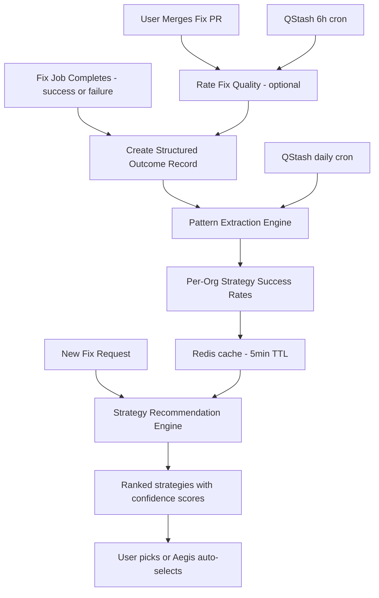
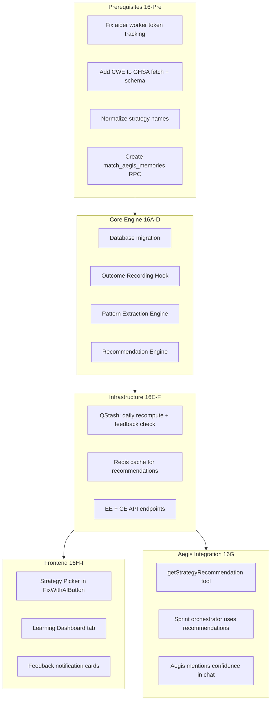
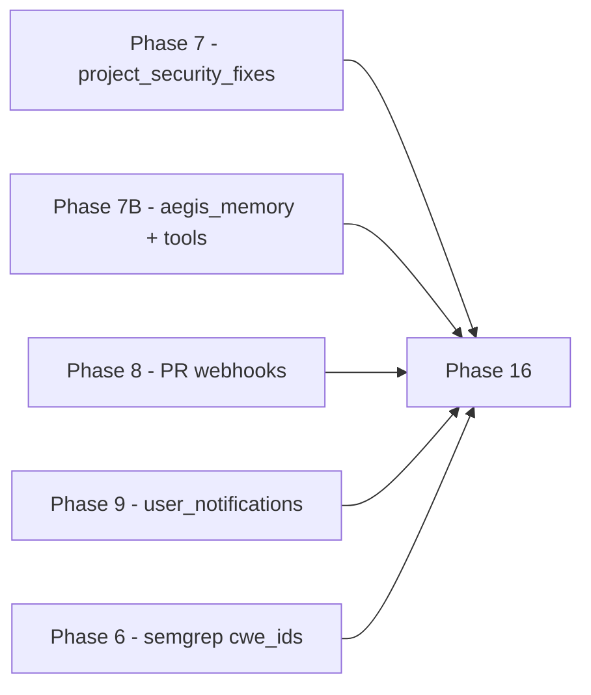

## Phase 16: Aegis Outcome-Based Learning

**Goal:** Make Aegis smarter over time by systematically learning from every fix outcome. Instead of always defaulting to version bump, Aegis builds a per-organization knowledge base: "For prototype pollution CVEs in npm packages, version bump succeeds 94% of the time. For SQL injection Semgrep findings in Express apps, code_patch succeeds 78% but takes 3x longer than expected." This transforms Aegis from a stateless tool executor into an adaptive system that gets better the longer an organization uses it.

**Prerequisites:** Phase 7 (fix engine with `project_security_fixes` tracking), Phase 7B (Aegis memory system + task system), Phase 8 (PR webhooks for merge detection), Phase 9 (user_notifications for feedback prompts), Phase 6B (reachability context for richer outcome data).

**Timeline:** ~2-3 weeks. The fix infrastructure already tracks outcomes -- this phase adds structured learning on top plus 4 prerequisite fixes.

### How It Works (Overview)




### Refined Architecture




---

### 16-Pre: Prerequisites (Fix Before Starting)

Four issues in the existing codebase that must be resolved first, otherwise Phase 16 data will be incomplete or inconsistent.

#### 16-Pre-A: Aider Worker Token Tracking

**Problem:** The aider worker (`backend/aider-worker/src/index.ts`) calls `updateJobStatus()` on completion but never passes `tokens_used` or `estimated_cost`. These fields exist on `project_security_fixes` but are always null. Phase 16's cost analytics are useless without this data.

**Files to modify:**

- `backend/aider-worker/src/executor.ts` -- Parse Aider's streamed stdout for token usage lines. Aider outputs patterns like `Tokens: X sent, Y received` and `Cost: $X.XX`. Add a `parseTokenUsage(output: string)` function that extracts these values.
- `backend/aider-worker/src/index.ts` -- Pass parsed `tokens_used` and `estimated_cost` to `updateJobStatus()` in the success path (around line 183).
- `backend/aider-worker/src/job-db.ts` -- Include `tokens_used` and `estimated_cost` in the `updateJobStatus()` Supabase update payload (around line 55).

```typescript
// executor.ts - new function
export function parseTokenUsage(output: string): { tokens: number; cost: number } {
  let tokens = 0;
  let cost = 0;
  const tokenMatch = output.match(/Tokens:\s*([\d,]+)\s*sent,\s*([\d,]+)\s*received/);
  if (tokenMatch) {
    tokens = parseInt(tokenMatch[1].replace(/,/g, ''), 10) + parseInt(tokenMatch[2].replace(/,/g, ''), 10);
  }
  const costMatch = output.match(/Cost:\s*\$?([\d.]+)/);
  if (costMatch) {
    cost = parseFloat(costMatch[1]);
  }
  return { tokens, cost };
}
```

#### 16-Pre-B: CWE Data in GHSA Fetch

**Problem:** `dependency_vulnerabilities` has no CWE column. The GHSA GraphQL query in `backend/src/lib/ghsa.ts` fetches CVE aliases but not CWE IDs. Phase 16 needs CWE to categorize vulnerability types (prototype-pollution, xss, sql-injection, etc.). Only `project_semgrep_findings` currently has `cwe_ids`.

**Files to modify:**

- `backend/src/lib/ghsa.ts` -- Add `cwes { nodes { cweId description } }` to the GraphQL `securityAdvisory` fragment. Update `ghsaVulnToRow()` (~line 154) to include `cwe_ids`:

```typescript
cwe_ids: (v.cwes?.nodes || []).map((c: any) => c.cweId), // e.g., ['CWE-79', 'CWE-89']
```

**Migration (include in phase16_aegis_learning.sql):**

```sql
ALTER TABLE dependency_vulnerabilities ADD COLUMN IF NOT EXISTS cwe_ids TEXT[] DEFAULT '{}';
```

**Note:** Existing vulns will have empty `cwe_ids`. They'll be populated on next GHSA refresh (daily watchtower poll or next extraction populate callback). Historical fix outcomes will have `vulnerability_type = NULL` which is handled gracefully by the pattern engine.

#### 16-Pre-C: Strategy Name Normalization

**Problem:** The sprint orchestrator (`backend/src/lib/aegis/sprint-orchestrator.ts`) uses different strategy names than the fix engine expects. If outcomes record inconsistent names, pattern matching breaks.


| Canonical (fix engine) | Sprint Orchestrator (current) |
| ---------------------- | ----------------------------- |
| `bump_version`         | `version_bump`                |
| `code_patch`           | `targeted_patch`              |
| `pin_transitive`       | `lockfile_only`               |
| `fix_semgrep`          | `semgrep_fix`                 |
| `remediate_secret`     | `secret_rotation`             |


Additionally, the sprint orchestrator uses `toolName: 'triggerAiFix'` but the tool is registered as `triggerFix` in `backend/src/lib/aegis/tools/security-ops.ts`.

**Files to modify:**

- `backend/src/lib/aegis/sprint-orchestrator.ts` -- Update `determineFixStrategy()` (~~line 288) to return canonical names. Fix tool name to `triggerFix` (~~line 316).
- Create a shared constants file `backend/src/lib/learning/strategy-constants.ts` with the canonical strategy list and display name mapping.

```typescript
export const CANONICAL_STRATEGIES = [
  'bump_version', 'code_patch', 'add_wrapper', 'pin_transitive',
  'remove_unused', 'fix_semgrep', 'remediate_secret',
] as const;

export const STRATEGY_DISPLAY_NAMES: Record<string, string> = {
  bump_version: 'Version Bump',
  code_patch: 'Code Patch',
  add_wrapper: 'Add Wrapper',
  pin_transitive: 'Pin Transitive',
  remove_unused: 'Remove Unused',
  fix_semgrep: 'Fix Semgrep',
  remediate_secret: 'Remediate Secret',
};
```

#### 16-Pre-D: match_aegis_memories RPC

**Problem:** `backend/src/lib/aegis/executor-v2.ts` calls `supabase.rpc('match_aegis_memories', ...)` for vector similarity search, but this RPC is not defined in any migration file. Memory vector search silently falls back to text search.

**Migration (include in phase16_aegis_learning.sql):**

```sql
CREATE OR REPLACE FUNCTION match_aegis_memories(
  query_embedding vector(768),
  match_threshold float,
  match_count int,
  filter_org_id uuid,
  filter_category text DEFAULT NULL
) RETURNS TABLE (id uuid, category text, key text, content text, similarity float)
LANGUAGE sql STABLE AS $$
  SELECT id, category, key, content,
         1 - (embedding <=> query_embedding) AS similarity
  FROM aegis_memory
  WHERE organization_id = filter_org_id
    AND (filter_category IS NULL OR category = filter_category)
    AND (expires_at IS NULL OR expires_at > NOW())
    AND 1 - (embedding <=> query_embedding) > match_threshold
  ORDER BY embedding <=> query_embedding
  LIMIT match_count;
$$;
```

---

### 16A: Database Migration

**File:** `backend/database/phase16_aegis_learning.sql`

**Run order:** After all Phase 7B migrations. Independent of Phase 15.

#### fix_outcomes table

```sql
CREATE TABLE fix_outcomes (
  id UUID PRIMARY KEY DEFAULT uuid_generate_v4(),
  organization_id UUID NOT NULL REFERENCES organizations(id) ON DELETE CASCADE,
  fix_job_id UUID NOT NULL REFERENCES project_security_fixes(id) ON DELETE CASCADE,
  project_id UUID REFERENCES projects(id) ON DELETE SET NULL,
  
  -- What was fixed
  fix_type TEXT NOT NULL,            -- 'vulnerability', 'semgrep', 'secret'
  strategy TEXT NOT NULL,            -- 'bump_version', 'code_patch', etc. (canonical names)
  
  -- Context dimensions (used for pattern matching)
  ecosystem TEXT NOT NULL,           -- 'npm', 'pip', 'maven', etc.
  framework TEXT,                    -- 'express', 'next', 'django', etc. (nullable)
  vulnerability_type TEXT,           -- 'prototype-pollution', 'sql-injection', 'xss', etc. (from CWE mapping, nullable)
  cwe_id TEXT,                       -- CWE identifier if available (nullable)
  severity TEXT,                     -- 'critical', 'high', 'medium', 'low'
  package_name TEXT,                 -- the affected package
  is_direct_dep BOOLEAN,            -- direct vs transitive
  has_reachability_data BOOLEAN,     -- was atom data available?
  reachability_level TEXT,           -- 'confirmed', 'data_flow', 'module', 'unreachable'
  provider TEXT DEFAULT 'github',    -- git provider the PR was created on
  
  -- Outcome
  success BOOLEAN NOT NULL,
  failure_reason TEXT,               -- categorized: 'breaking_changes', 'no_safe_version', 'build_error',
                                     -- 'test_failure', 'timeout', 'api_error', 'empty_diff',
                                     -- 'pr_creation_failed', 'auth_failed', 'unknown'
  failure_detail TEXT,               -- raw error context (truncated, for Aegis reference)
  
  -- Performance metrics
  duration_seconds INTEGER,
  tokens_used INTEGER,
  estimated_cost NUMERIC(10, 4),
  files_changed INTEGER,
  lines_added INTEGER,
  lines_removed INTEGER,
  
  -- Post-fix quality (populated later via webhooks + feedback)
  pr_merged BOOLEAN,                 -- was the PR actually merged?
  pr_merged_at TIMESTAMPTZ,
  human_quality_rating INTEGER CHECK (human_quality_rating BETWEEN 1 AND 5),
  introduced_new_vulns BOOLEAN DEFAULT false,
  fix_reverted BOOLEAN DEFAULT false, -- was the fix PR reverted after merge?
  feedback_prompted_at TIMESTAMPTZ,   -- when feedback notification was sent (prevent duplicates)
  
  -- Follow-up outcomes
  previous_attempt_id UUID REFERENCES fix_outcomes(id), -- if retry, link to failed attempt
  led_to_strategy TEXT,              -- if this failed, what strategy was tried next?
  
  created_at TIMESTAMPTZ DEFAULT NOW()
);

CREATE INDEX idx_fo_org_ecosystem ON fix_outcomes(organization_id, ecosystem);
CREATE INDEX idx_fo_org_strategy ON fix_outcomes(organization_id, strategy);
CREATE INDEX idx_fo_org_vuln_type ON fix_outcomes(organization_id, vulnerability_type);
CREATE INDEX idx_fo_org_success ON fix_outcomes(organization_id, success);
CREATE INDEX idx_fo_created ON fix_outcomes(created_at);
CREATE INDEX idx_fo_fix_job ON fix_outcomes(fix_job_id);
CREATE INDEX idx_fo_feedback ON fix_outcomes(organization_id, pr_merged, human_quality_rating, feedback_prompted_at)
  WHERE pr_merged = true AND human_quality_rating IS NULL AND feedback_prompted_at IS NULL;
```

#### strategy_patterns table

```sql
CREATE TABLE strategy_patterns (
  id UUID PRIMARY KEY DEFAULT uuid_generate_v4(),
  organization_id UUID NOT NULL REFERENCES organizations(id) ON DELETE CASCADE,
  
  -- Pattern dimensions (any combination, nulls = wildcard)
  ecosystem TEXT,                    -- null = all ecosystems
  vulnerability_type TEXT,           -- null = all vuln types
  strategy TEXT NOT NULL,
  is_direct_dep BOOLEAN,             -- null = both
  framework TEXT,                    -- null = all frameworks
  
  -- Computed metrics
  total_attempts INTEGER NOT NULL DEFAULT 0,
  successes INTEGER NOT NULL DEFAULT 0,
  success_rate NUMERIC(5, 4) NOT NULL DEFAULT 0,
  avg_duration_seconds INTEGER,
  avg_cost NUMERIC(10, 4),
  avg_quality_rating NUMERIC(3, 2),
  pr_merge_rate NUMERIC(5, 4),
  revert_rate NUMERIC(5, 4),
  
  -- Confidence
  confidence TEXT NOT NULL DEFAULT 'low', -- 'low' (<5), 'medium' (5-20), 'high' (>20)
  sample_count INTEGER NOT NULL DEFAULT 0,
  
  -- Failure analysis
  common_failure_reasons JSONB,      -- { "breaking_changes": 3, "build_error": 2, ... }
  best_followup_strategy TEXT,
  followup_success_rate NUMERIC(5, 4),
  
  last_computed_at TIMESTAMPTZ DEFAULT NOW(),
  created_at TIMESTAMPTZ DEFAULT NOW(),
  UNIQUE(organization_id, ecosystem, vulnerability_type, strategy, is_direct_dep, framework)
);

CREATE INDEX idx_sp_org_lookup ON strategy_patterns(organization_id, ecosystem, vulnerability_type);
CREATE INDEX idx_sp_org_strategy ON strategy_patterns(organization_id, strategy);
```

#### RLS Policies

```sql
ALTER TABLE fix_outcomes ENABLE ROW LEVEL SECURITY;
ALTER TABLE strategy_patterns ENABLE ROW LEVEL SECURITY;

CREATE POLICY "Service role full access on fix_outcomes" ON fix_outcomes FOR ALL
  USING (auth.role() = 'service_role');
CREATE POLICY "Service role full access on strategy_patterns" ON strategy_patterns FOR ALL
  USING (auth.role() = 'service_role');
```

#### compute_strategy_patterns RPC

```sql
CREATE OR REPLACE FUNCTION compute_strategy_patterns(p_org_id UUID)
RETURNS void LANGUAGE plpgsql AS $$
BEGIN
  DELETE FROM strategy_patterns WHERE organization_id = p_org_id;

  -- Level 1: Most specific (ecosystem + vulnerability_type + strategy + is_direct_dep)
  INSERT INTO strategy_patterns (
    organization_id, ecosystem, vulnerability_type, strategy, is_direct_dep,
    total_attempts, successes, success_rate, avg_duration_seconds, avg_cost,
    avg_quality_rating, pr_merge_rate, revert_rate, confidence, sample_count,
    common_failure_reasons, last_computed_at
  )
  SELECT
    p_org_id, ecosystem, vulnerability_type, strategy, is_direct_dep,
    COUNT(*),
    COUNT(*) FILTER (WHERE success),
    ROUND(COUNT(*) FILTER (WHERE success)::numeric / NULLIF(COUNT(*), 0), 4),
    AVG(duration_seconds)::integer,
    AVG(estimated_cost),
    AVG(human_quality_rating),
    ROUND(COUNT(*) FILTER (WHERE pr_merged)::numeric / NULLIF(COUNT(*) FILTER (WHERE success), 0), 4),
    ROUND(COUNT(*) FILTER (WHERE fix_reverted)::numeric / NULLIF(COUNT(*) FILTER (WHERE pr_merged), 0), 4),
    CASE
      WHEN COUNT(*) >= 20 THEN 'high'
      WHEN COUNT(*) >= 5 THEN 'medium'
      ELSE 'low'
    END,
    COUNT(*),
    (SELECT jsonb_object_agg(fr, cnt) FROM (
      SELECT failure_reason AS fr, COUNT(*) AS cnt
      FROM fix_outcomes fo2
      WHERE fo2.organization_id = p_org_id
        AND fo2.ecosystem = fix_outcomes.ecosystem
        AND fo2.vulnerability_type IS NOT DISTINCT FROM fix_outcomes.vulnerability_type
        AND fo2.strategy = fix_outcomes.strategy
        AND fo2.is_direct_dep IS NOT DISTINCT FROM fix_outcomes.is_direct_dep
        AND fo2.failure_reason IS NOT NULL
      GROUP BY failure_reason
    ) sub),
    NOW()
  FROM fix_outcomes
  WHERE organization_id = p_org_id
    AND ecosystem IS NOT NULL
  GROUP BY ecosystem, vulnerability_type, strategy, is_direct_dep;

  -- Level 2: Medium (ecosystem + strategy only)
  INSERT INTO strategy_patterns (
    organization_id, ecosystem, vulnerability_type, strategy, is_direct_dep,
    total_attempts, successes, success_rate, avg_duration_seconds, avg_cost,
    avg_quality_rating, pr_merge_rate, revert_rate, confidence, sample_count,
    last_computed_at
  )
  SELECT
    p_org_id, ecosystem, NULL, strategy, NULL,
    COUNT(*),
    COUNT(*) FILTER (WHERE success),
    ROUND(COUNT(*) FILTER (WHERE success)::numeric / NULLIF(COUNT(*), 0), 4),
    AVG(duration_seconds)::integer,
    AVG(estimated_cost),
    AVG(human_quality_rating),
    ROUND(COUNT(*) FILTER (WHERE pr_merged)::numeric / NULLIF(COUNT(*) FILTER (WHERE success), 0), 4),
    ROUND(COUNT(*) FILTER (WHERE fix_reverted)::numeric / NULLIF(COUNT(*) FILTER (WHERE pr_merged), 0), 4),
    CASE WHEN COUNT(*) >= 20 THEN 'high' WHEN COUNT(*) >= 5 THEN 'medium' ELSE 'low' END,
    COUNT(*),
    NOW()
  FROM fix_outcomes
  WHERE organization_id = p_org_id AND ecosystem IS NOT NULL
  GROUP BY ecosystem, strategy
  ON CONFLICT (organization_id, ecosystem, vulnerability_type, strategy, is_direct_dep, framework)
  DO NOTHING;

  -- Level 3: Broad (strategy only, org-wide)
  INSERT INTO strategy_patterns (
    organization_id, ecosystem, vulnerability_type, strategy, is_direct_dep,
    total_attempts, successes, success_rate, avg_duration_seconds, avg_cost,
    avg_quality_rating, pr_merge_rate, revert_rate, confidence, sample_count,
    last_computed_at
  )
  SELECT
    p_org_id, NULL, NULL, strategy, NULL,
    COUNT(*),
    COUNT(*) FILTER (WHERE success),
    ROUND(COUNT(*) FILTER (WHERE success)::numeric / NULLIF(COUNT(*), 0), 4),
    AVG(duration_seconds)::integer,
    AVG(estimated_cost),
    AVG(human_quality_rating),
    ROUND(COUNT(*) FILTER (WHERE pr_merged)::numeric / NULLIF(COUNT(*) FILTER (WHERE success), 0), 4),
    ROUND(COUNT(*) FILTER (WHERE fix_reverted)::numeric / NULLIF(COUNT(*) FILTER (WHERE pr_merged), 0), 4),
    CASE WHEN COUNT(*) >= 20 THEN 'high' WHEN COUNT(*) >= 5 THEN 'medium' ELSE 'low' END,
    COUNT(*),
    NOW()
  FROM fix_outcomes
  WHERE organization_id = p_org_id
  GROUP BY strategy
  ON CONFLICT (organization_id, ecosystem, vulnerability_type, strategy, is_direct_dep, framework)
  DO NOTHING;

  -- Compute follow-up strategies from retry chains
  UPDATE strategy_patterns sp SET
    best_followup_strategy = sub.next_strategy,
    followup_success_rate = sub.followup_rate
  FROM (
    SELECT
      fo_failed.organization_id,
      fo_failed.ecosystem,
      fo_failed.vulnerability_type,
      fo_failed.strategy,
      fo_failed.is_direct_dep,
      fo_retry.strategy AS next_strategy,
      ROUND(COUNT(*) FILTER (WHERE fo_retry.success)::numeric / NULLIF(COUNT(*), 0), 4) AS followup_rate
    FROM fix_outcomes fo_failed
    JOIN fix_outcomes fo_retry ON fo_retry.previous_attempt_id = fo_failed.id
    WHERE fo_failed.organization_id = p_org_id AND NOT fo_failed.success
    GROUP BY fo_failed.organization_id, fo_failed.ecosystem, fo_failed.vulnerability_type,
             fo_failed.strategy, fo_failed.is_direct_dep, fo_retry.strategy
    ORDER BY followup_rate DESC
  ) sub
  WHERE sp.organization_id = sub.organization_id
    AND sp.ecosystem IS NOT DISTINCT FROM sub.ecosystem
    AND sp.vulnerability_type IS NOT DISTINCT FROM sub.vulnerability_type
    AND sp.strategy = sub.strategy
    AND sp.is_direct_dep IS NOT DISTINCT FROM sub.is_direct_dep;
END;
$$;
```

#### Also in the same migration

```sql
-- CWE column for GHSA vulnerability data (16-Pre-B)
ALTER TABLE dependency_vulnerabilities ADD COLUMN IF NOT EXISTS cwe_ids TEXT[] DEFAULT '{}';

-- match_aegis_memories RPC (16-Pre-D, missing from Phase 7B)
CREATE OR REPLACE FUNCTION match_aegis_memories(
  query_embedding vector(768),
  match_threshold float,
  match_count int,
  filter_org_id uuid,
  filter_category text DEFAULT NULL
) RETURNS TABLE (id uuid, category text, key text, content text, similarity float)
LANGUAGE sql STABLE AS $$
  SELECT id, category, key, content,
         1 - (embedding <=> query_embedding) AS similarity
  FROM aegis_memory
  WHERE organization_id = filter_org_id
    AND (filter_category IS NULL OR category = filter_category)
    AND (expires_at IS NULL OR expires_at > NOW())
    AND 1 - (embedding <=> query_embedding) > match_threshold
  ORDER BY embedding <=> query_embedding
  LIMIT match_count;
$$;
```

---

### 16B: Outcome Recording Engine

**File:** `backend/src/lib/learning/outcome-recorder.ts` (new)

Every fix job completion (success or failure) creates a structured outcome record.

**Outcome creation flow:**

After every fix job reaches `completed` or `failed` status:

1. Extract vulnerability type from CWE IDs (map CWE to category: prototype-pollution, sql-injection, xss, path-traversal, etc.)
2. Gather context dimensions from the fix request and project data (ecosystem from dependency, framework from project, is_direct from project_dependencies, reachability from project_dependency_vulnerabilities)
3. Categorize failure reason (parse `error_category` + `error_message` into predefined categories)
4. Create `fix_outcomes` record
5. If this was a retry, link to the previous attempt via `previous_attempt_id` (match by same osv_id/finding_id + same project + earlier created_at)
6. Trigger incremental pattern recomputation (16C)

**CWE-to-vulnerability-type mapping:**

```typescript
const CWE_TO_VULN_TYPE: Record<string, string> = {
  'CWE-79': 'xss',
  'CWE-89': 'sql-injection',
  'CWE-1321': 'prototype-pollution',
  'CWE-22': 'path-traversal',
  'CWE-78': 'command-injection',
  'CWE-502': 'deserialization',
  'CWE-918': 'ssrf',
  'CWE-287': 'auth-bypass',
  'CWE-200': 'information-disclosure',
  'CWE-400': 'denial-of-service',
  'CWE-77': 'code-injection',
  'CWE-611': 'xxe',
  'CWE-352': 'csrf',
  'CWE-601': 'open-redirect',
  'CWE-94': 'code-injection',
  'CWE-362': 'race-condition',
  'CWE-863': 'authorization-bypass',
  'CWE-798': 'hardcoded-credentials',
  'CWE-327': 'weak-crypto',
  'CWE-295': 'improper-cert-validation',
  'CWE-190': 'integer-overflow',
  'CWE-416': 'use-after-free',
  'CWE-120': 'buffer-overflow',
};
```

**Failure reason categorization:**

```typescript
function categorizeFailure(errorCategory: string | null, errorMessage: string | null): string {
  if (errorCategory === 'no_changes') return 'empty_diff';
  if (errorCategory === 'auth_failed') return 'auth_failed';
  if (errorCategory === 'pr_creation_failed') return 'pr_creation_failed';
  if (errorCategory === 'timeout') return 'timeout';
  if (errorMessage?.match(/npm ERR!|yarn error|pnpm ERR|build.*fail/i)) return 'build_error';
  if (errorMessage?.match(/test.*fail|jest.*fail|mocha.*fail/i)) return 'test_failure';
  if (errorMessage?.match(/no.*safe.*version|no.*patched/i)) return 'no_safe_version';
  if (errorMessage?.match(/breaking.*change|major.*version/i)) return 'breaking_changes';
  if (errorMessage?.match(/rate.*limit|429|quota/i)) return 'api_error';
  return 'unknown';
}
```

**Hook points:**

1. In `backend/src/routes/integrations.ts` `handlePullRequestClosedEvent()` (~line 1854): After updating `project_security_fixes` status to `merged` or `pr_closed`, also update the corresponding `fix_outcomes` record:
  - If merged: set `pr_merged = true`, `pr_merged_at`
  - If closed without merge: leave `pr_merged = false`
2. Add same logic to `backend/src/routes/gitlab-webhooks.ts` MR merge handler and `backend/src/routes/bitbucket-webhooks.ts` PR merge handler.
3. Outcome creation itself: add a Supabase Realtime subscription on `project_security_fixes` status changes in a new CE route, OR (simpler) create outcomes in the daily cron and also from the webhook merge handler. **Recommended approach:** Create the outcome record from the daily QStash cron (`recompute-patterns`), which scans for `project_security_fixes` rows that don't yet have a corresponding `fix_outcomes` record. This avoids tight coupling and handles edge cases (machine crashes, missed webhooks).

**PR revert detection:**

In the push webhook handler (`handlePushEvent` in `integrations.ts`), check commit messages for revert patterns:

```typescript
const REVERT_PATTERN = /^Revert ".*fix\//i;
for (const commit of payload.commits || []) {
  if (REVERT_PATTERN.test(commit.message)) {
    const branchMatch = commit.message.match(/fix\/([^\s"]+)/);
    if (branchMatch) {
      await supabase.from('fix_outcomes')
        .update({ fix_reverted: true })
        .eq('organization_id', orgId)
        .ilike('fix_job_id', `%`) // join through project_security_fixes.pr_branch
        // ... match by branch name pattern
    }
  }
}
```

Also: in the extraction populate callback, compare dependency versions -- if a previously-fixed dep is back at a vulnerable version, flag the corresponding outcome as reverted.

---

### 16C: Pattern Extraction Engine

**File:** `backend/src/lib/learning/pattern-engine.ts` (new)

The pattern engine aggregates outcomes to compute strategy success rates across multiple dimensions. Runs after each new outcome (incremental) and daily (full batch recomputation).

**Pattern computation logic:**

```typescript
async function recomputePatterns(orgId: string) {
  // Full recomputation via Supabase RPC (SQL is efficient for aggregation)
  await supabase.rpc('compute_strategy_patterns', { p_org_id: orgId });
  
  // Invalidate Redis cache for this org's recommendations
  await invalidateCache(`strategy-recs:${orgId}:*`);
}

async function incrementalPatternUpdate(orgId: string, outcome: FixOutcome) {
  // For real-time responsiveness after each outcome, just recompute
  // the specific pattern dimensions affected by this outcome
  // For simplicity, call full recompute (fast for typical org sizes <1000 outcomes)
  await recomputePatterns(orgId);
}
```

**Confidence levels:**

- **Low** (< 5 outcomes): Pattern exists but sample size too small. Show to user but mark as "limited data."
- **Medium** (5-20 outcomes): Reasonably reliable. Aegis uses these for recommendations.
- **High** (> 20 outcomes): Strong signal. Aegis confidently recommends based on these.

**QStash daily cron:**

**Endpoint:** `POST /api/internal/learning/recompute-patterns` (CE route)
**Schedule:** `0 3 * * `* (daily at 3 AM UTC)
**Auth:** QStash signature or `X-Internal-Api-Key`
**File:** `backend/src/routes/learning-cron.ts` (new CE route, mounted in `backend/src/index.ts`)

Logic:

1. Find all orgs that have at least one `fix_outcomes` record with `created_at > last recomputation`
2. Also scan `project_security_fixes` for completed/failed jobs without corresponding `fix_outcomes` records -> create missing outcomes
3. For each org with new data: call `recomputePatterns(orgId)`

---

### 16D: Strategy Recommendation Engine

**File:** `backend/src/lib/learning/recommendation-engine.ts` (new)

When a user clicks "Fix with AI" or Aegis plans a fix, the strategy selector queries `strategy_patterns` to rank strategies by predicted success rate:

```typescript
interface StrategyRecommendation {
  strategy: string;
  displayName: string;
  predictedSuccessRate: number;  // 0-1
  confidence: 'low' | 'medium' | 'high';
  basedOnSamples: number;
  avgDuration: number;           // seconds
  avgCost: number;               // USD
  reasoning: string;             // human-readable explanation
  warnings?: string[];           // e.g., "High revert rate (15%) after merge"
  isGlobalDefault: boolean;      // true if using platform averages, not org data
}

async function recommendStrategies(
  orgId: string,
  ecosystem: string,
  vulnType: string | null,
  isDirect: boolean,
  fixType: 'vulnerability' | 'semgrep' | 'secret'
): Promise<StrategyRecommendation[]> {
  // 1. Check Redis cache first
  const cacheKey = `strategy-recs:${orgId}:${ecosystem}:${vulnType || 'any'}:${isDirect}:${fixType}`;
  const cached = await getCached(cacheKey);
  if (cached) return cached;

  // 2. Filter available strategies by fix type
  const available = fixType === 'semgrep' ? ['fix_semgrep'] :
                    fixType === 'secret' ? ['remediate_secret'] :
                    ['bump_version', 'code_patch', 'add_wrapper', 'pin_transitive', 'remove_unused'];

  // 3. Query strategy_patterns at most specific level first
  //    ecosystem + vulnType + strategy + isDirect
  // 4. Fall back to broader levels if no data at specific level
  // 5. Fall back to global defaults if no org data exists at all
  // 6. Rank by: success_rate * confidence_multiplier (high=1.0, medium=0.8, low=0.5)
  // 7. Cost-adjusted: if two strategies within 5% success rate, prefer cheaper one
  // 8. Revert penalty: reduce effective rate by revert_rate * 0.5
  // 9. Generate reasoning strings and warnings
  
  // Cache for 5 minutes
  await setCached(cacheKey, recommendations, 300);
  return recommendations;
}
```

**Global defaults** (used when org has no outcome data yet):

```typescript
const GLOBAL_DEFAULTS: Record<string, number> = {
  'bump_version': 0.75,
  'pin_transitive': 0.70,
  'remove_unused': 0.90,
  'code_patch': 0.55,
  'add_wrapper': 0.50,
  'fix_semgrep': 0.65,
  'remediate_secret': 0.85,
};
```

**Integration with ai-fix-engine.ts:**

In `requestFix()` (~line 280 of `backend/src/lib/ai-fix-engine.ts`), if no strategy is specified in the request, call `recommendStrategies()` to auto-select the top recommendation.

---

### 16E: Human Feedback Loop

After a fix PR is merged (detected via Phase 8 webhook), optionally prompt the user for quality feedback.

**QStash cron:**

**Endpoint:** `POST /api/internal/learning/check-feedback-prompts` (CE route, in `backend/src/routes/learning-cron.ts`)
**Schedule:** `0 */6 * * `* (every 6 hours)

Logic:

1. Query `fix_outcomes WHERE pr_merged = true AND human_quality_rating IS NULL AND feedback_prompted_at IS NULL AND pr_merged_at < NOW() - INTERVAL '24 hours' AND created_at > NOW() - INTERVAL '7 days'`
2. For each, look up `project_security_fixes.triggered_by` to find the user
3. Create a `user_notification` with `event_type = 'fix_feedback_request'`, `severity = 'info'`, `deptex_url` pointing to the fix outcome, and `body` including the fix description
4. Update `fix_outcomes.feedback_prompted_at = NOW()`

**Feedback notification content:**

Title: "How was the fix quality?"
Body: "You merged Aegis's fix for {osv_id || semgrep_rule || secret_type} in {project_name}. Rate the quality to help Aegis learn."

**Rating scale (1-5):**

- 1: Reverted / broke things
- 2: Required significant manual changes
- 3: Needed minor tweaks
- 4: Good, merged as-is with minor review
- 5: Perfect, merged immediately

**Frontend:** Small card in NotificationBell dropdown (reuses existing `user_notifications` infrastructure). In-app notification includes 5 clickable star icons. Clicking a star calls `POST /api/organizations/:id/learning/feedback`. Auto-dismissed after 7 days via existing notification-cleanup cron.

**API:**

`POST /api/organizations/:orgId/learning/feedback`
Body: `{ fixOutcomeId: string, rating: number }` (1-5)
Auth: authenticated user, org member
Side effect: Updates `fix_outcomes.human_quality_rating`, triggers incremental pattern recomputation

---

### 16F: API Endpoints

#### EE Routes (in `backend/src/routes/organizations.ts` or new `backend/src/routes/learning.ts`)


| Method | Path                                              | Purpose                                                                                         | Permission               |
| ------ | ------------------------------------------------- | ----------------------------------------------------------------------------------------------- | ------------------------ |
| `GET`  | `/api/organizations/:id/learning/recommendations` | Strategy recommendations for given context (query: ecosystem, vulnType, isDirect, fixType)      | `interact_with_aegis`    |
| `GET`  | `/api/organizations/:id/learning/dashboard`       | Dashboard data: strategy matrix, learning curve, failure analysis, follow-ups, quality insights | `interact_with_aegis`    |
| `GET`  | `/api/organizations/:id/learning/outcomes`        | Paginated list of fix outcomes (query: page, limit, strategy, success, ecosystem)               | `interact_with_aegis`    |
| `POST` | `/api/organizations/:id/learning/feedback`        | Submit human quality rating (body: fixOutcomeId, rating)                                        | authenticated org member |


#### CE Routes (in `backend/src/routes/learning-cron.ts`, mounted in `backend/src/index.ts`)


| Method | Path                                            | Purpose                                                     | Auth                        |
| ------ | ----------------------------------------------- | ----------------------------------------------------------- | --------------------------- |
| `POST` | `/api/internal/learning/recompute-patterns`     | QStash cron: daily pattern recomputation + outcome backfill | QStash / X-Internal-Api-Key |
| `POST` | `/api/internal/learning/check-feedback-prompts` | QStash cron: deliver feedback prompt notifications          | QStash / X-Internal-Api-Key |


CE routes use the same `verifyInternalAuth` pattern as `scheduled-extraction.ts`.

---

### 16G: Aegis Integration

#### New Aegis Tool

**File:** `backend/src/lib/aegis/tools/learning.ts` (new, register in `backend/src/lib/aegis/tools/index.ts`)

```typescript
registerAegisTool({
  name: 'getStrategyRecommendation',
  description: 'Get ranked fix strategy recommendations based on historical outcomes for this organization. Call this before planning any fix to provide context-aware strategy selection.',
  category: 'intelligence',
  permissionLevel: 'read',
  parameters: {
    type: 'object',
    properties: {
      ecosystem: { type: 'string', description: 'Package ecosystem (npm, pip, maven, etc.)' },
      vulnerabilityType: { type: 'string', description: 'Vulnerability type from CWE (xss, sql-injection, etc.)', nullable: true },
      isDirect: { type: 'boolean', description: 'Whether the dependency is direct' },
      fixType: { type: 'string', enum: ['vulnerability', 'semgrep', 'secret'] },
    },
    required: ['ecosystem', 'fixType'],
  },
  execute: async (params, context) => {
    const recommendations = await recommendStrategies(
      context.organizationId, params.ecosystem, params.vulnerabilityType,
      params.isDirect ?? true, params.fixType
    );
    return { recommendations };
  }
});
```

#### Sprint Orchestrator Upgrade

**File:** `backend/src/lib/aegis/sprint-orchestrator.ts`

Replace `determineFixStrategy()` with recommendation-aware version:

```typescript
async function determineFixStrategy(vuln: any, dep: any, orgId: string): Promise<string> {
  try {
    const recommendations = await recommendStrategies(
      orgId, dep?.ecosystem || 'npm',
      null, // vulnType -- would need CWE lookup, skip for now
      !!dep?.is_direct,
      'vulnerability'
    );
    if (recommendations.length > 0 && recommendations[0].confidence !== 'low') {
      return recommendations[0].strategy;
    }
  } catch {
    // Fall back to legacy logic if recommendation fails
  }

  // Legacy fallback (existing hardcoded logic, updated with canonical names)
  if (!dep) return 'bump_version';
  if (vuln.reachability_level === 'data_flow' || vuln.reachability_level === 'confirmed') {
    return 'code_patch';
  }
  if (['critical', 'high'].includes(vuln.severity)) {
    return 'bump_version';
  }
  return dep.ecosystem === 'npm' ? 'pin_transitive' : 'bump_version';
}
```

#### System Prompt Update

In `backend/src/lib/aegis/system-prompt-v2.ts`, add instruction to the system prompt:

"When planning security fixes, always call getStrategyRecommendation first to check historical success rates for this organization. Mention the predicted success rate and confidence level to the user. If the top strategy has less than 60% predicted success, warn the user and mention the best follow-up strategy."

#### Chat Integration

When Aegis auto-selects a strategy (for sprints or autopilot mode):

- Always pick the highest-ranked strategy with medium+ confidence
- If top strategy has < 60% predicted success rate, mention the uncertainty in the response
- After a failure, automatically check `best_followup_strategy` and suggest it

---

### 16H: Frontend -- Strategy Recommendation Cards

**File:** `frontend/src/components/security/FixProgressCard.tsx` (modify FixWithAIButton) + new `frontend/src/components/security/StrategyPicker.tsx`

Add a strategy selection dialog that appears before triggering a fix:

- Fetches recommendations from `GET /api/organizations/:id/learning/recommendations`
- Shows ranked list per strategy: name + success rate bar (green, proportional width) + confidence badge (High green / Medium amber / Low gray) + avg cost + avg duration
- Top recommendation highlighted with green-500/10 border
- If a strategy has warnings (high revert rate, common failure mode), show amber warning text below the row
- "Why this ranking?" collapsible section with reasoning string and sample counts
- User can select any strategy and click "Start Fix"
- Strategy selection sent to `requestFix()` API

**Cold-start UI** (zero outcomes for this org):

- All strategies shown with global default rates
- Each row marked "Platform average" in zinc-500 instead of confidence badge
- Bottom note: "Aegis will learn your organization's patterns as more fixes are completed."

**Frontend API integration:**

```typescript
// frontend/src/lib/api.ts -- new function
async getStrategyRecommendations(orgId: string, params: {
  ecosystem: string;
  vulnerabilityType?: string;
  isDirect?: boolean;
  fixType: 'vulnerability' | 'semgrep' | 'secret';
}): Promise<StrategyRecommendation[]> {
  const qs = new URLSearchParams({ ecosystem: params.ecosystem, fixType: params.fixType });
  if (params.vulnerabilityType) qs.set('vulnType', params.vulnerabilityType);
  if (params.isDirect !== undefined) qs.set('isDirect', String(params.isDirect));
  const res = await this.get(`/organizations/${orgId}/learning/recommendations?${qs}`);
  return res.recommendations;
}
```

---

### 16I: Frontend -- Learning Dashboard

**File:** `frontend/src/components/settings/AegisManagementConsole.tsx` (replace Learning placeholder at lines 777-786) + new `frontend/src/components/settings/LearningDashboard.tsx`

All charts use `recharts` (already installed, v2.15.0, proven pattern in `SLAAdherenceChart.tsx`).

**Sections:**

1. **Strategy Performance Matrix**: Table with recharts inline `<Bar>` for success rate. Filters: ecosystem dropdown + time range picker ("Last 30 days" / "Last 90 days" / "All time"). Rows: 7 strategies. Columns: Strategy, Success Rate (bar+%), Samples, Confidence (badge), Avg Cost, Avg Duration. Best strategy per ecosystem highlighted.
2. **Learning Curve Chart**: `<LineChart>` + `<Area>` showing monthly fix success rate. Green-500 line, green-500/10 area fill. 50% dashed baseline. Tooltip: "Month: 78% (42/54 fixes)". Right header: "Aegis has improved X% since first month" in green-500. Empty state when <3 months: sparkle icon + "Not enough data yet."
3. **Failure Analysis**: Horizontal `<BarChart>` of failure reasons sorted by count descending. Red-500/70 bars. Labels: "Breaking Changes", "Build Error", etc. Values: count + percentage. Max 8 shown.
4. **Follow-up Chains**: Table (no chart needed). Columns: "Failed Strategy" (red-400), arrow icon, "Best Follow-up" (green-400), "Follow-up Success Rate" (bar+%), "Samples". Empty rows show "No data yet" in zinc-600.
5. **Quality Insights**: Per-strategy star ratings. Filled stars amber-400, empty zinc-700. Average rating + count. Rating distribution as thin stacked bar (1=red-400 through 5=green-500). Empty state: "No feedback collected yet."

**Each section has a cold-start empty state** with Sparkles icon + zinc-500 descriptive text, matching existing placeholder pattern.

**Stitch AI Prompt for Learning Tab:** (kept from original plan, see Stitch prompt in 16E section below)

> Design a "Learning" tab inside the Aegis AI management console for Deptex (dark theme: bg #09090b, cards #18181b, borders #27272a 1px, text #fafafa, secondary #a1a1aa, accent green #22c55e). This tab is one of 9 tabs in the management console. The content area is ~900px wide. Font: Inter body, JetBrains Mono for numbers/stats. 8px border-radius. No gradients, no shadows. Ultra-minimal Linear/Vercel style.
>
> **Section 1 -- "Strategy Performance Matrix"** card (zinc-900 bg, zinc-800 border, rounded-lg, p-5):
> Header: "Strategy Performance" 15px semibold left. Right: ecosystem filter dropdown + time range picker. Table: 7 strategy rows with Success Rate (horizontal green-500 bar 120px + percentage), Samples (JetBrains Mono), Confidence badge (High green/Medium amber/Low gray pill), Avg Cost ($X.XX), Avg Duration (Xm). Best strategy row highlighted green-500/5 bg.
>
> **Section 2 -- "Learning Curve"** card:
> Header: "Fix Success Rate Over Time" + improvement stat in green-500. Line chart 200px height, green-500 2px line, green-500/10 area, monthly data points 6px dots, 50% dashed baseline. Tooltip: "Month: 78% (42/54 fixes)". Empty state for <3 months.
>
> **Section 3 -- "Failure Analysis"** card:
> Header: "Common Failure Reasons" + total failures count. Horizontal bars: red-500/70 fill, sorted by count. Value: "12 (23%)" in JetBrains Mono. Max 8 bars, "Show all" link.
>
> **Section 4 -- "Follow-up Chains"** card:
> Header: "When a Strategy Fails, What Works Next?". Table: Failed Strategy (red-400) -> Best Follow-up (green-400) with success rate bar + samples.
>
> **Section 5 -- "Quality Insights"** card:
> Header: "Human Quality Ratings" + "Based on X ratings". Star ratings (amber-400 filled, zinc-700 empty), average number, distribution bar (1=red through 5=green). Empty state for no ratings.

---

### 16J: GitLab/Bitbucket Webhook Gaps

**Problem:** Only GitHub's `handlePullRequestClosedEvent` updates `project_security_fixes` on merge. GitLab and Bitbucket webhook handlers don't do this.

**Files to modify:**

- `backend/src/routes/gitlab-webhooks.ts` -- In the MR merge/close handler, add the same fix job status update:

```typescript
const fixStatus = isMerged ? 'merged' : 'pr_closed';
await supabase.from('project_security_fixes')
  .update({ status: fixStatus, completed_at: new Date().toISOString() })
  .eq('project_id', projectId)
  .eq('pr_number', mrIid)
  .eq('pr_provider', 'gitlab')
  .in('status', ['completed']);
```

- `backend/src/routes/bitbucket-webhooks.ts` -- Same for Bitbucket PR events.

---

### Hosting / Infrastructure Impact


| Resource                  | Change                                                     | Cost Impact           |
| ------------------------- | ---------------------------------------------------------- | --------------------- |
| **QStash**                | 2 new cron schedules (daily recompute + 6h feedback check) | ~$0/month (free tier) |
| **Supabase**              | 2 new tables, 1 new column, 4 RPCs                         | $0 additional         |
| **Redis**                 | Cache keys for recommendations (~100 bytes each, 5min TTL) | Negligible            |
| **Fly.io**                | No new machines                                            | $0                    |
| **Frontend bundle**       | recharts already installed, no new deps                    | $0                    |
| **Total additional cost** |                                                            | **$0/month**          |


No new environment variables needed. No new external service dependencies. All computation runs in the existing backend process.

**Data retention:** `fix_outcomes` grows at ~100 bytes/row. 100 fixes/month = ~50KB/month = ~600KB/year per org. Negligible. No retention policy needed in the near term. Can add 2-year cleanup to the existing `notification-cleanup` cron if ever needed.

---

### 16K: Phase 16 Test Suite (50 tests)

#### Backend Tests (`backend/src/routes/__tests__/aegis-learning.test.ts`)

**Outcome Recording (1-10):**

1. Successful fix creates `fix_outcomes` record with correct dimensions
2. Failed fix creates record with categorized `failure_reason`
3. Retry links to previous attempt via `previous_attempt_id`
4. PR merge webhook updates `fix_outcomes.pr_merged = true` and `pr_merged_at`
5. PR revert detected via commit message pattern sets `fix_reverted = true`
6. Human quality rating stored correctly (1-5, rejects 0 and 6)
7. CWE-to-vulnerability-type mapping produces correct categories for 10+ CWEs
8. Failure reason categorization handles all known error patterns (build_error, test_failure, timeout, empty_diff, auth_failed, pr_creation_failed, no_safe_version, breaking_changes, api_error, unknown)
9. Outcome recording handles concurrent inserts (two fixes completing simultaneously for different projects)
10. GitLab MR merge updates fix_outcomes correctly (not just GitHub)

**Pattern Extraction (11-18):**

1. Pattern computed correctly at ecosystem + vuln_type + strategy level
2. Pattern falls back to broader level when specific data is sparse
3. Confidence levels assigned correctly: low (<5), medium (5-20), high (>20)
4. `common_failure_reasons` JSONB aggregates correctly
5. `best_followup_strategy` computed from retry chains
6. Patterns scoped per-org (org A's data never leaks to org B)
7. Daily batch recomputation produces same results as incremental
8. Pattern computation handles org with zero outcomes gracefully (no crash, no patterns created)

**Strategy Recommendations (19-28):**

1. Strategies ranked by success_rate * confidence_multiplier
2. Global defaults used when org has zero outcome data
3. Most specific pattern level takes priority over broader levels
4. Strategy with high revert rate (>10%) includes warning in recommendation
5. Aegis auto-selects highest-ranked medium+ confidence strategy
6. Aegis suggests `best_followup_strategy` after failure
7. Recommendations cached in Redis and invalidated on new outcome
8. All available strategies shown even with no pattern data (with low confidence and global defaults)
9. Cost-adjusted ranking prefers cheaper strategy when success rates are within 5%
10. Recommendation API requires `interact_with_aegis` permission (returns 403 without it)

**Human Feedback (29-33):**

1. Feedback prompt created 24h after PR merge (not before)
2. Feedback stored in `fix_outcomes.human_quality_rating`
3. Feedback never prompted twice for same fix (`feedback_prompted_at` prevents duplicates)
4. Feedback auto-expires after 7 days (old outcomes excluded from prompt query)
5. Pattern recomputed after feedback submission (avg_quality_rating updates)

**API Endpoints (34-38):**

1. `GET /learning/recommendations` returns ranked strategies for given context
2. `GET /learning/dashboard` returns all 5 dashboard sections with correct data shape
3. `GET /learning/outcomes` returns paginated outcomes with correct filters
4. `POST /learning/feedback` validates rating (1-5), rejects invalid values
5. All learning endpoints return 403 for non-org-members

**QStash Crons (39-40):**

1. Daily pattern recomputation cron processes all orgs with new outcomes since last run
2. Feedback prompt cron creates notifications for eligible merged fixes and skips already-prompted

#### Frontend Tests (`frontend/src/__tests__/aegis-learning-ui.test.ts`)

**Strategy Picker (41-45):**

1. Pre-fix dialog shows strategy recommendations ranked by predicted success rate
2. Top strategy highlighted with green border and confidence badge
3. "Why this ranking?" expandable shows reasoning and sample counts
4. User can override recommendation and pick any strategy
5. Cold-start state shows all strategies with "Platform average" label and global defaults

**Learning Dashboard (46-50):**

1. Strategy Performance Matrix renders correct data with recharts bars and filters
2. Learning Curve chart shows improvement trend; empty state when <3 months of data
3. Failure Analysis chart renders common failure reasons sorted by count descending
4. Follow-up Chains table shows correct strategy pairs with success rates
5. Quality Insights shows star ratings and distribution bars; empty state when no feedback

---

### Setup Checklist

1. **Run prerequisites first (code changes):**
  - Fix aider worker token tracking in `executor.ts`, `job-db.ts`, `index.ts` (16-Pre-A)
  - Add CWE to GHSA query in `ghsa.ts` (16-Pre-B)
  - Normalize strategy names in `sprint-orchestrator.ts`, fix tool name `triggerAiFix` -> `triggerFix` (16-Pre-C)
2. **Run database migration:** `backend/database/phase16_aegis_learning.sql` (creates `fix_outcomes`, `strategy_patterns`, RLS policies, `compute_strategy_patterns` RPC, `match_aegis_memories` RPC; ALTERs `dependency_vulnerabilities` to add `cwe_ids`)
3. **Configure QStash cron schedules** (Upstash dashboard):
  - **Pattern recomputation:** `0 3 * * `* -> `POST https://<backend>/api/internal/learning/recompute-patterns`
  - **Feedback prompts:** `0 */6 * * `* -> `POST https://<backend>/api/internal/learning/check-feedback-prompts`
  - Auth: QStash signature or `X-Internal-Api-Key: $INTERNAL_API_KEY` header
4. **Deploy:** No new workers, no new Fly.io machines, no new env vars. Just backend API code + frontend bundle.
5. **Backfill (optional):** After deployment, run a one-time backfill that creates `fix_outcomes` from existing `project_security_fixes` records. Success/failure, strategy, and error data are already tracked. CWE and vulnerability_type will be null for historical records -- they populate going forward.

---

### Dependency Map




Phase 15 (SLAs) is NOT a prerequisite. Phase 16 depends only on Phases 7, 7B, 8, 9, and 6. The roadmap dependency `P15 --> P16` can be removed (they are independent features).