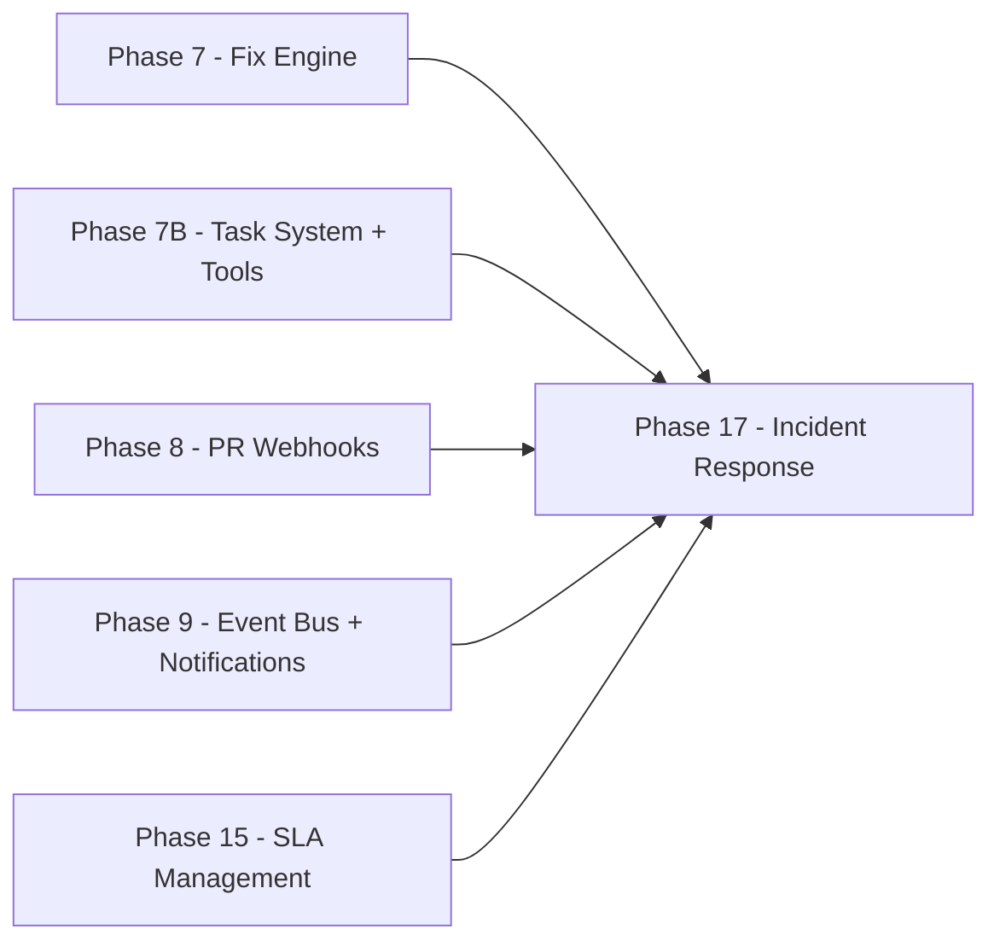

## Phase 17: Incident Response Orchestration

**Goal:** Transform Aegis's existing zero-day rapid response (7B-I) into a full incident response framework with multi-phase playbooks, automated containment, stakeholder communication, and post-mortem generation. When a critical security event occurs -- zero-day CVE, supply chain compromise, leaked secret, compliance breach -- Aegis executes a structured playbook that handles everything from locking down affected packages to generating the final incident report.

**Prerequisites:** Phase 7 (fix engine), Phase 7B (Aegis task system + tools + automations + Slack), Phase 8 (PR webhooks for branch protection), Phase 9 (notification events for alerting), Phase 15 (SLAs for deadline-aware triage).

**Timeline:** ~3-4 weeks. Builds heavily on the existing Aegis task system (7B-C) -- playbooks are specialized task types with domain-specific steps.

---

### The 6-Phase Incident Response Model

Every security incident, regardless of type, follows the same six phases:

```
CONTAIN --> ASSESS --> COMMUNICATE --> REMEDIATE --> VERIFY --> REPORT
  (stop       (what's      (tell           (fix          (confirm     (document
  bleeding)   affected?)   people)         it)           it's fixed)  everything)
```

Each phase maps to Aegis tools and actions. Playbooks define which tools run in each phase, in what order, and what decisions require human approval.

---

### 17A: Incident & Playbook Data Model

**Migration file:** `backend/database/phase17_incident_response.sql`

**Run after:** Phase 15 (SLA tables), Phase 7B (Aegis tables).

#### incident_playbooks

```sql
CREATE TABLE incident_playbooks (
  id UUID PRIMARY KEY DEFAULT uuid_generate_v4(),
  organization_id UUID NOT NULL REFERENCES organizations(id) ON DELETE CASCADE,
  name TEXT NOT NULL,
  description TEXT,
  trigger_type TEXT NOT NULL CHECK (trigger_type IN (
    'zero_day', 'supply_chain', 'secret_exposure', 'compliance_breach', 'custom'
  )),
  trigger_criteria JSONB,               -- auto-trigger conditions (see 17B)
  phases JSONB NOT NULL,                -- ordered array of PlaybookPhase (see below)
  auto_execute BOOLEAN DEFAULT false,   -- if true, runs autonomously when triggered
  notification_channels JSONB,          -- per-phase notification config
  is_template BOOLEAN DEFAULT false,    -- pre-built templates
  enabled BOOLEAN DEFAULT true,
  version INTEGER DEFAULT 1,
  usage_count INTEGER DEFAULT 0,
  last_used_at TIMESTAMPTZ,
  created_by UUID,
  updated_by UUID,
  created_at TIMESTAMPTZ DEFAULT NOW(),
  updated_at TIMESTAMPTZ DEFAULT NOW()
);

CREATE INDEX idx_ip_org ON incident_playbooks(organization_id);
CREATE INDEX idx_ip_org_trigger ON incident_playbooks(organization_id, trigger_type)
  WHERE enabled = true;
```

#### security_incidents

```sql
CREATE TABLE security_incidents (
  id UUID PRIMARY KEY DEFAULT uuid_generate_v4(),
  organization_id UUID NOT NULL REFERENCES organizations(id) ON DELETE CASCADE,
  playbook_id UUID REFERENCES incident_playbooks(id) ON DELETE SET NULL,
  task_id UUID REFERENCES aegis_tasks(id) ON DELETE SET NULL,
  title TEXT NOT NULL,
  incident_type TEXT NOT NULL,
  severity TEXT NOT NULL CHECK (severity IN ('critical', 'high', 'medium')),
  status TEXT NOT NULL DEFAULT 'active' CHECK (status IN (
    'active', 'contained', 'assessing', 'communicating',
    'remediating', 'verifying', 'resolved', 'closed', 'aborted'
  )),
  current_phase TEXT NOT NULL DEFAULT 'contain' CHECK (current_phase IN (
    'contain', 'assess', 'communicate', 'remediate', 'verify', 'report'
  )),
  trigger_source TEXT,                    -- 'cve_alert', 'watchtower', 'manual', 'aegis_automation'
  trigger_data JSONB,                     -- the triggering event data
  dedup_key TEXT,                         -- deduplication key (see 17B)

  -- People
  declared_by UUID,                       -- user or null for auto-triggered
  assigned_to UUID,                       -- responsible person (optional)
  escalation_level INTEGER DEFAULT 0,     -- incremented on phase timeout

  -- Scope
  affected_projects UUID[],
  affected_packages TEXT[],
  affected_cves TEXT[],

  -- Metrics
  time_to_contain_ms BIGINT,
  time_to_remediate_ms BIGINT,
  total_duration_ms BIGINT,
  fixes_created INTEGER DEFAULT 0,
  prs_merged INTEGER DEFAULT 0,

  -- Autonomy tracking
  autonomous_actions_taken JSONB DEFAULT '[]',  -- log of auto-approved dangerous tool calls
  is_false_positive BOOLEAN DEFAULT false,

  -- Output
  post_mortem TEXT,                        -- generated post-mortem markdown

  -- Timestamps
  declared_at TIMESTAMPTZ DEFAULT NOW(),
  contained_at TIMESTAMPTZ,
  remediated_at TIMESTAMPTZ,
  resolved_at TIMESTAMPTZ,
  closed_at TIMESTAMPTZ,
  created_at TIMESTAMPTZ DEFAULT NOW()
);

CREATE UNIQUE INDEX idx_si_dedup ON security_incidents(organization_id, dedup_key)
  WHERE dedup_key IS NOT NULL AND status NOT IN ('resolved', 'closed', 'aborted');
CREATE INDEX idx_si_org_status ON security_incidents(organization_id, status);
CREATE INDEX idx_si_org_created ON security_incidents(organization_id, created_at DESC);
```

Key design decisions:
- `dedup_key` with partial unique index prevents duplicate active incidents for the same trigger event.
- Granular `status` values track all 6 phases plus terminal states.
- `autonomous_actions_taken` provides audit trail for auto-bypassed approvals.
- `post_mortem` stored as markdown (PDF export is client-side via browser print).

#### incident_timeline

```sql
CREATE TABLE incident_timeline (
  id UUID PRIMARY KEY DEFAULT uuid_generate_v4(),
  incident_id UUID NOT NULL REFERENCES security_incidents(id) ON DELETE CASCADE,
  phase TEXT NOT NULL,
  event_type TEXT NOT NULL,    -- 'phase_started', 'action_taken', 'approval_requested',
                               -- 'approval_granted', 'notification_sent', 'fix_started',
                               -- 'fix_completed', 'verification_passed', 'note_added',
                               -- 'escalation_fired', 'scope_expanded'
  description TEXT NOT NULL,
  actor TEXT,                  -- 'aegis', user name, or 'system'
  metadata JSONB,
  duration_ms INTEGER,         -- how long this action took (for performance metrics)
  created_at TIMESTAMPTZ DEFAULT NOW()
);

CREATE INDEX idx_it_incident ON incident_timeline(incident_id, created_at);
```

#### incident_notes (manual observations during response)

```sql
CREATE TABLE incident_notes (
  id UUID PRIMARY KEY DEFAULT uuid_generate_v4(),
  incident_id UUID NOT NULL REFERENCES security_incidents(id) ON DELETE CASCADE,
  author_id UUID NOT NULL,
  content TEXT NOT NULL,
  created_at TIMESTAMPTZ DEFAULT NOW()
);

CREATE INDEX idx_in_incident ON incident_notes(incident_id, created_at);
```

#### Organization column (autonomous containment setting)

```sql
ALTER TABLE organizations
  ADD COLUMN IF NOT EXISTS allow_autonomous_containment BOOLEAN DEFAULT false;
```

When `true` and a playbook has `auto_execute = true`, critical-severity incidents auto-execute their Contain phase without human approval -- even for `dangerous` tools like `emergencyLockdownPackage`. All autonomous actions are logged.

#### RLS Policies

```sql
ALTER TABLE incident_playbooks ENABLE ROW LEVEL SECURITY;
ALTER TABLE security_incidents ENABLE ROW LEVEL SECURITY;
ALTER TABLE incident_timeline ENABLE ROW LEVEL SECURITY;
ALTER TABLE incident_notes ENABLE ROW LEVEL SECURITY;

CREATE POLICY "Service role full access on incident_playbooks" ON incident_playbooks FOR ALL
  USING (auth.role() = 'service_role');
CREATE POLICY "Service role full access on security_incidents" ON security_incidents FOR ALL
  USING (auth.role() = 'service_role');
CREATE POLICY "Service role full access on incident_timeline" ON incident_timeline FOR ALL
  USING (auth.role() = 'service_role');
CREATE POLICY "Service role full access on incident_notes" ON incident_notes FOR ALL
  USING (auth.role() = 'service_role');
```

**Phase definition structure** (stored in `incident_playbooks.phases` JSONB):

```typescript
interface PlaybookPhase {
  phase: 'contain' | 'assess' | 'communicate' | 'remediate' | 'verify' | 'report';
  name: string;
  steps: PlaybookStep[];
  requiresApproval: boolean;
  timeoutMinutes?: number;    // auto-escalate if phase takes too long
}

interface PlaybookStep {
  id: string;
  tool: string;               // Aegis tool name (must be a registered tool)
  params: Record<string, any>; // tool parameters (can reference incident context via $variables)
  condition?: string;          // skip if condition is false (safe JSON-based, see 17C)
  onFailure: 'continue' | 'pause' | 'abort';
}
```

---

### 17B: Trigger System

**File:** `backend/src/lib/incident-triggers.ts` (new)

The trigger system bridges Phase 9 events to incident creation. It runs inside the notification dispatcher pipeline -- when an event is dispatched, also check if it matches any active playbook triggers.

**Hook point:** In `backend/src/lib/notification-dispatcher.ts`, after `resolveMatchingRules()`, add a call to `checkIncidentTriggers(event)`.

#### Triggerable event types

Only specific event types can trigger incidents:

| Event Type | Playbook Type | Example Trigger Criteria |
|------------|---------------|--------------------------|
| `vulnerability_discovered` | `zero_day` | `{ severity: 'critical', cisa_kev: true }` or `{ epss_score: { $gt: 0.7 } }` |
| `supply_chain_anomaly` | `supply_chain` | `{ anomaly_score: { $gt: 80 } }` |
| `malicious_package_detected` | `supply_chain` | (always triggers if playbook enabled) |
| `secret_exposure_verified` | `secret_exposure` | `{ is_verified: true }` |
| `sla_breached` | `compliance_breach` | (always triggers if playbook enabled) |
| `policy_violation` | `compliance_breach` | `{ violations_count: { $gt: 5 } }` |

**New event type needed:** `secret_exposure_verified` -- emitted by the extraction worker pipeline after TruffleHog parsing when `is_verified = true` findings are detected. Add to extraction-worker/src/pipeline.ts in the TruffleHog step:

```typescript
if (verifiedSecrets.length > 0) {
  await emitEvent({
    type: 'secret_exposure_verified',
    organizationId,
    projectId,
    payload: {
      count: verifiedSecrets.length,
      detector_types: [...new Set(verifiedSecrets.map(s => s.detector_type))],
      project_name: projectName,
    },
    source: 'extraction_worker',
    priority: 'critical',
  });
}
```

#### Trigger evaluation logic

```typescript
async function checkIncidentTriggers(event: NotificationEvent): Promise<void> {
  const TRIGGERABLE_EVENTS = [
    'vulnerability_discovered', 'supply_chain_anomaly', 'malicious_package_detected',
    'secret_exposure_verified', 'sla_breached', 'policy_violation',
  ];
  if (!TRIGGERABLE_EVENTS.includes(event.event_type)) return;

  const { data: playbooks } = await supabase
    .from('incident_playbooks')
    .select('*')
    .eq('organization_id', event.organization_id)
    .eq('enabled', true)
    .not('auto_execute', 'is', null); // only auto-execute playbooks

  for (const playbook of playbooks || []) {
    if (!matchesTriggerCriteria(playbook.trigger_criteria, event)) continue;

    // Deduplication: one active incident per dedup_key
    const dedupKey = buildDedupKey(playbook.trigger_type, event);
    const { data: existing } = await supabase
      .from('security_incidents')
      .select('id')
      .eq('organization_id', event.organization_id)
      .eq('dedup_key', dedupKey)
      .not('status', 'in', '("resolved","closed","aborted")')
      .maybeSingle();

    if (existing) {
      await expandIncidentScope(existing.id, event);
      continue;
    }

    // Rate limit: max 5 incidents per org per hour
    const { count } = await supabase
      .from('security_incidents')
      .select('id', { count: 'exact', head: true })
      .eq('organization_id', event.organization_id)
      .gte('declared_at', new Date(Date.now() - 3600_000).toISOString());
    if ((count || 0) >= 5) continue;

    await declareIncident(event.organization_id, playbook, event);
  }
}
```

#### Dedup key format

- Zero-day: `zero_day:{osv_id}` (one incident per CVE)
- Supply chain: `supply_chain:{package_name}` (one per compromised package)
- Secret exposure: `secret_exposure:{detector_type}:{sha256(file_path)}` (one per finding location)
- Compliance breach: `compliance_breach:{project_id}` (one per project)

#### Trigger criteria matching

```typescript
function matchesTriggerCriteria(criteria: any, event: NotificationEvent): boolean {
  if (!criteria) return true; // no criteria = always match
  for (const [key, condition] of Object.entries(criteria)) {
    const eventValue = event.payload?.[key];
    if (typeof condition === 'object' && condition !== null) {
      if ('$gt' in condition && !(eventValue > condition.$gt)) return false;
      if ('$gte' in condition && !(eventValue >= condition.$gte)) return false;
      if ('$lt' in condition && !(eventValue < condition.$lt)) return false;
      if ('$in' in condition && !condition.$in.includes(eventValue)) return false;
    } else {
      if (eventValue !== condition) return false;
    }
  }
  return true;
}
```

#### Scope expansion (dedup merge)

When a new trigger matches an existing active incident, expand the scope:

```typescript
async function expandIncidentScope(incidentId: string, event: NotificationEvent): Promise<void> {
  const { data: incident } = await supabase
    .from('security_incidents').select('*').eq('id', incidentId).single();
  if (!incident) return;

  const updates: any = {};
  if (event.payload?.project_id && !incident.affected_projects?.includes(event.payload.project_id)) {
    updates.affected_projects = [...(incident.affected_projects || []), event.payload.project_id];
  }
  if (event.payload?.package_name && !incident.affected_packages?.includes(event.payload.package_name)) {
    updates.affected_packages = [...(incident.affected_packages || []), event.payload.package_name];
  }
  if (event.payload?.osv_id && !incident.affected_cves?.includes(event.payload.osv_id)) {
    updates.affected_cves = [...(incident.affected_cves || []), event.payload.osv_id];
  }

  if (Object.keys(updates).length > 0) {
    await supabase.from('security_incidents').update(updates).eq('id', incidentId);
    await addTimelineEvent(incidentId, incident.current_phase, 'scope_expanded',
      `Scope expanded: new affected ${Object.keys(updates).join(', ')} added`);
  }
}
```

#### Phase 9 event types for incident lifecycle

Emitted by the incident engine during lifecycle transitions:

| Event Type | Priority | When |
|------------|----------|------|
| `incident_declared` | critical | New incident created |
| `incident_contained` | high | Contain phase completed |
| `incident_resolved` | normal | All phases completed, incident resolved |
| `incident_escalated` | critical | Phase timeout fired |
| `incident_aborted` | high | Incident aborted due to critical failure |

These integrate with existing Phase 9 notification rules -- orgs can configure Slack/email/PagerDuty delivery for incident events.

---

### 17C: Playbook Execution Engine

**File:** `backend/src/lib/incident-engine.ts` (new)

The execution engine is **async and event-driven via QStash**, matching the existing Aegis task step pattern. No synchronous for-loops.

#### How it works

```
declareIncident() → create security_incidents + aegis_task + aegis_task_steps
                  → if auto_execute: queue first step via QStash
                  → else: wait for manual approval

execute-task-step → run tool → check if next step is new phase
                  → if new phase needs approval: pause, request approval
                  → if no approval needed: queue next step via QStash
                  → if phase complete: update incident timestamps + emit events
                  → if all phases done: resolve incident + generate post-mortem

escalate endpoint → check if incident still in timed-out phase
                  → increment escalation_level → emit incident_escalated event
```

#### declareIncident()

```typescript
async function declareIncident(
  orgId: string,
  playbook: IncidentPlaybook,
  triggerEvent: NotificationEvent
): Promise<string> {
  // 1. Build incident scope from trigger event
  const scope = extractScope(triggerEvent);

  // 2. Create security_incidents record
  const { data: incident } = await supabase
    .from('security_incidents')
    .insert({
      organization_id: orgId,
      playbook_id: playbook.id,
      title: buildIncidentTitle(playbook.trigger_type, triggerEvent),
      incident_type: playbook.trigger_type,
      severity: determineSeverity(triggerEvent),
      trigger_source: triggerEvent.source,
      trigger_data: triggerEvent.payload,
      dedup_key: buildDedupKey(playbook.trigger_type, triggerEvent),
      affected_projects: scope.projects,
      affected_packages: scope.packages,
      affected_cves: scope.cves,
    })
    .select().single();

  // 3. Convert playbook phases into aegis_task + aegis_task_steps
  const taskId = await createIncidentTask(orgId, incident, playbook);
  await supabase.from('security_incidents')
    .update({ task_id: taskId }).eq('id', incident.id);

  // 4. Timeline entry
  await addTimelineEvent(incident.id, 'contain', 'phase_started',
    `Incident declared: ${incident.title}`);

  // 5. Emit Phase 9 notification event
  await emitEvent({
    type: 'incident_declared',
    organizationId: orgId,
    payload: {
      incident_id: incident.id,
      title: incident.title,
      severity: incident.severity,
      incident_type: incident.incident_type,
      affected_projects_count: scope.projects.length,
      affected_packages: scope.packages,
    },
    source: 'incident_engine',
    priority: 'critical',
  });

  // 6. Security audit log
  await logSecurityEvent({
    organizationId: orgId,
    action: 'incident_declared',
    targetType: 'security_incident',
    targetId: incident.id,
    metadata: { severity: incident.severity, trigger_type: playbook.trigger_type, auto_execute: playbook.auto_execute },
    severity: 'critical',
  });

  // 7. Auto-start or wait for approval
  const shouldAutoStart = playbook.auto_execute;
  if (shouldAutoStart) {
    await autoStartIncident(incident, playbook, orgId);
  }

  // 8. Update playbook usage stats
  await supabase.from('incident_playbooks')
    .update({
      usage_count: playbook.usage_count + 1,
      last_used_at: new Date().toISOString(),
    })
    .eq('id', playbook.id);

  return incident.id;
}
```

#### createIncidentTask()

Converts playbook phases into flattened `aegis_task_steps`:

```typescript
async function createIncidentTask(
  orgId: string, incident: any, playbook: IncidentPlaybook
): Promise<string> {
  // Create aegis_task
  const { data: task } = await supabase
    .from('aegis_tasks')
    .insert({
      organization_id: orgId,
      title: `Incident Response: ${incident.title}`,
      mode: playbook.auto_execute ? 'autonomous' : 'plan',
      status: playbook.auto_execute ? 'running' : 'awaiting_approval',
      plan_json: playbook.phases,
      total_steps: playbook.phases.reduce((sum, p) => sum + p.steps.length, 0),
    })
    .select().single();

  // Flatten phases into task steps
  let stepNumber = 1;
  for (const phase of playbook.phases) {
    for (const step of phase.steps) {
      await supabase.from('aegis_task_steps').insert({
        task_id: task.id,
        step_number: stepNumber++,
        title: `[${phase.phase.toUpperCase()}] ${step.tool}`,
        tool_name: step.tool,
        tool_params: {
          ...step.params,
          __incident_id: incident.id,
          __incident_phase: phase.phase,
          __requires_approval: phase.requiresApproval,
          __on_failure: step.onFailure,
          __condition: step.condition,
          __timeout_minutes: phase.timeoutMinutes,
        },
        status: 'pending',
      });
    }
  }

  return task.id;
}
```

Step metadata fields prefixed with `__` are consumed by the execution engine, not passed to the tool.

#### Autonomous containment override

When `org.allow_autonomous_containment = true` and incident severity is critical:

```typescript
async function autoStartIncident(
  incident: any, playbook: IncidentPlaybook, orgId: string
): Promise<void> {
  const { data: org } = await supabase
    .from('organizations').select('allow_autonomous_containment').eq('id', orgId).single();

  const taskId = incident.task_id || (await supabase
    .from('security_incidents').select('task_id').eq('id', incident.id).single()).data?.task_id;

  // If org allows autonomous containment AND incident is critical,
  // mark task as running and queue first step
  if (org?.allow_autonomous_containment && incident.severity === 'critical') {
    await supabase.from('aegis_tasks')
      .update({ status: 'running', started_at: new Date().toISOString() })
      .eq('id', taskId);

    const firstStepId = await getNextPendingStep(taskId);
    if (firstStepId) {
      await qstashClient.publishJSON({
        url: `${BACKEND_URL}/api/internal/aegis/execute-task-step`,
        body: { taskId, stepId: firstStepId },
      });
    }

    await logSecurityEvent({
      organizationId: orgId,
      action: 'incident_auto_started',
      targetType: 'security_incident',
      targetId: incident.id,
      metadata: { autonomous: true, severity: incident.severity },
      severity: 'critical',
    });
  } else {
    // Non-critical or org doesn't allow autonomous: still need approval on contain phase
    // Task stays in awaiting_approval -- user must approve from Aegis UI
  }
}
```

#### Phase transition logic

Added to the `execute-task-step` handler in `backend/src/routes/aegis-task-step.ts`:

After a step completes successfully, check if the next step is in a different phase:

```typescript
// After executeTaskStep returns successfully:
if (result.hasMore) {
  const nextStepId = await getNextPendingStep(taskId);
  if (nextStepId) {
    const nextStep = await loadStep(nextStepId);
    const currentPhase = completedStep.tool_params.__incident_phase;
    const nextPhase = nextStep.tool_params.__incident_phase;
    const incidentId = completedStep.tool_params.__incident_id;

    if (incidentId && currentPhase !== nextPhase) {
      // Phase transition
      await advanceIncidentPhase(incidentId, nextPhase, currentPhase);

      // Check if next phase requires approval
      if (nextStep.tool_params.__requires_approval) {
        await requestPhaseApproval(incidentId, nextPhase, taskId);
        return; // Don't queue next step -- wait for approval
      }

      // Schedule escalation timeout for new phase
      if (nextStep.tool_params.__timeout_minutes) {
        await scheduleEscalation(incidentId, nextPhase, nextStep.tool_params.__timeout_minutes);
      }
    }

    // Queue next step
    await qstashClient.publishJSON({
      url: `${BACKEND_URL}/api/internal/aegis/execute-task-step`,
      body: { taskId, stepId: nextStepId },
    });
  }
} else if (result.taskCompleted) {
  // All steps done -- resolve incident
  const incidentId = completedStep.tool_params.__incident_id;
  if (incidentId) {
    await resolveIncident(incidentId);
  }
}
```

#### Variable resolution (safe, no eval)

```typescript
function resolveVariables(params: Record<string, any>, incident: SecurityIncident): Record<string, any> {
  const context: Record<string, any> = {
    incident_id: incident.id,
    organization_id: incident.organization_id,
    affected_projects: incident.affected_projects || [],
    affected_packages: incident.affected_packages || [],
    affected_cves: incident.affected_cves || [],
    severity: incident.severity,
    incident_type: incident.incident_type,
    title: incident.title,
  };
  return JSON.parse(
    JSON.stringify(params).replace(/"\$(\w+)"/g, (_, key) =>
      context[key] !== undefined ? JSON.stringify(context[key]) : `"$${key}"`
    )
  );
}
```

Only string values matching `"$variableName"` are replaced. No arbitrary code execution.

#### Condition evaluation (safe, JSON-based)

```typescript
function evaluateCondition(condition: string, incident: SecurityIncident): boolean {
  // Supports: "$field.length > N", "$field === 'value'", "$field > N"
  const arrayLengthMatch = condition.match(/^\$(\w+)\.length\s*(>|<|>=|<=|===|==)\s*(\d+)$/);
  if (arrayLengthMatch) {
    const [, field, op, val] = arrayLengthMatch;
    const arr = (incident as any)[field];
    if (!Array.isArray(arr)) return true;
    const num = parseInt(val);
    switch (op) {
      case '>': return arr.length > num;
      case '<': return arr.length < num;
      case '>=': return arr.length >= num;
      case '<=': return arr.length <= num;
      case '===': case '==': return arr.length === num;
    }
  }

  const stringMatch = condition.match(/^\$(\w+)\s*===\s*'([^']+)'$/);
  if (stringMatch) {
    const [, field, val] = stringMatch;
    return (incident as any)[field] === val;
  }

  return true; // Unknown format = execute (safe default)
}
```

#### Escalation via QStash

```typescript
async function scheduleEscalation(incidentId: string, phase: string, timeoutMinutes: number) {
  await qstashClient.publishJSON({
    url: `${BACKEND_URL}/api/internal/incidents/escalate`,
    body: { incidentId, phase },
    delay: timeoutMinutes * 60,
    headers: { 'X-Internal-Api-Key': process.env.INTERNAL_API_KEY! },
  });
}
```

Escalation endpoint behavior:
1. Check if incident is still in the same phase (if not, discard -- phase already advanced)
2. Increment `escalation_level` on the incident
3. Emit `incident_escalated` Phase 9 event (priority: critical -- triggers PagerDuty)
4. Add timeline entry: "Phase {phase} timed out after {X} minutes -- escalated to level {N}"

#### Concurrent incident handling

When multiple incidents are active simultaneously:
- Each incident is an independent Aegis task -- they execute in parallel via QStash
- **Fix deduplication:** Before `triggerFix` in a remediation step, check `project_security_fixes` for an active fix on the same target. If found, skip and log "Fix already in progress from incident {X}"
- **Priority ordering:** Higher severity incidents get QStash priority (0s delay vs 30s for medium)

---

### 17D: Pre-Built Playbook Templates

**File:** `backend/src/lib/incident-templates.ts` (new)

Four templates seeded as `is_template = true` playbooks that orgs can clone and customize. Defined as TypeScript objects; seeded when org enables incident response or on first Aegis setup.

**1. Zero-Day CVE Response** (`trigger_type: 'zero_day'`):

Auto-trigger: critical CVE with `cisa_kev = true` or EPSS > 0.7 affecting any org project.

| Phase | Steps | Tool | Approval |
|-------|-------|------|----------|
| Contain | Lock affected package across all projects | `emergencyLockdownPackage` | Yes (dangerous) |
| Assess | Blast radius: which projects, how used, reachable? | `assessBlastRadius` | No |
| Assess | SLA deadline check | `getSLAStatus` | No |
| Communicate | Slack alert to #security with blast radius summary | `createSlackMessage` | No |
| Communicate | Email to org admins | `sendEmail` | No |
| Remediate | Security sprint for affected projects ranked by Depscore | `createSecuritySprint` | Propose mode: Yes |
| Verify | Re-extract all affected projects | `triggerExtraction` (per project) | No |
| Report | Generate security report + post-mortem | `generateSecurityReport` | No |

**2. Supply Chain Compromise** (`trigger_type: 'supply_chain'`):

Auto-trigger: Watchtower anomaly score > 80 for a package, or malicious indicator detected.

| Phase | Steps | Tool |
|-------|-------|------|
| Contain | Block compromised version org-wide | `emergencyLockdownPackage` |
| Assess | Full usage analysis across org | `assessBlastRadius` |
| Assess | Watchtower evidence summary | `getWatchtowerSummary` |
| Communicate | Alert with confidence level and evidence | `createSlackMessage` + `sendEmail` |
| Remediate | If safe version exists: sprint to downgrade. If none: remove strategies | `createSecuritySprint` |
| Verify | Re-extract all affected projects | `triggerExtraction` (per project) |
| Report | Supply chain incident report | `generateSecurityReport` |

**3. Secret Exposure** (`trigger_type: 'secret_exposure'`):

Auto-trigger: TruffleHog finding with `is_verified = true` (confirmed active credential).

| Phase | Steps | Tool |
|-------|-------|------|
| Contain | Alert with rotation guidance (no lockdown needed for secrets) | `createSlackMessage` + `sendEmail` |
| Assess | Check if secret is in current code vs git history only | `getSecretFindings` |
| Communicate | Notify project owner + security team (redacted only) | `createSlackMessage` |
| Remediate | Replace hardcoded value with env var | `triggerFix` (strategy: `remediate_secret`) |
| Verify | Re-extract; verify finding gone or `is_current = false` | `triggerExtraction` |
| Report | Secret exposure report: detection time, exposure window | `generateSecurityReport` |

**4. Compliance Breach** (`trigger_type: 'compliance_breach'`):

Auto-trigger: policy evaluation changes project status from passing to non-passing, OR SLA breach.

| Phase | Steps | Tool |
|-------|-------|------|
| Contain | Identify scope: which projects, policies, violations | `getComplianceStatus` |
| Assess | Impact analysis: "X packages across Y projects non-compliant" | `evaluatePolicy` |
| Communicate | Notify compliance team with violation details | `createSlackMessage` + `sendEmail` |
| Remediate | Generate exception requests for low-risk items | `listPolicyExceptions` |
| Verify | Re-run policy evaluation; confirm passing | `evaluatePolicy` |
| Report | Compliance incident report: root cause, scope, resolution | `generateSecurityReport` |

---

### 17E: Post-Mortem Generation

**File:** `backend/src/lib/incident-postmortem.ts` (new)

**Strategy: Markdown-first, client-side PDF export.**

Server-side PDF via puppeteer requires Chromium binaries -- too heavy and fragile. Instead:
- Generate structured markdown from incident data + timeline (always works, no AI needed)
- Optionally enhance "Root Cause" and "Recommendations" via BYOK AI (if org has provider)
- Store markdown in `security_incidents.post_mortem`
- Frontend provides "Download PDF" via browser `window.print()` with print-optimized CSS

```typescript
async function generatePostMortem(incidentId: string): Promise<string> {
  const incident = await loadIncidentWithTimeline(incidentId);
  let markdown = buildTemplatePostMortem(incident); // always works, no AI

  // Optional AI enhancement (if org has BYOK provider)
  try {
    const provider = await getProviderForOrg(incident.organization_id);
    if (provider) {
      const enhanced = await enhanceWithAI(provider, markdown, incident);
      if (enhanced) markdown = enhanced;
    }
  } catch {
    // AI enhancement failed -- template version is fine
  }

  await supabase.from('security_incidents')
    .update({ post_mortem: markdown })
    .eq('id', incidentId);

  return markdown;
}
```

**Template-based post-mortem (no AI required):**

```markdown
# Security Incident Report: [Title]

## Summary
- **Type**: [incident_type]
- **Severity**: [severity]
- **Declared**: [declared_at]
- **Resolved**: [resolved_at]
- **Duration**: [total_duration formatted]

## Impact
- **Affected Projects**: [count] ([names])
- **Affected Packages**: [list]
- **Vulnerabilities**: [CVE IDs]

## Timeline
| Time | Phase | Action |
|------|-------|--------|
[generated from incident_timeline entries]

## Metrics
- **Time to Contain**: [time_to_contain formatted]
- **Time to Remediate**: [time_to_remediate formatted]
- **Fixes Created**: [fixes_created]
- **PRs Merged**: [prs_merged]
- **SLA Status**: [from Phase 15 data]

## Root Cause
[If AI available: generated analysis. If not: "See incident timeline for details."]

## Recommendations
[If AI available: generated recommendations. If not: "Review incident timeline and affected scope for preventive measures."]
```

---

### 17F: Custom Playbook Builder

Users can create custom playbooks via:

1. **Aegis chat**: "Create an incident response playbook for when a critical CVE affects our Crown Jewels projects." Aegis generates a playbook definition using the template structure, user reviews and approves.

2. **Management console**: "Incidents" tab > "Create Playbook" button > step-by-step form:
   - Name + description
   - Trigger type (from presets or custom)
   - Auto-trigger criteria (optional, JSON builder or natural language via Aegis)
   - Per-phase step configuration: pick tools from the Aegis tool registry, configure parameters, set approval requirements
   - Notification channels per phase
   - Test playbook with dry run (simulates execution without taking actions)

3. **Playbook validation** on save: All tool names in steps must be registered Aegis tools. Invalid tool names rejected.

---

### 17G: API Endpoints

#### EE Routes (`backend/src/routes/incidents.ts`, new file, registered in backend/src/index.ts)

| Method | Path | Purpose | Permission |
|--------|------|---------|------------|
| `GET` | `/api/organizations/:id/incidents` | List incidents (paginated, filter: status, type, severity, date range) | `interact_with_aegis` |
| `GET` | `/api/organizations/:id/incidents/stats` | Metrics: active count, avg resolution time, monthly count, severity breakdown | `interact_with_aegis` |
| `GET` | `/api/organizations/:id/incidents/:incidentId` | Get incident detail + timeline + notes | `interact_with_aegis` |
| `POST` | `/api/organizations/:id/incidents` | Manually declare an incident (body: title, severity, incident_type, affected_projects, playbook_id?) | `manage_incidents` |
| `PATCH` | `/api/organizations/:id/incidents/:incidentId/resolve` | Resolve incident (triggers post-mortem generation) | `manage_incidents` |
| `PATCH` | `/api/organizations/:id/incidents/:incidentId/close` | Close incident (body: is_false_positive?) | `manage_incidents` |
| `PATCH` | `/api/organizations/:id/incidents/:incidentId/abort` | Abort incident + cancel remaining steps | `manage_incidents` |
| `POST` | `/api/organizations/:id/incidents/:incidentId/notes` | Add manual note (body: content) | `interact_with_aegis` |
| `GET` | `/api/organizations/:id/incidents/:incidentId/post-mortem` | Get/generate post-mortem markdown | `interact_with_aegis` |
| `GET` | `/api/organizations/:id/playbooks` | List playbooks (templates + custom) | `interact_with_aegis` |
| `POST` | `/api/organizations/:id/playbooks` | Create custom playbook | `manage_incidents` |
| `PUT` | `/api/organizations/:id/playbooks/:playbookId` | Update playbook | `manage_incidents` |
| `DELETE` | `/api/organizations/:id/playbooks/:playbookId` | Delete custom playbook (blocks template deletion) | `manage_incidents` |
| `POST` | `/api/organizations/:id/playbooks/:playbookId/dry-run` | Simulate playbook (no real actions) | `manage_incidents` |

#### CE Routes (`backend/src/routes/incident-cron.ts`, new file, mounted in index.ts in index.ts)

| Method | Path | Purpose | Auth |
|--------|------|---------|------|
| `POST` | `/api/internal/incidents/escalate` | QStash delayed: escalate timed-out phase | QStash / X-Internal-Api-Key |

The escalation route handles QStash delayed publish callbacks for phase timeouts:

```typescript
router.post('/api/internal/incidents/escalate', requireInternalAuth, async (req, res) => {
  const { incidentId, phase } = req.body;
  if (!incidentId || !phase) return res.status(400).json({ error: 'Missing incidentId or phase' });

  const { data: incident } = await supabase
    .from('security_incidents').select('*').eq('id', incidentId).single();

  if (!incident) return res.status(404).json({ error: 'Incident not found' });

  // Discard stale escalation (phase already advanced)
  if (incident.current_phase !== phase) return res.json({ skipped: true, reason: 'Phase already advanced' });
  if (['resolved', 'closed', 'aborted'].includes(incident.status)) return res.json({ skipped: true });

  // Escalate
  await supabase.from('security_incidents')
    .update({ escalation_level: (incident.escalation_level || 0) + 1 })
    .eq('id', incidentId);

  await addTimelineEvent(incidentId, phase, 'escalation_fired',
    `Phase "${phase}" timed out -- escalated to level ${(incident.escalation_level || 0) + 1}`);

  await emitEvent({
    type: 'incident_escalated',
    organizationId: incident.organization_id,
    payload: {
      incident_id: incidentId,
      title: incident.title,
      severity: incident.severity,
      phase,
      escalation_level: (incident.escalation_level || 0) + 1,
    },
    source: 'incident_engine',
    priority: 'critical',
  });

  res.json({ escalated: true, level: (incident.escalation_level || 0) + 1 });
});
```

The trigger checking does NOT need its own cron -- it piggybacks on the Phase 9 notification dispatcher (inline during event dispatch).

---

### 17H: Aegis Tool Registration

**File:** `backend/src/lib/aegis/tools/incidents.ts` (new, imported in `backend/src/lib/aegis/tools/index.ts`)

Register 3 new tools so Aegis can interact with incidents via chat:

```typescript
registerAegisTool({
  name: 'declareIncident',
  description: 'Manually declare a security incident and optionally start a response playbook.',
  category: 'security_ops',
  permissionLevel: 'dangerous',
  parameters: {
    type: 'object',
    properties: {
      title: { type: 'string' },
      severity: { type: 'string', enum: ['critical', 'high', 'medium'] },
      incidentType: { type: 'string', enum: ['zero_day', 'supply_chain', 'secret_exposure', 'compliance_breach', 'custom'] },
      affectedPackages: { type: 'array', items: { type: 'string' } },
      playbookId: { type: 'string', description: 'Optional: playbook to execute' },
    },
    required: ['title', 'severity', 'incidentType'],
  },
  execute: async (params, context) => { /* create incident via engine */ },
});

registerAegisTool({
  name: 'getIncidentStatus',
  description: 'Get the current status of a security incident including phase, timeline, and affected scope.',
  category: 'security_ops',
  permissionLevel: 'read',
  parameters: { /* incidentId */ },
  execute: async (params, context) => { /* load incident + timeline */ },
});

registerAegisTool({
  name: 'listActiveIncidents',
  description: 'List all active security incidents for the organization.',
  category: 'security_ops',
  permissionLevel: 'read',
  parameters: {},
  execute: async (params, context) => { /* query active incidents */ },
});
```

---

### 17I: Frontend UI

**Active incident integration in AegisPage:**

In `frontend/src/app/pages/AegisPage.tsx`, add an "ACTIVE INCIDENTS" section above the existing "Active Tasks" in the left panel:
- Fetch `GET /api/organizations/:id/incidents?status=active,contained,assessing,communicating,remediating,verifying`
- Subscribe to `security_incidents` via Supabase Realtime for live status updates
- Render incident cards: severity badge (red critical / amber high) + title + current phase badge + time since declared
- Clicking an incident switches the main panel from chat to the incident detail view

**Supabase Realtime hooks:**
- `useIncidentStatus(orgId)` -- subscribes to `security_incidents` UPDATE for org's active incidents
- `useIncidentTimeline(incidentId)` -- subscribes to `incident_timeline` INSERT for selected incident

**Incident detail view** (main panel replacement when incident selected):

- Header bar: severity badge + title + status badge + "Declared Xm ago" + "Resolve" / "Close" buttons
- Phase progress bar: six connected segments (Contain -> Assess -> Communicate -> Remediate -> Verify -> Report). States: completed (green), current (amber with spinner), upcoming (zinc-900). Thin connecting lines between segments.
- Timeline: chronological event log grouped by phase. Each event: timestamp + phase badge + actor badge ("Aegis" or user name) + description. Expandable metadata. Vertical timeline line with colored dots (green complete, amber current, red failure).
- Approval card: inline card when current phase needs approval. "Approve" and "Reject" buttons.
- "Add Note" button for manual observations.
- Right panel (conditional, 320px): Affected Scope -- projects list (red/green dots), packages, CVE links, fix status during remediation.

**Stitch AI Prompt for Incident Detail View (Aegis Screen):**

> Design an incident response detail view within the Aegis three-panel screen for Deptex (dark theme: bg #09090b, cards #18181b, borders #27272a 1px, text #fafafa, secondary #a1a1aa, accent green #22c55e, critical red #ef4444, high amber #f59e0b). This view replaces the chat view in the main panel when an incident is selected from the left sidebar. Font: Inter body, JetBrains Mono for timestamps/IDs. 8px border-radius. No gradients, no shadows.
>
> **Left sidebar context (already rendered by Aegis screen):** Above the "Active Tasks" section, add a new "ACTIVE INCIDENTS" section header (11px uppercase, red-400, tracking-wider, with a red pulsing dot left of the text when incidents exist). Below: incident cards (zinc-900 bg, red-500/10 border-l-2, rounded-r-md, p-3, mb-1). Each card: severity pill (red-500 bg "Critical" or amber-500 bg "High", 10px font, rounded-full, px-2) + title (13px semibold white, max 1 line truncate) on first line. Second line: current phase badge ("Remediate" in amber-500/15 bg, amber-500 text, 10px, rounded-sm, px-1.5) + "12m ago" in zinc-500 11px. Active/selected card: bg-zinc-800, white left border instead of red.
>
> **Main panel -- Incident Detail View:**
>
> Header bar (border-b zinc-800, px-6, py-4, flex between):
> - Left: severity badge (large, 12px, rounded-sm, px-2 py-0.5, red-500 bg white text for critical, amber-500 bg for high) + incident title "Zero-Day: CVE-2024-XXXX in lodash" in 18px semibold + status badge ("Active" with pulsing amber dot, or "Resolved" with green check, zinc-700 bg, 12px, rounded-full, px-2.5).
> - Right: "Declared 42m ago" in 13px zinc-400. Below: two buttons side-by-side -- "Resolve" (green-500 bg, white text, 13px, rounded-md, 32px height, check icon) and "Close" (zinc-700 bg, zinc-300 text, same size, x icon).
>
> Phase progress bar (px-6, py-4, border-b zinc-800):
> - Six connected segments in a horizontal row, each ~120px wide, 40px tall.
> - Each segment: rounded-md, 1px border. Content: phase icon (16px) above phase name (11px semibold uppercase).
> - Segment states: Completed = green-500/15 bg, green-500 border, green-500 text, green check icon. Current = amber-500/15 bg, amber-500 border, amber-500 text, animated spinner icon. Upcoming = zinc-900 bg, zinc-800 border, zinc-500 text, circle icon.
> - Between segments: thin connecting line (2px, zinc-700, green-500 if segment before it is completed).
> - Phases in order: Contain (shield icon), Assess (search icon), Communicate (megaphone icon), Remediate (wrench icon), Verify (check-circle icon), Report (file-text icon).
>
> Timeline section (flex-1, overflow-y-auto, px-6, py-4):
> - Each event is a row with left-aligned layout:
>   - Left column (60px): timestamp in JetBrains Mono 11px zinc-500. Format: "14:30" for same day, "Feb 28 14:30" for older.
>   - Vertical timeline line: 2px zinc-800 connecting all events. Event dots: 8px circles on the line. Green for completed actions, amber for current, red for failures.
>   - Content column: phase badge (same style as progress bar but smaller, 10px, inline) + actor badge ("Aegis" with sparkle icon in green-500/15 bg, or user name in zinc-700 bg, 10px) + description text (13px zinc-200).
>   - Expandable: events with metadata show a "Details" link (zinc-400, 11px). Expands to show JSON or structured data in a zinc-950 bg code block with JetBrains Mono 11px.
> - Events grouped by phase with a subtle phase header between groups (11px uppercase zinc-600, border-b zinc-800/50).
>
> **Right panel (conditional, ~320px):**
> - Header: "Affected Scope" 14px semibold, zinc-300.
> - Section 1 -- "Projects" (count badge): list of affected project names with colored dots (red if still affected, green if remediated). Click navigates to project.
> - Section 2 -- "Packages" (count badge): affected package names with version in JetBrains Mono 12px zinc-400.
> - Section 3 -- "Vulnerabilities" (count badge): OSV IDs as clickable links (green-500, JetBrains Mono 12px) that open the vulnerability detail sidebar.
> - Section 4 -- "Fixes" (appears during/after Remediate phase): list of fix jobs with status badges (running spinner, completed check, failed x).

**Management Console Incidents tab:**

Replace the placeholder in `frontend/src/components/settings/AegisManagementConsole.tsx` (lines 788-796). Two sub-sections:

**Section 1 -- Incident Metrics** (three cards):
- Card 1: "Active Incidents" -- count (red if > 0, green if 0) + severity breakdown
- Card 2: "Avg Resolution Time" -- formatted duration + total count
- Card 3: "Incidents This Month" -- count + resolved/active breakdown

**Section 2 -- Playbooks** card:
- Header: "Response Playbooks" + "Create Playbook" button
- List of playbooks: icon + name + trigger criteria summary + auto-execute toggle + usage count + overflow menu (Edit, Dry Run, Duplicate, Delete)
- Templates labeled with "Template" pill; custom playbooks below

**Section 3 -- Incident History** card:
- Header: "Incident History" + filter row (type, severity, date range) + "Export" button
- Table: Date, Incident title, Type badge, Severity badge, Duration, Projects count, Resolution status
- Click opens incident detail in Aegis screen
- Pagination
- Empty state: "No incidents recorded yet."

**Stitch AI Prompt for Incidents Tab (Management Console):**

> Design an "Incidents" tab inside the Aegis AI management console for Deptex (dark theme: bg #09090b, cards #18181b, borders #27272a 1px, text #fafafa, secondary #a1a1aa, accent green #22c55e, critical red #ef4444, high amber #f59e0b). This tab is one of 9 tabs in the management console. Content area is ~900px wide. Font: Inter body, JetBrains Mono for timestamps/IDs. 8px border-radius.
>
> **Top row -- Incident metrics** (three cards side-by-side, zinc-900 bg, zinc-800 border, p-4, equal width):
> - Card 1: "Active Incidents" -- count in 28px semibold (red-500 if > 0, green-500 if 0). Below: severity breakdown "1 critical, 1 high" in 12px zinc-400. If 0: "No active incidents" in 12px green-500.
> - Card 2: "Avg Resolution Time" -- "4h 12m" in 28px semibold zinc-200. Below: "across 14 incidents" in 12px zinc-400.
> - Card 3: "Incidents This Month" -- count in 28px semibold. Below: "X resolved, Y active" in 12px zinc-400.
>
> **Section 1 -- "Playbooks"** card (zinc-900 bg, zinc-800 border, rounded-lg, p-5):
>
> - Header: "Response Playbooks" 15px semibold left. Right: "Create Playbook" button (green-500 bg, white text, plus icon, rounded-md, 32px height, 13px).
> - List of playbook cards (zinc-800/50 border between rows, py-3):
>   - Left: playbook icon (shield for zero-day, box for supply chain, key for secret, clipboard for compliance, puzzle for custom) in zinc-500. Name "Zero-Day CVE Response" in 14px semibold zinc-200. Below: trigger criteria summary "Triggers on: critical CVE with CISA KEV = true or EPSS > 0.7" in 12px zinc-400.
>   - Center: "Auto-execute" toggle (green-500 when on, zinc-600 when off) with label "Auto" in 11px zinc-500.
>   - Right: "Used 5 times" in 12px zinc-400. Overflow menu (...): Edit, Dry Run, Duplicate, Delete.
> - 4 pre-built templates shown first (labeled "Template" pill in zinc-700 bg, 10px), then custom playbooks.
>
> **Section 2 -- "Incident History"** card (zinc-900 bg, zinc-800 border, rounded-lg, p-5):
>
> - Header: "Incident History" 15px semibold left. Right: filter row -- type dropdown ("All Types"), severity dropdown ("All Severities"), date range picker. Far right: "Export" button (zinc-700 bg, download icon, 12px).
> - Table layout. Columns: "Date" (JetBrains Mono 12px zinc-400, "Feb 28, 2026"), "Incident" (title in 13px zinc-200 semibold, truncate at 40 chars), "Type" (pill: "Zero-Day" red-500/15 bg red-400 text, "Supply Chain" amber-500/15 bg amber-400 text, "Secret" purple-500/15 bg purple-400 text, "Compliance" blue-500/15 bg blue-400 text), "Severity" (pill, same style as type badges but red/amber), "Duration" (JetBrains Mono 12px zinc-400 "4h 12m"), "Projects" (count, 12px zinc-400), "Resolution" ("Resolved" green-500, "Active" amber-500, "Aborted" red-500 in 12px semibold).
> - Rows: hover bg-zinc-800/30. Click opens incident detail (navigates to Aegis screen with incident selected).
> - Pagination: "Showing 1-20 of 42" with prev/next (zinc-700 bg, 28px rounded-md).
> - Empty state: "No incidents recorded yet. Incidents are created automatically when playbook triggers fire, or manually via Aegis chat." in 14px zinc-500 centered.

---

### 17J: Phase 7B Gap Fix (Prerequisite)

**Must be fixed before Phase 17 works.** Two issues:

**1. approveTask() must queue first step:**

In `backend/src/lib/aegis/tasks.ts`, `approveTask()` sets `status = 'running'` but never queues the first step via QStash. Add:

```typescript
async function approveTask(taskId: string): Promise<void> {
  await supabase.from('aegis_tasks').update({
    status: 'running', started_at: new Date().toISOString()
  }).eq('id', taskId);

  const firstStepId = await getNextPendingStep(taskId);
  if (firstStepId) {
    await qstashClient.publishJSON({
      url: `${BACKEND_URL}/api/internal/aegis/execute-task-step`,
      body: { taskId, stepId: firstStepId },
    });
  }
}
```

**2. Sprint tool name mismatch:**

In `backend/src/lib/aegis/sprint-orchestrator.ts`, `buildSprintPlan()` uses `toolName: 'triggerAiFix'` but the tool is registered as `triggerFix` in `security-ops.ts`. Fix:

```typescript
// sprint-orchestrator.ts ~line 316
toolName: 'triggerFix', // was: 'triggerAiFix'
```

---

### 17K: Hosting & Infrastructure Summary

| Resource | Change | Cost |
|----------|--------|------|
| **Fly.io** | No new machines. Playbooks execute as Aegis task steps in the backend process. | $0 |
| **QStash** | 0 new cron schedules. Trigger checking is inline with notification dispatch. Escalation uses QStash delayed publish (per-incident, on demand). | $0 (free tier) |
| **Supabase** | 4 new tables (~5 indexes), RLS policies. Enable Realtime on `security_incidents` + `incident_timeline`. | $0 additional |
| **Redis** | Cache: `incident-stats:{orgId}` (60s TTL). Rate limit: `incident-rate:{orgId}` (1h window). | Negligible |
| **Storage** | Not needed (post-mortem markdown in column, PDF export is client-side). | $0 |
| **New npm deps** | None for backend. Frontend: optionally `jspdf` + `html2canvas` (~150KB) for PDF export, or use `window.print()` (zero deps). | $0 |
| **New env vars** | None. Uses existing `INTERNAL_API_KEY`, `QSTASH_TOKEN`, etc. | -- |
| **Total** | | **$0/month** |

Data retention: `incident_timeline` ~1KB per event. A 50-event incident ~50KB. 100 incidents/year ~5MB. No cleanup needed for years.

---

### 17L: Phase 17 Test Suite (44 tests)

#### Backend Tests (`backend/src/routes/__tests__/incident-response.test.ts`)

**Trigger System (1-6):**
1. `vulnerability_discovered` with CISA KEV + critical severity triggers zero-day playbook
2. `supply_chain_anomaly` with anomaly score > 80 triggers supply chain playbook
3. `secret_exposure_verified` triggers secret exposure playbook
4. `sla_breached` triggers compliance breach playbook
5. Deduplication: second trigger for same CVE expands existing incident scope (not new incident)
6. Rate limit: 6th incident in 1 hour is rejected

**Playbook Execution (7-14):**
7. Zero-day playbook executes all 6 phases via QStash step chain
8. Phase with `requiresApproval = true` pauses until approved
9. Step with failed condition is skipped and logged
10. Step failure with `onFailure: 'pause'` pauses the incident
11. Step failure with `onFailure: 'abort'` aborts the entire incident
12. Phase timestamps set correctly at each phase completion
13. `total_duration_ms` computed correctly on resolution
14. Playbook execution creates correct `incident_timeline` entries

**Autonomous Containment (15-18):**
15. Org with `allow_autonomous_containment = true`: critical incident auto-executes contain phase without approval
16. Org with `allow_autonomous_containment = false`: critical incident pauses for approval on contain phase
17. Autonomous actions logged in `autonomous_actions_taken` and `security_audit_logs`
18. Non-critical incidents always respect approval requirements regardless of org setting

**Escalation (19-21):**
19. Phase timeout fires QStash escalation after configured minutes
20. Escalation increments `escalation_level` and emits `incident_escalated` event
21. Escalation for already-advanced phase is discarded (stale escalation)

**Post-Mortem (22-25):**
22. Post-mortem includes all timeline events in chronological order
23. Post-mortem metrics (time-to-contain, time-to-remediate) computed correctly
24. Post-mortem generates without BYOK (template-based fallback)
25. Post-mortem AI-enhanced when BYOK available

**API Endpoints (26-31):**
26. `POST /incidents` creates incident with correct initial state
27. `PATCH /incidents/:id/resolve` sets resolved_at and generates post-mortem
28. `PATCH /incidents/:id/close` with `is_false_positive = true` marks correctly
29. `GET /incidents` returns paginated results filtered by status/type/severity
30. `GET /incidents/stats` returns correct metrics
31. Playbook CRUD: create, update, delete (blocks template deletion)

**Concurrent/Edge Cases (32-34):**
32. Two incidents for different CVEs run in parallel without interference
33. Two incidents trying to fix same package: second deduplicates fix
34. Incident with no matching playbook: manual incident created with no auto-steps

#### Frontend Tests (`frontend/src/__tests__/incident-response-ui.test.ts`)

**Incident UI (35-40):**
35. Active incident appears in Aegis left sidebar with red indicator
36. Incident detail view shows 6-phase progress bar with current phase highlighted
37. Timeline renders all events with correct phase badges and timestamps
38. Right panel shows affected projects, packages, and CVEs
39. "Resolve" button transitions incident to resolved state
40. Incident history table renders past incidents with correct data

**Integration (41-44):**
41. Phase 9 notification events dispatch for incident lifecycle events
42. Remediation phase triggers Phase 7 fix sprint
43. Verification phase triggers re-extraction
44. SLA deadlines from Phase 15 shown in Assess phase output

---

### Setup Checklist

1. **Fix Phase 7B gap:** `approveTask()` must queue first step via QStash (17J above). Fix sprint tool name `triggerAiFix` -> `triggerFix`.
2. **Run database migration:** `backend/database/phase17_incident_response.sql` (4 tables, indexes, RLS, org column).
3. **Add `secret_exposure_verified` event type:** In extraction worker pipeline, emit when TruffleHog finds `is_verified = true` findings.
4. **Enable Supabase Realtime** on `security_incidents` and `incident_timeline` tables (Supabase dashboard > Database > Replication).
5. **No new QStash cron schedules.** Escalation uses on-demand QStash delayed publish.
6. **No new env vars.** Uses existing `INTERNAL_API_KEY`, `QSTASH_TOKEN`, etc.
7. **No new npm dependencies** (backend). Frontend PDF export: use `window.print()` (zero deps) or optionally add `jspdf`.
8. **Deploy:** Backend API + frontend bundle. No new workers, no new Fly.io machines.

---

### Dependency Map



Phase 16 (Learning) is NOT a prerequisite but will benefit from incident fix outcomes being recorded as `fix_outcomes`.
