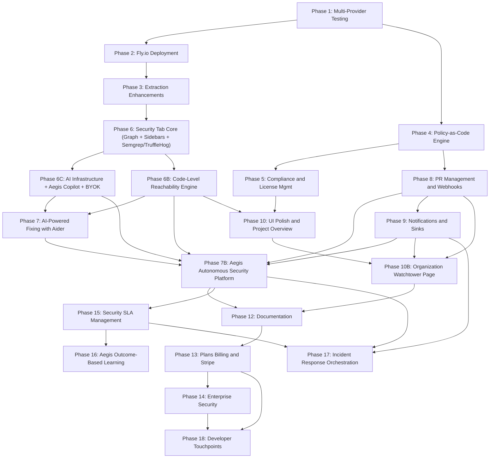

# Deptex Projects - Master Roadmap

## Architecture Overview

> **Note:** Phase 11 (Advanced LLM Integration) has been merged into Phase 7B. All AI-powered features are now Aegis capabilities.

---

## Phase Index

- [Phase 1: Multi-Provider Testing and Stabilization](phase_01_testing.plan.md)
- [Phase 2: Extraction Worker Deployment on Fly.io](phase_02_flyio.plan.md)
- [Phase 3: Extraction Worker Enhancements](phase_03_extraction.plan.md)
- [Phase 4: Policy-as-Code Engine + Custom Statuses](phase_04_policy.plan.md)
- [Phase 5: Compliance Tab Overhaul](phase_05_compliance.plan.md)
- [Phase 6: Security Tab Core](phase_06_security.plan.md)
- [Phase 6B: Code-Level Reachability Engine](phase_06b_reachability.plan.md)
- [Phase 6C: AI Infrastructure & Aegis Copilot](phase_06c_ai_aegis.plan.md)
- [Phase 7: AI-Powered Vulnerability Fixing (Aider)](phase_07_aider.plan.md)
- [Phase 7B: Aegis Autonomous Security Platform](phase_07b_aegis.plan.md)
- [Phase 8: PR Management and Webhooks](phase_08_pr_webhooks.plan.md)
- [Phase 9: Notifications and Integrations](phase_09_notifications.plan.md)
- [Phase 10: UI Polish and Project Overview](phase_10_ui.plan.md)
- [Phase 10B: Organization Watchtower Page](phase_10_watchtower_org_ae3ae7a1.plan.md)
- [Phase 11: MERGED INTO PHASE 7B](phase_11_merged.plan.md)
- [Phase 12: Documentation Overhaul](phase_12_docs.plan.md)
- [Phase 13: Plans, Billing & Stripe](phase_13_billing.plan.md)
- [Phase 14: Enterprise Security](phase_14_enterprise_security.plan.md)
- [Phase 15: Security SLA Management](phase_15_security_slas.plan.md)
- [Phase 16: Aegis Outcome-Based Learning](phase_16_aegis_learning.plan.md)
- [Phase 17: Incident Response Orchestration](phase_17_incident_response.plan.md)
- [Phase 18: Developer Touchpoints (IDE, CLI, CI)](phase_18_developer_tools.plan.md)

---

## Database Migrations Summary

New columns needed (across all phases):

- `projects.status_id` UUID (FK to organization_statuses - replaces is_compliant and legacy status)
- `projects.status_violations` TEXT[] (violation messages from last policy run)
- `projects.policy_evaluated_at` TIMESTAMPTZ
- `projects.asset_tier_id` UUID (FK to organization_asset_tiers - replaces asset_tier TEXT)
- `projects.effective_package_policy_code` TEXT (nullable - null means inherited from org)
- `projects.effective_project_status_code` TEXT (nullable - null means inherited from org)
- `projects.effective_pr_check_code` TEXT (nullable - null means inherited from org)
- `project_dependencies.policy_result` JSONB (stores per-dep package policy result: { allowed, reasons })
- `project_dependencies.is_outdated` BOOLEAN
- `project_dependencies.versions_behind` INTEGER
- `project_dependencies.malicious_indicator` JSONB
- `dependency_versions.slsa_level` INTEGER
- `projects.vulnerability_summary` JSONB (cached counts by severity)
- `projects.action_items` JSONB (pre-computed action items from policy evaluation: [{ message, deps, link }])
- `project_dependency_vulnerabilities.reachability_level` TEXT ('unreachable', 'module', 'import', 'data_flow', 'confirmed') - upgraded by atom reachable flow analysis
- `project_dependency_vulnerabilities.reachability_details` JSONB (flow_count, entry_points, sink_methods, tags)
- `project_dependency_vulnerabilities.suppressed` BOOLEAN DEFAULT false
- `project_dependency_vulnerabilities.risk_accepted` BOOLEAN DEFAULT false
- `project_dependency_vulnerabilities.risk_accepted_by` UUID (FK to auth.users)
- `project_dependency_vulnerabilities.risk_accepted_at` TIMESTAMPTZ
- `project_dependency_vulnerabilities.risk_accepted_reason` TEXT
- `project_semgrep_findings.extraction_run_id` TEXT NOT NULL (upsert-then-delete-stale pattern)
- `project_secret_findings.extraction_run_id` TEXT NOT NULL (upsert-then-delete-stale pattern)
- `project_secret_findings.is_current` BOOLEAN DEFAULT true (true if in HEAD, false if only in git history)
- `aegis_chat_threads.project_id` UUID (nullable FK to projects - for project-scoped Aegis threads)
- `aegis_chat_threads.context_type` TEXT (nullable - 'vulnerability', 'dependency', 'project_overview')
- `aegis_chat_threads.context_id` TEXT (nullable - OSV ID or dependency ID)
- `aegis_chat_threads.total_tokens_used` INTEGER DEFAULT 0 (running token count for per-thread budget enforcement)
- `organization_ai_providers.monthly_cost_cap` NUMERIC(8, 2) DEFAULT 100.00 (configurable monthly BYOK spend limit)
- `organization_ai_providers.encryption_key_version` INTEGER DEFAULT 1 (tracks which AI_ENCRYPTION_KEY version encrypted this row)
- `projects.last_vuln_check_at` TIMESTAMPTZ (background vuln monitoring timestamp)
- `projects.vuln_check_frequency` TEXT DEFAULT '24h' (configurable monitoring frequency)
- `aegis_automations.cron_expression` TEXT (cron schedule expression)
- `aegis_automations.timezone` TEXT DEFAULT 'UTC'
- `aegis_automations.automation_type` TEXT DEFAULT 'custom' (template name or 'custom')
- `aegis_automations.delivery_config` JSONB (channels, format)
- `aegis_automations.template_config` JSONB (template-specific settings)
- `aegis_automations.qstash_schedule_id` TEXT (QStash schedule ID)
- `aegis_automations.last_run_at` TIMESTAMPTZ
- `aegis_automations.last_run_status` TEXT
- `aegis_automations.last_run_output` TEXT
- `aegis_automations.run_count` INTEGER DEFAULT 0
- `aegis_chat_messages.metadata` JSONB DEFAULT '{}' (tool execution references)
- `project_repositories.sync_frequency` TEXT DEFAULT 'manual' ('manual', 'on_commit', 'daily', 'weekly')
- `organizations.mfa_enforced` BOOLEAN DEFAULT false
- `organizations.mfa_grace_period_days` INTEGER DEFAULT 7
- `projects.watchtower_enabled` BOOLEAN DEFAULT false (per-project Watchtower activation toggle)
- `organization_roles.permissions -> manage_watchtower` BOOLEAN (new org-level permission for Watchtower management)

Removed columns (old exception model replaced by git-like versioning):

- `projects.asset_tier` TEXT (replaced by asset_tier_id UUID FK)
- `projects.has_active_exception` (removed)
- `projects.exception_status_id` (removed)
- `organization_policies.policy_code` (deprecated - replaced by 3 separate tables)
- `project_policy_exceptions.override_status_id` (table replaced entirely)

New tables:

- `extraction_jobs` (Supabase-based job queue with status tracking, retry logic, crash recovery)
- `extraction_logs` (real-time extraction pipeline logs with Supabase Realtime, linked to jobs via run_id)
- `organization_statuses` (org-defined custom statuses with name, color, rank, is_passing, is_system)
- `organization_asset_tiers` (customizable asset tiers with name, color, rank, environmental_multiplier, is_system)
- `organization_package_policies` (single org-wide package policy code, one row per org)
- `organization_status_codes` (single org-wide project status code, one row per org)
- `organization_pr_checks` (single org-wide PR check code, one row per org)
- `project_policy_changes` (git-like policy versioning - replaces `project_policy_exceptions`. Fields: id, project_id, organization_id, code_type, author_id, reviewer_id, parent_id, base_code, proposed_code, message, status, is_ai_generated, ai_merged_code, has_conflict, created_at, reviewed_at)
- `project_vulnerability_events` (timeline tracking: detected, resolved, suppressed, accepted, kev_added, epss_changed, depscore_changed)
- `project_semgrep_findings` (parsed Semgrep code security findings: rule_id, file_path, line range, severity, message, CWE/OWASP refs)
- `project_secret_findings` (parsed TruffleHog secret findings: detector_type, file_path, is_verified, redacted_value - never stores full secrets)
- `organization_ai_providers` (BYOK keys: provider, encrypted_api_key, model_preference, is_default, monthly_cost_cap - shared by Aegis + Aider)
- `ai_usage_logs` (AI usage tracking for both tiers: organization_id, user_id, feature, tier, provider, model, input_tokens, output_tokens, estimated_cost, context_type, context_id, duration_ms, success)
- `project_security_fixes` (AI fix job tracking for all fix types: fix_type, strategy, status, osv_id/semgrep_finding_id/secret_finding_id, fly_machine_id, pr_url, tokens_used, estimated_cost)
- `project_version_candidates` (smart version recommendations: package_name, ecosystem, candidate_type, candidate_version, fixes_cve_count, known_new_cves, release_notes, verified_at)
- `aegis_tool_executions` (audit log of every Aegis tool call: tool_name, category, params, result, permission_level, approval_status, duration_ms, tokens_used, cost)
- `aegis_tasks` (long-running background tasks: title, mode, status, plan_json, step counts, total_cost, summary)
- `aegis_task_steps` (individual steps within a task: step_number, tool_name, tool_params, status, result_json, cost)
- `aegis_memory` (organizational knowledge base: category, key, content, embedding vector(1536), source_thread_id, expires_at)
- `aegis_approval_requests` (pending approval requests for dangerous actions: tool_name, params, justification, status, reviewed_by, expires_at)
- `aegis_event_triggers` (event-driven automation triggers: event_type, filter_criteria, automation_id)
- `aegis_org_settings` (per-org Aegis configuration: operating_mode, budgets, tool_permissions, pr_review_mode, preferred_provider/model)
- `aegis_slack_config` (Slack bot configuration: bot_token, signing_secret, default_channel)
- `security_debt_snapshots` (daily security debt score snapshots: score, breakdown, snapshot_date)
- `package_reputation_scores` (package reputation scoring: package_name, score, signals breakdown)
- `project_reachable_flows` (atom reachable flow paths: purl, flow_nodes JSONB, entry_point_file/method/line/tag, sink_file/method/line, sink_is_external, flow_length)
- `project_usage_slices` (atom usage analysis: file_path, line_number, containing_method, target_name, target_type, resolved_method, usage_label)
- `project_code_snippets` (extracted source code at each flow step: reachable_flow_id, step_index, file_path, code_content, highlight_line)
- `project_commits` (commit history from webhooks)
- `project_pr_checks` (PR check run results)
- `license_obligations` (reference table for license requirements)
- `organization_plans` (billing and plan management: plan_tier, stripe_customer_id, stripe_subscription_id, syncs_used/limit, projects_limit, members_limit, watchtower_limit)
- `organization_sso_providers` (SSO configuration: provider_type, supabase_sso_provider_id, domain, enforce_sso, default_role_id, group_role_mapping)
- `project_watchlist` (junction table: project_id + organization_watchlist_id -- tracks which projects contributed which packages to the org watchlist for clean removal on disable)

Dropped tables:

- `project_policy_exceptions` (replaced by `project_policy_changes`)
- `organization_policies` (replaced by 3 separate tables: `organization_package_policies`, `organization_status_codes`, `organization_pr_checks`)

---

## API Cost Summary (Scale-to-Zero Model)

All Fly.io workers use the scale-to-zero pattern: machines only run during active jobs and stop themselves when done. You pay per-second of actual compute, not 24/7.

**Deptex infrastructure costs (what we pay):**

- **Extraction worker pool** (3 stopped machines, performance-8x 64GB): **~$5/month idle** + ~$0.13-0.19/job (10-15 min with deep reachability analysis)
- **Aider worker pool** (2 stopped machines, shared-cpu-4x 4GB): **$0.30/month idle** + ~$0.005/job
- **Platform AI - Gemini 2.5 Flash** (Tier 1 features: analyze usage, policy assistant, action items, summaries): **~$5-15/month** across all orgs. ~$0.0001-0.0003 per call. This is so cheap it's effectively free to operate.
- **Socket.dev API** (malicious detection): Free tier 250/month, then $0.01/lookup: **$0-10/month**

**BYOK costs (what orgs pay their own LLM provider -- Tier 2):**

These costs are billed directly by the org's chosen provider (OpenAI, Anthropic, or Google). Deptex does not see or pay these costs.

- **Aegis chat message**: ~$0.001-0.05 per message depending on model (GPT-4o-mini: ~$0.002, GPT-4o: ~$0.03, Gemini Flash: ~$0.0003). Multi-turn tool use multiplies this by ~2-5x for complex queries (multiple LLM calls in the ReAct loop).
- **Aegis memory embeddings**: ~$0.000002 per memory stored (negligible). Uses text-embedding-3-small ($0.02/1M tokens).
- **Aegis scheduled automations**: ~$0.01-0.10 per automation run (depends on complexity and tools used). Daily briefing: ~$0.02. Weekly digest: ~$0.05. Monthly compliance report: ~$0.10.
- **Aegis PR security review**: ~$0.01-0.05 per PR review (analyzes diff + queries tools).
- **AI fix (Aider)**: ~$0.05-0.50 per fix depending on model and code size
- **Security Sprint**: sum of individual fix costs + planning overhead (~$0.01 per planning step)
- **Typical org monthly BYOK spend**: $10-100 depending on usage, model choice, and automation frequency. Orgs using Gemini Flash for Aegis chat + GPT-4o-mini for fixes will be on the lower end. Heavy users with daily automations and PR reviews: ~$50-100. Configurable monthly cost cap (default $100) prevents runaway spending.

**Typical month (Deptex infrastructure only, 100 extractions):**

- Extraction compute (100 jobs x ~$0.16 avg): $16
- Aider compute: $0.25
- Stopped machines: $5.30
- Platform AI (Gemini Flash): ~$10
- Socket.dev: $0
- **Total: ~$32/month**

**Heavy month (500 extractions):**

- Extraction compute (500 jobs x ~$0.16 avg): $80
- Aider compute: $1.00
- Stopped machines: $5.30
- Platform AI (Gemini Flash): ~$15
- Socket.dev: ~$5
- **Total: ~$106/month**

Note: Aider compute costs are infrastructure only (Fly.io machine time). The LLM token costs for Aider are BYOK -- paid by the org directly to their provider.

Note: The higher extraction compute cost reflects `performance-8x` 64GB machines for deep reachability analysis. With Fly.io compute reservations (40% discount for annual commitment), the extraction costs drop to ~$9.60/month (typical) and ~$48/month (heavy).
