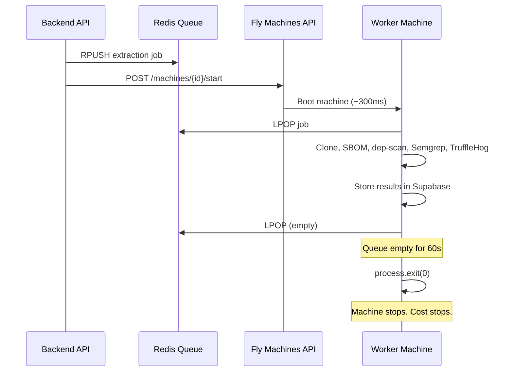

## Phase 2: Extraction Worker Deployment on Fly.io (Scale-to-Zero)

**Goal:** Deploy the extraction worker to Fly.io using a scale-to-zero architecture with a pre-created machine pool. Machines start on demand when jobs are enqueued, process the job, and stop themselves when idle. This enables full parallelism (multiple extractions at once) while paying only for actual compute seconds used.

### Architecture




For concurrent extractions: backend starts a DIFFERENT machine for each job. N jobs = N machines running in parallel, each pulling its own job from Redis.

### Machine Sizing

**Config: `performance-8x` with 64GB RAM** (iad region)

Why 64GB: With `--profile research` enabled, dep-scan uses the atom engine for deep reachability analysis (call graphs, data-flow tracing, code slicing). Atom's static analysis is memory-intensive: 32GB minimum for medium projects, 64GB+ recommended for large codebases. Semgrep (SAST) adds another 5-8GB. 64GB ensures reliable deep analysis across all project sizes without OOM kills.

Why 8 dedicated CPUs: cdxgen, Semgrep, and atom all benefit from parallelism. Dedicated (not shared) CPUs ensure consistent performance for the compute-heavy atom analysis. More CPUs = faster scans = shorter runtime = lower per-job cost.

Per-second rate: $0.0002153/sec = **$0.775/hr**

Since machines only run during extraction and stop themselves immediately after (scale-to-zero), you only pay for actual compute time:

- 5-minute extraction: ~$0.065
- 10-minute extraction: ~$0.13
- 30-minute deep analysis (large monorepo): ~$0.39

### Tasks

#### 2A: Replace Redis queue with Supabase-based job persistence

**Why:** If a machine crashes after popping a job from Redis, the job is lost forever. With Supabase, jobs live in Postgres and can always be recovered.

**New `extraction_jobs` table:**

- `id` UUID primary key
- `project_id` UUID (FK)
- `organization_id` UUID (FK)
- `status` TEXT: `queued`, `processing`, `completed`, `failed`, `cancelled`
- `run_id` UUID (links to `extraction_logs` for this run)
- `machine_id` TEXT (nullable - Fly machine ID that claimed this job)
- `payload` JSONB (repo_full_name, installation_id, default_branch, ecosystem, provider, integration_id, etc.)
- `attempts` INTEGER DEFAULT 0
- `max_attempts` INTEGER DEFAULT 3
- `error` TEXT (nullable - error message on failure)
- `started_at` TIMESTAMPTZ (nullable)
- `completed_at` TIMESTAMPTZ (nullable)
- `created_at` TIMESTAMPTZ

**Worker job claim** (atomic, safe for concurrent machines):

```sql
UPDATE extraction_jobs
SET status = 'processing', started_at = NOW(), machine_id = $1, attempts = attempts + 1
WHERE id = (
  SELECT id FROM extraction_jobs
  WHERE status = 'queued'
  ORDER BY created_at
  LIMIT 1
  FOR UPDATE SKIP LOCKED
)
RETURNING *;
```

`FOR UPDATE SKIP LOCKED` ensures two machines never grab the same job.

**Stuck job recovery:** A periodic check (runs on backend via cron/QStash every 5 minutes):

```sql
UPDATE extraction_jobs
SET status = 'queued', machine_id = NULL, started_at = NULL
WHERE status = 'processing'
  AND started_at < NOW() - INTERVAL '15 minutes'
  AND attempts < max_attempts;
```

Jobs stuck in `processing` for >15 min are assumed crashed and requeued (up to `max_attempts`).

Jobs that exceed `max_attempts` are set to `failed` with error "Extraction failed after {N} attempts (machine crash or timeout)".

**Worker lifecycle changes** in [index.ts](backend/extraction-worker/src/index.ts):

- Replace Redis LPOP with Supabase query using the atomic claim SQL above
- After processing, update job to `completed` or `failed`
- Check for more `queued` jobs; if none for 60 seconds, `process.exit(0)`
- Global try/catch around entire pipeline: on any unhandled error, update job to `failed` with error message, log to `extraction_logs`, then continue to next job

#### 2B: Add machine orchestrator to backend

Create `ee/backend/lib/fly-machines.ts`:

- `startExtractionMachine()`: calls Fly Machines API to start a stopped machine from the pool
- Uses `https://api.machines.dev/v1/apps/deptex-extraction-worker/machines` endpoint
- Lists machines, picks one in "stopped" state, sends `POST /machines/{id}/start`
- Called from [projects.ts](ee/backend/routes/projects.ts) right after inserting the job into `extraction_jobs`

**Edge case handling in the orchestrator:**


| Scenario                                       | Handling                                                                                                                                                                                                          |
| ---------------------------------------------- | ----------------------------------------------------------------------------------------------------------------------------------------------------------------------------------------------------------------- |
| All machines busy (none in "stopped" state)    | Create a burst machine via `POST /machines` (up to a configurable max, e.g., 5). Log warning.                                                                                                                     |
| Fly.io API unreachable / 5xx                   | Retry 3x with exponential backoff (1s, 2s, 4s). If still failing, log error but DON'T fail the request - the job is safely in Supabase. A stuck-job recovery cron will catch it when a machine becomes available. |
| Fly.io API rate limited (429)                  | Retry after `Retry-After` header, or 2s default.                                                                                                                                                                  |
| Machine fails to start (Fly returns error)     | Try a different machine from the pool. If all fail, log error - stuck-job recovery handles it.                                                                                                                    |
| `FLY_API_TOKEN` expired / 401                  | Log critical error, alert. Job stays `queued` in Supabase.                                                                                                                                                        |
| Machine starts but crashes before claiming job | Job stays `queued` in Supabase. Next machine start (or stuck-job recovery) picks it up.                                                                                                                           |
| Machine starts but can't reach Supabase        | Machine polls for job, gets errors, exits after idle timeout. Job stays `queued`.                                                                                                                                 |


Required env vars on backend:

- `FLY_API_TOKEN`: Fly.io API token (create via `fly tokens create deploy -a deptex-extraction-worker`)
- `FLY_EXTRACTION_APP`: `deptex-extraction-worker`
- `FLY_MAX_BURST_MACHINES`: Maximum total machines (default 5)

#### 2C: Create `fly.toml` for extraction worker

```toml
app = "deptex-extraction-worker"
primary_region = "iad"

[build]

[env]
  NODE_ENV = "production"

# No [http_service] - this is a worker, not a web server.
# Lifecycle managed by backend via Machines API start/stop.

[[vm]]
  cpu_kind = "shared"
  cpus = 8
  memory_mb = 16384
```

#### 2D: Update Dockerfile

Update [Dockerfile](backend/extraction-worker/Dockerfile):

- Pin Python package versions (dep-scan, semgrep) for reproducible builds
- Add non-root user for security
- Set `DEPSCAN_CACHE_DIR=/tmp/depscan-cache` (ephemeral, fresh each start)

#### 2E-pipeline: Comprehensive pipeline failure handling

Add structured error handling to every step in [pipeline.ts](backend/extraction-worker/src/pipeline.ts). Each step should:

1. Log a human-readable "Starting..." message to `extraction_logs`
2. Catch all errors and log them with level `error`
3. Decide: is this step **critical** (pipeline must abort) or **optional** (pipeline continues)?
4. On abort: update `extraction_jobs.status = 'failed'`, update `project_repositories.status = 'error'`, log final error message

**Critical steps** (abort on failure):

- Clone: without the repo, nothing else works
- SBOM generation: without deps, nothing else works
- Dependency sync: if DB writes fail, data is inconsistent

**Optional steps** (log warning, continue):

- Vulnerability scan (dep-scan): project works without vuln data
- Semgrep (SAST): supplementary scan
- TruffleHog (secrets): supplementary scan
- EPSS enrichment: supplementary data
- CISA KEV check: supplementary data
- Report upload to storage: supplementary artifacts

**Specific failure detections to add:**


| Failure                               | Detection                       | User-facing message                                                                      |
| ------------------------------------- | ------------------------------- | ---------------------------------------------------------------------------------------- |
| GitHub token expired                  | Clone returns 401/403           | "Authentication failed - your GitHub App installation may need to be reconnected"        |
| GitLab/Bitbucket token expired        | Clone returns auth error        | "Authentication failed - reconnect your {provider} integration in Organization Settings" |
| Repository not found / deleted        | Clone returns 404               | "Repository not found - it may have been deleted or made private"                        |
| Branch not found                      | Clone returns ref error         | "Branch '{branch}' not found in repository"                                              |
| Repo too large / disk full            | Clone hangs or ENOSPC           | "Repository is too large to scan (>{limit}GB)"                                           |
| No manifest file at specified path    | cdxgen finds nothing            | "No package manifest found at '{path}' - check your project's package path setting"      |
| cdxgen timeout                        | Process killed after 5 min      | "SBOM generation timed out - the repository may be too large or complex"                 |
| Empty SBOM (0 dependencies)           | Parse returns empty array       | "No dependencies found - the package manifest may be empty or in an unsupported format"  |
| Supabase connection error during sync | Connection refused / timeout    | "Database connection error during sync - will retry" (retry 3x)                          |
| dep-scan not installed                | which/command check fails       | "Vulnerability scanning unavailable (dep-scan not installed)" (warning, continue)        |
| dep-scan timeout                      | Process killed after timeout    | "Vulnerability scan timed out" (warning, continue)                                       |
| dep-scan crash (Python error)         | Non-zero exit + stderr          | "Vulnerability scan failed: {first line of stderr}" (warning, continue)                  |
| Semgrep OOM                           | Exit code 137 (SIGKILL)         | "Static analysis ran out of memory - scanning skipped" (warning, continue)               |
| Machine approaching memory limit      | Monitor `process.memoryUsage()` | Log warning when >80% of available RAM used                                              |


#### 2E: Initial deployment and pool creation

Steps:

1. Install flyctl: `powershell -Command "iwr https://fly.io/install.ps1 -useb | iex"`
2. Login: `fly auth login`
3. From `backend/extraction-worker/`: `fly launch` (creates the app from Dockerfile + fly.toml)
4. Set secrets: `fly secrets set SUPABASE_URL=xxx SUPABASE_SERVICE_ROLE_KEY=xxx UPSTASH_REDIS_URL=xxx UPSTASH_REDIS_TOKEN=xxx GITHUB_APP_ID=xxx GITHUB_APP_PRIVATE_KEY=xxx EXTRACTION_QUEUE_NAME=extraction-jobs`
5. Deploy: `fly deploy`
6. Scale to pool of 3 machines: `fly scale count 3`
7. Stop all machines (they start in "started" state): `fly machines list` then `fly machine stop <id>` for each
8. Create deploy token for backend: `fly tokens create deploy -a deptex-extraction-worker`
9. Add `FLY_API_TOKEN` to backend `.env`

After this, the pool of 3 stopped machines is ready. Backend starts them on demand.

#### 2F: Live extraction logs system

**Database:** New `extraction_logs` table:

- `id` UUID primary key
- `project_id` UUID (FK to projects)
- `run_id` UUID (groups logs per extraction run - generated when job is enqueued)
- `step` TEXT: `cloning`, `sbom`, `deps_sync`, `vuln_scan`, `semgrep`, `trufflehog`, `uploading`, `complete`
- `level` TEXT: `info`, `success`, `warning`, `error`
- `message` TEXT: Human-readable message
- `duration_ms` INTEGER (nullable): How long the step took
- `metadata` JSONB (nullable): Extra details (dep count, vuln count, error message)
- `created_at` TIMESTAMPTZ

Enable **Supabase Realtime** on this table so the frontend can subscribe to live inserts.

**Worker changes** - Create a `logger.ts` utility in the extraction worker:

- `ExtractionLogger` class that takes `projectId` and `runId`
- Methods: `info(step, message)`, `success(step, message, durationMs?)`, `warn(step, message)`, `error(step, message, error?)`
- Each method does an INSERT into `extraction_logs` via Supabase client
- Replace all current `console.log` calls in [pipeline.ts](backend/extraction-worker/src/pipeline.ts) with logger calls

**Human-readable message mapping:**


| Pipeline step  | Log messages                                                                                                     |
| -------------- | ---------------------------------------------------------------------------------------------------------------- |
| Clone          | "Cloning repository from GitHub..." -> "Repository cloned successfully" (2.1s)                                   |
| SBOM           | "Generating software bill of materials..." -> "SBOM generated - found 147 dependencies" (8.3s)                   |
| Deps sync      | "Syncing dependencies to database..." -> "Dependencies synced (89 direct, 58 transitive)" (1.2s)                 |
| Vuln scan      | "Running vulnerability scan..." -> "Vulnerability scan complete - found 12 vulnerabilities (3 critical)" (15.4s) |
| Vuln scan fail | "Running vulnerability scan..." -> "Vulnerability scan failed: process timed out" (red)                          |
| Semgrep        | "Running static code analysis..." -> "Static analysis complete - 4 findings" (22.1s)                             |
| Semgrep skip   | "Static analysis skipped (Semgrep not installed)" (warning/yellow)                                               |
| TruffleHog     | "Scanning for exposed secrets..." -> "Secret scan complete - no secrets found" (3.2s)                            |
| Upload         | "Uploading reports to storage..." -> "Reports uploaded successfully" (0.8s)                                      |
| Complete       | "Extraction complete" (green, with total duration)                                                               |
| Error          | "Extraction failed: {error message}" (red)                                                                       |


**Frontend - Live log sidebar** in project settings repository section:

- Extend or replace the existing [SyncDetailSidebar.tsx](frontend/src/components/SyncDetailSidebar.tsx)
- Dark background terminal-style panel (zinc-950, monospace font)
- Each log line shows: timestamp (HH:MM:SS), colored status dot (blue=info, green=success, yellow=warning, red=error), message, optional duration badge
- Subscribe to Supabase Realtime: `supabase.channel('extraction_logs').on('postgres_changes', { event: 'INSERT', filter: 'project_id=eq.{id}' }, callback)`
- Auto-scroll to bottom as new logs arrive
- Historical runs: dropdown to select past extraction runs (by run_id), loads logs for that run
- Collapsible detail: click a log line to expand metadata (error stack trace, detailed counts, etc.)

#### 2G: Test the full flow

1. Trigger a project extraction from the frontend
2. Verify backend enqueues to Redis AND calls Fly Machines API to start a machine
3. Verify machine boots, processes job, stores results, and stops itself
4. Verify live logs appear in real-time in the sidebar as each step progresses
5. Verify error states show as red log lines
6. Verify a second extraction starts a different machine (concurrency)
7. Verify machine stops after idle timeout
8. Verify historical log runs are browsable

### Cost Estimate (Scale-to-Zero)

- 3 stopped machines (rootfs ~2GB each): 3 x 2 x $0.15 = **$0.90/month idle**
- Per extraction job (~~5 min): **~~$0.01**
- 100 extractions/month: $0.90 + $1.03 = **~$2/month**
- 500 extractions/month: $0.90 + $5.14 = **~$6/month**
