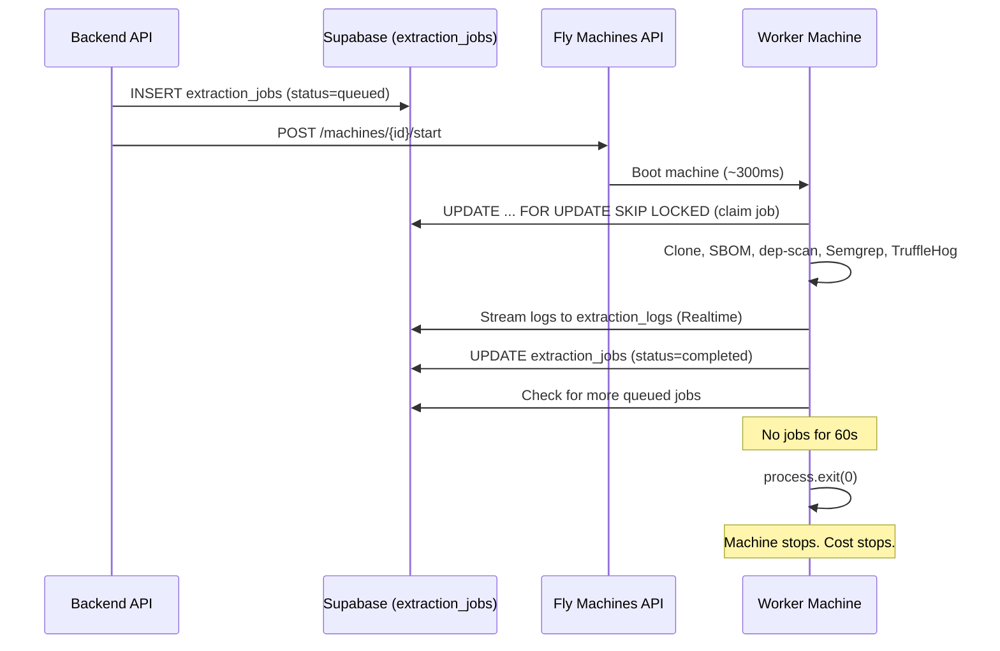

## Phase 2: Extraction Worker Deployment on Fly.io (Scale-to-Zero)

### How to Run This Plan

**Automated (agent executes):** Tasks 2A through 2F, 2I (security/RLS), 2J (recovery endpoint), 2K (lifecycle details), 2N (Redis deprecation) — database migrations, backend code, worker code, fly.toml, Dockerfile, pipeline failure handling, extraction logger, live logs UI, RLS policies, recovery cron, cancellation endpoint.

**Manual (you execute):** Tasks 2E-deploy and 2G — Fly.io deployment, secrets, machine pool setup, testing. **These steps are NOT run by the agent.** Instead, the agent creates `fly.md` at the project root with copy-paste commands and a checklist.

**When you click Run:**

1. The agent implements 2A–2F.
2. The agent **must** create `fly.md` at project root (see task 2H).
3. You run the commands in `fly.md` when ready to deploy.

**Goal:** Deploy the extraction worker to Fly.io using a scale-to-zero architecture with a pre-created machine pool. Machines start on demand when jobs are enqueued, process the job, and stop themselves when idle. This enables full parallelism (multiple extractions at once) while paying only for actual compute seconds used.

### Architecture




For concurrent extractions: backend starts a DIFFERENT machine for each job. N jobs = N machines running in parallel, each claiming its own job atomically from Supabase (not Redis). Jobs survive machine crashes — they stay in Postgres and are recovered automatically.

### Machine Sizing

**Config: `performance-8x` with 64GB RAM** (iad region)

Why 64GB: With `--profile research` enabled, dep-scan uses the atom engine for deep reachability analysis (call graphs, data-flow tracing, code slicing). Atom's static analysis is memory-intensive: 32GB minimum for medium projects, 64GB+ recommended for large codebases. Semgrep (SAST) adds another 5-8GB. 64GB ensures reliable deep analysis across all project sizes without OOM kills.

Why 8 dedicated CPUs: cdxgen, Semgrep, and atom all benefit from parallelism. Dedicated (not shared) CPUs ensure consistent performance for the compute-heavy atom analysis. More CPUs = faster scans = shorter runtime = lower per-job cost.

Per-second rate: $0.0002153/sec = **$0.775/hr**

Since machines only run during extraction and stop themselves immediately after (scale-to-zero), you only pay for actual compute time:

- 5-minute extraction: ~$0.065
- 10-minute extraction: ~$0.13
- 30-minute deep analysis (large monorepo): ~$0.39

### Tasks

#### 2A: Replace Redis queue with Supabase-based job persistence

**Why:** If a machine crashes after popping a job from Redis, the job is lost forever. With Supabase, jobs live in Postgres and can always be recovered.

**New `extraction_jobs` table:**

- `id` UUID primary key
- `project_id` UUID (FK)
- `organization_id` UUID (FK)
- `status` TEXT: `queued`, `processing`, `completed`, `failed`, `cancelled`
- `run_id` UUID (links to `extraction_logs` for this run — generated at enqueue time, regenerated on retry)
- `machine_id` TEXT (nullable — Fly machine ID that claimed this job)
- `payload` JSONB (repo_full_name, installation_id, default_branch, ecosystem, provider, integration_id, etc.)
- `attempts` INTEGER DEFAULT 0
- `max_attempts` INTEGER DEFAULT 3
- `error` TEXT (nullable — error message on failure)
- `started_at` TIMESTAMPTZ (nullable)
- `heartbeat_at` TIMESTAMPTZ (nullable — updated every 60s while processing; used by recovery to detect stuck jobs)
- `completed_at` TIMESTAMPTZ (nullable)
- `created_at` TIMESTAMPTZ

**Indexes:**

- `CREATE INDEX idx_extraction_jobs_status_created ON extraction_jobs(status, created_at)` — for the claim query
- `CREATE INDEX idx_extraction_jobs_project ON extraction_jobs(project_id)` — for project-level lookups
- `CREATE INDEX idx_extraction_jobs_org ON extraction_jobs(organization_id)` — for org-level lookups

**Migration file:** `backend/database/extraction_jobs_schema.sql`

**Worker job claim** (atomic, safe for concurrent machines):

```sql
UPDATE extraction_jobs
SET status = 'processing', started_at = NOW(), machine_id = $1, attempts = attempts + 1
WHERE id = (
  SELECT id FROM extraction_jobs
  WHERE status = 'queued'
  ORDER BY created_at
  LIMIT 1
  FOR UPDATE SKIP LOCKED
)
RETURNING *;
```

`FOR UPDATE SKIP LOCKED` ensures two machines never grab the same job.

**Stuck job recovery:** A periodic check (runs on backend via QStash cron every 5 minutes — see 2J for full implementation):

```sql
UPDATE extraction_jobs
SET status = 'queued', machine_id = NULL, started_at = NULL, heartbeat_at = NULL
WHERE status = 'processing'
  AND heartbeat_at < NOW() - INTERVAL '5 minutes'
  AND attempts < max_attempts;
```

The worker sends a heartbeat (`UPDATE heartbeat_at = NOW()`) every 60 seconds while processing. Jobs without a heartbeat for >5 min are assumed crashed and requeued (up to `max_attempts`). This is faster than the old 15-minute window and correctly handles long-running analysis (heartbeats keep the job alive).

Jobs that exceed `max_attempts` are set to `failed` with error "Extraction failed after {N} attempts (machine crash or timeout)".

See **2J** for the concrete recovery endpoint, RPC functions, and QStash trigger setup.
See **2K** for heartbeat implementation, run_id lifecycle, cancellation flow, and idle shutdown logic.

**Worker lifecycle changes** in [index.ts](backend/extraction-worker/src/index.ts):

- Replace Redis LPOP with Supabase query using the atomic claim SQL above
- After processing, update job to `completed` or `failed`
- Check for more `queued` jobs; if none for 60 seconds, `process.exit(0)`
- Global try/catch around entire pipeline: on any unhandled error, update job to `failed` with error message, log to `extraction_logs`, then continue to next job

#### 2B: Add machine orchestrator to backend

Create `ee/backend/lib/fly-machines.ts`:

- `startExtractionMachine()`: calls Fly Machines API to start a stopped machine from the pool
- Uses `https://api.machines.dev/v1/apps/deptex-extraction-worker/machines` endpoint
- Lists machines, picks one in "stopped" state, sends `POST /machines/{id}/start`
- Called from [projects.ts](ee/backend/routes/projects.ts) right after inserting the job into `extraction_jobs`

**Edge case handling in the orchestrator:**


| Scenario                                       | Handling                                                                                                                                                                                                          |
| ---------------------------------------------- | ----------------------------------------------------------------------------------------------------------------------------------------------------------------------------------------------------------------- |
| All machines busy (none in "stopped" state)    | Create a burst machine via `POST /machines` (up to a configurable max, e.g., 5). Log warning.                                                                                                                     |
| Fly.io API unreachable / 5xx                   | Retry 3x with exponential backoff (1s, 2s, 4s). If still failing, log error but DON'T fail the request - the job is safely in Supabase. A stuck-job recovery cron will catch it when a machine becomes available. |
| Fly.io API rate limited (429)                  | Retry after `Retry-After` header, or 2s default.                                                                                                                                                                  |
| Machine fails to start (Fly returns error)     | Try a different machine from the pool. If all fail, log error - stuck-job recovery handles it.                                                                                                                    |
| `FLY_API_TOKEN` expired / 401                  | Log critical error, alert. Job stays `queued` in Supabase.                                                                                                                                                        |
| Machine starts but crashes before claiming job | Job stays `queued` in Supabase. Next machine start (or stuck-job recovery) picks it up.                                                                                                                           |
| Machine starts but can't reach Supabase        | Machine polls for job, gets errors, exits after idle timeout. Job stays `queued`.                                                                                                                                 |


Required env vars on backend:

- `FLY_API_TOKEN`: Fly.io API token (create via `fly tokens create deploy -a deptex-extraction-worker`)
- `FLY_EXTRACTION_APP`: `deptex-extraction-worker`
- `FLY_MAX_BURST_MACHINES`: Maximum total machines (default 5)

#### 2C: Create `fly.toml` for extraction worker

```toml
app = "deptex-extraction-worker"
primary_region = "iad"

[build]

[env]
  NODE_ENV = "production"

# No [http_service] - this is a worker, not a web server.
# Lifecycle managed by backend via Machines API start/stop.

[[vm]]
  cpu_kind = "performance"
  cpus = 8
  memory_mb = 65536
```

Note: `performance` (dedicated) CPUs and 64GB RAM to support atom/dep-scan research profile. See Machine Sizing section above. For initial testing with basic extraction (no research profile), you can temporarily use `shared` cpus and `memory_mb = 16384` (16GB) to save cost, then scale up when enabling Phase 6B deep reachability.

#### 2D: Update Dockerfile

Update [Dockerfile](backend/extraction-worker/Dockerfile):

- Pin Python package versions (dep-scan, semgrep) for reproducible builds
- Add non-root user for security
- Set `DEPSCAN_CACHE_DIR=/tmp/depscan-cache` (ephemeral, fresh each start)

#### 2E-pipeline: Comprehensive pipeline failure handling

Add structured error handling to every step in [pipeline.ts](backend/extraction-worker/src/pipeline.ts). Each step should:

1. Log a human-readable "Starting..." message to `extraction_logs`
2. Catch all errors and log them with level `error`
3. Decide: is this step **critical** (pipeline must abort) or **optional** (pipeline continues)?
4. On abort: update `extraction_jobs.status = 'failed'`, update `project_repositories.status = 'error'`, log final error message

**Critical steps** (abort on failure):

- Clone: without the repo, nothing else works
- SBOM generation: without deps, nothing else works
- Dependency sync: if DB writes fail, data is inconsistent

**Optional steps** (log warning, continue):

- Vulnerability scan (dep-scan): project works without vuln data
- Semgrep (SAST): supplementary scan
- TruffleHog (secrets): supplementary scan
- EPSS enrichment: supplementary data
- CISA KEV check: supplementary data
- Report upload to storage: supplementary artifacts

**Specific failure detections to add:**


| Failure                               | Detection                       | User-facing message                                                                      |
| ------------------------------------- | ------------------------------- | ---------------------------------------------------------------------------------------- |
| GitHub token expired                  | Clone returns 401/403           | "Authentication failed - your GitHub App installation may need to be reconnected"        |
| GitLab/Bitbucket token expired        | Clone returns auth error        | "Authentication failed - reconnect your {provider} integration in Organization Settings" |
| Repository not found / deleted        | Clone returns 404               | "Repository not found - it may have been deleted or made private"                        |
| Branch not found                      | Clone returns ref error         | "Branch '{branch}' not found in repository"                                              |
| Repo too large / disk full            | Clone hangs or ENOSPC           | "Repository is too large to scan (>{limit}GB)"                                           |
| No manifest file at specified path    | cdxgen finds nothing            | "No package manifest found at '{path}' - check your project's package path setting"      |
| cdxgen timeout                        | Process killed after 5 min      | "SBOM generation timed out - the repository may be too large or complex"                 |
| Empty SBOM (0 dependencies)           | Parse returns empty array       | "No dependencies found - the package manifest may be empty or in an unsupported format"  |
| Supabase connection error during sync | Connection refused / timeout    | "Database connection error during sync - will retry" (retry 3x)                          |
| dep-scan not installed                | which/command check fails       | "Vulnerability scanning unavailable (dep-scan not installed)" (warning, continue)        |
| dep-scan timeout                      | Process killed after timeout    | "Vulnerability scan timed out" (warning, continue)                                       |
| dep-scan crash (Python error)         | Non-zero exit + stderr          | "Vulnerability scan failed: {first line of stderr}" (warning, continue)                  |
| Semgrep OOM                           | Exit code 137 (SIGKILL)         | "Static analysis ran out of memory - scanning skipped" (warning, continue)               |
| Machine approaching memory limit      | Monitor `process.memoryUsage()` | Log warning when >80% of available RAM used                                              |


#### 2E-deploy: Initial deployment and pool creation (MANUAL — do NOT implement)

**This task is not implemented by the agent.** All steps are in `fly.md`. User runs: install flyctl, `fly auth login`, `fly launch` from backend/extraction-worker, set secrets, `fly deploy`, `fly scale count 3`, stop all machines, create deploy token, add FLY_API_TOKEN to backend .env. Do not execute these during plan run.

#### 2F: Live extraction logs system

**Database:** New `extraction_logs` table:

- `id` UUID primary key
- `project_id` UUID (FK to projects)
- `run_id` UUID (groups logs per extraction run - generated when job is enqueued)
- `step` TEXT: `cloning`, `sbom`, `deps_sync`, `vuln_scan`, `semgrep`, `trufflehog`, `uploading`, `complete`
- `level` TEXT: `info`, `success`, `warning`, `error`
- `message` TEXT: Human-readable message
- `duration_ms` INTEGER (nullable): How long the step took
- `metadata` JSONB (nullable): Extra details (dep count, vuln count, error message)
- `created_at` TIMESTAMPTZ

**Migration file:** `backend/database/extraction_logs_schema.sql`

**Indexes:**

- `CREATE INDEX idx_extraction_logs_project ON extraction_logs(project_id)` — for project-level lookups
- `CREATE INDEX idx_extraction_logs_run ON extraction_logs(run_id)` — for fetching all logs in a run

Enable **Supabase Realtime** on this table so the frontend can subscribe to live inserts (must be enabled manually in Supabase Dashboard or via SQL: `ALTER PUBLICATION supabase_realtime ADD TABLE extraction_logs`).

**Worker changes** - Create a `logger.ts` utility in the extraction worker:

- `ExtractionLogger` class that takes `projectId` and `runId`
- Methods: `info(step, message)`, `success(step, message, durationMs?)`, `warn(step, message)`, `error(step, message, error?)`
- Each method does an INSERT into `extraction_logs` via Supabase client
- Replace all current `console.log` calls in [pipeline.ts](backend/extraction-worker/src/pipeline.ts) with logger calls

**Human-readable message mapping:**


| Pipeline step  | Log messages                                                                                                     |
| -------------- | ---------------------------------------------------------------------------------------------------------------- |
| Clone          | "Cloning repository from GitHub..." -> "Repository cloned successfully" (2.1s)                                   |
| SBOM           | "Generating software bill of materials..." -> "SBOM generated - found 147 dependencies" (8.3s)                   |
| Deps sync      | "Syncing dependencies to database..." -> "Dependencies synced (89 direct, 58 transitive)" (1.2s)                 |
| Vuln scan      | "Running vulnerability scan..." -> "Vulnerability scan complete - found 12 vulnerabilities (3 critical)" (15.4s) |
| Vuln scan fail | "Running vulnerability scan..." -> "Vulnerability scan failed: process timed out" (red)                          |
| Semgrep        | "Running static code analysis..." -> "Static analysis complete - 4 findings" (22.1s)                             |
| Semgrep skip   | "Static analysis skipped (Semgrep not installed)" (warning/yellow)                                               |
| TruffleHog     | "Scanning for exposed secrets..." -> "Secret scan complete - no secrets found" (3.2s)                            |
| Upload         | "Uploading reports to storage..." -> "Reports uploaded successfully" (0.8s)                                      |
| Complete       | "Extraction complete" (green, with total duration)                                                               |
| Error          | "Extraction failed: {error message}" (red)                                                                       |


**Frontend - Live log sidebar** in project settings repository section:

- Extend or replace the existing [SyncDetailSidebar.tsx](frontend/src/components/SyncDetailSidebar.tsx)
- Dark background terminal-style panel (zinc-950, monospace font)
- Each log line shows: timestamp (HH:MM:SS), colored status dot (blue=info, green=success, yellow=warning, red=error), message, optional duration badge
- Subscribe to Supabase Realtime: `supabase.channel('extraction_logs').on('postgres_changes', { event: 'INSERT', filter: 'project_id=eq.{id}' }, callback)`
- Auto-scroll to bottom as new logs arrive
- Historical runs: dropdown to select past extraction runs (by run_id), loads logs for that run
- Collapsible detail: click a log line to expand metadata (error stack trace, detailed counts, etc.)

#### 2G: Test the full flow (MANUAL — do NOT implement)

**This task is not implemented by the agent.** Testing steps go into `fly.md` for the user to run after deployment.

#### 2H: Create fly.md (REQUIRED — agent MUST do this)

**After completing tasks 2A through 2F, ensure `fly.md` exists at the project root.** The file contains the manual deployment steps (install flyctl, login, launch, secrets, deploy, scale, stop machines, create token, add to .env) and the 2G test checklist. The agent must:

1. **Verify** `fly.md` exists with deployment steps and test checklist.
2. **Update** `fly.md` if any paths, commands, or env var names change during 2A–2F.
3. **Create** `fly.md` if missing — copy from the reference content below or from the existing `fly.md` at project root.

Reference: See `fly.md` at project root for the full checklist. User runs those commands when ready to deploy. Do NOT execute them during the plan run.

If `fly.md` is missing, create it with the deployment checklist. A template exists at `fly.md` in the project root — use it as reference.

### Cost Estimate (Scale-to-Zero)

- 3 stopped machines (rootfs ~2GB each): 3 x 2 x $0.15 = **$0.90/month idle**
- Per extraction job (~~5 min): **~~$0.065**
- 100 extractions/month: $0.90 + $6.50 = **~$7.40/month**
- 500 extractions/month: $0.90 + $32.50 = **~$33.40/month**

---

### 2I: Security

#### Row Level Security (RLS)

`**extraction_jobs` RLS:**

- Service role (worker, backend): full access (INSERT, SELECT, UPDATE)
- Authenticated users: SELECT only, filtered by `organization_id` via org membership check
- No direct user writes — jobs are only created by backend endpoints that already check auth + permissions
- `payload` JSONB contains `installation_id` and `integration_id` (reference IDs, not tokens). Still: RLS prevents cross-org reads

```sql
ALTER TABLE extraction_jobs ENABLE ROW LEVEL SECURITY;

CREATE POLICY "Service role full access" ON extraction_jobs
  FOR ALL USING (auth.role() = 'service_role');

CREATE POLICY "Org members can read own jobs" ON extraction_jobs
  FOR SELECT USING (
    organization_id IN (
      SELECT organization_id FROM organization_members WHERE user_id = auth.uid()
    )
  );
```

`**extraction_logs` RLS:**

- Service role: full access (worker inserts, backend reads)
- Authenticated users: SELECT only, scoped to projects they can access (same pattern as project_dependencies RLS)
- Logs can reveal repo names, error stack traces, dependency counts — must be org-scoped

```sql
ALTER TABLE extraction_logs ENABLE ROW LEVEL SECURITY;

CREATE POLICY "Service role full access" ON extraction_logs
  FOR ALL USING (auth.role() = 'service_role');

CREATE POLICY "Org members can read own project logs" ON extraction_logs
  FOR SELECT USING (
    project_id IN (
      SELECT p.id FROM projects p
      JOIN organization_members om ON om.organization_id = p.organization_id
      WHERE om.user_id = auth.uid()
    )
  );
```

#### Supabase Realtime Auth

The frontend subscribes to live `extraction_logs` inserts. Supabase Realtime respects RLS by default when using the anon key, but the subscription filter `project_id=eq.{id}` MUST be server-validated:

- Frontend creates the Realtime channel using the user's JWT (from AuthContext), not the anon key
- RLS on `extraction_logs` ensures users only see rows for projects in their org
- Frontend MUST verify the user has access to the project before subscribing (check project membership or org membership — same logic as `checkProjectAccess()`)
- If a user is removed from an org while subscribed, their next Realtime message will fail the RLS check and Supabase will disconnect the subscription

#### Secrets Handling

- **Worker environment**: Secrets (`SUPABASE_SERVICE_ROLE_KEY`, `GITHUB_APP_PRIVATE_KEY`) are injected as Fly.io secrets (encrypted at rest, available only to the running machine). They are NEVER in the Dockerfile, fly.toml, or source code.
- **No secrets in logs**: The ExtractionLogger (2F) MUST sanitize log messages. Before writing any log entry, strip:
  - Anything matching `ghp_[A-Za-z0-9]{36}` (GitHub tokens)
  - Anything matching `glpat-[A-Za-z0-9_-]{20}` (GitLab PATs)
  - Anything matching `Bearer [A-Za-z0-9._-]+`
  - URLs containing `oauth2:` or `x-token-auth:` (clone URLs with embedded tokens)
  - Replace with `[REDACTED]`
- **No payload in UI**: The `extraction_jobs.payload` JSONB is NOT exposed to the frontend. Only `status`, `run_id`, `attempts`, `error`, `created_at`, `started_at`, `completed_at` are returned by API endpoints.
- **FLY_API_TOKEN rotation**: Document in `fly.md` how to rotate the token (`fly tokens create deploy`, update backend .env, restart backend). Recommend rotation every 90 days.
- **Machine ID**: `extraction_jobs.machine_id` is stored for debugging. It is NOT returned to non-admin API responses. Only visible to org owners/admins in a potential admin debug view.

#### Worker Network Isolation

- Workers only need outbound access to: Supabase (DB + Storage), GitHub/GitLab/Bitbucket (clone), npm/PyPI/Maven registries (cdxgen), OSV API (dep-scan)
- No inbound ports are open (no `[http_service]` in fly.toml)
- Workers never accept external connections — they only poll Supabase for jobs

---

### 2J: Stuck Job Recovery (Concrete Implementation)

#### Backend endpoint

Create `POST /api/internal/recovery/extraction-jobs` in `backend/src/routes/` (CE route, outside EE block). Protected by `X-Internal-Api-Key` header (same pattern as `ee/backend/routes/internal.ts`).

```typescript
router.post('/api/internal/recovery/extraction-jobs', async (req, res) => {
  const apiKey = req.headers['x-internal-api-key'];
  if (apiKey !== process.env.INTERNAL_API_KEY) {
    return res.status(401).json({ error: 'Unauthorized' });
  }

  const supabase = getSupabase();

  // 1. Requeue stuck jobs (processing > 15 min, under max attempts)
  const { data: requeued, error: requeueError } = await supabase.rpc('recover_stuck_extraction_jobs');

  // 2. Fail jobs that exceeded max attempts
  const { data: failed, error: failError } = await supabase.rpc('fail_exhausted_extraction_jobs');

  // 3. Start machines for any queued jobs that have no machine assigned
  //    (handles case where machine start failed but job stayed queued)
  const { data: orphanedJobs } = await supabase
    .from('extraction_jobs')
    .select('id')
    .eq('status', 'queued')
    .order('created_at', { ascending: true })
    .limit(5);

  let machinesStarted = 0;
  if (orphanedJobs?.length) {
    for (const job of orphanedJobs) {
      try {
        await startExtractionMachine();
        machinesStarted++;
      } catch (e) { /* logged inside startExtractionMachine */ }
    }
  }

  res.json({
    requeued: requeued?.length ?? 0,
    failed: failed?.length ?? 0,
    orphaned_jobs_found: orphanedJobs?.length ?? 0,
    machines_started: machinesStarted,
  });
});
```

#### Supabase RPC functions

```sql
-- Requeue stuck jobs
CREATE OR REPLACE FUNCTION recover_stuck_extraction_jobs()
RETURNS SETOF extraction_jobs AS $$
  UPDATE extraction_jobs
  SET status = 'queued', machine_id = NULL, started_at = NULL
  WHERE status = 'processing'
    AND started_at < NOW() - INTERVAL '15 minutes'
    AND attempts < max_attempts
  RETURNING *;
$$ LANGUAGE sql;

-- Fail exhausted jobs
CREATE OR REPLACE FUNCTION fail_exhausted_extraction_jobs()
RETURNS SETOF extraction_jobs AS $$
  UPDATE extraction_jobs
  SET status = 'failed',
      error = 'Extraction failed after ' || attempts || ' attempts (machine crash or timeout)',
      completed_at = NOW()
  WHERE status = 'processing'
    AND started_at < NOW() - INTERVAL '15 minutes'
    AND attempts >= max_attempts
  RETURNING *;
$$ LANGUAGE sql;
```

#### Trigger mechanism

Use QStash to call the recovery endpoint every 5 minutes:

- Schedule: `*/5 * * * *`
- URL: `https://<backend-url>/api/internal/recovery/extraction-jobs`
- Headers: `X-Internal-Api-Key: <INTERNAL_API_KEY>`
- Add `INTERNAL_API_KEY` to backend `.env` and QStash schedule config
- QStash signature verification protects against external calls (same pattern as existing QStash endpoints in `ee/backend/lib/qstash.ts`)

#### Recovery logging

When recovery runs:

- Log to console: `[RECOVERY] Requeued N stuck jobs, failed M exhausted jobs, started K machines for orphaned jobs`
- For each failed job: insert an `extraction_logs` entry with level `error` and message "Extraction failed after N attempts — machine crashed or timed out. Try re-syncing from project settings."
- For each requeued job: insert an `extraction_logs` entry with level `warning` and message "Extraction attempt N failed (machine unresponsive) — automatically retrying..."

---

### 2K: Worker Lifecycle Details

#### run_id generation

`run_id` is a UUID generated by the backend at job enqueue time (in the connect endpoint in `projects.ts`). It is stored on `extraction_jobs.run_id` and passed to the worker. The worker uses it for all `extraction_logs` inserts, linking all logs from one extraction run. If the same job is retried (after crash recovery), a NEW `run_id` is generated so each attempt has its own log stream. The old logs from the failed attempt are preserved (user can view them in the historical runs dropdown).

```typescript
// In the connect endpoint (projects.ts), when inserting the job:
const runId = crypto.randomUUID();
await supabase.from('extraction_jobs').insert({
  project_id: projectId,
  organization_id: orgId,
  status: 'queued',
  run_id: runId,
  payload: { ... },
  created_at: new Date().toISOString(),
});
```

On retry (recovery requeues a stuck job): the recovery function generates a new `run_id` and updates the job record. This way the frontend can show "Attempt 1 (failed)" and "Attempt 2 (in progress)" separately.

#### Job cancellation

Add a cancellation endpoint and UI button:

- `POST /api/organizations/:orgId/projects/:projectId/extraction/cancel`
- Permission: same as triggering extraction (project settings access)
- Sets `extraction_jobs.status = 'cancelled'` for the active `queued` or `processing` job
- If the job is `queued` (machine not yet started): immediate. No machine to stop.
- If the job is `processing` (machine running): set status to `cancelled` in DB. The worker checks job status at each pipeline step boundary (before starting the next step). If `cancelled`, worker logs "Extraction cancelled by user", cleans up temp files, updates `project_repositories.status = 'cancelled'`, exits cleanly.
- Worker does NOT check mid-step (e.g. mid-clone or mid-scan). Cancellation takes effect between steps.
- Frontend: "Cancel" button appears on the SyncDetailSidebar when extraction is in progress. Disabled with loading state while cancelling.
- Edge case: user cancels while recovery is about to requeue → recovery skips `cancelled` jobs (the recovery SQL has `WHERE status = 'processing'`, not `cancelled`).

#### Idle shutdown (graceful)

The worker's idle loop needs to handle a race condition: a new job might be enqueued between the last "no jobs" check and `process.exit(0)`.

```typescript
const IDLE_TIMEOUT_MS = 60_000;
let lastJobTime = Date.now();

while (true) {
  const job = await claimJob(machineId);
  if (job) {
    lastJobTime = Date.now();
    await processJob(job);
    // After processing, immediately check for more (no idle wait)
    continue;
  }

  // No job available
  if (Date.now() - lastJobTime > IDLE_TIMEOUT_MS) {
    console.log('[EXTRACT] No jobs for 60s, shutting down');
    process.exit(0);
  }

  // Brief sleep before next poll (not 60s — just 5s to stay responsive)
  await new Promise(r => setTimeout(r, 5000));
}
```

The race is acceptable because:

- If a job is enqueued while the machine is shutting down, the backend ALSO starts a machine (possibly this one again, or another from the pool)
- The job stays `queued` in Supabase and will be claimed by the next machine that starts
- Worst case: a few seconds of delay before the next machine picks it up

#### Worker heartbeat

Instead of relying solely on `started_at < NOW() - 15 minutes` for stuck detection, add a heartbeat:

- Add `heartbeat_at TIMESTAMPTZ` column to `extraction_jobs`
- Worker updates `heartbeat_at = NOW()` every 60 seconds while processing (lightweight UPDATE, single row by `id`)
- Recovery query changes to: `heartbeat_at < NOW() - INTERVAL '5 minutes'` (instead of `started_at < NOW() - 15 minutes`)
- This catches stuck jobs faster (5 min vs 15 min) and distinguishes "still running, just slow" from "crashed"
- If a machine is running a 3-hour dep-scan research analysis, heartbeats keep the job alive. Without heartbeats, recovery would mistakenly requeue it after 15 min.

Updated recovery SQL:

```sql
UPDATE extraction_jobs
SET status = 'queued', machine_id = NULL, started_at = NULL, heartbeat_at = NULL
WHERE status = 'processing'
  AND heartbeat_at < NOW() - INTERVAL '5 minutes'
  AND attempts < max_attempts;
```

Updated `extraction_jobs` table schema (add to 2A):

- `heartbeat_at` TIMESTAMPTZ (nullable — set on claim, updated every 60s)

#### Machine-level watchdog

Even with heartbeats, a fully hung process (infinite loop, deadlock) won't send heartbeats and will be caught by recovery. But as a final safety net:

- Set `auto_destroy = true` on Fly Machines with a max lifetime of 4 hours
- This is a hard kill: if the machine runs for >4h, Fly terminates it regardless
- The job will be caught by recovery (no heartbeat) and requeued or failed
- 4h covers: 3h dep-scan research (largest repos) + 30 min cdxgen + 30 min buffer
- Configured via Fly Machines API when creating/starting machines:

```typescript
await fetch(`https://api.machines.dev/v1/apps/${appName}/machines/${machineId}/start`, {
  method: 'POST',
  headers: { Authorization: `Bearer ${FLY_API_TOKEN}` },
  body: JSON.stringify({
    config: {
      auto_destroy: true,
      restart: { policy: 'no' },
      stop_config: { timeout: '4h' },
    }
  }),
});
```

---

### 2L: Comprehensive Edge Case Catalog

Every scenario that can happen in production, with the expected system behavior:

#### Job Lifecycle Edge Cases


| #   | Scenario                                                         | Expected Behavior                                                                                                                                                                                                                     | Recovery                        |
| --- | ---------------------------------------------------------------- | ------------------------------------------------------------------------------------------------------------------------------------------------------------------------------------------------------------------------------------- | ------------------------------- |
| 1   | Job inserted, machine starts, claims job, completes successfully | Happy path. Status: queued → processing → completed. Machine stops.                                                                                                                                                                   | —                               |
| 2   | Job inserted, machine start fails (Fly API error)                | Job stays `queued`. Orchestrator retries other machines. Recovery cron starts a machine for orphaned jobs.                                                                                                                            | Automatic (recovery)            |
| 3   | Machine starts, crashes before claiming any job                  | Job stays `queued`. Machine stops. Recovery finds orphaned jobs, starts new machine.                                                                                                                                                  | Automatic (recovery)            |
| 4   | Machine claims job, crashes mid-clone                            | Job stays `processing`. Heartbeat stops. Recovery requeues after 5 min. New run_id generated. Temp files orphaned on dead machine (cleaned by Fly on machine destroy).                                                                | Automatic (recovery)            |
| 5   | Machine claims job, crashes mid-dep-sync (partial DB writes)     | Job requeued. Next attempt re-runs full pipeline including dep sync. Dep sync uses UPSERT (on conflict), so partial writes from attempt 1 are safely overwritten.                                                                     | Automatic (idempotent)          |
| 6   | Machine claims job, OOM kill (exit 137) during Semgrep           | Semgrep is optional. But OOM kills the entire process, not just Semgrep. Job stays `processing`, no heartbeat. Recovery requeues. Next attempt may OOM again → after 3 attempts, failed with clear message.                           | Automatic (max 3 attempts)      |
| 7   | Machine runs for 4+ hours (enormous monorepo)                    | Machine-level watchdog kills it. Job has no heartbeat. Recovery requeues. If it keeps timing out → failed after 3 attempts.                                                                                                           | Automatic (watchdog + recovery) |
| 8   | Job reaches max_attempts (3 failures)                            | Status set to `failed`. Error logged: "Extraction failed after 3 attempts". User sees error in UI with "Try again" button.                                                                                                            | Manual (user re-triggers)       |
| 9   | User cancels during `queued` state                               | Status → `cancelled`. No machine to stop. Immediate.                                                                                                                                                                                  | —                               |
| 10  | User cancels during `processing` state                           | Status → `cancelled` in DB. Worker checks at next step boundary, logs "cancelled", cleans up, exits.                                                                                                                                  | Worker self-cleanup             |
| 11  | User cancels, but worker already completed                       | Cancel endpoint checks current status. If `completed`, returns 409 "Already completed".                                                                                                                                               | No-op                           |
| 12  | User triggers new extraction while one is already `processing`   | Backend checks for existing active jobs. If found: either cancel the old one and start new, OR reject with "Extraction already in progress". Recommend: reject with clear message.                                                    | Frontend shows message          |
| 13  | Recovery runs while worker is mid-heartbeat                      | Worker sends heartbeat at T=0. Recovery runs at T=4:59. heartbeat_at is recent → job is NOT requeued. Safe.                                                                                                                           | No conflict                     |
| 14  | Two recovery cron runs execute simultaneously                    | The recovery UPDATE uses `WHERE status = 'processing'` — two concurrent runs may both try to requeue the same row. Use `FOR UPDATE SKIP LOCKED` in recovery too, OR accept that double-requeue is harmless (job is already `queued`). | Idempotent                      |


#### Infrastructure Edge Cases


| #   | Scenario                                                             | Expected Behavior                                                                                                                                                                                                                 | Recovery                     |
| --- | -------------------------------------------------------------------- | --------------------------------------------------------------------------------------------------------------------------------------------------------------------------------------------------------------------------------- | ---------------------------- |
| 15  | Supabase is down when backend tries to insert job                    | INSERT fails. Backend returns 502 to frontend. User retries.                                                                                                                                                                      | Manual (user retries)        |
| 16  | Supabase is down when worker tries to claim job                      | Worker retries with backoff (3x). If still down after 60s, worker exits. Job stays `queued`. Recovery starts new machine later.                                                                                                   | Automatic (retry + recovery) |
| 17  | Supabase is down when worker tries to log                            | ExtractionLogger catches the error silently (fire-and-forget). Pipeline continues. Logs for that step are lost. Pipeline result (success/failure) is still recorded when Supabase comes back.                                     | Graceful degradation         |
| 18  | Supabase is down when worker tries to update job to `completed`      | Worker retries 3x. If still failing: job stays `processing`, but work is done. Recovery will requeue it (wasting a retry), but dep sync was already complete (idempotent upsert). Worst case: extra extraction run, no data loss. | Automatic (idempotent)       |
| 19  | Fly.io is down (can't start machines)                                | Jobs accumulate as `queued`. Recovery cron tries to start machines every 5 min. When Fly comes back, recovery starts machines for all queued jobs. No data loss.                                                                  | Automatic (recovery)         |
| 20  | Fly.io starts machine but it gets a different IP / can't resolve DNS | Machine can't reach Supabase. Polls fail. Machine exits after idle timeout. Job stays `queued`. Recovery starts new machine (which hopefully gets a working network).                                                             | Automatic (retry)            |
| 21  | GitHub/GitLab/Bitbucket is down during clone                         | Clone step fails (timeout after 5 min). Critical step → job fails. Error logged: "Repository host unreachable — try again later". User retries manually. Does NOT auto-retry (external service issue, not machine issue).         | Manual (user retries)        |
| 22  | Rate limited by GitHub API during clone                              | Clone step fails with 429 or "rate limit exceeded". Logged as error. User retries after cooldown. Consider: add rate-limit-specific detection and message "GitHub rate limit reached — wait 15 minutes and retry".                | Manual with guidance         |
| 23  | Disk fills up during clone (large repo)                              | ENOSPC error detected. Critical step fails. Error: "Repository too large to scan". Machine cleans up temp dir and continues to next job (if any).                                                                                 | Automatic cleanup            |
| 24  | npm registry is down during dep-scan                                 | dep-scan fails. Optional step → pipeline continues without vuln data. Warning logged.                                                                                                                                             | Graceful degradation         |


#### Concurrency Edge Cases


| #   | Scenario                                                                   | Expected Behavior                                                                                                                                                           | Recovery                    |
| --- | -------------------------------------------------------------------------- | --------------------------------------------------------------------------------------------------------------------------------------------------------------------------- | --------------------------- |
| 25  | 10 jobs enqueued simultaneously (org onboarding)                           | Backend starts up to `FLY_MAX_BURST_MACHINES` (5) machines. Remaining 5 jobs wait `queued`. As machines complete and pick up more, or recovery starts machines for orphans. | Automatic (pool + burst)    |
| 26  | Two machines try to claim the same job                                     | `FOR UPDATE SKIP LOCKED` ensures only one succeeds. The other gets a different job (or null if none left).                                                                  | Built-in (Postgres locking) |
| 27  | Machine A claims job, Machine B started for same job (backend started two) | Machine B finds no `queued` jobs, idles for 60s, exits. Wasted ~$0.01 in compute. Acceptable.                                                                               | No-op (acceptable waste)    |
| 28  | Burst machine created, but pool already has capacity (race)                | Burst machine starts, finds no jobs, idles, exits. Acceptable. To minimize: check pool state BEFORE creating burst (list machines, count stopped).                          | Best-effort optimization    |
| 29  | User triggers extraction for Project A and Project B simultaneously        | Two separate jobs. Two machines start (if available). Each claims its own job. No conflict.                                                                                 | Independent processing      |
| 30  | Same project re-extracted while previous extraction is `queued`            | Edge case #12 above: reject with "Extraction already in progress".                                                                                                          | Frontend validation         |


#### Data Integrity Edge Cases


| #   | Scenario                                                       | Expected Behavior                                                                                                                                                                                          | Recovery                 |
| --- | -------------------------------------------------------------- | ---------------------------------------------------------------------------------------------------------------------------------------------------------------------------------------------------------- | ------------------------ |
| 31  | Extraction completes but populate-dependencies (QStash) fails  | Dependencies are in DB but lack registry metadata (scores, downloads, vulns). QStash retries automatically (3x). If all fail: deps show as "pending enrichment". Next extraction will re-trigger populate. | Automatic (QStash retry) |
| 32  | Worker writes partial deps (50/100 upserted), then crashes     | Recovery requeues job. Next attempt re-runs full pipeline. UPSERT on conflict overwrites the 50 already written and adds the remaining 50. No duplicates, no gaps.                                         | Automatic (idempotent)   |
| 33  | Old extraction data exists, new extraction adds different deps | New extraction does a full replace: deletes old `project_dependencies` rows and inserts new ones (within a transaction if possible). Old deps that are no longer present are removed.                      | By design                |
| 34  | extraction_logs table grows very large (thousands of runs)     | Add automatic cleanup: delete logs older than 90 days via a monthly cron. Or: add a TTL policy. Each log row is small (~500 bytes), so even 100K rows is ~50MB. Low priority.                              | Future cleanup job       |


---

### 2M: Phase 2 Test Suite

All tests that MUST pass before Phase 2 is considered complete. Organized by component.

#### Unit Tests

`**backend/extraction-worker/src/__tests__/job-claim.test.ts`:**

1. Claim job returns the oldest `queued` job
2. Claim job sets `status = 'processing'`, `started_at`, `machine_id`, increments `attempts`
3. Claim job returns null when no `queued` jobs exist
4. Two concurrent claims never return the same job (simulate with two async calls)
5. Claim skips `processing`, `completed`, `failed`, `cancelled` jobs
6. Claim skips locked rows (concurrent `FOR UPDATE SKIP LOCKED` behavior)

`**backend/extraction-worker/src/__tests__/job-lifecycle.test.ts`:**

1. Job completes: status → `completed`, `completed_at` set, `error` is null
2. Job fails: status → `failed`, `error` set with message, `completed_at` set
3. Job cancelled mid-processing: worker checks status at step boundary, exits cleanly
4. Heartbeat updates `heartbeat_at` every 60s during processing
5. Worker exits after 60s idle (no queued jobs)
6. Worker processes multiple jobs sequentially (first job completes, claims second)
7. Worker does NOT exit during processing even if idle timeout would have triggered
8. Global try/catch: unhandled pipeline error → job set to `failed`, worker continues

`**backend/extraction-worker/src/__tests__/logger.test.ts`:**

1. `info()` inserts row with correct `step`, `level`, `message`, `run_id`, `project_id`
2. `success()` includes `duration_ms`
3. `warn()` sets level to `warning`
4. `error()` includes error message in `metadata`
5. Logger failure (Supabase down) does NOT crash the pipeline — error is caught silently
6. Token patterns are redacted from log messages (GitHub, GitLab, Bearer tokens)
7. Clone URLs with embedded tokens are redacted

`**ee/backend/lib/__tests__/fly-machines.test.ts`:**

1. Happy path: list machines → find stopped → start it → return machine ID
2. All machines busy: creates burst machine (up to `FLY_MAX_BURST_MACHINES`)
3. All machines busy + at burst limit: logs error, returns null (job stays queued)
4. Fly API 5xx: retries 3x with backoff, then returns null
5. Fly API 429: retries after `Retry-After` header (or 2s default)
6. Fly API 401: logs critical error, returns null
7. Machine start returns error: tries next stopped machine
8. No machines exist at all: creates first burst machine
9. Burst machine creation failure: logs error, returns null

`**ee/backend/lib/__tests__/job-recovery.test.ts`:**

1. Stuck job (processing > 5 min, no heartbeat): requeued, new run_id, attempts unchanged
2. Job with recent heartbeat (< 5 min ago): NOT requeued (still running)
3. Exhausted job (attempts >= max_attempts): set to `failed` with error message
4. `completed` jobs: untouched by recovery
5. `cancelled` jobs: untouched by recovery
6. `queued` jobs: untouched by recovery (they're waiting for a machine)
7. Concurrent recovery runs: no double-requeue (idempotent)
8. Recovery starts machines for orphaned `queued` jobs (no machine assigned)
9. Recovery inserts `extraction_logs` entry for each requeued and failed job

`**backend/extraction-worker/src/__tests__/pipeline-failures.test.ts`:**

1. Clone 401/403 → `extraction_jobs.status = 'failed'`, user-facing auth error message
2. Clone 404 → `failed`, "Repository not found" message
3. Clone branch not found → `failed`, "Branch not found" message
4. Clone ENOSPC → `failed`, "Repository too large" message
5. cdxgen timeout (5 min) → `failed`, "SBOM generation timed out" message
6. cdxgen empty SBOM → `failed`, "No dependencies found" message
7. dep-scan not installed → `warning` log, pipeline continues, vulns skipped
8. dep-scan timeout → `warning` log, pipeline continues
9. dep-scan crash (Python error) → `warning` log with first line of stderr
10. Semgrep OOM (exit 137) → `warning` log, pipeline continues
11. Supabase connection error during dep sync → retry 3x, then `failed`
12. Report upload failure → `warning` log, pipeline continues
13. Critical step failure sets `project_repositories.status = 'error'`
14. Optional step failure keeps `project_repositories.status` as `extracting`
15. Memory usage >80% → warning log (does not abort)

#### Integration Tests (backend, requires Supabase)

`**ee/backend/routes/__tests__/extraction-connect.test.ts`:**

1. Connect repo → inserts `extraction_jobs` row with status `queued`
2. Connect repo → generates `run_id` (UUID)
3. Connect repo while extraction already `processing` → returns 409
4. Connect repo → calls `startExtractionMachine()` (mock Fly API)
5. Connect repo with Fly API down → returns 200 (job queued), logs warning
6. Cancel extraction → sets status to `cancelled`
7. Cancel already completed extraction → returns 409
8. Cancel already cancelled extraction → returns 409

`**ee/backend/routes/__tests__/recovery-endpoint.test.ts`:**

1. Recovery endpoint requires `X-Internal-Api-Key` header
2. Recovery endpoint without key → 401
3. Recovery requeues stuck jobs and returns count
4. Recovery fails exhausted jobs and returns count
5. Recovery starts machines for orphaned queued jobs

#### Frontend Tests

`**frontend/src/__tests__/sync-detail-sidebar.test.ts`:**

1. Sidebar renders log entries with correct level colors (info=blue, success=green, warn=yellow, error=red)
2. Sidebar auto-scrolls to bottom when new log arrives
3. Historical runs dropdown shows past runs sorted by date
4. Selecting a historical run loads that run's logs
5. Click log line → expands metadata section
6. "Cancel" button appears during active extraction
7. "Cancel" button hidden when no active extraction
8. Error state renders red "Extraction failed" with error message
9. Completed state renders green "Extraction complete" with duration

`**frontend/src/__tests__/realtime-subscription.test.ts`:**

1. Supabase Realtime subscription created with correct project_id filter
2. New log insert triggers callback and renders new line
3. Subscription cleaned up on component unmount
4. Subscription uses user JWT (not anon key)

#### Resilience Tests (optional, for CI)

1. Kill worker process mid-pipeline → job stays `processing`, recovery requeues after 5 min
2. Simulate Supabase outage during dep sync → retry 3x, then fail with clear error
3. Simulate dep-scan timeout → pipeline continues, vulns marked as "not scanned"
4. Simulate all Fly machines busy + burst limit → job stays queued, no data loss
5. Run 5 concurrent extractions → all complete, no job duplication, no data corruption

---

### 2N: Redis Deprecation Strategy

Phase 2 moves extraction jobs from Redis to Supabase. The transition:

1. **Phase 2 changes**: `queueExtractionJob()` in `ee/backend/lib/redis.ts` is replaced. Instead of `RPUSH` to Redis, it INSERTs into `extraction_jobs` table. The function signature stays the same for backward compatibility.
2. **Worker changes**: `index.ts` replaces Redis LPOP with Supabase claim query.
3. **Redis still used for**: AST parsing jobs (`ast-parsing-jobs` queue), watchtower jobs (`watchtower-jobs` queue), caching (`getCached`/`setCached`). These are NOT migrated in Phase 2.
4. **Rollback plan**: If Supabase job claims are too slow or unreliable in production, the old Redis-based `queueExtractionJob()` is still in git history. Rollback = revert the function and worker `index.ts`.
5. **Monitoring**: After deployment, compare extraction latency (time from enqueue to first log entry). If significantly slower than Redis (>2s added), investigate Supabase connection pooling or add an index on `extraction_jobs(status, created_at)`.
6. **Index**: Add `CREATE INDEX idx_extraction_jobs_status_created ON extraction_jobs(status, created_at)` for the claim query performance.

