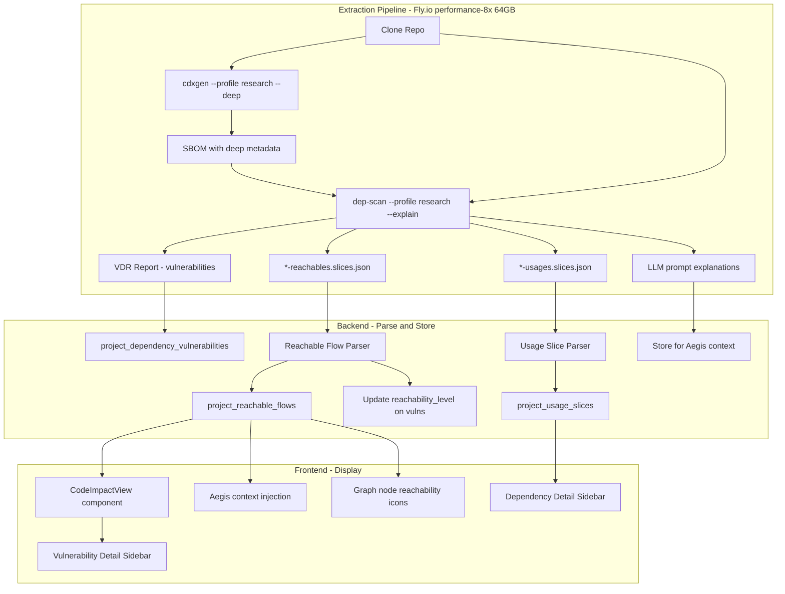

## Phase 6B: Code-Level Reachability Engine

**Goal:** Unlock deep code-level reachability analysis by leveraging dep-scan's built-in research profile and the atom static analysis engine. This transforms our current module-level reachability ("Your code imports lodash") into source-to-sink data-flow tracing ("User input from req.body flows through processInput() into lodash.merge(), which has a prototype pollution vulnerability"). All without building custom call graph tools from scratch -- dep-scan + atom already does this; we just need to enable and parse it.

**Timeline:** ~3-4 weeks. The heavy lifting (call graph generation, data-flow analysis, code slicing) is already implemented in dep-scan/atom. Our work is: enable the research profile, parse output files, store results, display in UI.

**Relationship to Phase 6:** Phase 6 (Security Tab UI) works with the basic `depscan:insights` reachability initially. Phase 6B enhances Phase 6 by feeding deep data-flow reachability into the vulnerability detail sidebar (6D), dependency sidebar (6E), Aegis copilot (6G), and graph node enrichment (6A). The sidebars are designed to progressively show more detail as reachability data becomes available.

### How dep-scan Research Profile Works

dep-scan has two modes. We currently run basic mode (just vulnerability matching). Research mode activates the **atom** engine (Apache 2.0, from the AppThreat project) which performs:

1. **Code slicing**: Parses the entire codebase into an intermediate representation (IR)
2. **Call graph construction**: Maps function-to-function calls across user code AND into dependencies
3. **Data-flow analysis**: Traces data from "sources" (framework entry points like HTTP request params, form data, route handlers) through the code into "sinks" (external library function calls)
4. **Reachability determination**: Cross-references reachable library sinks against the vulnerability database. If user-controlled data can reach a function in a vulnerable package, it's flagged as reachable.

This is fundamentally different from the Endor Labs / Snyk approach (which requires a pre-curated database of "CVE X affects function Y"). dep-scan traces ALL data flows from sources to sinks automatically. No manual curation needed. If a vulnerability exists in a package and your code sends data into that package, it's detected.

### Reachability Depth Levels

```
Level 1: "lodash has CVE-XXXX"                    ← dep-scan basic (what we have now)
Level 2: "Your code imports lodash"                ← depscan:insights (what we have now)
Level 3: "You use lodash.merge() via alias '_'"    ← atom usages slices (Phase 6B)
Level 4: "req.body → processInput() → _.merge()"  ← atom reachables slices (Phase 6B)
Level 5: "Here's your code + the vulnerable code"  ← code snippet extraction (Phase 6B)
```

Phase 6B takes us from Level 2 to Level 5.

### Architecture Overview




### 6B-A: Enable Research Profile in Pipeline

**Change in** [pipeline.ts](backend/extraction-worker/src/pipeline.ts):

The dep-scan command changes from:

```typescript
const depScanArgs = [
  '--bom', bomArg,
  '--reports-dir', outArg,
  '-t', ecosystem,
  '--no-banner',
  '--vulnerability-analyzer', 'VDRAnalyzer',
];
```

To:

```typescript
const depScanArgs = [
  '--profile', 'research',
  '--bom', bomArg,
  '--reports-dir', outArg,
  '-t', ecosystem,
  '--no-banner',
  '--explain',
];
```

The `--profile research` flag tells dep-scan to:

1. Generate the SBOM with deep metadata via cdxgen (research profile)
2. Run atom to create code slices, call graphs, and data-flow analysis
3. Compute reachable flows using the FrameworkReachability algorithm (default)
4. Output `*-reachables.slices.json` and `*-usages.slices.json` alongside the normal VDR report

The `--explain` flag adds verbose reachability explanations to the output, including LLM-ready prompts when `--explanation-mode LLMPrompts` is used.

**cdxgen must also run with research profile.** Currently cdxgen runs separately before dep-scan. When dep-scan is invoked with `--profile research`, it handles cdxgen invocation internally with the right flags. If we keep the separate cdxgen step, add `--profile research --deep` to cdxgen as well:

```typescript
const cdxgenArgs = [
  '-o', sbomPath,
  '--profile', 'research',
  '--deep',
  '-t', ecosystem,
  workspaceRoot,
];
```

**Timeout adjustment:** Research mode takes longer due to atom analysis. Increase the dep-scan spawn timeout:

```typescript
const res = spawnSync(depScanExe, depScanArgs, {
  cwd: workspaceRoot,
  encoding: 'utf8',
  timeout: 180 * 60 * 1000, // 3 hours max (up from 90 min)
});
```

**Machine sizing:** The Fly.io extraction machines are `performance-8x` with 64GB RAM (updated in Phase 2). This accommodates atom's memory requirements: 32GB minimum for medium projects, 64GB for large codebases. The performance (dedicated) CPU tier ensures consistent throughput for the compute-heavy static analysis.

### 6B-B: Parse Reachable Flows

After dep-scan completes, look for `*-reachables.slices.json` in the reports directory. Each file contains an array of reachable flow entries:

```json
[
  {
    "flows": [
      {
        "id": 44,
        "label": "METHOD_PARAMETER_IN",
        "name": "req",
        "fullName": "",
        "signature": "",
        "isExternal": false,
        "code": "req",
        "typeFullName": "express.Request",
        "parentMethodName": "processInput",
        "parentMethodSignature": "void(express.Request,express.Response)",
        "parentFileName": "src/api/handler.ts",
        "parentPackageName": "com.example.app",
        "parentClassName": "handler",
        "lineNumber": 40,
        "columnNumber": 2,
        "tags": "framework-input"
      },
      {
        "id": 88,
        "label": "CALL",
        "name": "merge",
        "fullName": "lodash.merge",
        "isExternal": true,
        "code": "_.merge({}, data)",
        "typeFullName": "lodash",
        "parentMethodName": "processInput",
        "parentFileName": "src/api/handler.ts",
        "lineNumber": 42,
        "tags": ""
      }
    ],
    "purls": [
      "pkg:npm/lodash@4.17.15"
    ]
  }
]
```

Each entry contains:

- `flows[]`: Ordered array of nodes tracing the data flow from source to sink. Each node has: file path, line number, column, method name, class name, code snippet, whether the call is external (library), and tags (e.g. "framework-input" for entry points).
- `purls[]`: The Package URLs of the dependencies reached by this flow. These map directly to our `project_dependencies` table.

**New database table:**

```sql
CREATE TABLE project_reachable_flows (
  id UUID PRIMARY KEY DEFAULT uuid_generate_v4(),
  project_id UUID NOT NULL REFERENCES projects(id) ON DELETE CASCADE,
  purl TEXT NOT NULL,
  flow_nodes JSONB NOT NULL,
  -- Array of flow nodes: [{ id, label, name, fullName, isExternal, code,
  --   typeFullName, parentMethodName, parentMethodSignature, parentFileName,
  --   parentPackageName, parentClassName, lineNumber, columnNumber, tags }]
  entry_point_file TEXT,
  entry_point_method TEXT,
  entry_point_line INTEGER,
  entry_point_tag TEXT, -- 'framework-input', 'route-handler', etc.
  sink_file TEXT,
  sink_method TEXT,
  sink_line INTEGER,
  sink_is_external BOOLEAN DEFAULT true,
  flow_length INTEGER, -- number of nodes in the flow
  created_at TIMESTAMPTZ DEFAULT NOW()
);

CREATE INDEX idx_prf_project_purl ON project_reachable_flows(project_id, purl);
CREATE INDEX idx_prf_project_entry ON project_reachable_flows(project_id, entry_point_file);
```

**Parsing logic in pipeline.ts:**

```typescript
// After dep-scan completes, find reachable slices
const reachableFiles = fs.readdirSync(reportsDir)
  .filter(f => f.endsWith('-reachables.slices.json'));

for (const rf of reachableFiles) {
  const slices = JSON.parse(fs.readFileSync(path.join(reportsDir, rf), 'utf8'));
  for (const slice of slices) {
    if (!slice.flows?.length || !slice.purls?.length) continue;
    const firstNode = slice.flows[0];
    const lastNode = slice.flows[slice.flows.length - 1];

    for (const purl of slice.purls) {
      // Upsert into project_reachable_flows
      await supabase.from('project_reachable_flows').upsert({
        project_id: projectId,
        purl,
        flow_nodes: slice.flows,
        entry_point_file: firstNode.parentFileName,
        entry_point_method: firstNode.parentMethodName,
        entry_point_line: firstNode.lineNumber,
        entry_point_tag: firstNode.tags || null,
        sink_file: lastNode.parentFileName,
        sink_method: lastNode.fullName || lastNode.name,
        sink_line: lastNode.lineNumber,
        sink_is_external: lastNode.isExternal ?? true,
        flow_length: slice.flows.length,
      });
    }
  }
}
```

**Update reachability on vulnerabilities:**

After parsing flows, cross-reference with `project_dependency_vulnerabilities` to upgrade `reachability_level`:

```sql
ALTER TABLE project_dependency_vulnerabilities
  ADD COLUMN reachability_level TEXT DEFAULT 'module',
  -- 'unreachable', 'module', 'import', 'data_flow', 'confirmed'
  ADD COLUMN reachability_details JSONB;
  -- { flow_count: 3, entry_points: ['handler.ts:40', 'api.ts:15'],
  --   sink_methods: ['lodash.merge'], tags: ['framework-input'] }
```

For each vulnerability, check if any `project_reachable_flows` row has a matching purl. If yes, upgrade from `module` to `data_flow` (or `confirmed` if the flow includes a `framework-input` tagged source node). Store summary details in `reachability_details`.

### 6B-C: Parse Usage Slices

dep-scan also outputs `*-usages.slices.json` files. These tell us HOW each library is used -- answering the same questions that tree-sitter import/export analysis was designed for, but generated by atom during the same analysis pass.

Usages slice format:

```json
{
  "objectSlices": [
    {
      "fullName": "handler.processInput:void(Request,Response)",
      "fileName": "src/api/handler.ts",
      "lineNumber": 40,
      "usages": [
        {
          "targetObj": {
            "name": "merge",
            "typeFullName": "lodash",
            "lineNumber": 42,
            "label": "LOCAL"
          },
          "invokedCalls": [
            {
              "callName": "merge",
              "resolvedMethod": "lodash.merge",
              "lineNumber": 42
            }
          ]
        }
      ]
    }
  ],
  "userDefinedTypes": [
    {
      "name": "handler",
      "fields": [],
      "procedures": [
        {
          "callName": "processInput",
          "paramTypes": ["Request", "Response"],
          "returnType": "void",
          "lineNumber": 40
        }
      ]
    }
  ]
}
```

**New database table:**

```sql
CREATE TABLE project_usage_slices (
  id UUID PRIMARY KEY DEFAULT uuid_generate_v4(),
  project_id UUID NOT NULL REFERENCES projects(id) ON DELETE CASCADE,
  file_path TEXT NOT NULL,
  line_number INTEGER NOT NULL,
  containing_method TEXT, -- the method where the usage occurs
  target_name TEXT NOT NULL, -- the library symbol being used (e.g. 'merge')
  target_type TEXT, -- full type name (e.g. 'lodash')
  resolved_method TEXT, -- fully resolved method name (e.g. 'lodash.merge')
  usage_label TEXT, -- 'LOCAL', 'FIELD', 'PARAMETER'
  ecosystem TEXT,
  created_at TIMESTAMPTZ DEFAULT NOW(),
  UNIQUE(project_id, file_path, line_number, target_name)
);

CREATE INDEX idx_pus_project_type ON project_usage_slices(project_id, target_type);
CREATE INDEX idx_pus_project_file ON project_usage_slices(project_id, file_path);
```

This replaces the `project_import_exports` table from the original plan. Atom's usages slices provide richer data: not just imports, but actual usage locations, resolved method names, and type information.

### 6B-D: Code Snippet Extraction and CodeImpactView

**Goal:** Extract and display actual source code showing the vulnerability in context. This is the "wow factor" -- users see exactly where in their code the vulnerability is exploitable.

**How it works:**

Using the `flow_nodes` from `project_reachable_flows`, each node already contains:

- `parentFileName`: exact source file
- `lineNumber`: exact line
- `code`: the actual code at that point (provided by atom)
- `parentMethodName`: containing method

We extract expanded code snippets (~5 lines of context) at each flow node. Since the extraction worker has the cloned repo available during pipeline execution, snippets are extracted at scan time:

```sql
CREATE TABLE project_code_snippets (
  id UUID PRIMARY KEY DEFAULT uuid_generate_v4(),
  reachable_flow_id UUID NOT NULL REFERENCES project_reachable_flows(id) ON DELETE CASCADE,
  step_index INTEGER NOT NULL, -- 0 = entry point, N = sink
  file_path TEXT NOT NULL,
  function_name TEXT,
  start_line INTEGER NOT NULL,
  end_line INTEGER NOT NULL,
  code_content TEXT NOT NULL,
  is_user_code BOOLEAN NOT NULL,
  highlight_line INTEGER, -- the specific line in the flow
  created_at TIMESTAMPTZ DEFAULT NOW()
);
```

**Frontend: `CodeImpactView.tsx` component:**

```
Affected Code -- CONFIRMED REACHABLE (data-flow traced)

  YOUR CODE (entry point: framework-input)
  ┌ src/api/handler.ts:42 -- processInput()
  │ 40 │ function processInput(req, res) {
  │ 41 │   const data = req.body;
  │ 42 │   const merged = _.merge({}, data);    ← calls vulnerable function
  │ 43 │   return processResult(merged);
  │ 44 │ }
  └────

       │ user input flows into lodash.merge()
       â–¼

  VULNERABLE DEPENDENCY
  ┌ node_modules/lodash/lodash.js:3487 -- baseMerge()
  │ 3486 │ function baseMerge(object, source) {
  │ 3487 │   for (var key in source) {           ← prototype pollution
  │ 3488 │     assignValue(object, key,
  │ 3489 │       source[key]);
  │ 3490 │   }
  │ 3491 │ }
  └────

  Risk: User input (req.body) flows directly into lodash.merge()
        without prototype pollution protection.

  [Explain with Aegis]  [Fix with AI]
```

Built with:

- Syntax highlighting via `prism-react-renderer` or `shiki`
- Line number gutter with highlighted call-site lines
- Call chain arrows between snippets
- Collapsible intermediate steps for long chains (>3 nodes)
- "framework-input" tag displayed as a badge on the entry point

### 6B-E: LLMPrompts Integration for Aegis

dep-scan supports an `--explanation-mode LLMPrompts` flag that generates AI-ready prompt text for each reachable vulnerability. This is a direct feed into our Aegis Security Copilot:

```bash
depscan --profile research -t js --explain --explanation-mode LLMPrompts
```

The generated prompts include:

- Description of the data flow path
- Entry point and sink identification
- Vulnerable function context
- Suggested remediation directions

These prompts are stored alongside the reachable flows and injected into Aegis context when a user opens the copilot panel for a specific vulnerability. This gives Aegis detailed code-level context without needing to reconstruct it from raw data.

### 6B-F: Integration with Phase 6 and Phase 7

**Phase 6 (Security Tab) enhancements when 6B data is available:**

- **Vulnerability nodes (6A)**: Reachability icon upgrades from binary (reachable/not) to tiered: "confirmed" (data-flow traced, green shield), "data_flow" (flow detected without framework-input tag, yellow), "module" (basic import-level, gray), "unreachable" (dimmed)
- **Vulnerability Detail Sidebar (6D)**: "Affected Code" section shows the full `CodeImpactView` component with flow path and code snippets instead of just a file list
- **Dependency Detail Sidebar (6E)**: Shows which specific functions are used from the package (from usage slices) and their vulnerability status
- **Aegis copilot (6G)**: Receives LLMPrompts context for precise vulnerability explanations. Can say: "Your `processInput` function at `handler.ts:42` passes `req.body` directly to `lodash.merge()`, which has a prototype pollution vulnerability. The data flows through 2 intermediate calls."
- **Filtering (6C)**: Reachability filter gains new options: "Confirmed (data-flow)" / "Data flow detected" / "Module only" / "Unreachable"
- **Depscore update**: Reachability weight in Depscore becomes more granular: confirmed=1.0, data_flow=0.9, module=0.5, unreachable=per-tier weight

**Phase 7 (AI Fixing) enhancements:**

- Aider receives the full data-flow path as context: entry point file/line, each intermediate call, and the sink
- LLMPrompts output from dep-scan is passed directly to the Aider prompt for maximum context
- Fix strategies become smarter: if the flow shows user input reaching a vulnerable function, AI can suggest input validation at the entry point as an alternative to upgrading the package

### Supported Languages

atom (the engine behind dep-scan research mode) supports:

- **Java** (full support, most mature)
- **JavaScript** (full support)
- **TypeScript** (full support)
- **Python** (full support)
- **PHP** (supported, PHP 5.2-8.3)

This covers all the languages we currently support in our extraction pipeline. No additional tools need to be installed -- atom is bundled with dep-scan.

### Memory and Performance Considerations

- **FrameworkReachability** (default analyzer): 16-32GB RAM for medium projects, 32-64GB for large. Our `performance-8x` 64GB machines handle this comfortably.
- **SemanticReachability** (enhanced analyzer, optional): Requires 64GB+ and access to container SBOMs, OpenAPI specs, and multi-lifecycle BOMs. We start with FrameworkReachability and can offer SemanticReachability as a premium option later.
- **Atom code size limit**: Optimized for applications up to 100K LOC. For very large monorepos (>100K LOC), atom may produce partial results. This is acceptable -- partial reachability data is still vastly better than none.
- **Extraction time increase**: Research mode adds ~5-15 minutes to the pipeline (atom analysis). Total extraction time becomes ~10-25 minutes for typical projects. The `performance-8x` machines with dedicated CPUs keep this reasonable.
- **Non-deterministic results**: Atom's slicing is optimized for constant-time performance and is non-deterministic. Repeated runs may yield slightly varying results. This is fine -- users see the latest analysis, not a diff between runs.

### Fallback Strategy

If atom fails (OOM, timeout, unsupported language feature), the pipeline falls back gracefully:

1. dep-scan still produces the VDR report with basic vulnerability data
2. The `depscan:insights` "Used in X" module-level reachability still works
3. Reachability level stays at `module` instead of upgrading to `data_flow`/`confirmed`
4. Log the atom failure for debugging

Check for atom success by verifying the `*-reachables.slices.json` file exists and is non-empty. If it's missing or empty, log a warning and skip the deep reachability parsing step.

### Future Enhancement: CVE-to-Function Mapping Database

dep-scan's source-to-sink approach works without knowing which SPECIFIC function has the CVE. However, adding a curated mapping of "CVE X affects function Y" would provide even more precise results (Endor Labs-level precision). This is a future enhancement:

- Build a `cve_affected_functions` table mapping OSV IDs to specific affected functions
- Populate from GHSA advisory text, NVD descriptions, fix commit diffs, and AI extraction
- When available, cross-reference atom's reachable flows against the mapping for "confirmed" level (vs. "data_flow" without the mapping)
- This is NOT required for Phase 6B -- the source-to-sink approach provides excellent results on its own

### Phase 6B Test Suite

#### Backend Tests (`backend/src/__tests__/reachability-engine.test.ts`)

Tests 1-5 (Research Profile Pipeline):

1. dep-scan runs with `--profile research --explain` flags and produces `*-reachables.slices.json`
2. dep-scan runs with `--profile research` and produces `*-usages.slices.json`
3. Pipeline gracefully falls back when atom fails (no reachable slices produced)
4. Pipeline handles empty reachable slices file (no reachable flows found)
5. cdxgen runs with `--profile research --deep` and produces enhanced SBOM

Tests 6-10 (Reachable Flow Parsing):
6. Parse reachable flow with 2-node path (source → sink) into correct DB rows
7. Parse reachable flow with 5+ nodes (multi-hop chain) preserving order
8. Extract entry_point fields correctly from first flow node
9. Extract sink fields correctly from last flow node
10. Multiple purls in one flow create separate rows per purl

Tests 11-15 (Usage Slice Parsing):
11. Parse objectSlices into project_usage_slices rows with correct file/line/method
12. Parse invokedCalls with resolved method names
13. Parse userDefinedTypes into correct derived-type usage records
14. Handle usages file with empty objectSlices array
15. Deduplication: re-extraction replaces old usage data

Tests 16-20 (Reachability Level Update):
16. Vulnerability with matching purl in reachable flows: level upgrades from `module` to `data_flow`
17. Vulnerability with framework-input tagged source: level upgrades to `confirmed`
18. Vulnerability with no matching flow: level stays at `module`
19. Multiple flows for same purl: reachability_details includes all entry points
20. Reachability level persists correctly across re-extractions (old data replaced)

Tests 21-25 (Code Snippet Extraction):
21. Extract correct lines around call site in user code (5-line window)
22. Handle flow node with `code` field from atom (use atom's code snippet)
23. Fallback to file read when atom's `code` field is empty
24. Handle missing/moved files gracefully (skip snippet, keep flow data)
25. Minified dependency code detected and flagged (lines >500 chars)

Tests 26-28 (LLMPrompts):
26. LLMPrompts explanation mode produces non-empty prompt text
27. Generated prompts include entry point and sink information
28. Prompts are stored and retrievable per vulnerability for Aegis context

#### Frontend Tests (`frontend/src/__tests__/code-impact-view.test.ts`)

Tests 29-33:
29. CodeImpactView renders user code snippet with syntax highlighting
30. CodeImpactView renders call chain arrows between flow nodes
31. CodeImpactView renders vulnerable dependency code with highlight line
32. Intermediate steps (>3 nodes) are collapsible
33. "Explain with Aegis" button sends reachable flow context to Aegis panel

### Cost and Performance Impact

- **Machine cost**: `performance-8x` 64GB at $0.775/hr. A 15-minute extraction with deep analysis costs ~$0.19. With scale-to-zero, you only pay while the machine is running.
- **No additional tools**: atom is bundled with dep-scan. No JELLY, PyXray, PyCG, or tree-sitter installations needed. Docker image stays smaller.
- **Storage**: Reachable flows and usage slices are moderate in size. A project with 50 reachable flows and 200 usage entries adds ~250 rows. Indexed on (project_id, purl) for fast queries.
- **Total extraction time**: ~10-25 minutes (up from ~5-15 minutes without research mode). Acceptable for the quality of data produced.
