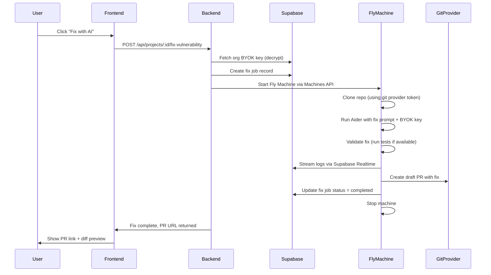
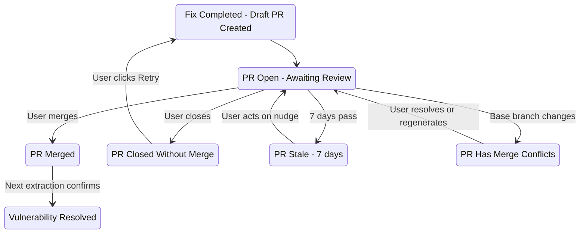

## Phase 7: AI-Powered Vulnerability Fixing (Aider)

**Goal:** Enable AI-powered vulnerability remediation using Aider on Fly.io Machines, with multiple fix strategies, PR creation, live progress tracking, and safety measures. Uses BYOK keys from Phase 6G.

### Architecture




### 7A: Aider Fly.io Machine Template

Separate Fly.io app: `deptex-aider-worker`

**Docker image:**

- Base: Python 3.11 slim
- Pre-installed: `aider-chat` pip package, Git, Node.js 20 (for npm-based repos), pip (for Python repos)
- No pre-installed LLM key - fetched at runtime from BYOK

**Machine config:**

- Size: `shared-cpu-4x`, 4GB RAM (Aider is lighter than extraction - mainly LLM API calls)
- Same scale-to-zero pattern as extraction worker: backend starts machine via Machines API, machine processes fix, stops itself
- Safety timeout: machine exits after 10 minutes max regardless of state (enforced by both Aider `--timeout` and machine-level watchdog)
- Secrets: `SUPABASE_URL`, `SUPABASE_SERVICE_ROLE_KEY` (for job status updates and log streaming). LLM key passed per-job via the job payload.

**Cost estimate per fix:**

- Fly.io Machine: ~$0.01-0.03 (runs 1-5 minutes)
- LLM tokens: ~$0.05-0.50 (varies by model and code size) - **BYOK, the org pays this directly to their provider**
- Total infrastructure cost to Deptex: ~$0.01-0.03 per fix

### 7B: Fix Orchestrator

Create `ee/backend/lib/ai-fix-engine.ts`:

```typescript
interface FixRequest {
  projectId: string;
  organizationId: string;
  userId: string;
  strategy: 'bump_version' | 'code_patch' | 'add_wrapper' | 'pin_transitive' | 'remove_unused' | 'fix_semgrep' | 'remediate_secret';

  // For dependency vulnerability fixes (bump_version, code_patch, add_wrapper, pin_transitive, remove_unused)
  vulnerabilityOsvId?: string;
  targetVersion?: string;

  // For Semgrep fixes (fix_semgrep)
  semgrepFindingId?: string; // FK to project_semgrep_findings

  // For TruffleHog fixes (remediate_secret)
  secretFindingId?: string; // FK to project_secret_findings
}

interface FixResult {
  success: boolean;
  prUrl?: string;
  prNumber?: number;
  diffSummary?: string;
  error?: string;
  tokensUsed?: number;
  estimatedCost?: number;
}
```

The fix engine handles three categories of security issues:

1. **Dependency vulnerabilities** (strategies: bump_version, code_patch, add_wrapper, pin_transitive, remove_unused) -- triggered from the Vulnerability Detail Sidebar "Fix with AI" button
2. **Semgrep code issues** (strategy: fix_semgrep) -- triggered from the Project Security Sidebar or Aegis when user asks to fix a code issue
3. **Exposed secrets** (strategy: remediate_secret) -- triggered from the Project Security Sidebar or Aegis when user asks to remediate a secret

**Flow:**

1. Validate request: check vulnerability exists, project has a connected repo, org has BYOK configured
2. Fetch BYOK key for the org's default provider (decrypt via `getProviderForOrg`)
3. Create job record in `project_security_fixes` table with status `queued`
4. Gather rich context for the fix:
  - CVE details (osv_id, severity, description, fixed_versions)
  - Affected project dependencies (name, version, direct/transitive)
  - **Atom reachability data** (from `project_reachable_flows`): entry point file/line/method, full data-flow path through the code, sink function in the vulnerable dependency. This tells Aider exactly WHERE the vulnerability is exploitable.
  - **Atom usage slices** (from `project_usage_slices`): which specific functions/exports the project uses from the vulnerable package. This tells Aider whether the project actually calls the vulnerable function or only uses safe parts of the package.
  - **dep-scan LLMPrompts** (if available): AI-ready explanation text generated by dep-scan's `--explanation-mode LLMPrompts`, included directly in the Aider prompt for maximum context.
  - **Code snippets** (from `project_code_snippets`): the actual source code at each step of the reachable flow, so Aider can see the code it needs to modify.
5. Start Fly Machine via Machines API, passing:
  - Job ID
  - Repo clone URL + auth token (from git provider integration)
  - All gathered context from step 4
  - Fix strategy + target version
  - LLM provider + model + API key (encrypted in transit)
6. Machine runs the fix script (7C), streams logs via Supabase Realtime
7. On completion: update job status to `completed` or `failed`, store PR URL
8. Machine stops itself

**Database table for fix tracking:**

```sql
CREATE TABLE project_security_fixes (
  id UUID PRIMARY KEY DEFAULT uuid_generate_v4(),
  project_id UUID NOT NULL REFERENCES projects(id) ON DELETE CASCADE,
  organization_id UUID NOT NULL REFERENCES organizations(id) ON DELETE CASCADE,
  fix_type TEXT NOT NULL, -- 'vulnerability', 'semgrep', 'secret'
  strategy TEXT NOT NULL, -- 'bump_version', 'code_patch', 'add_wrapper', 'pin_transitive', 'remove_unused', 'fix_semgrep', 'remediate_secret'
  status TEXT NOT NULL DEFAULT 'queued', -- 'queued', 'running', 'completed', 'failed'
  triggered_by UUID NOT NULL REFERENCES auth.users(id),

  -- For vulnerability fixes
  osv_id TEXT, -- nullable, only for fix_type = 'vulnerability'
  -- For Semgrep fixes
  semgrep_finding_id UUID REFERENCES project_semgrep_findings(id), -- nullable
  -- For secret fixes
  secret_finding_id UUID REFERENCES project_secret_findings(id), -- nullable

  fly_machine_id TEXT,
  pr_url TEXT,
  pr_number INTEGER,
  diff_summary TEXT,
  tokens_used INTEGER,
  estimated_cost NUMERIC(6, 4),
  error_message TEXT,
  started_at TIMESTAMPTZ,
  completed_at TIMESTAMPTZ,
  created_at TIMESTAMPTZ DEFAULT NOW()
);
```

### 7C: Fix Strategies

**1. Version Bump** (`bump_version` -- most common, ~70% of fixes):

```bash
# Inside the Fly Machine
git clone $REPO_URL --depth 1
cd $REPO_DIR
git checkout -b fix/$OSV_ID

# Use Aider to perform the upgrade intelligently
# Include reachability context so Aider knows what code to test after upgrading
aider --yes --no-auto-commits \
  --model $LLM_MODEL \
  --message "Upgrade $PACKAGE_NAME from $CURRENT_VERSION to $TARGET_VERSION to fix $OSV_ID.
    Update the package manifest and lockfile.
    If there are breaking changes, make necessary code adjustments.

    CONTEXT - How this package is used in the project:
    $USAGE_SLICES_SUMMARY
    (e.g., 'lodash.merge() is called in src/api/handler.ts:42, src/utils/config.ts:18')

    CONTEXT - Reachable data flow:
    $REACHABLE_FLOW_SUMMARY
    (e.g., 'User input from req.body flows into lodash.merge() at handler.ts:42')

    After upgrading, verify the usage sites above still work correctly.
    Do NOT change any unrelated files." \
  --file package.json --file package-lock.json $AFFECTED_FILES

# Validate
npm audit --json | jq ".vulnerabilities[\"$PACKAGE_NAME\"]" # should be null

git add -A
git commit -m "fix: upgrade $PACKAGE_NAME to $TARGET_VERSION ($OSV_ID)"
git push origin fix/$OSV_ID
# Create draft PR via GitHub/GitLab/Bitbucket API
```

**2. Code Patch** (`code_patch` -- for vulns without a fixed version):

Uses the full atom reachability data to know exactly what to patch:

```bash
# Aider receives the exact data flow path from atom
aider --yes --no-auto-commits \
  --model $LLM_MODEL \
  --message "The dependency $PACKAGE_NAME@$VERSION has vulnerability $OSV_ID: $VULN_DESCRIPTION.
    No fixed version is available. Add mitigation at the application level.

    REACHABLE DATA FLOW (from dep-scan analysis):
    Entry point: $ENTRY_POINT_FILE:$ENTRY_POINT_LINE ($ENTRY_POINT_METHOD)
    Flow: $FLOW_CHAIN_SUMMARY
    Sink: $SINK_METHOD in $PACKAGE_NAME

    CODE AT ENTRY POINT:
    $ENTRY_POINT_CODE_SNIPPET

    CODE AT VULNERABLE CALL:
    $VULNERABLE_CALL_CODE_SNIPPET

    Add input validation, sanitization, or a safe wrapper at or before the call
    to $SINK_METHOD to prevent exploitation. Explain what you changed and why." \
  --file $ENTRY_POINT_FILE --file $VULNERABLE_CALL_FILE
```

**3. Add Wrapper** (`add_wrapper` -- safer alternative to full upgrade):

When the atom data shows only specific functions are called from a vulnerable package, add a safe wrapper around just those calls instead of upgrading the whole package (useful when upgrading would break things):

```bash
aider --yes --no-auto-commits \
  --model $LLM_MODEL \
  --message "The function $VULNERABLE_FUNCTION in $PACKAGE_NAME@$VERSION has $OSV_ID.
    Your code calls this function at these locations:
    $USAGE_LOCATIONS_WITH_CODE

    Create a safe wrapper function that sanitizes input before calling
    $VULNERABLE_FUNCTION, then update all call sites to use the wrapper.
    This avoids upgrading the package while mitigating the vulnerability." \
  --file $WRAPPER_TARGET_FILE $USAGE_FILES
```

**4. Pin Transitive** (`pin_transitive` -- for vulnerabilities in transitive dependencies):

```bash
# For npm: add overrides in package.json
# For pip: add constraint in requirements.txt
# For yarn: add resolutions in package.json
aider --yes --no-auto-commits \
  --model $LLM_MODEL \
  --message "The transitive dependency $PACKAGE_NAME@$CURRENT_VERSION (pulled in via $PARENT_PACKAGE)
    has vulnerability $OSV_ID. Pin it to $SAFE_VERSION using the appropriate
    mechanism for this ecosystem:
    - npm: add to 'overrides' in package.json
    - yarn: add to 'resolutions' in package.json
    - pip: add to constraints file or override in requirements.txt
    Regenerate the lockfile after pinning." \
  --file package.json --file package-lock.json
```

**5. Remove Unused Dependency** (`remove_unused` -- for zombie deps):

```bash
# Verify the dependency is truly unused via atom usage analysis
aider --yes --no-auto-commits \
  --model $LLM_MODEL \
  --message "Remove the unused dependency $PACKAGE_NAME from this project.
    Usage analysis confirms no code in this project imports or calls any
    function from this package.
    Remove it from the package manifest and lockfile.
    Remove any remaining import statements that reference it.
    Do NOT change any unrelated files." \
  --file package.json --file package-lock.json
```

**6. Fix Semgrep Issue** (`fix_semgrep` -- for code-level security issues):

Triggered from the Project Security Sidebar or Aegis when a user asks to fix a Semgrep finding. Uses the Semgrep finding's rule, file/line, and code context:

```bash
aider --yes --no-auto-commits \
  --model $LLM_MODEL \
  --message "Fix the security issue found by Semgrep rule $RULE_ID at $FILE_PATH:$LINE_RANGE.
    Category: $CATEGORY (e.g., sql-injection, xss, insecure-crypto)
    Severity: $SEVERITY
    CWE: $CWE_IDS
    Message: $SEMGREP_MESSAGE

    Current code:
    $CODE_SNIPPET

    Fix the vulnerability while preserving the existing functionality.
    Follow OWASP best practices for this category of issue." \
  --file $FILE_PATH
```

**7. Remediate Secret** (`remediate_secret` -- for exposed secrets found by TruffleHog):

Replaces the hardcoded secret with an environment variable reference. Does NOT modify .env files or handle the actual secret value.

```bash
aider --yes --no-auto-commits \
  --model $LLM_MODEL \
  --message "An exposed $DETECTOR_TYPE secret was found at $FILE_PATH:$LINE.
    Replace the hardcoded secret value with an environment variable reference.
    Use: process.env.$ENV_VAR_NAME (or os.environ['$ENV_VAR_NAME'] for Python).
    Add a comment noting the env var that needs to be set.
    If a .env.example file exists, add the variable name there (without the value).
    Do NOT include the actual secret value anywhere in the code." \
  --file $FILE_PATH
```

### 7D: Fix Progress UI

In the Vulnerability Detail Sidebar (6D), when "Fix with AI" is clicked:

1. **Pre-fix confirmation**: Small inline card showing:
  - Selected strategy (bump/patch/wrapper/pin/remove/semgrep fix/secret remediation)
  - Target version (for bump), or affected file/line (for semgrep/secret fixes)
  - Estimated cost based on model + typical token usage
  - "Start Fix" confirmation button
2. **Progress indicator** (replaces the confirmation card):
  - Step indicator: Cloning → Analyzing → Fixing → Testing → Creating PR
  - Current step highlighted with spinner
  - Live log stream below (reuses extraction worker log infrastructure from Phase 2 - Supabase Realtime on `extraction_logs` table keyed by fix job ID)
  - Logs are color-coded: white for info, yellow for warnings, green for success, red for errors
3. **Completion states:**
  - **Success**: Green banner "Fix PR created" with PR link button + diff summary (files changed, lines added/removed)
  - **Failure -- smart failure flow**: Instead of a generic error, Aegis analyzes the failure and provides actionable guidance:
  1. Red banner with error category (e.g., "Build failed after upgrade", "No safe version exists", "Aider timed out")
  2. **Aegis failure analysis** (auto-triggered): Aegis receives the error log and fix context, generates an explanation: "The version bump to 4.17.21 caused a TypeScript compilation error in handler.ts:42 because the merge() type signature changed. You can either: (a) pin to 4.17.20 which fixes CVE-A but not CVE-B, or (b) update the type annotation at handler.ts:42."
  3. **Smart retry options**: Based on the failure mode, Aegis suggests:
    - "Try a different version" (if version bump failed due to breaking changes)
    - "Try code_patch instead" (if no safe version exists)
    - "Try add_wrapper" (if the failure was in upgrading but the vulnerable call is isolated)
  4. "Retry with suggested strategy" button (pre-fills the suggested alternative)
  5. "Ask Aegis for help" button (opens Aegis panel with full failure context for conversational troubleshooting)
4. **Fix history**: In the vulnerability detail sidebar, a "Past Fixes" collapsible section showing previous fix attempts with status, PR link, strategy used, and failure reason if applicable. Helps users see what's been tried and what worked.

### 7E: Safety Measures

- Machine auto-destroys after 10-minute timeout (enforced at machine level via Fly Machines API `auto_destroy` and Aider `--timeout`)
- **Extraction worker machine**: auto-destroys after 4-hour timeout (see 6N)
- PR created as **draft** for human review (never merged automatically)
- Aider runs with `--no-auto-commits` - all changes reviewed before committing
- Post-fix validation: run `npm audit` / `pip audit` / relevant tool to confirm vulnerability is resolved
- Never push directly to main/master branch - creates `fix/$OSV_ID`, `fix/semgrep-$RULE_ID`, or `fix/secret-$DETECTOR_TYPE` branches
- Rate limiting: max 5 concurrent fix jobs per organization (prevent runaway costs)
- **Same-project serialization**: before starting a fix, check if another fix job for the SAME PROJECT is currently `running`. If yes, queue the new job (status = `queued`) rather than starting it in parallel. This prevents two fixes from modifying the same files simultaneously and creating merge conflicts. Sprint jobs already run sequentially; this guard applies to manual individual fixes.
- Cost cap: configurable per-org maximum monthly AI spend (from `organization_ai_providers.monthly_cost_cap`, checked before starting each fix)
- **Max attempts guard**: max 3 failed fix attempts per target (same osv_id/finding_id) per 24 hours. After 3 failures, block retry and show "Manual intervention required" (see 6N for details).
- Audit trail: all fix jobs logged in `project_security_fixes` with user, strategy, cost, result. All LLM calls logged in `ai_usage_logs`.
- Secret safety: for `remediate_secret` strategy, Aider never receives the actual secret value -- only the file, line, and detector type. The prompt instructs it to replace the hardcoded value with an env var reference. Only available for findings with `is_current = true` (see 6N).
- **Re-extraction safety**: warn user before re-extraction if fix jobs are running (see 6N)
- **BYOK deletion guard**: warn before deleting an AI provider key if active fix jobs exist (see 6G)
- Repository access: uses the same git provider token as extraction (no additional permissions needed)

### 7G: Fix Status Integration Across All Screens

Fix status from `project_security_fixes` must be visible globally -- not just inside the Security tab sidebar where the fix was triggered. Every screen that displays a vulnerability, dependency, or project should reflect active/completed/failed fix state in real time.

**Graph Node Indicators (Security Tab -- project, org, and team graphs):**

- **Vulnerability node**: When a fix job targets this vulnerability (`osv_id` match in `project_security_fixes` with status `queued` or `running`):
  - Small sparkle/AI icon badge (green-500, 14px) in the top-right corner of the node, with a subtle `animate-pulse` animation
  - Tooltip on hover: "Being fixed by Aegis (Step 3/5: Analyzing code)"
  - When status = `completed` and PR exists: icon changes to a green check + "PR created" tooltip with PR number
  - When status = `failed`: icon changes to amber warning triangle + "Fix failed" tooltip
  - Icon clears when no active/recent fix exists (or after PR is merged and vuln is resolved on next extraction)
- **Dependency node**: If ANY vulnerability under this dependency has an active fix, show the same sparkle badge. Tooltip: "1 fix in progress, 2 fixes completed"
- **Project center node**: If ANY fix job is running for this project, show sparkle badge with count: "3 AI fixes in progress"
- **Org/Team graph project nodes**: Same badge as center node -- sparkle with count if any fixes running for that project
- **Org/Team graph team nodes**: Aggregate across team projects: "5 AI fixes in progress across 3 projects"

**Vulnerability Detail Sidebar (6D) -- already partially covered in 7D, additions:**

- "Fix with AI" button state changes based on active fixes:
  - No active fix: normal green button "Fix with AI"
  - Fix queued: button becomes "Fix Queued..." (disabled, gray, with spinner) + queue position indicator
  - Fix running: button becomes "Fix in Progress" (disabled, animated border) + live step indicator + "View Logs" expandable
  - Fix completed: button becomes "Fix PR Created" (green outline) with PR link. Below: "Fix again" secondary link for re-attempts
  - Fix failed: button reverts to "Fix with AI" with a "Previous attempt failed" warning badge above it + expandable failure reason
- **Past Fixes section** (already in 7D): add real-time status updates for running fixes within this section

**Dependency Detail Sidebar (6E):**

- Under "Current Vulnerabilities" list (section 3): each vulnerability row gains a fix status badge inline:
  - Running: small sparkle icon + "Fixing..." text in green-500 13px
  - Completed: green check + "PR #42" link in green-500 13px
  - Failed: amber warning + "Fix failed" in amber-500 13px
- Under "Recommended Versions" (section 4): if a version bump fix is in progress targeting this package, show: "AI is currently upgrading to vX.Y.Z" inline status card with progress bar

**Project Security Sidebar (6F -- center node click):**

- New "Active AI Fixes" card between "Priority Actions" and "Actions Footer":
  - Shows count of running/queued fixes: "2 running, 1 queued"
  - Mini list: each fix with target name (CVE ID or Semgrep rule or secret type), strategy badge, current step
  - Each item clickable -- navigates to the vulnerability/finding and opens its detail sidebar
  - If no active fixes: card hidden entirely (don't show empty state)

**Dependencies Tab (ProjectDependenciesPage):**

- **Dependency overview table/cards**: add a small "AI Fix" column/badge. If any vulnerability for this dependency has an active fix, show sparkle icon
- **Supply chain graph**: dependency nodes with active fixes show the same sparkle badge as the Security tab graph nodes
- **Dependency detail page** (`DependencyOverviewPage.tsx`): if the dependency has active fixes for its vulnerabilities, show an "Active Fixes" banner card at the top: "Aegis is fixing 2 vulnerabilities in this package"

**Compliance Tab (ProjectCompliancePage):**

- If a non-compliant package has an active AI fix, the compliance status cell shows "Fix in Progress" instead of just the violation badge. This prevents users from manually addressing something Aegis is already handling.
- Compliance summary counts should note: "3 non-compliant (1 fix in progress)"

**Project Overview Page (ProjectOverviewPage):**

- Security summary card: add "X AI fixes active" count alongside vulnerability counts
- Activity feed: fix events (started, completed, failed) appear as activity items with sparkle icon

**Org/Team Security Pages (6M):**

- Already covered by graph node indicators above
- Summary statistics bar: include aggregate "X AI fixes in progress" count across all projects
- "Run Security Sprint" button: if a sprint is already running, button changes to "Sprint in Progress (Step X/Y)" with progress bar

**Aegis Full-Page Screen (7B-L):**

- Left sidebar "Active Tasks" section: all running fix jobs appear as task cards with mini progress indicators
- Chat interface: when a fix completes or fails, Aegis posts an update message in the relevant thread: "Fix for CVE-2024-XXXX completed. Draft PR #42 created on branch fix/CVE-2024-XXXX."
- Fix events also appear in the Activity tab of the Aegis screen

### 7H: Real-time Fix Status Infrastructure

All fix status indicators across the app must update in real time without page refresh, using Supabase Realtime subscriptions.

**Supabase Realtime channel:**

Subscribe to `project_security_fixes` table changes scoped to the user's current context:

```typescript
// Project-level subscription (for project pages)
const channel = supabase.channel(`fix-status:${projectId}`)
  .on('postgres_changes', {
    event: '*',
    schema: 'public',
    table: 'project_security_fixes',
    filter: `project_id=eq.${projectId}`,
  }, (payload) => {
    // Update local fix status state
    // payload.new contains updated row with status, fly_machine_id, pr_url, etc.
  })
  .subscribe();

// Org-level subscription (for org pages, Aegis screen)
const orgChannel = supabase.channel(`fix-status-org:${orgId}`)
  .on('postgres_changes', {
    event: '*',
    schema: 'public',
    table: 'project_security_fixes',
    filter: `organization_id=eq.${orgId}`,
  }, (payload) => {
    // Update org-wide fix status state
  })
  .subscribe();
```

**React hooks:**

Create `frontend/src/hooks/useFixStatus.ts`:

```typescript
// Returns fix status for all fixes in a project
export function useProjectFixStatus(projectId: string): {
  fixes: FixJob[];        // all active/recent fixes
  runningCount: number;    // count of running fixes
  queuedCount: number;     // count of queued fixes
  getFixForVuln: (osvId: string) => FixJob | null;
  getFixForSemgrep: (findingId: string) => FixJob | null;
  getFixForSecret: (findingId: string) => FixJob | null;
  getFixesForDep: (depName: string) => FixJob[];
}

// Returns fix status across all projects in an org
export function useOrgFixStatus(orgId: string): {
  fixes: FixJob[];
  runningCount: number;
  getFixesForProject: (projectId: string) => FixJob[];
}

// Returns whether a specific target has an active fix
export function useTargetFixStatus(target: {
  osvId?: string;
  semgrepFindingId?: string;
  secretFindingId?: string;
  projectId: string;
}): {
  activeFix: FixJob | null;
  recentFixes: FixJob[];    // completed/failed in last 24h
  canStartNewFix: boolean;  // false if active fix exists or max attempts reached
  blockReason?: string;     // human-readable reason if canStartNewFix is false
}
```

**Fix status context provider:**

Wrap project and org layouts with a `FixStatusProvider` that manages the Realtime subscription and exposes fix data to all child components via React context. This avoids duplicate subscriptions when multiple components on the same page need fix status.

```typescript
// In ProjectLayout.tsx:
<FixStatusProvider projectId={projectId}>
  <Outlet />
</FixStatusProvider>

// In OrganizationLayout.tsx:
<OrgFixStatusProvider orgId={orgId}>
  <Outlet />
</OrgFixStatusProvider>
```

**Log streaming for active fixes:**

Reuses the existing extraction log infrastructure (Supabase Realtime on `extraction_logs`). Fix jobs write logs with their job ID as the key. The Fix Progress UI (7D) subscribes to `extraction_logs` filtered by `fix_job_id` for live log display.

### 7I: Duplicate Fix Prevention & Aegis Awareness

When a user attempts to fix something that already has an active fix (either through the "Fix with AI" button or by asking Aegis), the system must detect the duplicate and respond intelligently.

**Detection logic (shared by both button and Aegis paths):**

Before initiating any fix, the fix orchestrator (`ai-fix-engine.ts`) checks:

```typescript
async function checkExistingFix(projectId: string, target: FixTarget): Promise<ExistingFixCheck> {
  // Check for active fix (queued or running) on the same target
  const activeFix = await supabase
    .from('project_security_fixes')
    .select('*')
    .eq('project_id', projectId)
    .in('status', ['queued', 'running'])
    .match(target.type === 'vulnerability' ? { osv_id: target.id } :
           target.type === 'semgrep' ? { semgrep_finding_id: target.id } :
           { secret_finding_id: target.id })
    .single();

  if (activeFix.data) {
    return {
      hasActiveFix: true,
      fix: activeFix.data,
      message: `This ${target.type} is already being fixed. Current status: ${activeFix.data.status} (started ${timeAgo(activeFix.data.started_at)}).`
    };
  }

  // Check for recent completed fix with open PR
  const recentCompleted = await supabase
    .from('project_security_fixes')
    .select('*')
    .eq('project_id', projectId)
    .eq('status', 'completed')
    .not('pr_url', 'is', null)
    .match(/* same target filter */)
    .order('completed_at', { ascending: false })
    .limit(1)
    .single();

  if (recentCompleted.data) {
    return {
      hasCompletedFix: true,
      fix: recentCompleted.data,
      message: `A fix PR already exists for this issue: PR #${recentCompleted.data.pr_number}. Merge it to resolve the vulnerability, or close it and retry.`
    };
  }

  return { canProceed: true };
}
```

**"Fix with AI" button behavior:**

The button uses `useTargetFixStatus` hook (from 7H) to determine its state. When an active fix exists, the button is replaced by a status card BEFORE the user even clicks:

- **Active fix exists (queued/running):** Button disabled. Shows inline: "Aegis is fixing this (Step X/Y)" with animated sparkle icon. "View Progress" link expands the live log viewer. No need to click and get an error -- the state is visible immediately.
- **Completed fix with open PR:** Button replaced with "Fix PR #42 Created" green link to the PR. Below: "Try a different approach" secondary button (allows starting a new fix with a different strategy, useful if the PR was closed without merging).
- **Recent failures exist (< 3):** Button still enabled but shows amber warning: "Previous attempt failed (code_patch strategy). Try a different approach?" with strategy suggestion.
- **Max attempts reached (3 failures in 24h):** Button disabled. Shows: "3 attempts failed in the last 24 hours. Manual intervention required." with expandable failure history and Aegis guidance.

**Aegis chat awareness:**

Aegis's `triggerFix` tool implementation calls `checkExistingFix()` before proceeding. Based on the result, Aegis responds naturally:

- **Active fix running:** "I'm already working on fixing CVE-2024-XXXX -- it's currently at step 3 of 5 (analyzing the code). I'll let you know when it's done. You can also track progress in the Security tab."
- **Active fix queued:** "I have a fix queued for CVE-2024-XXXX -- it's waiting for the current fix on [other-package] to complete (same-project serialization). It should start within a few minutes."
- **Completed fix with open PR:** "I already created a fix for this -- PR #42 on branch `fix/CVE-2024-XXXX` is ready for review. Would you like me to summarize what the PR changes?"
- **Recent failures:** "I tried fixing this earlier with a version bump strategy, but it failed because [reason]. Want me to try a code_patch approach instead?"
- **Max attempts reached:** "I've tried 3 different approaches to fix this in the last 24 hours, but none succeeded. Here's what happened: [summary of each attempt]. I recommend [specific manual guidance based on failure patterns]."

**Sprint-level awareness:**

When Aegis is running a Security Sprint (7B-N) and the sprint plan includes a fix for vulnerability X, and the user separately asks Aegis to fix vulnerability X:

- Aegis detects the overlap by checking `aegis_task_steps` for a step targeting the same osv_id/finding_id
- Response: "This vulnerability is already part of the security sprint I'm running (step 4 of 12). It's scheduled to be fixed after the current item completes. Would you like me to prioritize it and move it to the front of the queue?"

**Cross-user awareness:**

If User A triggered a fix and User B (same org) tries to fix the same thing:

- Same detection logic applies -- `project_security_fixes` is org-scoped
- Aegis/button shows: "This is already being fixed by [User A's name] (started X minutes ago). View progress."
- Prevents duplicate effort and wasted BYOK spend across team members

### 7J: Fix-to-PR Lifecycle Integration

AI-generated fix PRs have a lifecycle that extends beyond the initial creation. This section covers the full journey from fix completion through PR merge and vulnerability resolution.

**Phase 8 PR Tracking Integration:**

When a fix job creates a draft PR, the fix engine also creates a record in the Phase 8 PR tracking system:

```sql
-- Add to project_security_fixes for the reverse lookup
ALTER TABLE project_security_fixes
  ADD COLUMN pr_provider TEXT,          -- 'github', 'gitlab', 'bitbucket'
  ADD COLUMN pr_repo_full_name TEXT,    -- 'owner/repo'
  ADD COLUMN pr_branch TEXT;            -- 'fix/CVE-2024-XXXX'
```

When Phase 8's PR webhook fires for the fix branch (push event or PR event), Phase 8 recognizes it as an AI fix PR by matching the branch name pattern (`fix/*`) against `project_security_fixes.pr_branch`. The PR tracking table stores:

- `source = 'ai_fix'` to distinguish from regular PRs
- `fix_job_id` FK back to `project_security_fixes`
- All standard PR tracking fields (status, checks, merge status)

**PR table display:**

In the Phase 8 PR tracking table, AI fix PRs appear with:

- "AI Fix" badge (sparkle icon + green-500 pill) next to the PR title
- Linked vulnerability/finding ID (clickable, navigates to the Security tab detail sidebar)
- Strategy used (e.g., "Version Bump to v4.17.21")
- Fix cost (tokens used, estimated dollar amount)

**Post-fix PR states and transitions:**




**PR merged -- vulnerability resolution flow:**

1. PR webhook fires with `merged = true`
2. Phase 8 triggers an extraction for the project (or waits for the next scheduled extraction)
3. Extraction detects the vulnerability is no longer present (package version updated, code patched, etc.)
4. `project_vulnerability_events` gets a `resolved` event with metadata: `{ resolved_by: 'ai_fix', fix_job_id, pr_number, strategy }`
5. `project_security_fixes` status updated to `merged` (new status beyond `completed`)
6. MTTR (Mean Time To Remediation) calculated: `resolved_at - detected_at`
7. Security debt snapshot updated on next daily snapshot

**PR closed without merge:**

1. PR webhook fires with `merged = false, state = closed`
2. `project_security_fixes` status updated to `pr_closed`
3. In the Vulnerability Detail Sidebar (6D): fix history shows "PR #42 was closed without merging" with "Retry Fix" button
4. If Aegis is in the conversation context, it notes: "The fix PR for CVE-XXXX was closed. Would you like me to try a different approach?"

**PR stale detection:**

Background check (part of the vuln-check cron in 6H or a separate lightweight cron):

1. Query `project_security_fixes` where `status = 'completed'` and `pr_url IS NOT NULL` and `completed_at < NOW() - INTERVAL '7 days'`
2. For each: check PR status via git provider API
3. If PR is still open (not merged, not closed):
  - Create notification: "Your fix PR #42 for CVE-XXXX has been open for 7 days. Merge it to resolve the vulnerability, or close it if no longer needed."
  - Deliver via configured channels (in-app inbox, Slack if configured)
  - Aegis can proactively mention this in daily briefings (Phase 7B-E template)

**PR merge conflicts:**

When the base branch (main/master) changes after the fix PR was created, the fix branch may have merge conflicts:

1. Detected when: PR webhook reports `mergeable = false` or `mergeable_state = 'conflicting'`
2. UI indicator: in the fix history section of the Vulnerability Detail Sidebar, show amber "Merge Conflict" badge
3. User options:
  - "Regenerate Fix" button: creates a NEW fix job that clones the latest base branch and re-applies the fix strategy. Old PR is closed.
  - Manual resolution: user resolves conflicts in the PR directly
4. Aegis awareness: "The fix PR for CVE-XXXX has merge conflicts because the main branch changed. Want me to regenerate the fix on the latest code?"

**Fix superseded by manual fix:**

When a user manually fixes a vulnerability (upgrades the package, patches the code) and the next extraction shows the vulnerability resolved:

1. If an open fix PR exists for the same vulnerability, it becomes stale
2. On next extraction: vuln resolved → check if open fix PR exists → mark `project_security_fixes` status as `superseded`
3. UI: fix history shows "Superseded -- vulnerability was resolved manually" with gray badge
4. Notification: "CVE-XXXX was resolved manually. The AI fix PR #42 is no longer needed." Suggest closing the PR.

**Fix introduces new vulnerability:**

During the Aider fix validation step (7C), after making changes:

1. Run `npm audit` / `pip audit` on the modified codebase
2. If the fix introduced a NEW vulnerability (e.g., upgrading to a version that has a different CVE):
  - Include a warning in the PR description: "WARNING: The target version v4.18.0 has 1 known vulnerability: CVE-2025-YYYY (Medium). The original CVE-2024-XXXX (Critical) is resolved."
  - Fix job metadata includes `introduced_vulns: ['CVE-2025-YYYY']`
  - UI shows amber warning in fix history: "This fix resolves CVE-XXXX but introduces CVE-YYYY"
  - Aegis mentions this tradeoff in the completion message
3. If the new vulnerability is MORE severe than the one being fixed: Aider aborts the fix, marks as failed with reason `fix_introduces_worse_vulnerability`. Smart failure flow suggests an alternative strategy.

### 7K: Edge Cases & Error Handling

Comprehensive catalog of edge cases across the AI fix pipeline. Each edge case has a detection mechanism, user-facing behavior, and recovery path.

**1. BYOK key revoked or expired mid-fix:**

- Detection: Aider receives 401/403 from the LLM provider API
- Fix job status: `failed`, error_message: `LLM API authentication failed. Your API key may have been revoked or expired.`
- UI: failure card in sidebar with specific guidance: "Check your AI provider key in Organization Settings > AI Configuration. The key may need to be refreshed."
- Aegis: "The fix failed because the API key was rejected by [provider]. Please verify your key in Organization Settings."

**2. Git provider token expired mid-fix:**

- Detection: git clone or git push returns authentication error
- Fix job status: `failed`, error_message: `Repository authentication failed. Your [GitHub/GitLab/Bitbucket] connection may have expired.`
- UI: failure card with "Reconnect [provider]" link to project settings
- Recovery: after reconnecting, user can retry the fix

**3. Repository deleted or archived while fix is running:**

- Detection: git clone fails with 404 or "archived repository" error
- Fix job status: `failed`, error_message: `Repository not found or is archived.`
- UI: failure card with "This project's repository may have been deleted or archived."

**4. Multiple queued fixes targeting overlapping files:**

- Scenario: Fix A (version bump for lodash) modifies package.json. Fix B (pin transitive for minimist) also modifies package.json. Both queued for the same project.
- Same-project serialization (7E) already ensures they run sequentially. However, Fix B's context was gathered BEFORE Fix A ran -- its view of package.json is stale.
- Solution: when a queued fix is dequeued for execution, re-fetch the target file checksums and compare against the context gathered at queue time. If any target files changed:
  - Re-gather context from the current state of the repo (re-read affected files, re-check vulnerability status)
  - If the vulnerability was already resolved by a prior fix: skip this fix, mark status `superseded`, log "Resolved by prior fix job [ID]"
  - If the vulnerability still exists but files changed: proceed with updated context

**5. Monorepo-specific fix targeting:**

- Scenario: project tracks `packages/api` within a monorepo. Fix must be scoped to that subdirectory.
- Fix engine reads the project's `root_directory` setting (if configured in project settings) and passes it to the Aider machine
- Aider clones the full repo but scopes changes: `aider --file packages/api/package.json --file packages/api/package-lock.json`
- Branch name includes scope: `fix/packages-api/CVE-2024-XXXX`
- PR title includes scope: "[packages/api] Fix CVE-2024-XXXX: upgrade lodash to 4.17.21"

**6. Aider produces empty or no-op changes:**

- Detection: after Aider runs, `git diff` returns empty
- Fix job status: `failed`, error_message: `AI could not determine changes to make. The fix strategy may not be applicable.`
- Smart failure flow: suggest alternative strategy. E.g., if version bump produced no changes, the package.json may not directly reference the package (transitive dep) -- suggest `pin_transitive` instead.

**7. Very large repositories (>1GB shallow clone):**

- Detection: git clone times out or machine runs out of disk space (4GB machine has ~6GB disk)
- Mitigation: use `--depth 1 --single-branch` for shallow clone. If the repo has large binary files (detected by checking `.gitattributes` for LFS): add `--filter=blob:limit=10m` to skip large blobs.
- If clone still fails: `failed` with message "Repository is too large for AI fixing. Consider using a shallower clone strategy or reducing repository size."
- Future enhancement: sparse checkout to only pull the directories Aider needs to modify

**8. Private package registries:**

- Scenario: project uses a private npm registry (e.g., Artifactory, GitHub Packages). Aider machine runs `npm install` during validation, which fails because it can't authenticate to the private registry.
- Detection: `npm install` fails with 401/403 or ENOT FOUND for private packages
- Fix job: still completes if Aider's code changes are correct. Mark validation as `skipped` with note: "Post-fix validation skipped: private registry authentication required."
- PR description includes: "Note: This fix was not validated against your private registry. Please verify locally before merging."
- Future enhancement: allow orgs to configure registry credentials for the Aider machine (encrypted, per-org)

**9. Rate limiting from git providers when creating multiple PRs:**

- Scenario: security sprint creates 10+ PRs rapidly, hitting GitHub's API rate limit (5000/hr with token, but PR creation has additional secondary rate limits)
- Mitigation: add configurable delay between PR creations during sprints. Default: 5 seconds between PR API calls.
- Detection: 429 response from git provider API
- Retry: exponential backoff (5s, 10s, 20s, max 60s) with max 3 retries per PR creation
- If still rate-limited: pause the sprint, notify user "Git provider rate limit reached. Sprint paused. Will resume automatically in [X minutes]."

**10. User changes BYOK provider while a fix is running:**

- Running fixes are unaffected -- the decrypted API key was passed to the Aider machine at job start time. The machine uses that key for the duration of the fix.
- Queued fixes: when dequeued, fetch the CURRENT default BYOK provider (may be different from when the fix was queued). Log which provider was used.
- Edge case: provider deleted while fix is queued. On dequeue: fetch fails → mark fix `failed` with "AI provider configuration changed. The provider used when this fix was queued is no longer available."

**11. Target version becomes banned during fix:**

- Scenario: fix started targeting v4.17.21, but while running, org admin bans v4.17.21
- Running fix completes as normal (ban happened after context was locked)
- PR description includes a warning (added by the completion handler): "NOTE: The target version v4.17.21 has been banned by your organization since this fix was created. Review the ban policy before merging."
- UI: fix history shows amber "Target version now banned" badge
- Aegis: "Heads up -- the version I upgraded to (v4.17.21) was banned after the fix started. You may want to close this PR and fix to a different version."

**12. Concurrent BYOK budget exhaustion:**

- Scenario: two fixes start simultaneously, both pass the budget check, but together they exceed the monthly cap
- Current check is non-atomic (read balance → start fix → deduct after completion)
- Solution: use Supabase RPC function for atomic budget reservation:

```sql
CREATE OR REPLACE FUNCTION reserve_ai_budget(
  p_org_id UUID,
  p_estimated_cost NUMERIC
) RETURNS BOOLEAN AS $$
DECLARE
  v_remaining NUMERIC;
  v_cap NUMERIC;
  v_spent NUMERIC;
BEGIN
  SELECT monthly_cost_cap INTO v_cap
  FROM organization_ai_providers
  WHERE organization_id = p_org_id AND is_default = true;

  SELECT COALESCE(SUM(estimated_cost), 0) INTO v_spent
  FROM ai_usage_logs
  WHERE organization_id = p_org_id
    AND tier = 'byok'
    AND created_at >= date_trunc('month', NOW());

  v_remaining := v_cap - v_spent;

  IF v_remaining >= p_estimated_cost THEN
    RETURN true;
  ELSE
    RETURN false;
  END IF;
END;
$$ LANGUAGE plpgsql;
```

- If budget check fails: fix not started, user sees "Monthly AI budget would be exceeded by this fix (estimated $X.XX, remaining budget: $Y.YY). An admin can increase the limit in Organization Settings."

**13. LLM produces code with syntax errors or failing tests:**

- Detection: post-fix validation step. Aider has built-in linting, but if it fails:
  - Run the project's lint command (if detectable from package.json scripts) or basic syntax check
  - Run `npm test` / `pytest` if test scripts exist and project size is manageable (< 5 min test suite)
- If validation fails: two-tier handling:
  - **Tier 1 (auto-retry)**: Aider automatically retries with the error output as context (built into Aider's workflow). Max 2 internal retries.
  - **Tier 2 (fail with context)**: if retries exhausted, mark fix as `failed` with the lint/test error output. Smart failure flow analyzes the error.
- PR description always includes validation result: "Validation: npm audit passed, ESLint passed, tests: N/A (no test script detected)"

**14. Fix job orphaned (machine crashed without reporting):**

- Detection: cleanup cron runs every 5 minutes, queries:

```sql
  SELECT * FROM project_security_fixes
  WHERE status = 'running'
  AND started_at < NOW() - INTERVAL '15 minutes';
  

```

  (15 min > 10 min machine timeout, provides buffer)

- For each orphaned job: check Fly Machines API for machine status. If machine is stopped/destroyed:
  - Update fix status to `failed`, error_message: `Fix machine terminated unexpectedly. This may indicate a crash or resource exhaustion.`
  - Notify user via in-app notification
- For machines still running past 15 min (should not happen due to 10-min auto-destroy): force-stop via Fly Machines API, then mark as failed

**15. Fix for suppressed/accepted vulnerability:**

- Should we allow fixing a vulnerability that was suppressed or risk-accepted? Yes, but with context:
- If suppressed: "Fix with AI" button still available, but shows info banner: "This vulnerability is currently suppressed. Fixing it will automatically unsuppress it."
- If risk-accepted: button shows warning: "Your team previously accepted the risk for this vulnerability. Fixing it will reset the risk acceptance."
- On successful fix completion: automatically clear `suppressed` and `risk_accepted` flags, log events to `project_vulnerability_events`

**16. Network partition during fix (machine loses connectivity):**

- Aider depends on: (a) LLM API access, (b) git push to create PR, (c) Supabase for status updates
- If LLM API unreachable: Aider fails with timeout → captured by machine watchdog
- If git push fails: fix changes are made but PR not created → mark as `failed` with "Changes were made but PR creation failed. Retry to push the changes."
- If Supabase unreachable: machine can't update status → orphan detection (edge case 14) catches it
- Machine-level timeout (10 min) is the ultimate safety net for all network issues

### 7F: Phase 7 Test Suite

#### Backend Tests (`backend/src/__tests__/ai-fix-engine.test.ts`)

Tests 1-5 (Fix Orchestrator):

1. Fix request creates job record with status `queued`
2. Fix request fails if org has no BYOK key configured (returns 400 with helpful message)
3. Fix request fails if vulnerability doesn't exist (returns 404)
4. Fix request fails if project has no connected repo (returns 400)
5. Rate limiting: 6th concurrent fix returns 429

Tests 6-10 (Fly Machine Lifecycle):
6. Machine starts with correct config (size, timeout, environment)
7. Machine receives correct job payload including atom reachability context (flow paths, usage slices, code snippets, LLMPrompts)
8. Machine stops after completing fix
9. Machine auto-destroys after 10-minute timeout
10. Machine failure updates job status to `failed` with error message

Tests 11-18 (Fix Strategies):
11. Version bump strategy: PR contains updated package.json with target version
12. Code patch strategy: PR contains code changes at the entry point / vulnerable call identified by atom reachability
13. Add wrapper strategy: PR contains new wrapper function + updated call sites
14. Pin transitive strategy: PR contains overrides/resolutions in package.json for transitive dep
15. Remove unused strategy: PR removes dependency from manifest
16. Fix Semgrep issue: PR contains code fix at the Semgrep finding file/line
17. Remediate secret: PR replaces hardcoded value with env var reference (never includes the actual secret)
18. Post-fix validation runs appropriate audit tool and reports result

Tests 19-22 (Reachability Context):
19. Fix request for vulnerability includes atom reachable flow data in Aider prompt
20. Fix request for vulnerability includes usage slice data (which functions are called)
21. Fix request gracefully handles missing atom data (falls back to basic file list)
22. Fix creates draft PR on correct branch (`fix/$OSV_ID`, `fix/semgrep-$RULE`, or `fix/secret-$TYPE`)

Tests 23-25 (Cost and Safety):
23. Cost estimate calculated before fix starts based on model + estimated tokens
24. Cost cap prevents fix if org has exceeded monthly limit
25. Secret remediation Aider prompt does NOT contain the actual secret value

#### Frontend Tests (`frontend/src/__tests__/ai-fix-ui.test.ts`)

Tests 26-30 (Fix Flow):
26. "Fix with AI" button disabled when no BYOK key configured (shows tooltip)
27. Pre-fix confirmation shows strategy, target version or file/line, estimated cost
28. Progress indicator shows correct step transitions with log streaming
29. Success state shows PR link and diff summary
30. Strategy selector shows relevant options based on fix type (vuln vs. semgrep vs. secret)

Tests 31-35 (Semgrep/Secret Fix UI):
31. "Ask Aegis" button on Semgrep finding sends finding context to Aegis panel
32. Aegis offers "Want me to try fixing this?" when it determines the issue is auto-fixable
33. Accepting Aegis fix suggestion triggers fix_semgrep strategy and shows progress
34. "Ask Aegis" button on TruffleHog finding sends redacted context (no secret value)
35. Aegis secret remediation guidance includes "Replace with env var" option that triggers remediate_secret

Tests 36-38 (Fix History):
36. Past fixes section shows fix attempts with status and PR links (for all fix types)
37. Failed fix shows error message and retry button
38. Fix history sorted by most recent first

#### Fix Status Integration Tests (`frontend/src/__tests__/fix-status-integration.test.ts`)

Tests 39-46 (Graph Node Indicators -- 7G):
39. Vulnerability node shows sparkle badge with pulse animation when fix is running
40. Vulnerability node shows green check badge when fix completed with PR
41. Vulnerability node shows amber warning badge when fix failed
42. Dependency node shows sparkle badge when any child vulnerability has active fix
43. Project center node shows sparkle badge with count when any fix running for project
44. Org graph project nodes show aggregate fix count badges
45. All badges clear when fix is resolved (PR merged + re-extraction confirms fix)
46. Graph node badges update in real time via Supabase Realtime (no page refresh)

Tests 47-52 (Cross-Screen Status -- 7G):
47. Dependencies tab shows "AI Fix" badge on dependencies with active fixes
48. Dependency overview page shows "Active Fixes" banner when fixes are running for its vulns
49. Compliance tab shows "Fix in Progress" status for non-compliant packages with active AI fixes
50. Project Overview security summary card shows "X AI fixes active" count
51. Org/Team Security pages show aggregate "X AI fixes in progress" count
52. Aegis full-page screen Active Tasks sidebar shows running fix jobs with progress

Tests 53-58 (Real-time Infrastructure -- 7H):
53. `useProjectFixStatus` hook returns correct running/queued counts
54. `useTargetFixStatus` returns active fix and `canStartNewFix = false` when fix exists
55. `useTargetFixStatus` returns `canStartNewFix = false` with `blockReason` when max attempts reached
56. `FixStatusProvider` manages single Realtime subscription for all child components
57. Fix status updates propagate to multiple components on same page without duplicate subscriptions
58. Log streaming works for active fix jobs via `extraction_logs` Realtime subscription

Tests 59-66 (Duplicate Fix Prevention -- 7I):
59. "Fix with AI" button shows "Fix in Progress" state when active fix exists (before user clicks)
60. "Fix with AI" button shows "Fix PR Created" state with PR link when completed fix with open PR exists
61. "Fix with AI" button shows amber warning with failure history when recent failures exist (< 3)
62. "Fix with AI" button disabled with "Manual intervention required" when max attempts (3) reached
63. Aegis `triggerFix` tool responds "I'm already working on this" when active fix for same target
64. Aegis detects sprint overlap: "This is part of the sprint I'm running (step X/Y)"
65. Cross-user detection: User B sees "Being fixed by User A" when User A started the fix
66. Completed fix with open PR: Aegis responds with PR summary instead of starting new fix

Tests 67-74 (Fix-to-PR Lifecycle -- 7J):
67. Fix completion creates record in Phase 8 PR tracking table with `source = 'ai_fix'` badge
68. PR table shows "AI Fix" badge, linked vulnerability ID, strategy, and cost
69. PR merged triggers re-extraction, vuln resolution creates `resolved` event with `resolved_by: 'ai_fix'`
70. PR closed without merge updates `project_security_fixes.status` to `pr_closed`, shows "Retry Fix" button
71. Stale PR detection: open fix PR > 7 days triggers nudge notification
72. PR merge conflict detected: sidebar shows amber "Merge Conflict" badge with "Regenerate Fix" button
73. Fix superseded by manual fix: status updated to `superseded`, notification suggests closing PR
74. Fix introducing a worse vulnerability aborts with `fix_introduces_worse_vulnerability` error

#### Edge Case Tests (`backend/src/__tests__/ai-fix-edge-cases.test.ts`)

Tests 75-90 (Edge Cases -- 7K):
75. BYOK key revoked mid-fix: job fails with "LLM API authentication failed" error message
76. Git provider token expired mid-fix: job fails with "Repository authentication failed" error
77. Repo deleted/archived: job fails with "Repository not found or is archived" error
78. Queued fix re-fetches context on dequeue when target files changed by prior fix
79. Queued fix auto-supersedes when prior fix already resolved the vulnerability
80. Monorepo fix scoped to correct subdirectory via `root_directory` project setting
81. Monorepo fix branch name includes package scope: `fix/packages-api/CVE-...`
82. Aider empty diff (no-op) detected and marked failed with strategy suggestion
83. Large repo (>1GB) uses `--depth 1 --single-branch --filter=blob:limit=10m` for clone
84. Private registry: validation skipped with note when `npm install` fails with auth error
85. Git provider rate limit (429): exponential backoff with max 3 retries per PR creation
86. Sprint pauses on rate limit and resumes automatically after cooldown
87. BYOK provider changed while fix queued: dequeued fix uses CURRENT provider, not original
88. BYOK provider deleted while fix queued: dequeued fix fails with "provider no longer available"
89. Target version banned during fix: PR created with "version now banned" warning in description
90. `reserve_ai_budget` RPC prevents concurrent BYOK budget exhaustion (atomic check)

Tests 91-96 (More Edge Cases -- 7K continued):
91. LLM produces code with syntax errors: Aider retries internally, then fails with lint output
92. Orphaned fix job (machine crashed): cleanup cron marks as failed after 15 minutes
93. Fix for suppressed vulnerability: proceeds with banner "will unsuppress on success"
94. Fix for accepted-risk vulnerability: proceeds with warning "will reset risk acceptance"
95. Network partition (Supabase unreachable from machine): orphan detection catches it
96. Fix job metadata includes `introduced_vulns` array when post-fix audit detects new CVEs