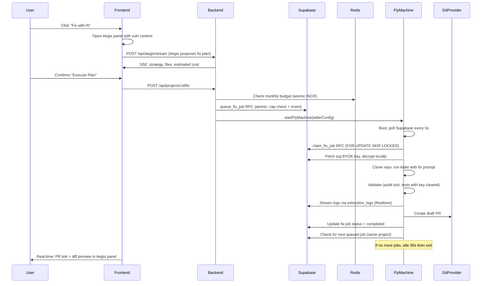
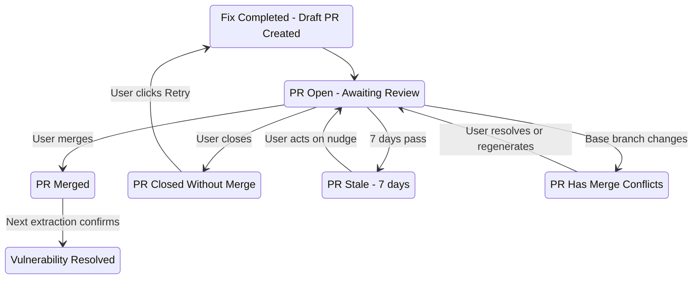

## Phase 7: AI-Powered Vulnerability Fixing (Aider)

**Goal:** Enable AI-powered vulnerability remediation using Aider on Fly.io Machines, with a Jules-like chat-driven planning flow, multiple fix strategies across all 11 supported ecosystems, PR creation, live progress tracking, and comprehensive safety measures. Uses BYOK keys from Phase 6C.

**Prerequisites:** Phase 6 Core, Phase 6B (reachability), Phase 6C (AI infrastructure + BYOK), Phase 8 (PR webhooks -- already built).

### Architecture


```mermaid
sequenceDiagram
    participant U as User
    participant FE as Frontend
    participant BE as Backend
    participant DB as Supabase
    participant RD as Redis
    participant FM as FlyMachine
    participant GH as GitProvider

    U->>FE: Click "Fix with AI"
    FE->>FE: Open Aegis panel with vuln context
    FE->>BE: POST /api/aegis/stream (Aegis proposes fix plan)
    BE->>FE: SSE: strategy, files, estimated cost
    U->>FE: Confirms "Execute Plan"
    FE->>BE: POST /api/projects/:id/fix
    BE->>RD: Check monthly budget (atomic INCR)
    BE->>DB: queue_fix_job RPC (atomic: cap check + insert)
    BE->>FM: startFlyMachine(aiderConfig)
    FM->>FM: Boot, poll Supabase every 5s
    FM->>DB: claim_fix_job RPC (FOR UPDATE SKIP LOCKED)
    FM->>DB: Fetch org BYOK key, decrypt locally
    FM->>FM: Clone repo, run Aider with fix prompt
    FM->>FM: Validate (audit tool, tests with key cleared)
    FM->>DB: Stream logs via extraction_logs (Realtime)
    FM->>GH: Create draft PR
    FM->>DB: Update fix job status = completed
    FM->>DB: Check for next queued job (same project)
    Note over FM: If no more jobs, idle 30s then exit
    FE->>U: Real-time: PR link + diff preview in Aegis panel
```


### 7A: Aider Fly.io Machine Template

Separate Fly.io app: `deptex-aider-worker`. Uses the **same poll-based pattern** as the extraction worker -- machine boots, polls Supabase for queued jobs, claims atomically, processes, then idles and exits.

**Worker architecture (mirrors extraction worker):**

```
backend/aider-worker/
  src/
    index.ts        -- Poll loop (5s), claim via RPC, process, 30s idle exit
    job-db.ts       -- claimJob, sendHeartbeat, updateJobStatus, isJobCancelled
    logger.ts       -- FixLogger -> extraction_logs table (reuses log infra)
    executor.ts     -- Build Aider prompt, invoke subprocess, parse output
    strategies.ts   -- Per-ecosystem strategy selection and file detection
    validation.ts   -- Post-fix validation (audit, lint, test)
    git-ops.ts      -- Clone, branch, commit, push, create PR via git provider API
  Dockerfile
  fly.toml
  package.json
```

The worker is a **Node.js process** that invokes Aider as a **Python subprocess**. This lets us reuse the exact same polling/heartbeat/logging patterns as the extraction worker while leveraging Aider's Python CLI.

**Poll loop:**

```typescript
const POLL_INTERVAL = 5_000;   // 5 seconds
const IDLE_TIMEOUT = 30_000;   // 30 seconds (shorter than extraction's 60s)
const HEARTBEAT_INTERVAL = 60_000;

let lastJobTime = Date.now();
while (true) {
  const job = await claimJob(machineId);
  if (job) {
    lastJobTime = Date.now();
    await processFixJob(job);
    // After completion, immediately check for next queued job (same project gets priority)
    continue;
  }
  if (Date.now() - lastJobTime > IDLE_TIMEOUT) {
    logger.info('No jobs for 30s, exiting for scale-to-zero');
    process.exit(0);
  }
  await sleep(POLL_INTERVAL);
}
```

**Dockerfile:**

```dockerfile
FROM node:20-slim

RUN apt-get update && apt-get install -y --no-install-recommends \
    git curl python3 python3-pip python3-venv && \
    python3 -m venv /opt/aider-venv && \
    /opt/aider-venv/bin/pip install --no-cache-dir aider-chat && \
    apt-get clean && rm -rf /var/lib/apt/lists/*

ENV PATH="/opt/aider-venv/bin:$PATH"

RUN git config --global user.name "Deptex AI" && \
    git config --global user.email "ai@deptex.dev"

WORKDIR /app
COPY package.json package-lock.json ./
RUN npm ci --production
COPY dist/ ./dist/

USER node
CMD ["node", "dist/index.js"]
```

**fly.toml:**

```toml
app = "deptex-aider-worker"
primary_region = "iad"

[build]
  dockerfile = "Dockerfile"

[[vm]]
  cpu_kind = "shared"
  cpus = 4
  memory = "8gb"
```

No HTTP service -- this is a pure worker. No auto_start/auto_stop in fly.toml since machines are managed via the Machines API (same as extraction worker).

**Machine sizing: `shared-cpu-4x`, 8GB RAM:**

- Aider itself is I/O-bound (waiting for LLM API responses), not CPU-bound. Shared CPU is fine and 60% cheaper than dedicated.
- 8GB RAM (bumped from 4GB) to accommodate: git clone of large repos (500MB-2GB), Aider loading file contents into memory, validation tools (npm install, etc.), and Node.js runtime overhead (~200MB).
- Disk: Fly.io default ~10GB root volume is sufficient for shallow clones.

**Timeouts (three layers):**

1. **Aider `--timeout 120`**: Per-LLM-API-call timeout (2 minutes). This is NOT total execution time -- it's per-request to the LLM provider. Prevents hanging on a single slow API call.
2. **Process-level watchdog (10 minutes)**: The worker sets a `setTimeout` that sends `SIGTERM` to the Aider subprocess after 10 minutes of total execution. This is the primary safety limit.
3. **Fly Machines `stop_config.timeout = "15m"`**: Ultimate backstop. If the worker process itself hangs (can't send SIGTERM), Fly destroys the machine after 15 minutes.

**API key security model (BYOK keys never stored in job payload):**

The Aider machine receives these as **Fly secrets** (set once at deploy time, not per-job):

- `SUPABASE_URL`, `SUPABASE_SERVICE_ROLE_KEY` (for job polling, heartbeats, log streaming)
- `AI_ENCRYPTION_KEY` (for decrypting BYOK keys at runtime)

At job runtime, the worker:

1. Reads `organization_id` from the claimed job record
2. Queries `organization_ai_providers` for the org's default provider
3. Decrypts the API key locally using `AI_ENCRYPTION_KEY` (same as Phase 6C's `decryptApiKey()`)
4. Sets the key as an environment variable for the Aider subprocess (`OPENAI_API_KEY`, `ANTHROPIC_API_KEY`, or `GEMINI_API_KEY` depending on provider)
5. **After Aider completes**: clears the key from the environment before running validation (install/test), so validation scripts cannot exfiltrate the key

Git provider tokens are similarly fetched at runtime from `organization_integrations` -- never stored in the job payload.

**Aider CLI invocation:**

```typescript
function getAiderEnvVars(provider: string, apiKey: string): Record<string, string> {
  const envMap: Record<string, string> = {
    openai: 'OPENAI_API_KEY',
    anthropic: 'ANTHROPIC_API_KEY',
    google: 'GEMINI_API_KEY',
  };
  return { [envMap[provider]]: apiKey };
}

function getAiderModelFlag(provider: string, model: string): string {
  if (provider === 'google') return `gemini/${model}`;
  return model;
}
```

Key flags:

- `--yes-always` (not `--yes`): fully non-interactive, auto-accepts all confirmations
- `--no-auto-commits`: we commit manually after validation
- `--message-file /tmp/fix-prompt.md` (not `--message`): avoids shell argument length limits for large prompts with reachability context
- `--timeout 120`: per-API-call timeout in seconds
- `--no-stream`: disable streaming output (we capture stdout for logging)
- `--file <path>`: files to edit (ecosystem-specific, see 7C)

**Generalized Fly Machine utility (`ee/backend/lib/fly-machines.ts`):**

Refactor `startExtractionMachine()` into a generic `startFlyMachine()` that both extraction and aider workers use:

```typescript
interface FlyMachineConfig {
  app: string;
  image?: string;  // defaults to registry.fly.io/${app}:latest
  guest: { cpus: number; memory_mb: number; cpu_kind: 'shared' | 'performance' };
  maxBurst: number;
  stopTimeout: string;  // '4h' for extraction, '15m' for aider
  region?: string;      // defaults to 'iad'
}

const EXTRACTION_CONFIG: FlyMachineConfig = {
  app: process.env.FLY_EXTRACTION_APP || 'deptex-extraction-worker',
  guest: { cpus: 8, memory_mb: 65536, cpu_kind: 'performance' },
  maxBurst: parseInt(process.env.FLY_MAX_BURST_MACHINES || '5'),
  stopTimeout: '4h',
};

const AIDER_CONFIG: FlyMachineConfig = {
  app: process.env.FLY_AIDER_APP || 'deptex-aider-worker',
  guest: { cpus: 4, memory_mb: 8192, cpu_kind: 'shared' },
  maxBurst: parseInt(process.env.FLY_AIDER_MAX_BURST || '3'),
  stopTimeout: '15m',
};

export async function startFlyMachine(config: FlyMachineConfig): Promise<string | null> {
  // 1. List machines for config.app
  // 2. Try to start a stopped pool machine
  // 3. If none available and under maxBurst: create burst machine with auto_destroy: true
  // 4. Retry up to 3 times with backoff
  // Same logic as current startExtractionMachine() but parameterized
}

// Convenience wrappers
export const startExtractionMachine = () => startFlyMachine(EXTRACTION_CONFIG);
export const startAiderMachine = () => startFlyMachine(AIDER_CONFIG);
```

New env vars: `FLY_AIDER_APP` (default: `deptex-aider-worker`), `FLY_AIDER_MAX_BURST` (default: 3).

**Cost estimate per fix:**

- Fly.io Machine (shared-cpu-4x, 8GB, ~$0.032/hr): ~$0.003-0.005 per fix (1-10 minutes)
- LLM tokens: ~$0.05-0.50 (varies by model and code size) -- **BYOK, the org pays their provider directly**
- Total infrastructure cost to Deptex per fix: **~$0.003-0.005** (negligible)
- Stopped machines: ~$0.15/month each, 2 pool machines = $0.30/month idle

### 7B: Fix Orchestrator

Create `ee/backend/lib/ai-fix-engine.ts`:

```typescript
interface FixRequest {
  projectId: string;
  organizationId: string;
  userId: string;
  strategy: FixStrategy;

  // For dependency vulnerability fixes
  vulnerabilityOsvId?: string;
  dependencyId?: string;
  projectDependencyId?: string;
  targetVersion?: string;

  // For Semgrep fixes
  semgrepFindingId?: string;

  // For TruffleHog fixes
  secretFindingId?: string;
}

type FixStrategy = 'bump_version' | 'code_patch' | 'add_wrapper' | 'pin_transitive' | 'remove_unused' | 'fix_semgrep' | 'remediate_secret';

interface FixResult {
  success: boolean;
  jobId: string;
  prUrl?: string;
  prNumber?: number;
  prBranch?: string;
  diffSummary?: string;
  error?: string;
  errorCategory?: string;
  tokensUsed?: number;
  estimatedCost?: number;
  validationResult?: ValidationResult;
  introducedVulns?: string[];
}

interface ValidationResult {
  auditPassed: boolean | null;  // null = skipped
  lintPassed: boolean | null;
  testsPassed: boolean | null;
  testsSkipped: boolean;
  notes: string[];
}
```

The fix engine handles three categories:

1. **Dependency vulnerabilities** (bump_version, code_patch, add_wrapper, pin_transitive, remove_unused) -- triggered from Aegis panel via "Fix with AI" button or chat
2. **Semgrep code issues** (fix_semgrep) -- triggered from Aegis panel or chat
3. **Exposed secrets** (remediate_secret) -- triggered from Aegis panel or chat

**Jules-like chat-driven flow:**

Instead of a simple "click button → modal → execute" pattern, Phase 7 uses a conversational planning flow:

1. User clicks **"Fix with AI"** on a vulnerability, Semgrep finding, or secret → Opens the **Aegis panel** with the relevant context pre-loaded
2. Aegis **analyzes the issue** and proposes a fix plan:
  - "I recommend upgrading lodash from 4.17.15 to 4.17.21 to fix CVE-2024-XXXX."
  - "This will modify package.json and package-lock.json."
  - "Your code uses lodash.merge() in 3 files -- I'll verify compatibility after upgrading."
  - "Estimated cost: ~$0.10 (GPT-4o, ~2000 tokens)"
  - **[Execute Plan]** button rendered as an action card in the chat
3. User can **discuss and modify**: "What about a code patch instead?" → Aegis adjusts: "OK, I'll add input sanitization at handler.ts:42 before the lodash.merge() call instead."
4. User clicks **"Execute Plan"** → Aegis calls the `triggerFix` tool → Job queued → Progress shown inline in chat
5. **Live progress** in the Aegis panel: step indicator + log stream
6. On completion: Aegis posts "Fix PR #42 created on branch fix/CVE-2024-XXXX" with a link

The same flow works when Aegis proactively suggests fixes during regular conversation: "I noticed CVE-2024-XXXX in lodash. Want me to fix it?"

**Orchestrator flow (backend):**

1. Validate: project has connected repo, org has BYOK configured, vulnerability/finding exists
2. Check budget: Phase 6C Redis INCR pattern (`ai:cost:${orgId}:${year}:${month}`)
3. Call `queue_fix_job` RPC (atomic: concurrent cap + same-project serialization + insert)
4. Gather rich context and store in job `payload` JSONB:
  - CVE details (osv_id, severity, description, fixed_versions)
  - Affected dependencies (name, version, direct/transitive, ecosystem)
  - Atom reachability data (from `project_reachable_flows`): entry points, data-flow paths, sink functions
  - Atom usage slices (from `project_usage_slices`): which functions are called
  - dep-scan LLMPrompts (from `project_reachable_flows.llm_prompt`): AI-ready context
  - Repo info: clone URL, provider type, default branch, root_directory (for monorepos)
  - Fix strategy + target version + affected file paths
  - **NOT in payload**: API keys, git tokens (fetched at runtime by the worker)
5. Call `startAiderMachine()` to wake a Fly machine (best-effort; job stays in DB if this fails)
6. Return `{ success: true, jobId }` to the frontend

**Database table:**

```sql
CREATE TABLE project_security_fixes (
  id UUID PRIMARY KEY DEFAULT gen_random_uuid(),
  project_id UUID NOT NULL REFERENCES projects(id) ON DELETE CASCADE,
  organization_id UUID NOT NULL REFERENCES organizations(id) ON DELETE CASCADE,
  run_id UUID NOT NULL DEFAULT gen_random_uuid(),

  fix_type TEXT NOT NULL CHECK (fix_type IN ('vulnerability', 'semgrep', 'secret')),
  strategy TEXT NOT NULL CHECK (strategy IN (
    'bump_version', 'code_patch', 'add_wrapper', 'pin_transitive',
    'remove_unused', 'fix_semgrep', 'remediate_secret'
  )),
  status TEXT NOT NULL DEFAULT 'queued' CHECK (status IN (
    'queued', 'running', 'completed', 'failed', 'cancelled',
    'pr_closed', 'merged', 'superseded'
  )),
  triggered_by UUID NOT NULL REFERENCES auth.users(id),

  -- Target identification
  osv_id TEXT,
  dependency_id UUID REFERENCES dependencies(id),
  project_dependency_id UUID REFERENCES project_dependencies(id),
  semgrep_finding_id UUID REFERENCES project_semgrep_findings(id),
  secret_finding_id UUID REFERENCES project_secret_findings(id),
  target_version TEXT,

  -- Job payload (context for the worker -- NO secrets)
  payload JSONB NOT NULL DEFAULT '{}',

  -- Machine lifecycle
  machine_id TEXT,
  heartbeat_at TIMESTAMPTZ,
  attempts INTEGER NOT NULL DEFAULT 0,
  max_attempts INTEGER NOT NULL DEFAULT 3,

  -- Results
  pr_url TEXT,
  pr_number INTEGER,
  pr_branch TEXT,
  pr_provider TEXT,
  pr_repo_full_name TEXT,
  diff_summary TEXT,
  tokens_used INTEGER,
  estimated_cost NUMERIC(10, 4),
  error_message TEXT,
  error_category TEXT,
  introduced_vulns TEXT[],
  validation_result JSONB,

  -- Timestamps
  started_at TIMESTAMPTZ,
  completed_at TIMESTAMPTZ,
  created_at TIMESTAMPTZ DEFAULT NOW()
);

CREATE INDEX idx_psf_project_status ON project_security_fixes(project_id, status);
CREATE INDEX idx_psf_org_status ON project_security_fixes(organization_id, status);
CREATE INDEX idx_psf_queued ON project_security_fixes(status, created_at) WHERE status = 'queued';
CREATE INDEX idx_psf_running ON project_security_fixes(status, heartbeat_at) WHERE status = 'running';
CREATE INDEX idx_psf_osv ON project_security_fixes(project_id, osv_id) WHERE osv_id IS NOT NULL;
CREATE INDEX idx_psf_run ON project_security_fixes(run_id);
```

`**claim_fix_job` RPC (atomic job claiming with same-project serialization):**

```sql
CREATE OR REPLACE FUNCTION claim_fix_job(p_machine_id TEXT)
RETURNS SETOF project_security_fixes AS $$
BEGIN
  RETURN QUERY
  WITH candidate AS (
    SELECT psf.*
    FROM project_security_fixes psf
    WHERE psf.status = 'queued'
      -- Same-project serialization: skip if another job is running for this project
      AND NOT EXISTS (
        SELECT 1 FROM project_security_fixes running
        WHERE running.project_id = psf.project_id
          AND running.status = 'running'
      )
    ORDER BY psf.created_at ASC
    LIMIT 1
    FOR UPDATE SKIP LOCKED
  )
  UPDATE project_security_fixes
  SET status = 'running',
      machine_id = p_machine_id,
      started_at = NOW(),
      heartbeat_at = NOW(),
      attempts = attempts + 1
  FROM candidate
  WHERE project_security_fixes.id = candidate.id
  RETURNING project_security_fixes.*;
END;
$$ LANGUAGE plpgsql;
```

`**queue_fix_job` RPC (atomic concurrent cap + insert):**

```sql
CREATE OR REPLACE FUNCTION queue_fix_job(
  p_project_id UUID,
  p_organization_id UUID,
  p_fix_type TEXT,
  p_strategy TEXT,
  p_triggered_by UUID,
  p_osv_id TEXT DEFAULT NULL,
  p_dependency_id UUID DEFAULT NULL,
  p_project_dependency_id UUID DEFAULT NULL,
  p_semgrep_finding_id UUID DEFAULT NULL,
  p_secret_finding_id UUID DEFAULT NULL,
  p_target_version TEXT DEFAULT NULL,
  p_payload JSONB DEFAULT '{}'
) RETURNS UUID AS $$
DECLARE
  v_org_count INTEGER;
  v_job_id UUID;
BEGIN
  -- Lock org row to serialize concurrent fix requests
  PERFORM 1 FROM organizations WHERE id = p_organization_id FOR UPDATE;

  -- Check org-level concurrent cap (max 5 active jobs)
  SELECT COUNT(*) INTO v_org_count
  FROM project_security_fixes
  WHERE organization_id = p_organization_id
    AND status IN ('queued', 'running');

  IF v_org_count >= 5 THEN
    RAISE EXCEPTION 'MAX_CONCURRENT_FIXES: Organization has reached the maximum of 5 concurrent fix jobs';
  END IF;

  -- Insert the job (same-project serialization handled at claim time, not queue time)
  INSERT INTO project_security_fixes (
    project_id, organization_id, fix_type, strategy, triggered_by,
    osv_id, dependency_id, project_dependency_id,
    semgrep_finding_id, secret_finding_id, target_version, payload
  ) VALUES (
    p_project_id, p_organization_id, p_fix_type, p_strategy, p_triggered_by,
    p_osv_id, p_dependency_id, p_project_dependency_id,
    p_semgrep_finding_id, p_secret_finding_id, p_target_version, p_payload
  ) RETURNING id INTO v_job_id;

  RETURN v_job_id;
END;
$$ LANGUAGE plpgsql;
```

**Budget check (uses Phase 6C Redis INCR -- no Supabase RPC):**

```typescript
async function checkAndReserveBudget(orgId: string, estimatedCost: number): Promise<boolean> {
  const now = new Date();
  const key = `ai:cost:${orgId}:${now.getFullYear()}:${now.getMonth() + 1}`;
  const estimatedCents = Math.ceil(estimatedCost * 100);

  // Fetch monthly cap
  const { data: provider } = await supabase
    .from('organization_ai_providers')
    .select('monthly_cost_cap')
    .eq('organization_id', orgId)
    .eq('is_default', true)
    .single();

  const capCents = Math.floor((provider?.monthly_cost_cap ?? 100) * 100);

  // Atomic increment (Redis INCR is atomic, prevents race conditions)
  const newTotal = await redis.incrby(key, estimatedCents);
  await redis.expire(key, 35 * 24 * 60 * 60); // 35-day TTL

  if (newTotal > capCents) {
    await redis.decrby(key, estimatedCents); // rollback
    return false;
  }
  return true;
}
```

**Recovery endpoint: `POST /api/internal/recovery/fix-jobs`:**

Protected by `X-Internal-Api-Key`. Called by QStash cron every 5 minutes (same pattern as extraction recovery).

```sql
CREATE OR REPLACE FUNCTION recover_stuck_fix_jobs()
RETURNS SETOF project_security_fixes AS $$
BEGIN
  RETURN QUERY
  UPDATE project_security_fixes
  SET status = 'queued',
      machine_id = NULL,
      heartbeat_at = NULL,
      run_id = gen_random_uuid()  -- New run_id for fresh log stream
  WHERE status = 'running'
    AND heartbeat_at < NOW() - INTERVAL '5 minutes'
    AND attempts < max_attempts
  RETURNING *;
END;
$$ LANGUAGE plpgsql;

CREATE OR REPLACE FUNCTION fail_exhausted_fix_jobs()
RETURNS SETOF project_security_fixes AS $$
BEGIN
  RETURN QUERY
  UPDATE project_security_fixes
  SET status = 'failed',
      error_message = 'Fix machine terminated unexpectedly after ' || attempts || ' attempt(s).',
      error_category = 'machine_crash',
      completed_at = NOW()
  WHERE status = 'running'
    AND heartbeat_at < NOW() - INTERVAL '5 minutes'
    AND attempts >= max_attempts
  RETURNING *;
END;
$$ LANGUAGE plpgsql;
```

Recovery endpoint logic:

1. Call `recover_stuck_fix_jobs()` -- requeue stale jobs
2. Call `fail_exhausted_fix_jobs()` -- fail jobs that exceeded retries
3. Insert warning/error rows into `extraction_logs` for each affected job
4. Orphan handling: select up to 3 oldest `queued` jobs, call `startAiderMachine()` for each

**Cancellation: `cancelFixJob(jobId, userId)`:**

```typescript
async function cancelFixJob(jobId: string, userId: string): Promise<void> {
  const { data: job } = await supabase
    .from('project_security_fixes')
    .select('*')
    .eq('id', jobId)
    .single();

  if (!job || !['queued', 'running'].includes(job.status)) return;

  await supabase
    .from('project_security_fixes')
    .update({ status: 'cancelled', completed_at: new Date().toISOString() })
    .eq('id', jobId);

  // If running on a machine, stop it
  if (job.status === 'running' && job.machine_id) {
    await stopFlyMachine(AIDER_CONFIG.app, job.machine_id);
  }
}
```

Frontend: "Cancel Fix" button in the progress UI. The worker checks `isJobCancelled()` (queries DB for status = 'cancelled') before each major step (after clone, after Aider, before push).

**Dequeue/continuation logic:**

After a fix completes (success or failure), the worker checks for the next queued job before going idle:

```typescript
async function processFixJob(job: FixJob): Promise<void> {
  try {
    // ... run the fix ...
  } finally {
    // Check if there's a next job queued for the same project (priority)
    // or any other queued job
    // The main poll loop handles this by calling claimJob() immediately
    // (no sleep between jobs)
  }
}
```

The `claim_fix_job` RPC already handles same-project serialization -- it skips projects with a running job. So after completing a job, the worker's next `claimJob()` call can immediately pick up the next queued job for that project (since the running one just completed).

### 7C: Fix Strategies

**Ecosystem detection:**

The worker determines the ecosystem from the job payload's `ecosystem` field (populated from `dependencies.ecosystem` during context gathering). If missing, fall back to file-based detection:

```typescript
function detectEcosystem(repoRoot: string): string | null {
  if (fs.existsSync(path.join(repoRoot, 'package.json'))) return 'npm';
  if (fs.existsSync(path.join(repoRoot, 'requirements.txt')) ||
      fs.existsSync(path.join(repoRoot, 'pyproject.toml'))) return 'pypi';
  if (fs.existsSync(path.join(repoRoot, 'Cargo.toml'))) return 'cargo';
  if (fs.existsSync(path.join(repoRoot, 'go.mod'))) return 'golang';
  if (fs.existsSync(path.join(repoRoot, 'pom.xml'))) return 'maven';
  if (fs.existsSync(path.join(repoRoot, 'Gemfile'))) return 'gem';
  if (fs.existsSync(path.join(repoRoot, 'composer.json'))) return 'composer';
  if (fs.existsSync(path.join(repoRoot, 'pubspec.yaml'))) return 'pub';
  if (fs.existsSync(path.join(repoRoot, 'mix.exs'))) return 'hex';
  if (fs.existsSync(path.join(repoRoot, 'Package.swift'))) return 'swift';
  // nuget: look for *.csproj
  const csprojs = glob.sync('*.csproj', { cwd: repoRoot });
  if (csprojs.length > 0) return 'nuget';
  return null;
}
```

**Ecosystem reference table:**


| Ecosystem | Manifest                          | Lock                           | Audit Tool                                   | Override/Pin             | Install (safe)                  |
| --------- | --------------------------------- | ------------------------------ | -------------------------------------------- | ------------------------ | ------------------------------- |
| npm       | package.json                      | package-lock.json              | `npm audit --json`                           | `overrides`              | `npm install --ignore-scripts`  |
| yarn      | package.json                      | yarn.lock                      | `yarn audit --json`                          | `resolutions`            | `yarn install --ignore-scripts` |
| pnpm      | package.json                      | pnpm-lock.yaml                 | `pnpm audit --json`                          | `pnpm.overrides`         | `pnpm install --ignore-scripts` |
| pypi      | requirements.txt / pyproject.toml | requirements.txt / poetry.lock | `pip-audit --format=json`                    | constraints file         | `pip install --no-deps`         |
| cargo     | Cargo.toml                        | Cargo.lock                     | `cargo audit --json`                         | `[patch.crates-io]`      | `cargo check`                   |
| golang    | go.mod                            | go.sum                         | `govulncheck -json ./...`                    | `replace` directive      | `go mod tidy`                   |
| maven     | pom.xml                           | n/a                            | `mvn org.owasp:dependency-check-maven:check` | `<dependencyManagement>` | `mvn compile -q`                |
| gem       | Gemfile                           | Gemfile.lock                   | `bundle-audit check`                         | version pin in Gemfile   | `bundle install --no-install`   |
| composer  | composer.json                     | composer.lock                  | `composer audit --format=json`               | version constraint       | `composer install --no-scripts` |
| pub       | pubspec.yaml                      | pubspec.lock                   | n/a                                          | `dependency_overrides`   | `dart pub get`                  |
| hex       | mix.exs                           | mix.lock                       | `mix_audit`                                  | override in mix.exs      | `mix deps.get`                  |
| swift     | Package.swift                     | Package.resolved               | n/a                                          | n/a                      | `swift package resolve`         |
| nuget     | *.csproj                          | packages.lock.json             | `dotnet list package --vulnerable`           | n/a                      | `dotnet restore`                |


**Strategy file mapping (what Aider edits per ecosystem):**

```typescript
function getStrategyFiles(ecosystem: string, strategy: FixStrategy, rootDir: string): string[] {
  const manifests: Record<string, string[]> = {
    npm: ['package.json', 'package-lock.json'],
    yarn: ['package.json', 'yarn.lock'],
    pnpm: ['package.json', 'pnpm-lock.yaml'],
    pypi: ['requirements.txt', 'pyproject.toml', 'poetry.lock'],
    cargo: ['Cargo.toml', 'Cargo.lock'],
    golang: ['go.mod', 'go.sum'],
    maven: ['pom.xml'],
    gem: ['Gemfile', 'Gemfile.lock'],
    composer: ['composer.json', 'composer.lock'],
    pub: ['pubspec.yaml', 'pubspec.lock'],
    hex: ['mix.exs', 'mix.lock'],
    swift: ['Package.swift', 'Package.resolved'],
    nuget: [], // detected dynamically (*.csproj)
  };
  // Filter to files that actually exist, prepend rootDir for monorepos
  return manifests[ecosystem]
    ?.map(f => path.join(rootDir, f))
    .filter(f => fs.existsSync(f)) ?? [];
}
```

**Aider invocation (all strategies):**

All strategies use the same invocation pattern. The prompt varies by strategy; the ecosystem determines which files to edit.

```typescript
async function invokeAider(
  workDir: string,
  promptFile: string,
  files: string[],
  model: string,
  envVars: Record<string, string>,
  logger: FixLogger,
  watchdogMs: number = 10 * 60 * 1000,
): Promise<{ exitCode: number; stdout: string; stderr: string }> {
  const args = [
    '--yes-always',
    '--no-auto-commits',
    '--no-stream',
    '--model', model,
    '--message-file', promptFile,
    ...files.flatMap(f => ['--file', f]),
    '--timeout', '120',
  ];

  return new Promise((resolve, reject) => {
    const child = spawn('aider', args, { cwd: workDir, env: { ...process.env, ...envVars } });
    let stdout = '', stderr = '';

    child.stdout.on('data', d => { stdout += d; logger.log('aider', d.toString().trim()); });
    child.stderr.on('data', d => { stderr += d; });

    // Process-level watchdog (primary timeout)
    const watchdog = setTimeout(() => {
      child.kill('SIGTERM');
      setTimeout(() => child.kill('SIGKILL'), 5000);
      reject(new Error('Aider execution timed out after 10 minutes'));
    }, watchdogMs);

    child.on('close', code => {
      clearTimeout(watchdog);
      resolve({ exitCode: code ?? 1, stdout, stderr });
    });
    child.on('error', err => { clearTimeout(watchdog); reject(err); });
  });
}
```

**Strategy 1: Version Bump** (`bump_version` -- most common, ~70% of fixes):

Prompt template (written to temp file, passed via `--message-file`):

```
Upgrade {PACKAGE_NAME} from {CURRENT_VERSION} to {TARGET_VERSION} to fix {OSV_ID}.
Update the package manifest and lockfile for this {ECOSYSTEM} project.
If there are breaking changes between these versions, make necessary code adjustments.

CONTEXT - How this package is used in the project:
{USAGE_SLICES_SUMMARY}

CONTEXT - Reachable data flow:
{REACHABLE_FLOW_SUMMARY}

CONTEXT - dep-scan analysis:
{LLM_PROMPT_FROM_DEPSCAN}

After upgrading, verify the usage sites above still work correctly.
Do NOT change any unrelated files.
```

**Strategy 2: Code Patch** (`code_patch` -- for vulns without a fixed version):

```
The dependency {PACKAGE_NAME}@{VERSION} has vulnerability {OSV_ID}: {VULN_DESCRIPTION}.
No fixed version is available. Add mitigation at the application level.

REACHABLE DATA FLOW (from static analysis):
Entry point: {ENTRY_POINT_FILE}:{ENTRY_POINT_LINE} ({ENTRY_POINT_METHOD})
Flow: {FLOW_CHAIN_SUMMARY}
Sink: {SINK_METHOD} in {PACKAGE_NAME}

CODE AT ENTRY POINT:
{ENTRY_POINT_CODE_SNIPPET}

CODE AT VULNERABLE CALL:
{VULNERABLE_CALL_CODE_SNIPPET}

Add input validation, sanitization, or a safe wrapper at or before the call
to {SINK_METHOD} to prevent exploitation. Explain what you changed and why.
```

**Strategy 3: Add Wrapper** (`add_wrapper`):

```
The function {VULNERABLE_FUNCTION} in {PACKAGE_NAME}@{VERSION} has {OSV_ID}.
Your code calls this function at these locations:
{USAGE_LOCATIONS_WITH_CODE}

Create a safe wrapper function that sanitizes input before calling
{VULNERABLE_FUNCTION}, then update all call sites to use the wrapper.
This avoids upgrading the package while mitigating the vulnerability.
```

**Strategy 4: Pin Transitive** (`pin_transitive`):

The prompt is ecosystem-aware, referencing the correct override mechanism:

```
The transitive dependency {PACKAGE_NAME}@{CURRENT_VERSION} (pulled in via {PARENT_PACKAGE})
has vulnerability {OSV_ID}. Pin it to {SAFE_VERSION} using the {ECOSYSTEM} override mechanism:
{ECOSYSTEM_SPECIFIC_INSTRUCTION}
```

Where `ECOSYSTEM_SPECIFIC_INSTRUCTION` maps to:

- npm: `Add to "overrides" in package.json`
- yarn: `Add to "resolutions" in package.json`
- pnpm: `Add to "pnpm.overrides" in package.json`
- pip: `Add a constraint in requirements.txt or constraints.txt`
- cargo: `Add a [patch.crates-io] section in Cargo.toml`
- go: `Add a "replace" directive in go.mod`
- maven: `Add to <dependencyManagement> in pom.xml`
- Other ecosystems: `Pin the exact version in the manifest file`

**Strategy 5: Remove Unused** (`remove_unused`):

```
Remove the unused dependency {PACKAGE_NAME} from this {ECOSYSTEM} project.
Usage analysis confirms no code in this project imports or calls any function from this package.
Remove it from the package manifest and lockfile.
Remove any remaining import statements that reference it.
Do NOT change any unrelated files.
```

**Strategy 6: Fix Semgrep Issue** (`fix_semgrep`):

```
Fix the security issue found by Semgrep rule {RULE_ID} at {FILE_PATH}:{LINE_RANGE}.
Category: {CATEGORY}
Severity: {SEVERITY}
CWE: {CWE_IDS}
Message: {SEMGREP_MESSAGE}

Current code:
{CODE_SNIPPET}

Fix the vulnerability while preserving the existing functionality.
Follow OWASP best practices for this category of issue.
```

**Strategy 7: Remediate Secret** (`remediate_secret`):

```
An exposed {DETECTOR_TYPE} secret was found at {FILE_PATH}:{LINE}.
Replace the hardcoded secret value with an environment variable reference.
Use the appropriate pattern for this language:
- JavaScript/TypeScript: process.env.{ENV_VAR_NAME}
- Python: os.environ['{ENV_VAR_NAME}']
- Go: os.Getenv("{ENV_VAR_NAME}")
- Java: System.getenv("{ENV_VAR_NAME}")
- Ruby: ENV['{ENV_VAR_NAME}']
Add a comment noting the env var that needs to be set.
If a .env.example file exists, add the variable name there (without the value).
Do NOT include the actual secret value anywhere in the code.
```

Note: Aider reads the file content via `--file`, so it will see the secret in the source. This is the org's own code running on their own BYOK key. The secret was already committed to git. The BYOK key is cleared from the environment before validation runs.

**Post-fix validation:**

After Aider completes and before committing:

```typescript
async function validateFix(
  workDir: string,
  ecosystem: string,
  logger: FixLogger,
): Promise<ValidationResult> {
  const result: ValidationResult = {
    auditPassed: null,
    lintPassed: null,
    testsPassed: null,
    testsSkipped: false,
    notes: [],
  };

  // 1. Clear LLM API key from environment BEFORE running any install/test
  delete process.env.OPENAI_API_KEY;
  delete process.env.ANTHROPIC_API_KEY;
  delete process.env.GEMINI_API_KEY;

  // 2. Run safe install (lockfile regeneration)
  try {
    const installCmd = getSafeInstallCommand(ecosystem);
    if (installCmd) {
      execSync(installCmd, { cwd: workDir, timeout: 120_000, stdio: 'pipe' });
    }
  } catch (err) {
    result.notes.push(`Install failed: ${err.message}. Lockfile may need manual regeneration.`);
  }

  // 3. Run audit tool
  try {
    const auditCmd = getAuditCommand(ecosystem);
    if (auditCmd) {
      execSync(auditCmd, { cwd: workDir, timeout: 60_000, stdio: 'pipe' });
      result.auditPassed = true;
    }
  } catch {
    result.auditPassed = false;
    result.notes.push('Audit tool reports remaining vulnerabilities.');
  }

  // 4. Run tests (2-minute timeout, isolated container makes this safe)
  try {
    const testCmd = getTestCommand(ecosystem, workDir);
    if (testCmd) {
      execSync(testCmd, { cwd: workDir, timeout: 120_000, stdio: 'pipe' });
      result.testsPassed = true;
    } else {
      result.testsSkipped = true;
      result.notes.push('No test command detected.');
    }
  } catch {
    result.testsPassed = false;
    result.notes.push('Tests failed after fix. Please verify locally.');
  }

  return result;
}
```

**PR description template:**

```typescript
function buildPRDescription(job: FixJob, result: FixResult): string {
  return `## Security Fix: ${job.osv_id || job.strategy}

**Strategy:** ${formatStrategy(job.strategy, job.target_version)}
**Severity:** ${job.payload.severity || 'N/A'}
**Ecosystem:** ${job.payload.ecosystem}
**Generated by:** Deptex AI (Aider)

### What changed
${result.diffSummary || 'See diff below.'}

### Validation
- Audit: ${formatValidation(result.validationResult?.auditPassed)}
- Tests: ${result.validationResult?.testsSkipped ? 'Skipped (no test command detected)' : formatValidation(result.validationResult?.testsPassed)}
${result.validationResult?.notes.map(n => `- Note: ${n}`).join('\n') || ''}

${result.introducedVulns?.length ? `### Warnings\n- This fix introduces: ${result.introducedVulns.join(', ')}` : ''}

---
*This is a draft PR created by [Deptex AI](https://deptex.dev). Review carefully before merging.*`;
}
```

**Branch collision handling:**

```typescript
async function createFixBranch(provider: GitProvider, baseBranch: string, branchName: string): Promise<string> {
  // Check if branch already exists
  const exists = await provider.branchExists(branchName);
  if (!exists) return branchName;

  // Check if there's an open PR for this branch
  const openPR = await provider.getOpenPRForBranch(branchName);
  if (!openPR) {
    // Old branch with no open PR -- delete and reuse name
    await provider.deleteBranch(branchName);
    return branchName;
  }

  // Branch has an open PR -- append suffix
  for (let i = 2; i <= 10; i++) {
    const suffixed = `${branchName}-${i}`;
    if (!(await provider.branchExists(suffixed))) return suffixed;
  }
  throw new Error('Too many existing branches for this fix');
}
```

**Disk cleanup between fixes:**

After each fix job (success or failure), the worker cleans up:

```typescript
finally {
  // Remove cloned repo to free disk and prevent file leakage between fixes
  await fs.rm(workDir, { recursive: true, force: true });
}
```

### 7D: Fix Progress UI

**Chat-driven planning flow (replaces old modal pattern):**

1. **"Fix with AI" button** on any vulnerability, Semgrep finding, or secret finding opens the Aegis panel (if not already open) and sends context to Aegis. The button behavior depends on state:
  - No active fix + BYOK configured: green button "Fix with AI" → opens Aegis panel
  - No BYOK: disabled button with tooltip "Configure AI keys in Organization Settings"
  - Fix queued: "Fix Queued..." (disabled, gray, spinner)
  - Fix running: "Fix in Progress" (disabled, animated border) + "View Logs" expandable
  - Fix completed: "Fix PR Created" (green outline) with PR link + "Fix again" secondary link
  - Fix failed: "Fix with AI" with amber "Previous attempt failed" warning badge
2. **Aegis proposes the plan** (rendered as an action card in chat):
  - Strategy recommendation with reasoning
  - Files that will be modified
  - Estimated cost (model + typical token usage range)
  - **[Execute Plan]** button
  - **[Modify Strategy]** button (opens strategy picker)
3. **Progress indicator** (inline in Aegis panel after executing):
  - Step indicator: Cloning → Analyzing → Fixing → Validating → Creating PR
  - Current step highlighted with spinner
  - Live log stream below (Supabase Realtime on `extraction_logs` filtered by `run_id`)
  - Logs color-coded: white info, yellow warnings, green success, red errors
  - **"Cancel Fix"** button (calls `cancelFixJob()`)
4. **Completion states** (inline in Aegis panel):
  - **Success**: "Fix PR #42 created on branch fix/CVE-2024-XXXX" with PR link + diff summary
  - **Failure -- smart failure flow**: Aegis analyzes the failure and provides:
  1. Error category explanation
  2. Suggested alternative strategy
  3. "Retry with suggested strategy" button
  4. "Ask Aegis for help" continues the conversation with full failure context
5. **Fix history**: In the vulnerability/finding detail sidebar, a "Past Fixes" collapsible section showing previous attempts with status, PR link, strategy, and failure reason.

### 7E: Safety Measures

- **Three-layer timeout**: Aider `--timeout 120` (per-API-call), process watchdog 10 min (primary), Fly Machines `stop_config.timeout: 15m` (ultimate backstop)
- PR created as **draft** for human review (never merged automatically)
- Aider runs with `--no-auto-commits` -- all changes reviewed before committing
- Post-fix validation: audit tool per ecosystem + tests with 2-min timeout. LLM API key **cleared from environment** before validation runs (prevents exfiltration via install scripts)
- Never push directly to main/master -- creates `fix/$OSV_ID`, `fix/semgrep-$RULE_ID`, or `fix/secret-$DETECTOR_TYPE` branches
- **Rate limiting**: max 5 concurrent fix jobs per organization (enforced atomically by `queue_fix_job` RPC)
- **Same-project serialization**: enforced at claim time by `claim_fix_job` RPC. Jobs queue rather than run in parallel for the same project. Dequeued jobs re-fetch context to handle stale state.
- **Cost cap**: Phase 6C Redis INCR pattern. Atomic check-and-reserve before each fix. Rollback on failure.
- **Max attempts guard**: max 3 failed fix attempts per target per 24 hours. After 3, block retry with "Manual intervention required."
- **Cancellation**: `cancelFixJob()` sets status = 'cancelled', stops Fly machine if running. Worker checks `isJobCancelled()` before each major step.
- Audit trail: all fix jobs in `project_security_fixes`, all LLM calls in `ai_usage_logs`
- Secret safety: Aider sees the file content (necessary to modify it), but the BYOK key holder is authorizing their own LLM to see their own code. Key cleared before validation.
- **Re-extraction safety**: warn user before re-extraction if fix jobs are running
- **BYOK deletion guard**: warn before deleting an AI provider key if active fix jobs exist
- **Recovery cron**: `POST /api/internal/recovery/fix-jobs` every 5 minutes via QStash (requeues stuck, fails exhausted, starts machines for orphans)
- Repository access: uses the same git provider token as extraction (requires `contents: write` + `pull_requests: write` permissions on the GitHub App)
- **Supabase token scoping** (future enhancement): use a limited-scope Supabase token for the Aider machine instead of the full service role key. The machine only needs: read/update `project_security_fixes`, insert `extraction_logs`, read `organization_ai_providers` and `organization_integrations`.

### 7G: Fix Status Integration Across All Screens

Fix status from `project_security_fixes` must be visible globally -- not just inside the Aegis panel where the fix was triggered. Every screen that displays a vulnerability, dependency, or project should reflect active/completed/failed fix state in real time.

**Graph Node Indicators (Security Tab -- project, org, and team graphs):**

- **Vulnerability node**: When a fix job targets this vulnerability (`osv_id` match in `project_security_fixes` with status `queued` or `running`):
  - Small sparkle/AI icon badge (green-500, 14px) in the top-right corner of the node, with a subtle `animate-pulse` animation
  - Tooltip on hover: "Being fixed by Aegis (Step 3/5: Analyzing code)"
  - When status = `completed` and PR exists: icon changes to a green check + "PR created" tooltip with PR number
  - When status = `failed`: icon changes to amber warning triangle + "Fix failed" tooltip
  - Icon clears when no active/recent fix exists (or after PR is merged and vuln is resolved on next extraction)
- **Dependency node**: If ANY vulnerability under this dependency has an active fix, show the same sparkle badge. Tooltip: "1 fix in progress, 2 fixes completed"
- **Project center node**: If ANY fix job is running for this project, show sparkle badge with count: "3 AI fixes in progress"
- **Org/Team graph project nodes**: Same badge as center node -- sparkle with count if any fixes running for that project
- **Org/Team graph team nodes**: Aggregate across team projects: "5 AI fixes in progress across 3 projects"

**Vulnerability Detail Sidebar (6D):**

- "Fix with AI" button state changes per 7D
- **Past Fixes section**: real-time status updates for running fixes

**Dependency Detail Sidebar (6E):**

- Under "Current Vulnerabilities": each vulnerability row gains a fix status badge inline (running/completed/failed)
- Under "Recommended Versions": if a version bump fix is in progress, show inline "AI is currently upgrading to vX.Y.Z"

**Project Security Sidebar (6F -- center node click):**

- New "Active AI Fixes" card between "Priority Actions" and "Actions Footer":
  - Count: "2 running, 1 queued"
  - Mini list: each fix with target, strategy badge, current step
  - Each item clickable -- navigates to the vulnerability/finding detail
  - Hidden when no active fixes

**Dependencies Tab, Compliance Tab, Project Overview Page, Org/Team Security Pages, Aegis Full-Page Screen:**

Same integration as described in the original plan (dependency badges, compliance "Fix in Progress" status, overview counts, activity feed, Aegis active tasks sidebar). No changes to these sections.

### 7H: Real-time Fix Status Infrastructure

All fix status indicators update in real time via Supabase Realtime.

**Supabase Realtime channels:**

```typescript
// Project-level: fix job status changes
supabase.channel(`fix-status:${projectId}`)
  .on('postgres_changes', {
    event: '*', schema: 'public', table: 'project_security_fixes',
    filter: `project_id=eq.${projectId}`,
  }, handleFixStatusUpdate)
  .subscribe();

// Project-level: live fix logs (keyed by run_id)
supabase.channel(`fix-logs:${runId}`)
  .on('postgres_changes', {
    event: 'INSERT', schema: 'public', table: 'extraction_logs',
    filter: `run_id=eq.${runId}`,
  }, handleLogEntry)
  .subscribe();

// Org-level: all fix jobs across projects
supabase.channel(`fix-status-org:${orgId}`)
  .on('postgres_changes', {
    event: '*', schema: 'public', table: 'project_security_fixes',
    filter: `organization_id=eq.${orgId}`,
  }, handleOrgFixStatusUpdate)
  .subscribe();
```

Note: fix logs use the `extraction_logs` table with the fix job's `run_id`. The log streaming infrastructure from Phase 2 is fully reused -- the frontend subscribes to `extraction_logs` filtered by `run_id` for live log display.

**React hooks** (create `frontend/src/hooks/useFixStatus.ts`):

```typescript
export function useProjectFixStatus(projectId: string): {
  fixes: FixJob[];
  runningCount: number;
  queuedCount: number;
  getFixForVuln: (osvId: string) => FixJob | null;
  getFixForSemgrep: (findingId: string) => FixJob | null;
  getFixForSecret: (findingId: string) => FixJob | null;
  getFixesForDep: (depName: string) => FixJob[];
}

export function useOrgFixStatus(orgId: string): {
  fixes: FixJob[];
  runningCount: number;
  getFixesForProject: (projectId: string) => FixJob[];
}

export function useTargetFixStatus(target: {
  osvId?: string;
  semgrepFindingId?: string;
  secretFindingId?: string;
  projectId: string;
}): {
  activeFix: FixJob | null;
  recentFixes: FixJob[];
  canStartNewFix: boolean;
  blockReason?: string;
}
```

**Context providers:**

```typescript
// In ProjectLayout.tsx:
<FixStatusProvider projectId={projectId}>
  <Outlet />
</FixStatusProvider>

// In OrganizationLayout.tsx:
<OrgFixStatusProvider orgId={orgId}>
  <Outlet />
</OrgFixStatusProvider>
```

### 7I: Duplicate Fix Prevention & Aegis Awareness

When a user attempts to fix something that already has an active fix (via button or Aegis chat), the system detects the duplicate and responds intelligently.

**Detection logic (shared by button and Aegis):**

```typescript
async function checkExistingFix(projectId: string, target: FixTarget): Promise<ExistingFixCheck> {
  const activeFix = await supabase
    .from('project_security_fixes')
    .select('*')
    .eq('project_id', projectId)
    .in('status', ['queued', 'running'])
    .match(target.type === 'vulnerability' ? { osv_id: target.id } :
           target.type === 'semgrep' ? { semgrep_finding_id: target.id } :
           { secret_finding_id: target.id })
    .single();

  if (activeFix.data) {
    return {
      hasActiveFix: true, fix: activeFix.data,
      message: `This ${target.type} is already being fixed. Status: ${activeFix.data.status} (started ${timeAgo(activeFix.data.started_at)}).`
    };
  }

  const recentCompleted = await supabase
    .from('project_security_fixes')
    .select('*')
    .eq('project_id', projectId)
    .eq('status', 'completed')
    .not('pr_url', 'is', null)
    .match(/* same target filter */)
    .order('completed_at', { ascending: false })
    .limit(1)
    .single();

  if (recentCompleted.data) {
    return {
      hasCompletedFix: true, fix: recentCompleted.data,
      message: `A fix PR already exists: PR #${recentCompleted.data.pr_number}. Merge it to resolve, or close and retry.`
    };
  }

  return { canProceed: true };
}
```

**"Fix with AI" button behavior:**

Uses `useTargetFixStatus` hook. States are rendered BEFORE the user clicks -- no need to click and get an error:

- **Active fix (queued/running):** Disabled. Shows "Aegis is fixing this (Step X/Y)" with sparkle icon + "View Progress" link.
- **Completed with open PR:** "Fix PR #42 Created" green link + "Try a different approach" secondary button.
- **Recent failures (< 3):** Enabled with amber warning: "Previous attempt failed. Try a different approach?"
- **Max attempts reached:** Disabled. "3 attempts failed in 24 hours. Manual intervention required."

**Aegis chat awareness:**

Aegis's `triggerFix` tool calls `checkExistingFix()` first and responds naturally:

- Active fix running: "I'm already working on this -- currently at step 3/5. I'll let you know when it's done."
- Completed with open PR: "I already created PR #42 for this. Want me to summarize what the PR changes?"
- Recent failures: "I tried version bump earlier but it failed because [reason]. Want me to try code_patch instead?"
- Max attempts: "I've tried 3 approaches in 24 hours. Here's what happened: [summary]. I recommend [manual guidance]."

**Sprint-level awareness (Phase 7B integration point):**

When Phase 7B's Security Sprint includes a fix for vulnerability X and the user separately asks to fix X:

- Aegis checks `aegis_task_steps` for overlap
- Response: "This is already part of the sprint I'm running (step 4/12). Want me to prioritize it?"

This detection logic is implemented in Phase 7B, not Phase 7.

**Cross-user awareness:**

If User A triggered a fix and User B (same org) tries the same target:

- `project_security_fixes` is org-scoped -- same detection logic applies
- Shows: "This is being fixed by [User A's name] (started X minutes ago). View progress."

### 7J: Fix-to-PR Lifecycle Integration

AI-generated fix PRs have a lifecycle that extends beyond initial creation. Phase 8 (already built) provides the PR webhook infrastructure.

**Phase 8 integration:**

When a fix job creates a draft PR, the fix engine stores `pr_branch`, `pr_provider`, `pr_repo_full_name` on the `project_security_fixes` row. Phase 8's PR webhook recognizes AI fix PRs by matching the branch pattern (`fix/`*) against `project_security_fixes.pr_branch`. The PR tracking table stores:

- `source = 'ai_fix'` to distinguish from regular PRs
- `fix_job_id` FK back to `project_security_fixes`
- All standard PR tracking fields

**PR table display:**

In Phase 8's PR tracking table, AI fix PRs show:

- "AI Fix" badge (sparkle icon + green-500 pill)
- Linked vulnerability/finding ID (clickable)
- Strategy used
- Fix cost (tokens, estimated dollar amount)

**Post-fix PR states and transitions:**


```mermaid
stateDiagram-v2
    fixCompleted: Fix Completed - Draft PR Created
    prOpen: PR Open - Awaiting Review
    prMerged: PR Merged
    prClosed: PR Closed Without Merge
    vulnResolved: Vulnerability Resolved
    prStale: PR Stale - 7 days
    prConflict: PR Has Merge Conflicts

    fixCompleted --> prOpen
    prOpen --> prMerged: User merges
    prOpen --> prClosed: User closes
    prOpen --> prStale: 7 days pass
    prOpen --> prConflict: Base branch changes
    prMerged --> vulnResolved: Next extraction confirms
    prClosed --> fixCompleted: User clicks Retry
    prStale --> prOpen: User acts on nudge
    prConflict --> prOpen: User resolves or regenerates
```


**PR merged -- vulnerability resolution flow:**

1. Phase 8 PR webhook fires with `merged = true`
2. Phase 8 triggers extraction (or waits for next scheduled)
3. Extraction confirms vulnerability resolved
4. `project_vulnerability_events` gets `resolved` event: `{ resolved_by: 'ai_fix', fix_job_id, pr_number, strategy }`
5. `project_security_fixes` status → `merged`
6. MTTR calculated: `resolved_at - detected_at`

**PR closed without merge:**

1. Phase 8 webhook fires with `merged = false, state = closed`
2. Status → `pr_closed`
3. UI: fix history shows "PR #42 closed without merging" + "Retry Fix" button
4. Aegis: "The fix PR was closed. Want me to try a different approach?"

**PR stale detection (7 days):**

Background check via recovery cron or Phase 8's daily sweep:

1. Query open fix PRs older than 7 days
2. Create notification: "Your fix PR #42 has been open for 7 days."
3. Deliver via configured channels (in-app inbox, Slack)

**PR merge conflicts:**

1. Phase 8 webhook reports `mergeable = false`
2. UI: amber "Merge Conflict" badge in fix history
3. Options: "Regenerate Fix" (new job, closes old PR) or manual resolution
4. Aegis: "Fix PR has merge conflicts. Want me to regenerate on the latest code?"

**Fix superseded by manual fix:**

1. Extraction shows vuln resolved → check for open fix PR → status → `superseded`
2. UI: "Superseded -- resolved manually" gray badge
3. Notification suggests closing the PR

**Fix introduces new vulnerability:**

1. Post-fix audit detects new CVE
2. If new CVE is LESS severe: PR created with warning in description, `introduced_vulns` populated
3. If new CVE is MORE severe: abort fix, status → `failed`, error_category → `fix_introduces_worse_vulnerability`

### 7K: Edge Cases & Error Handling

**1. BYOK key revoked or expired mid-fix:**

- Detection: Aider receives 401/403 from LLM provider
- Status: `failed`, error_category: `auth_failed`
- UI: "Check your AI provider key in Organization Settings > AI Configuration."

**2. Git provider token expired mid-fix:**

- Detection: git clone/push returns auth error
- Status: `failed`, error_category: `repo_auth_failed`
- UI: "Reconnect [provider]" link

**3. Repository deleted or archived:**

- Detection: git clone fails with 404
- Status: `failed`, error_category: `repo_not_found`

**4. Multiple queued fixes targeting overlapping files:**

- Same-project serialization ensures sequential execution
- On dequeue: re-fetch target file checksums. If files changed by prior fix:
  - Re-gather context from current repo state
  - If vulnerability already resolved: mark `superseded`
  - If still exists: proceed with updated context

**5. Monorepo-specific fix targeting:**

- Fix engine reads `root_directory` from project settings
- Aider scopes changes: `--file packages/api/package.json`
- Branch: `fix/packages-api/CVE-2024-XXXX`
- PR title: "[packages/api] Fix CVE-2024-XXXX: upgrade lodash"

**6. Aider produces empty or no-op changes:**

- Detection: `git diff` returns empty after Aider
- Status: `failed`, error_category: `no_changes`
- Smart failure: suggest alternative strategy

**7. Very large repositories (>1GB shallow clone):**

- Use `--depth 1 --single-branch --filter=blob:limit=10m`
- Machine has ~10GB disk (8GB RAM machine gets proportional disk)
- If clone fails: `failed` with "Repository is too large for AI fixing."

**8. Private package registries:**

- Install fails with 401/403 → mark validation as `skipped`
- PR description: "Note: Not validated against your private registry. Verify locally."

**9. Rate limiting from git providers:**

- Detection: 429 from git provider API
- Retry: exponential backoff (5s, 10s, 20s, max 60s) with max 3 retries
- If still rate-limited: fail the PR creation step, fix job completes but without PR. Error: "Changes made but PR creation rate-limited. Retry to push."

**10. User changes BYOK provider while fix is running:**

- Running: unaffected (key was decrypted at start)
- Queued: on dequeue, fetch CURRENT provider. Log which provider was used.
- Provider deleted while queued: `failed` with "AI provider no longer available."

**11. Target version becomes banned during fix:**

- Running fix completes normally
- PR description includes warning: "Target version was banned since this fix was created."
- UI: amber badge in fix history

**12. Concurrent BYOK budget exhaustion:**

- Uses Phase 6C Redis INCR pattern (atomic). No race condition.
- If budget check fails: "Monthly AI budget exceeded ($X/$Y). Admin can increase in Organization Settings."

**13. LLM produces code with syntax errors or failing tests:**

- Aider's built-in auto-lint retries (max 2 internal retries)
- If still fails: `failed` with lint/test output in error_message
- Smart failure flow analyzes the error
- PR description always includes validation result

**14. Fix job orphaned (machine crashed):**

- Recovery cron every 5 minutes: `recover_stuck_fix_jobs()` requeues jobs with stale heartbeat (>5 min)
- `fail_exhausted_fix_jobs()` fails jobs exceeding max_attempts
- Orphan handling: start machines for queued jobs with no running machine

**15. Fix for suppressed/accepted vulnerability:**

- Allowed, but with context banners
- On success: automatically clear `suppressed`/`risk_accepted` flags

**16. Network partition during fix:**

- LLM unreachable: Aider fails → process watchdog catches
- Git push fails: `failed` with "Changes made but PR creation failed."
- Supabase unreachable: orphan detection catches it
- 10-min process watchdog is the ultimate safety net

**17. Branch name collision (NEW):**

- Check if branch exists before push
- If old PR is closed: delete branch, reuse name
- If PR is open: append `-2`, `-3`, etc.
- Max 10 attempts before failing

**18. Disk space exhaustion (NEW):**

- Check `df` before clone. If <2GB free: log warning.
- After each fix: `rm -rf` the work directory
- If clone fails with disk space error: `failed` with "Insufficient disk space."

**19. Ecosystem detection failure (NEW):**

- If ecosystem not in job payload AND not detectable from files: `failed` with "Could not determine project ecosystem."
- Smart failure suggests manually setting ecosystem in project settings

**20. Aider produces partial changes (NEW):**

- If Aider modifies some files but errors on others: commit what we have
- PR description notes: "Partial fix -- some files could not be modified."
- error_category: `partial_fix`

**21. Worker claims job but can't decrypt BYOK key (NEW):**

- `AI_ENCRYPTION_KEY` mismatch or `organization_ai_providers` row missing
- Status: `failed`, error_category: `key_decryption_failed`
- UI: "AI provider configuration issue. Verify your API key in Organization Settings."

**22. Concurrent fix request race condition (NEW):**

- `queue_fix_job` RPC locks the org row with `FOR UPDATE`, preventing two concurrent requests from both passing the cap check
- If the lock contention is too high (unlikely at 5 concurrent max): retry the RPC call once after 1s

### 7F: Phase 7 Test Suite

#### Backend Tests (`backend/src/__tests__/ai-fix-engine.test.ts`)

Tests 1-7 (Fix Orchestrator):

1. Fix request creates job record with status `queued` via `queue_fix_job` RPC
2. Fix request fails if org has no BYOK key configured (returns 400)
3. Fix request fails if vulnerability doesn't exist (returns 404)
4. Fix request fails if project has no connected repo (returns 400)
5. `queue_fix_job` RPC: 6th concurrent fix returns error (max 5 cap)
6. `queue_fix_job` RPC: concurrent requests are serialized by org lock (no race condition)
7. Budget check via Redis INCR blocks fix when monthly cap exceeded, rolls back counter

Tests 8-14 (Fly Machine Lifecycle):

1. `startFlyMachine(AIDER_CONFIG)` starts with correct sizing (shared-cpu-4x, 8GB)
2. Worker polls Supabase every 5s via `claim_fix_job` RPC
3. `claim_fix_job` returns null when project already has a running fix (serialization)
4. `claim_fix_job` atomically claims oldest queued job (FOR UPDATE SKIP LOCKED)
5. Worker sends heartbeat every 60s during fix execution
6. Worker exits after 30s idle (scale-to-zero)
7. Machine failure: recovery cron marks as failed after heartbeat stale >5 min

Tests 15-22 (Fix Strategies):

1. Version bump: Aider invoked with correct manifest files per ecosystem
2. Code patch: prompt includes atom reachability entry point + sink
3. Add wrapper: prompt includes usage locations
4. Pin transitive: prompt includes correct override mechanism per ecosystem
5. Remove unused: prompt confirms no imports exist
6. Fix Semgrep: prompt includes rule ID, file, line, CWE
7. Remediate secret: prompt references env var pattern per language
8. Ecosystem detection falls back to file-based when payload missing

Tests 23-26 (Validation):

1. LLM API key cleared from environment before validation runs
2. Audit tool runs per ecosystem and result stored in `validation_result`
3. Tests run with 2-minute timeout; timeout does not fail the fix
4. Private registry: validation skipped with note

Tests 27-30 (Reachability Context):

1. Fix request includes atom reachable flow data in Aider prompt
2. Fix request includes usage slice data
3. Fix request gracefully handles missing atom data (falls back to basic file list)
4. Fix request includes dep-scan LLMPrompts when available

Tests 31-34 (Safety):

1. Cost estimate calculated before fix; budget reserved atomically
2. Secret remediation prompt does NOT contain actual secret value
3. Aider invoked with `--yes-always`, `--no-auto-commits`, `--message-file`, `--timeout 120`
4. Process-level watchdog terminates Aider after 10 minutes

Tests 35-38 (Cancellation and Recovery):

1. `cancelFixJob` sets status = 'cancelled' and stops Fly machine
2. Worker checks `isJobCancelled()` before push and skips if cancelled
3. Recovery cron requeues stuck jobs (heartbeat >5 min, attempts < max)
4. Recovery cron fails exhausted jobs (attempts >= max)

Tests 39-42 (Dequeue and Branch Handling):

1. After fix completes, worker immediately claims next queued job for same project
2. Branch collision: old branch with closed PR is deleted and reused
3. Branch collision: old branch with open PR gets `-2` suffix
4. PR description includes validation results, warnings, and Deptex branding

Tests 43-44 (Model Mapping):

1. `getAiderModelFlag('google', 'gemini-2.5-flash')` returns `'gemini/gemini-2.5-flash'`
2. `getAiderEnvVars` returns correct env var name per provider

#### Frontend Tests (`frontend/src/__tests__/ai-fix-ui.test.ts`)

Tests 45-50 (Jules-like Fix Flow):

1. "Fix with AI" button opens Aegis panel with vulnerability context
2. Aegis proposes fix plan with strategy, files, estimated cost, and [Execute Plan] button
3. Clicking [Execute Plan] triggers fix and shows progress in panel
4. Progress indicator shows correct step transitions with live log stream
5. Success state shows PR link and diff summary inline in Aegis panel
6. "Cancel Fix" button calls cancellation endpoint and updates UI

Tests 51-55 (Button States):

1. "Fix with AI" disabled when no BYOK key configured (tooltip)
2. Button shows "Fix Queued..." when fix is queued
3. Button shows "Fix in Progress" when fix is running
4. Button shows "Fix PR Created" with link when completed
5. Button shows amber warning when recent failures exist

Tests 56-60 (Semgrep/Secret Fix UI):

1. "Ask Aegis" on Semgrep finding opens Aegis panel with finding context
2. Aegis offers "Want me to fix this?" for auto-fixable issues
3. Accepting triggers fix_semgrep and shows progress
4. "Ask Aegis" on TruffleHog sends redacted context (no secret value)
5. Aegis secret remediation includes env var option that triggers remediate_secret

Tests 61-63 (Fix History):

1. Past fixes section shows attempts with status and PR links
2. Failed fix shows error message and retry button
3. Fix history sorted by most recent first

#### Fix Status Integration Tests (`frontend/src/__tests__/fix-status-integration.test.ts`)

Tests 64-71 (Graph Node Indicators -- 7G):

1. Vulnerability node shows sparkle badge when fix is running
2. Vulnerability node shows green check when fix completed with PR
3. Vulnerability node shows amber warning when fix failed
4. Dependency node shows sparkle when any child vuln has active fix
5. Project center node shows sparkle with count
6. Org graph project nodes show aggregate fix count badges
7. All badges clear on resolution (PR merged + re-extraction)
8. Badges update in real time via Supabase Realtime

Tests 72-77 (Cross-Screen Status -- 7G):

1. Dependencies tab shows "AI Fix" badge on deps with active fixes
2. Dependency overview shows "Active Fixes" banner
3. Compliance tab shows "Fix in Progress" for non-compliant with active fix
4. Project Overview shows "X AI fixes active" count
5. Org/Team Security pages show aggregate count
6. Aegis Active Tasks sidebar shows running fix jobs

Tests 78-83 (Real-time Infrastructure -- 7H):

1. `useProjectFixStatus` returns correct running/queued counts
2. `useTargetFixStatus` returns `canStartNewFix = false` when fix exists
3. `useTargetFixStatus` returns `blockReason` when max attempts reached
4. `FixStatusProvider` manages single Realtime subscription
5. Fix status updates propagate to multiple components without duplicate subscriptions
6. Log streaming works via `extraction_logs` filtered by `run_id`

Tests 84-91 (Duplicate Fix Prevention -- 7I):

1. Button shows "Fix in Progress" when active fix exists (before click)
2. Button shows "Fix PR Created" with link when completed fix with open PR
3. Button shows amber warning when recent failures (< 3)
4. Button disabled with "Manual intervention required" at max attempts
5. Aegis `triggerFix` responds "I'm already working on this" for active fix
6. Cross-user detection: "Being fixed by [User A]" for different user's fix
7. Completed with open PR: Aegis responds with PR summary
8. Aegis responds "This is part of the sprint" for sprint overlap (**Phase 7B integration test**)

Tests 92-99 (Fix-to-PR Lifecycle -- 7J):

1. Fix completion creates Phase 8 PR tracking record with `source = 'ai_fix'`
2. PR table shows "AI Fix" badge, linked vuln ID, strategy, cost
3. PR merged → re-extraction → `resolved` event with `resolved_by: 'ai_fix'`
4. PR closed without merge → status `pr_closed` → "Retry Fix" button
5. Stale PR (>7 days) triggers nudge notification
6. PR merge conflict → amber badge + "Regenerate Fix" button
7. Fix superseded → status `superseded` → notification suggests closing PR
8. Fix introducing worse vulnerability → abort with `fix_introduces_worse_vulnerability`

#### Edge Case Tests (`backend/src/__tests__/ai-fix-edge-cases.test.ts`)

Tests 100-121 (Edge Cases -- 7K):

1. BYOK key revoked: `failed` with error_category `auth_failed`
2. Git token expired: `failed` with `repo_auth_failed`
3. Repo deleted: `failed` with `repo_not_found`
4. Queued fix re-fetches context on dequeue when files changed
5. Queued fix auto-supersedes when vulnerability already resolved
6. Monorepo fix scoped to correct subdirectory
7. Monorepo branch includes scope: `fix/packages-api/CVE-...`
8. Empty diff detected → `failed` with `no_changes`
9. Large repo uses `--depth 1 --single-branch --filter=blob:limit=10m`
10. Private registry: validation skipped with note
11. Git provider 429: exponential backoff with max 3 retries
12. BYOK provider changed while queued: uses CURRENT provider
13. BYOK provider deleted while queued: `failed` with provider error
14. Target version banned during fix: PR created with warning
15. Budget check atomic via Redis INCR (concurrent test)
16. LLM syntax errors: Aider retries, then fails with lint output
17. Orphaned job: recovery cron marks failed after stale heartbeat
18. Suppressed vulnerability: proceeds with "will unsuppress" banner
19. Accepted-risk vulnerability: proceeds with "will reset acceptance" warning
20. Network partition: orphan detection catches it
21. `introduced_vulns` populated when audit detects new CVEs
22. Branch collision: suffix appended when branch exists with open PR
23. Disk space check before clone; cleanup after each fix
24. Ecosystem detection failure → `failed` with clear message
25. Partial Aider changes: committed with "partial fix" note
26. BYOK key decryption failure: `failed` with `key_decryption_failed`
27. `queue_fix_job` org lock prevents concurrent cap race condition

### 7L: Recommended Implementation Order

1. **Database migration**: `project_security_fixes` table + `claim_fix_job` + `queue_fix_job` + recovery RPCs
2. **Generalized Fly Machine utility**: refactor `startExtractionMachine()` → `startFlyMachine(config)`
3. **Fix orchestrator** (`ee/backend/lib/ai-fix-engine.ts`): queue logic, budget check, context gathering, cancellation
4. **Aider worker**: `backend/aider-worker/` (index.ts poll loop, job-db, logger, executor, strategies, validation, git-ops)
5. **Aider worker Docker image + fly.toml**: build and deploy to Fly.io
6. **Recovery endpoint**: `POST /api/internal/recovery/fix-jobs`
7. **API endpoints**: POST fix, GET fix status, POST cancel, in projects.ts routes
8. **Frontend: useFixStatus hooks + FixStatusProvider**: real-time subscriptions
9. **Frontend: Aegis integration**: Jules-like chat flow, triggerFix action, plan proposal
10. **Frontend: Fix Progress UI**: step indicator, log stream, cancel button, completion states
11. **Frontend: Fix Status across all screens**: graph badges, sidebar badges, overview counts
12. **Frontend: Duplicate fix prevention**: button states, Aegis awareness
13. **Phase 8 integration**: AI fix PR recognition, `source = 'ai_fix'` tracking
14. **Test suite**: ~126 tests across backend and frontend

