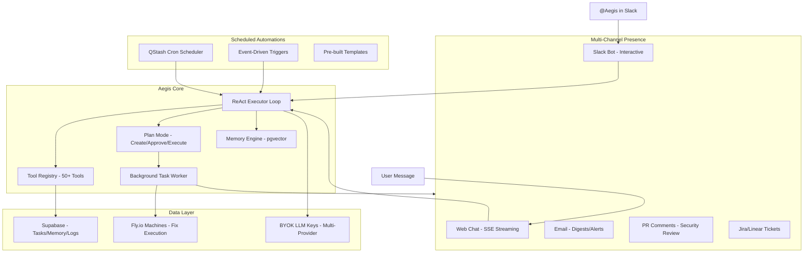

## Phase 7B: Aegis -- The Autonomous Security Engineer Platform

**Goal:** Transform Aegis from a conversational chatbot into a fully autonomous security engineer. Aegis runs a multi-turn agentic loop with 50+ tools, creates and executes multi-step plans, works on long-running background tasks, remembers organizational context via vector memory, runs scheduled automations, interacts as a Slack bot, reviews PRs for security issues, automates compliance artifact generation, proactively monitors for threats, and provides executive reporting with ROI tracking. The dedicated Aegis screen becomes the security command center for the organization.

**Timeline:** ~3-4 months. The largest single phase in the roadmap -- this is the core product differentiator.

**Prerequisites:** Phase 6 (Security tab, data to query), Phase 6B (reachability data for intelligence), Phase 7 (Aider fix engine for remediation tasks), Phase 8 (PR webhooks for PR review), Phase 9 (event system for automation triggers).

The full Phase 7B subsections (7B-A through 7B-P) are detailed below. This is the largest section in the entire roadmap -- each subsection represents a major capability of the Aegis platform.

**Key Technical Decision -- Vercel AI SDK as the Agent Engine Layer:**

Rather than building a custom multi-provider LLM abstraction from scratch (or trying to embed an external agent runtime like OpenClaw), Aegis uses the **Vercel AI SDK** (`ai` npm package) as its foundational LLM layer. This gives us for free:

- Multi-provider support (OpenAI, Anthropic, Google) with a unified API -- no writing separate `OpenAIProvider`, `AnthropicProvider`, `GoogleProvider` classes
- Multi-turn tool calling via `streamText()` with `maxSteps` -- the ReAct loop handled by the SDK
- SSE streaming with proper event formatting via `.toDataStreamResponse()`
- React `useChat` hook for the frontend with automatic streaming, loading states, error handling
- Token counting and cost estimation per provider
- Tool calling protocol translation (each provider has different function-calling formats -- SDK normalizes them)

Install: `npm install ai @ai-sdk/openai @ai-sdk/anthropic @ai-sdk/google zod`

**OpenClaw-Inspired Patterns (concepts borrowed, not code):**

We studied OpenClaw (the popular open-source AI agent management platform, MIT-licensed) and adopted several of their proven patterns without embedding their runtime (which is architecturally designed as a standalone daemon, not an embeddable engine for multi-tenant SaaS):

- **Memory compaction** (7B-D): When conversation context approaches the token limit, trigger an automatic "compaction turn" where Aegis summarizes important context into long-term pgvector memory before the context window is truncated. Adapted from OpenClaw's pre-compaction agentic flush.
- **Tool permission profiles** (7B-B): OpenClaw's `full/messaging/coding/minimal` tool profile pattern influenced our `safe/moderate/dangerous` permission levels with org-level overrides.
- **Session isolation** (7B-A): OpenClaw's `dmScope: per-channel-peer` pattern maps to our org-scoped thread isolation -- conversations are strictly scoped per organization, and the same user across different orgs sees separate thread histories.

### Architecture




### 7B-A: Core Agentic Architecture

**Rewrite** the current single-shot executor in [executor.ts](ee/backend/lib/aegis/executor.ts) into a multi-turn ReAct (Reason + Act) loop:

```typescript
interface AgentLoopConfig {
  maxIterations: number;       // default 25, prevents infinite loops
  maxTokenBudget: number;      // per-message token cap
  timeoutMs: number;           // 120_000 for inline, unlimited for background tasks
  streamCallback?: (event: AegisStreamEvent) => void;
}

type AegisStreamEvent =
  | { type: 'text_delta'; content: string }
  | { type: 'tool_start'; toolName: string; params: Record<string, any> }
  | { type: 'tool_result'; toolName: string; success: boolean; summary: string }
  | { type: 'plan_created'; plan: AegisPlan }
  | { type: 'approval_required'; requestId: string; action: string; description: string }
  | { type: 'task_started'; taskId: string; title: string }
  | { type: 'error'; message: string }
  | { type: 'done'; totalTokens: number; totalCost: number };
```

**The loop:**

1. Receive user message (or system trigger from automation/event)
2. Load relevant memories via queryMemory (top 5 by cosine similarity)
3. Inject memories + org context into system prompt
4. LOOP (max 25 iterations):
  - Send messages + tools to LLM provider (OpenAI/Anthropic/Google based on BYOK config)
  - If LLM returns tool_calls: check permission for each, execute if approved, log to `aegis_tool_executions`, stream tool events, append results to message history, continue loop
  - If LLM returns text with no tool calls: stream text_delta events, break loop (LLM is done)
5. Log total tokens and cost to `ai_usage_logs`
6. If Aegis learned something worth remembering, call `storeMemory` tool
7. Stream done event

**Operating modes:**

- **Chat mode** (default): Real-time SSE-streamed conversation for queries completing within ~60 seconds
- **Plan mode**: For complex multi-step requests. Aegis creates a plan (steps with tools, estimated cost, risk). User reviews, approves/modifies/rejects. On approval, executes inline or creates background task.
- **Autonomous mode**: For scheduled automations and event-driven triggers. No user in the loop. Respects org safety settings.

**Multi-provider LLM support via Vercel AI SDK:**

Create `ee/backend/lib/aegis/llm-provider.ts` -- a thin wrapper around the AI SDK that resolves the correct provider from BYOK config:

```typescript
import { createOpenAI } from '@ai-sdk/openai';
import { createAnthropic } from '@ai-sdk/anthropic';
import { createGoogleGenerativeAI } from '@ai-sdk/google';
import { LanguageModel, embed } from 'ai';

interface ProviderConfig {
  providerType: 'openai' | 'anthropic' | 'google';
  apiKey: string;
  model: string;
  baseURL?: string; // for Azure OpenAI or custom endpoints
}

export function getLanguageModel(config: ProviderConfig): LanguageModel {
  switch (config.providerType) {
    case 'openai':
      return createOpenAI({ apiKey: config.apiKey, baseURL: config.baseURL })(config.model);
    case 'anthropic':
      return createAnthropic({ apiKey: config.apiKey })(config.model);
    case 'google':
      return createGoogleGenerativeAI({ apiKey: config.apiKey })(config.model);
  }
}

export function getEmbeddingModel(config: ProviderConfig) {
  // Embeddings always use OpenAI text-embedding-3-small (cheapest, best for memory)
  // even if the org's chat model is Anthropic/Google
  return createOpenAI({ apiKey: config.apiKey })('text-embedding-3-small');
}
```

This replaces the need for separate `OpenAIProvider`, `AnthropicProvider`, `GoogleProvider` classes. The AI SDK handles all provider-specific differences internally (tool calling format, streaming protocol, token counting). Provider selected via BYOK config `provider_type`.

**SSE endpoint using AI SDK streaming:**

`POST /api/aegis/stream` (replaces synchronous `/handle` for chat). Uses the AI SDK's built-in data stream protocol:

```typescript
import { streamText } from 'ai';

app.post('/api/aegis/stream', async (req, res) => {
  const { threadId, message, organizationId } = req.body;
  const model = getLanguageModel(await getProviderForOrg(organizationId));
  const memories = await queryMemory(organizationId, message);
  const systemPrompt = buildSystemPrompt(organizationId, memories);
  const history = await getThreadMessages(threadId);

  const result = streamText({
    model,
    system: systemPrompt,
    messages: [...history, { role: 'user', content: message }],
    tools: buildToolSet(organizationId, req.user.id), // AI SDK tool definitions
    maxSteps: 25, // multi-turn ReAct loop -- SDK handles the iteration
    onStepFinish: async ({ toolCalls, toolResults, usage }) => {
      // Log each tool execution to aegis_tool_executions
      // Check budget, apply permission layer, handle approvals
    },
    onFinish: async ({ usage, steps }) => {
      // Log total tokens/cost to ai_usage_logs
      // Trigger memory compaction if context is getting large
      // Save assistant message to aegis_chat_messages
    },
  });

  return result.toDataStreamResponse(); // SSE streaming handled by AI SDK
});
```

The `maxSteps: 25` parameter tells the AI SDK to keep looping (model calls tool -> executes tool -> feeds result back -> model decides next action) up to 25 iterations, which is exactly the ReAct loop from the original plan. The SDK manages the iteration, tool result injection, and streaming -- we focus on the permission layer and logging.

Old `/handle` endpoint kept for backward compatibility, delegates internally to the streaming endpoint.

**Anti-hallucination enforcement** in system prompt: Aegis MUST call query tools before making factual claims. Never guess vulnerability counts, compliance status, or security posture. Always cite tool results in responses.

### 7B-B: Tool Registry (50+ Tools)

Expand from the current 6 actions to 50+ tools organized by category. Tools are defined using the Vercel AI SDK's `tool()` helper with Zod schemas for type-safe parameter validation:

```typescript
import { tool } from 'ai';
import { z } from 'zod';

// Each tool uses AI SDK's tool() with Zod schemas -- no raw JSONSchema needed.
// The AI SDK automatically converts Zod to the provider's native format.
// Our permission/RBAC layer wraps around the AI SDK tool execution.

interface AegisToolMeta {
  category: ToolCategory;
  permissionLevel: 'safe' | 'moderate' | 'dangerous';
  requiredRbacPermissions: string[];
}

type ToolCategory =
  | 'org_management' | 'project_ops' | 'security_ops' | 'policy'
  | 'compliance' | 'intelligence' | 'reporting' | 'external' | 'memory' | 'automation';

interface ToolContext {
  organizationId: string;
  userId: string;
  projectId?: string;
  threadId: string;
  taskId?: string;
  operatingMode: 'readonly' | 'propose' | 'autopilot';
}

// Example tool definition using AI SDK + Zod:
const getProjectVulnerabilities = tool({
  description: 'Get all vulnerabilities for a project, optionally filtered by severity or reachability',
  parameters: z.object({
    projectId: z.string().uuid(),
    severity: z.enum(['critical', 'high', 'medium', 'low']).optional(),
    reachabilityLevel: z.enum(['confirmed', 'data_flow', 'module', 'unreachable']).optional(),
    limit: z.number().max(100).default(50),
  }),
  execute: async (params) => {
    // Supabase query with org-scoped RLS
    // The permission check + logging happens in the wrapper (buildToolSet)
  },
});

// buildToolSet() wraps all tools with permission checks and logging,
// then returns the AI SDK-compatible tools object for streamText():
function buildToolSet(organizationId: string, userId: string) {
  const context: ToolContext = { organizationId, userId, ... };
  return wrapWithPermissions({
    getProjectVulnerabilities,
    listProjects,
    assessBlastRadius,
    // ... all 50+ tools
  }, context);
}
```

**Organization Management** (8 tools): `listTeams`, `createTeam` (moderate), `updateTeam` (moderate), `deleteTeam` (dangerous), `listMembers`, `inviteMember` (moderate), `removeMember` (dangerous), `updateMemberRole` (moderate)

**Project Operations** (8 tools): `listProjects`, `getProjectSummary`, `getProjectDependencies`, `getProjectVulnerabilities`, `getDependencyGraph`, `getReachabilityFlows`, `getProjectSecurityPosture`, `triggerExtraction` (moderate)

**Security Operations** (10 tools): `getVulnerabilityDetail`, `suppressVulnerability` (moderate), `acceptRisk` (moderate), `revertSuppression` (moderate), `triggerFix` (moderate -- invokes Phase 7 Aider engine), `getFixStatus`, `createSecuritySprint` (moderate), `getSprintStatus`, `assessBlastRadius`, `emergencyLockdownPackage` (dangerous -- pins package across all org projects)

**Policy Operations** (7 tools): `listPolicies`, `getPolicy`, `createPolicy` (moderate), `updatePolicy` (moderate), `deletePolicy` (dangerous), `testPolicyDryRun`, `generatePolicyFromDescription` (absorbs Phase 11C)

**Compliance Operations** (5 tools): `getComplianceStatus`, `generateSBOM`, `generateVEX`, `generateLicenseNotice`, `generateAuditPackage` (moderate)

**Intelligence** (6 tools): `getPackageReputation`, `analyzeUpgradePath` (absorbs Phase 11D), `getEPSSTrends`, `checkCISAKEV`, `searchPackages`, `analyzeNewDependency` (absorbs Phase 11A)

**Reporting** (4 tools): `generateSecurityReport`, `generateComplianceReport`, `generateExecutiveSummary` (absorbs Phase 11E), `getROIMetrics`

**External / "The Body"** (6 tools): `sendSlackMessage` (moderate), `sendEmail` (moderate), `createJiraTicket` (moderate), `createLinearTicket` (moderate), `postPRComment` (moderate), `sendWebhook` (moderate)

**Memory** (3 tools): `storeMemory`, `queryMemory`, `listMemories`

**Automation** (3 tools): `createScheduledJob` (moderate), `updateScheduledJob` (moderate), `deleteScheduledJob` (moderate)

**Permission model (3 layers):**

1. **User RBAC**: Aegis inherits the calling user's permissions. Check `requiredRbacPermissions` against user's role.
2. **Tool danger level**: `safe` = always auto-approved. `moderate` = org-configurable (Propose mode: needs approval; Autopilot: auto-approved). `dangerous` = always needs approval unless org has explicitly opted in.
3. **Org overrides**: Stored in `aegis_org_settings.tool_permissions` JSONB with `auto_approve`, `always_require_approval`, and `blocked` lists.

**Approval workflow:** When a tool needs approval: create `aegis_approval_requests` record -> notify via inbox + Slack (with interactive Approve/Reject buttons if Slack bot is configured) -> pause execution -> resume on approval, suggest alternatives on rejection.

**Database:**

```sql
CREATE TABLE aegis_tool_executions (
  id UUID PRIMARY KEY DEFAULT uuid_generate_v4(),
  organization_id UUID NOT NULL REFERENCES organizations(id) ON DELETE CASCADE,
  user_id UUID NOT NULL REFERENCES auth.users(id),
  thread_id UUID REFERENCES aegis_chat_threads(id),
  task_id UUID,
  tool_name TEXT NOT NULL,
  tool_category TEXT NOT NULL,
  parameters JSONB NOT NULL,
  result JSONB,
  success BOOLEAN,
  permission_level TEXT NOT NULL,
  approval_status TEXT, -- null (auto), 'approved', 'rejected'
  duration_ms INTEGER,
  tokens_used INTEGER,
  estimated_cost NUMERIC(8, 4),
  created_at TIMESTAMPTZ DEFAULT NOW()
);

CREATE TABLE aegis_approval_requests (
  id UUID PRIMARY KEY DEFAULT uuid_generate_v4(),
  organization_id UUID NOT NULL REFERENCES organizations(id) ON DELETE CASCADE,
  requested_by UUID NOT NULL REFERENCES auth.users(id),
  thread_id UUID REFERENCES aegis_chat_threads(id),
  task_id UUID,
  task_step_id UUID,
  tool_name TEXT NOT NULL,
  parameters JSONB NOT NULL,
  justification TEXT,
  status TEXT NOT NULL DEFAULT 'pending', -- 'pending', 'approved', 'rejected', 'expired'
  reviewed_by UUID REFERENCES auth.users(id),
  reviewed_at TIMESTAMPTZ,
  expires_at TIMESTAMPTZ DEFAULT (NOW() + INTERVAL '24 hours'),
  created_at TIMESTAMPTZ DEFAULT NOW()
);
```

### 7B-C: Task System (Long-Running Background Work)

For operations that take minutes to hours (security sprints, cross-org analysis, zero-day response).

**Two execution paths:**

- **Inline** (< 60s): Runs within the SSE connection. No task record needed.
- **Background** (minutes-hours): Task record created, steps persisted, worker processes sequentially. Survives server restarts.

**Plan-then-execute flow:**

1. User sends a complex request ("Fix all critical reachable vulnerabilities in the payments project")
2. Aegis enters Plan mode within SSE: calls tools to gather data, generates a plan
3. Streams `plan_created` event -- frontend renders a plan card with steps, costs, Approve/Modify/Cancel buttons
4. User approves -> Aegis creates background task with steps
5. Task worker processes steps sequentially, updating status after each
6. Frontend subscribes to `aegis_tasks` + `aegis_task_steps` via Supabase Realtime
7. On completion: summary generated, delivered to thread + configured channels

**Database:**

```sql
CREATE TABLE aegis_tasks (
  id UUID PRIMARY KEY DEFAULT uuid_generate_v4(),
  organization_id UUID NOT NULL REFERENCES organizations(id) ON DELETE CASCADE,
  user_id UUID NOT NULL REFERENCES auth.users(id),
  thread_id UUID REFERENCES aegis_chat_threads(id),
  title TEXT NOT NULL,
  description TEXT,
  mode TEXT NOT NULL DEFAULT 'plan', -- 'plan', 'execute', 'autonomous'
  status TEXT NOT NULL DEFAULT 'planning',
    -- 'planning', 'awaiting_approval', 'running', 'paused', 'completed', 'failed', 'cancelled'
  plan_json JSONB,
  total_steps INTEGER DEFAULT 0,
  completed_steps INTEGER DEFAULT 0,
  failed_steps INTEGER DEFAULT 0,
  total_cost NUMERIC(8, 4) DEFAULT 0,
  summary TEXT,
  started_at TIMESTAMPTZ,
  completed_at TIMESTAMPTZ,
  created_at TIMESTAMPTZ DEFAULT NOW()
);

CREATE TABLE aegis_task_steps (
  id UUID PRIMARY KEY DEFAULT uuid_generate_v4(),
  task_id UUID NOT NULL REFERENCES aegis_tasks(id) ON DELETE CASCADE,
  step_number INTEGER NOT NULL,
  title TEXT NOT NULL,
  tool_name TEXT NOT NULL,
  tool_params JSONB NOT NULL,
  status TEXT NOT NULL DEFAULT 'pending',
    -- 'pending', 'running', 'awaiting_approval', 'completed', 'failed', 'skipped'
  result_json JSONB,
  error_message TEXT,
  cost NUMERIC(8, 4) DEFAULT 0,
  started_at TIMESTAMPTZ,
  completed_at TIMESTAMPTZ,
  created_at TIMESTAMPTZ DEFAULT NOW()
);
```

**Task worker** (`ee/backend/lib/aegis/task-worker.ts`): Polls `aegis_tasks` with `status = 'running'` every 5 seconds. Processes next pending step, checks budget before each step, applies circuit breaker (>50% failures, min 3 -> pause). Resilient to restarts (picks up from last completed step).

**Platform awareness:** Any UI component queries `aegis_task_steps` to check if Aegis is working on a related entity. Vulnerability sidebar shows "Being fixed by Aegis (Step 3/7)" when a fix task targets that CVE.

### 7B-D: Memory System (pgvector in Supabase)

Enable the `vector` extension in Supabase. Aegis maintains a persistent knowledge base with vector embeddings for semantic retrieval.

```sql
CREATE EXTENSION IF NOT EXISTS vector;

CREATE TABLE aegis_memory (
  id UUID PRIMARY KEY DEFAULT uuid_generate_v4(),
  organization_id UUID NOT NULL REFERENCES organizations(id) ON DELETE CASCADE,
  category TEXT NOT NULL, -- 'decision', 'preference', 'knowledge', 'outcome', 'note'
  key TEXT NOT NULL,
  content TEXT NOT NULL,
  embedding vector(1536),
  source_thread_id UUID REFERENCES aegis_chat_threads(id),
  created_by UUID REFERENCES auth.users(id),
  metadata JSONB DEFAULT '{}',
  expires_at TIMESTAMPTZ,
  created_at TIMESTAMPTZ DEFAULT NOW()
);

CREATE INDEX ON aegis_memory USING ivfflat (embedding vector_cosine_ops) WITH (lists = 100);
```

**Categories:** `decision` (past decisions + rationale), `preference` (org preferences), `knowledge` (domain facts), `outcome` (results of past actions), `note` (user-created notes for Aegis)

**Creation:** Automatic (Aegis stores decisions/outcomes via `storeMemory` tool as instructed by system prompt) + Manual (user says "Remember that...")

**Retrieval:** Before every non-trivial response, executor generates embedding from current context, queries top 5 memories by cosine similarity, injects into system prompt as "Relevant organizational context."

**Context compaction (inspired by OpenClaw's pre-compaction agentic flush):**

When a conversation thread grows long enough that the message history approaches 70% of the model's context window, Aegis performs an automatic compaction cycle before the next user message is processed:

1. **Detection**: Track cumulative token count per thread (estimated via `ai` SDK's token counting). When `totalTokens > 0.7 * modelContextLimit`, trigger compaction.
2. **Agentic memory flush**: Before truncating history, run a single internal LLM call with the prompt: "You are about to lose access to the earlier parts of this conversation. Review the full conversation and extract any important decisions, preferences, facts, or outcomes that should be preserved as long-term memory. Call `storeMemory` for each piece of durable knowledge." This gives Aegis one last chance to save important context before it's lost.
3. **Compaction**: After the flush, keep only the system prompt + the last N messages (configurable, default 10) + a summary message: "Previous conversation context has been compacted. Key information has been saved to long-term memory and will be retrieved as needed."
4. **Seamless experience**: The user never sees the compaction -- it happens server-side between messages. The next response draws from both the recent messages and the freshly-saved memories.

This pattern ensures Aegis never loses important organizational context even in very long conversations, while keeping token usage within budget. OpenClaw uses a similar approach with their automatic memory flush before session compaction, adapted here for our pgvector-backed memory system instead of their file-based approach.

**Cost:** OpenAI `text-embedding-3-small` = $0.02/1M tokens. ~$0.000002 per memory stored. The compaction LLM call adds ~$0.01-0.05 per compaction event (rare -- only on very long conversations). Negligible overall.

### 7B-E: Scheduled Automations Engine

Replace the current skeleton with a production-grade job scheduler powered by QStash.

**Flow:** User creates automation -> LLM parses natural language schedule to cron -> register QStash schedule -> QStash fires at scheduled time -> hits `POST /api/internal/aegis/run-automation/:id` -> loads config, creates autonomous Aegis execution -> runs tools -> delivers output via configured channels.

**Pre-built templates:**

1. **Daily Security Briefing** (weekdays 7am): New CVEs, EPSS changes, anomalies, stale vulns
2. **Weekly Security Digest** (Monday 9am): Full posture report with week-over-week trends
3. **Monthly Compliance Report** (1st of month): License compliance, policy adherence, SBOM freshness
4. **Critical CVE Alert** (event-driven): When critical CVE affects org stack -> immediate blast radius + Slack alert
5. **Pre-Release Security Gate** (event-driven): Before deployment tag -> full compliance check
6. **Dependency Health Audit** (weekly Friday): Reputation changes, maintenance drops, deprecation warnings
7. **Stale Vulnerability Report** (weekly Wednesday): Vulns unfixed > X days, grouped by severity
8. **New Dependency Review** (event-driven): New dep detected -> risk assessment + alternatives

**Event-driven triggers:** `aegis_event_triggers` table hooks into Phase 9 notification events. When event matches trigger criteria, run the associated automation.

```sql
CREATE TABLE aegis_event_triggers (
  id UUID PRIMARY KEY DEFAULT uuid_generate_v4(),
  organization_id UUID NOT NULL REFERENCES organizations(id) ON DELETE CASCADE,
  automation_id UUID NOT NULL REFERENCES aegis_automations(id) ON DELETE CASCADE,
  event_type TEXT NOT NULL,
  filter_criteria JSONB,
  enabled BOOLEAN DEFAULT TRUE,
  created_at TIMESTAMPTZ DEFAULT NOW()
);
```

**Expanded `aegis_automations`:** Add columns for `cron_expression`, `timezone`, `automation_type`, `delivery_config` (JSONB), `template_config` (JSONB), `qstash_schedule_id`, `last_run_at`, `last_run_status`, `last_run_output`, `run_count`.

**Delivery channels:** in-app inbox, email (via Resend), Slack (channel or DM), Discord, Jira, Linear, webhook, PDF export to Supabase storage.

**Failure handling:** 3 consecutive failures auto-disables automation and notifies admin.

### 7B-F: Multi-Channel Presence ("The Body")

**In-app:** Dedicated Aegis screen (7B-L) + sidebar panel (Phase 6G) + inline status indicators throughout the platform.

**Slack Bot (full interactive):**

```sql
CREATE TABLE aegis_slack_config (
  id UUID PRIMARY KEY DEFAULT uuid_generate_v4(),
  organization_id UUID NOT NULL REFERENCES organizations(id) ON DELETE CASCADE,
  slack_bot_token TEXT NOT NULL, -- encrypted
  slack_signing_secret TEXT NOT NULL, -- encrypted
  default_channel_id TEXT,
  enabled BOOLEAN DEFAULT TRUE,
  created_at TIMESTAMPTZ DEFAULT NOW()
);
```

Capabilities: @Aegis mentions in any channel -> Slack Events API -> Aegis processes with org context -> responds in thread. Slash commands: `/aegis status`, `/aegis fix CVE-...`, `/aegis report`. Proactive messages: automation delivery, urgent alerts. Interactive approvals: Approve/Reject buttons on approval requests.

Backend: `ee/backend/lib/aegis/slack-bot.ts` handles Events API + Interactions API. New routes: `POST /api/integrations/slack/events`, `POST /api/integrations/slack/interactions`. Both verify Slack signing secrets.

**Cost:** Slack API is free. No additional cost.

**Email:** Via Resend ($20/month for 50K emails, free tier available). HTML templates for security briefings, digests, reports, critical alerts. Backend: `ee/backend/lib/aegis/email.ts`.

**PR Comments:** Use existing git provider APIs. Posted by PR Security Review (7B-G).

**Jira/Linear:** Use existing integration infrastructure. Aegis tools create tickets with vulnerability details, affected projects, remediation links.

**Channel selection defaults:** Critical -> Slack DM + email + in-app. High -> Slack channel + in-app. Medium -> in-app inbox. Low -> daily digest batch.

### 7B-G: PR Security Review

Triggered by PR webhook (Phase 8). After Phase 8's policy evaluation, if org has Aegis enabled with PR review turned on:

1. Create Aegis execution in autonomous mode with PR context (diff, changed files, new/updated/removed deps, policy results)
2. Aegis uses tools: `analyzeNewDependency` (risk + alternatives for each new package), `getVulnerabilityDetail` (CVE impact), `getPackageReputation` (trust scores), `getComplianceStatus` (policy impact)
3. Generates structured review comment posted on PR:
  - Security Summary (pass/warn/fail)
  - New Dependencies (risk assessment table with alternatives)
  - Vulnerability Impact (CVEs resolved/introduced by version changes)
  - License Changes
  - Policy Compliance
4. Sets check run status: `required` (blocks merge on critical findings), `advisory` (warns only, default), or `disabled`

**Absorbs Phase 11A** (AI Dependency Review): new dep analysis is part of the PR review pipeline and a standalone tool.

### 7B-H: Compliance Autopilot

**Automated VEX generation** (from original [05_Aegis.md](documents/planningdocuments/05_Aegis.md)): Tool `generateVEX(projectId, osvIds?)`. For unreachable vulns: VEX status `not_affected`, justification `code_not_reachable` with auto-generated impact statement from atom data. For reachable: status `affected` with data flow path. For unknown reachability: status `under_investigation`. Output: OpenVEX JSON or CSAF 2.0, stored in Supabase storage.

**License compliance orchestration:** When a new policy causes violations, Aegis analyzes impact ("47 packages across 12 projects non-compliant"), auto-generates exception requests for low-risk items, creates remediation sprint for the rest.

**Audit readiness scoring:** Tool `getAuditReadiness(framework?)`. Checks controls for SOC 2 Type II, ISO 27001, NIST CSF. Returns checklist with pass/fail per control and remediation suggestions.

**Audit package export:** Tool `generateAuditPackage(projectIds?, framework?)`. Bundles SBOMs + VEX + license notices + compliance reports + vulnerability summaries + remediation history into a ZIP in Supabase storage.

**Absorbs Phase 11C** (Policy Assistant): `generatePolicyFromDescription`, `testPolicyDryRun` tools.

### 7B-I: Proactive Intelligence

**Package reputation scoring:** Composite score (0-100) per package. Signals: maintainer activity (20%), bus factor (10%), historical CVE frequency (15%), Watchtower anomalies (15%), download trend stability (10%), typosquatting similarity (10%), license stability (5%), package age (5%), open security issues (10%). Stored in `package_reputation_scores`, updated on extraction.

**Cross-project blast radius:** Tool `assessBlastRadius(packageName)`. Queries dependency graph across ALL org projects -- which projects use it, how (direct/transitive), which functions called (usage slices), which data flows reach it (reachable flows), which are Crown Jewels.

**Predictive risk:** Tool `getEPSSTrends(osvId)`. EPSS trajectory analysis. If score crosses configurable threshold (default 0.4) with rising trend, flag for immediate attention.

**Zero-day rapid response:** When critical CVE published (Phase 6H or Critical CVE Alert automation): Aegis creates autonomous task -> `assessBlastRadius` -> check reachability per project -> generate priority-ranked triage report -> optionally start fixing critical projects (in Autopilot mode) -> notify via configured channels. Entire workflow within minutes of disclosure.

**Smart upgrade paths** (absorbs Phase 11D): Tool `analyzeUpgradePath`. LLM reads changelogs, identifies breaking changes, estimates effort, suggests optimal upgrade path.

**Anomaly detection** (absorbs Phase 11F): Runs during extraction post-processing and scheduled health audits. Detects: sudden dep spikes, low-reputation new deps, typosquatting, license changes, maintainer transfers.

### 7B-J: Executive Reporting and ROI

**Security metrics:** Tool `getSecurityMetrics(timeRange?)`. Returns vuln counts by severity, reachable count, fixed/new this period, mean time to remediation, code issues, secrets, compliance rate, security debt score with trend.

**ROI tracking:** Heuristics: auto-fix = 2h saved, code patch = 4h, sprint = 1h/fix + 2h planning, triage = 30min, report = 4h, VEX = 2h, audit package = 8h, PR review = 30min/PR. Tool `getROIMetrics(timeRange?)`. Returns: hours saved, cost savings (hours x $75/hr), fixes completed, reports generated, PRs reviewed, net savings.

**Executive summary** (absorbs Phase 11E): Tool `generateExecutiveSummary(timeRange?, format?)`. Non-technical C-suite report: overall status + trend, key metrics, Aegis impact with dollar savings, top remaining risks.

### 7B-K: Aegis Management Console (Organization Settings)

New sidebar group **"AI & Automation"** in [OrganizationSettingsPage.tsx](frontend/src/app/pages/OrganizationSettingsPage.tsx), positioned between the existing "Security" and "Plan" groups. The group contains two items:

- **Aegis AI** (`aegis_management` section) -- requires `manage_aegis` permission. The main management console.
- **AI Configuration** (`ai_configuration` section) -- requires `manage_aegis` permission. BYOK API key management, provider selection, model defaults.

**Org Settings sidebar (updated full structure):**

```
General
  General
  Members (view_members)
  Roles (edit_roles)
  Integrations (manage_integrations)
  Notifications (manage_integrations or manage_notifications)
Security
  Policies (manage_compliance)
  Security SLAs (manage_compliance, Team+ tier)
  Audit Logs (view_activity)
  Single Sign-On (manage_security, Team+ tier)
  Multi-Factor Authentication (manage_security)
  Legal Documents (manage_security)
AI & Automation                         <-- NEW GROUP
  Aegis AI (manage_aegis)               <-- 7B-K management console
  AI Configuration (manage_aegis)       <-- BYOK keys, providers, models
Plan
  Usage (manage_billing)
  Plan & Billing (manage_billing)
```

**Code changes to `OrganizationSettingsPage.tsx`:**

Add the new group to `orgSettingsSections`:

```typescript
{
  title: 'AI & Automation',
  items: [
    { id: 'aegis_management', label: 'Aegis AI', icon: Sparkles, permission: 'manage_aegis' },
    { id: 'ai_configuration', label: 'AI Configuration', icon: Settings2, permission: 'manage_aegis' },
  ],
},
```

Add `'aegis_management'` and `'ai_configuration'` to `VALID_SETTINGS_SECTIONS`.

**Note:** "Security SLAs" also gets added to the Security group (Phase 15), gated by `manage_compliance` + Team+ tier.

**Aegis Management Console tabs (9 total, up from 7):**

1. **Configuration**: Operating mode (Read-Only / Propose / Autopilot), per-category tool permission toggles, default notification channel, PR review mode.
2. **Spending**: Monthly/daily/per-task budget caps, alert thresholds (50%/80%/100%), spending breakdown chart by category, historical spending line chart.
3. **Active Work**: Running tasks with progress bars + Pause/Cancel buttons, queued tasks, pending approval requests with Approve/Reject buttons.
4. **Automations**: List with enable/disable toggles, last run status, next run time. Create/edit/delete. Run history.
5. **Memory**: Searchable memory list by category. "Teach Aegis" button for manual knowledge. Edit/delete per memory. "Clear all" with confirmation.
6. **Learning**: Strategy performance matrix, learning curve chart, failure analysis, follow-up chains, quality insights (Phase 16 -- see Stitch prompt in `phase_16_aegis_learning.plan.md`).
7. **Incidents**: Incident history table, playbook management, create/edit playbooks (Phase 17 -- see Stitch prompt in `phase_17_incident_response.plan.md`).
8. **Usage Analytics**: Messages/day chart, most used tools, fix success rate, average response time, token usage breakdown.
9. **Audit Log**: Full `aegis_tool_executions` log. Filterable by date/user/category/permission level. Expandable rows. CSV export.

**Stitch AI Prompt for Aegis Management Console:**

> Design an Aegis AI management console section within an Organization Settings page for Deptex (dark theme: bg #09090b, cards #18181b, borders #27272a 1px, text #fafafa, secondary #a1a1aa, accent green #22c55e). This is a sub-page within org settings, displayed in the main content area to the right of the settings sidebar. Font: Inter body, JetBrains Mono for numbers/IDs/code. 8px border-radius. No gradients, no shadows. Ultra-minimal Linear/Vercel style.
>
> **Settings sidebar context**: The settings page has a left sidebar with section groups. The groups are: "General" (General, Members, Roles, Integrations, Notifications), "Security" (Policies, Security SLAs, Audit Logs, Single Sign-On, MFA, Legal Documents), **"AI & Automation"** (highlighted group, **Aegis AI** is the active item with sparkle icon in green-500, AI Configuration below it), "Plan" (Usage, Plan & Billing). Section group headers are 11px uppercase zinc-500 tracking-wider. Nav items are 13px semibold, active item has bg-zinc-800/60 rounded-md with white text, inactive items are zinc-400. The main content area is ~900px wide.
>
> **Page header**: Left: "Aegis AI" title in 22px semibold + sparkle icon (green-500). Below: "Configure Aegis's behavior, permissions, and spending limits." in 14px zinc-400. Right: "Operating Mode" dropdown selector -- a prominent segmented control with three options: "Read-Only" (gray), "Propose" (amber, selected, has a subtle amber-500/10 bg), "Autopilot" (green). Each segment ~100px wide, 36px tall, rounded-lg, border zinc-700. Active segment has colored border and colored text. Tooltip on hover explaining each mode.
>
> **Tab bar** (below header, full width, border-b zinc-800): Nine tabs in a horizontal row: "Configuration" (active, green-500 underline), "Spending", "Active Work", "Automations", "Memory", "Learning", "Incidents", "Usage", "Audit Log". Tabs styled as 13px semibold uppercase zinc-400, active tab white with 2px green-500 bottom border. Right-aligned next to tabs: small status pill "Online" with green dot (or "No BYOK Key" with amber dot if not configured).
>
> **Configuration tab content** (shown when Configuration tab active):
>
> Section 1 -- "Tool Permissions" card (zinc-900 bg, zinc-800 border, rounded-lg, p-5):
>
> - Header: "Tool Permissions" 15px semibold left, "Reset to defaults" text link right (zinc-500, 12px)
> - Table-style layout. Columns: "Category" (left, 13px semibold zinc-300), "Tools" (count badge, zinc-500 12px), "Permission Level" (right, dropdown). 10 rows, one per category: Org Management (8), Project Ops (8), Security Ops (10), Policy (7), Compliance (5), Intelligence (6), Reporting (4), External (6), Memory (3), Automation (3).
> - Each row has a dropdown selector with three options: "Auto-Approve" (green text), "Require Approval" (amber text), "Blocked" (red text). Default varies by category.
> - Rows separated by zinc-800/50 borders. Row hover: bg-table-hover.
> - Expandable: clicking a category row reveals individual tools within that category, each with their own dropdown override.
>
> Section 2 -- "Model & Notifications" card:
>
> - Two side-by-side cards (50% width each, 8px gap).
> - Left card: "Default LLM Model" label 12px zinc-500 uppercase. Below: dropdown showing current model "claude-sonnet-4-20250514" in JetBrains Mono 14px. Provider icon left of the dropdown (Anthropic logo small). "Change" link below.
> - Right card: "Notification Channel" label. Dropdown: "Slack #security" (Slack icon), "In-App Inbox", "Email". "Test" button right of dropdown (ghost, zinc-400, small).
>
> Section 3 -- "PR Review Mode" card:
>
> - Segmented control like operating mode: "Required" (blocks merge), "Advisory" (warns only, selected), "Disabled". Each with a one-line description below in zinc-500 12px.
>
> **Spending tab content** (shown when Spending tab active):
>
> Top row: three metric cards side-by-side (equal width, zinc-900 bg, zinc-800 border, p-4):
>
> - Card 1: "Monthly Budget" label 11px zinc-500 uppercase. "$42.18 / $100.00" in 24px semibold, green-500 if under 80%, amber-500 if 80-99%, red-500 if exceeded. Thin progress bar below (same color, rounded-full, 4px height). "42% used" below bar in 12px zinc-400.
> - Card 2: "Daily Budget" same layout. "$3.21 / $10.00".
> - Card 3: "Per-Task Limit" same layout. "$25.00 max" in 20px. No progress bar. "Highest today: $4.82" in 12px zinc-400.
>
> Below: "Spending by Category" card -- horizontal bar chart. Each bar = a tool category. Bar color: green-500. Label left (category name, 13px zinc-300), value right ("$12.40", JetBrains Mono 12px zinc-400). Bars sorted by spend descending. Max 10 bars.
>
> Below: "30-Day Spending History" card -- line chart (zinc-900 bg). X-axis: dates (12px zinc-500). Y-axis: dollars. Line color: green-500. Fill: green-500/10 area chart. Alert threshold lines: dashed amber at 80%, dashed red at 100%.
>
> Budget inputs: three inline editable fields at the bottom. "Monthly cap", "Daily cap", "Per-task limit". Each: JetBrains Mono 14px, zinc-800 bg input, "$" prefix, "Save" button (green-500, small, appears on change).
>
> **Active Work tab content:**
>
> Two sections stacked vertically:
>
> Section 1 -- "Running Tasks" (with count badge):
>
> - Each task is a card (zinc-900 bg, zinc-800 border, rounded-lg, p-4, 8px gap between cards).
> - Card layout: Left: task title "Fix all critical vulns in payments-api" 14px semibold. Below: "Step 3 of 7 -- Upgrading lodash to 4.17.21" in 13px zinc-400. Below: thin progress bar (green-500, 3px, rounded-full, width proportional to completed/total steps).
> - Right side: "Started 12m ago" in 12px zinc-500. Below: two small ghost buttons: "Pause" (zinc-400, pause icon) and "Cancel" (red-400, x icon). Both rounded-md, 28px height.
> - Bottom of card: expandable "View steps" link (zinc-400, chevron-down). Expands to show numbered step list with status icons: green check (completed), green spinner (running), gray circle (pending), red x (failed).
>
> Section 2 -- "Pending Approvals" (with count badge, amber if any):
>
> - Each approval is a card with amber-500/10 bg, amber-500/20 border.
> - Left: tool name "emergencyLockdownPackage" in JetBrains Mono 13px semibold. Below: parameters summary "Package: event-stream, Scope: all org projects" in zinc-400 13px. Below: "Requested by Sarah K. 5 min ago" in zinc-500 12px.
> - Right: two buttons: "Approve" (green-500 bg, white text, 13px, rounded-md, 32px height) and "Reject" (zinc-700 bg, zinc-200 text).
>
> **Automations tab content:**
>
> Header row: "Automations" left, "Create Automation" button right (green-500 bg, white text, plus icon, rounded-lg, 36px height).
>
> List of automation cards:
>
> - Each card (zinc-900 bg, zinc-800 border, rounded-lg, p-4):
>   - Left: automation name "Daily Security Briefing" 14px semibold. Below: schedule in zinc-400 13px "Weekdays at 7:00 AM EST" with calendar icon. Below: "Delivers to: #security (Slack)" with Slack icon, 12px zinc-500.
>   - Center: last run status dot (green = success, red = failed, gray = never run) + "Last run: 2h ago" or "Never run" in 12px zinc-500.
>   - Right: toggle switch (green-500 when enabled, zinc-600 when disabled, 36x20px). Below: "..." overflow menu (Edit, Run Now, View History, Delete).
> - Cards sorted: enabled first, then disabled. 6px gap between cards.
>
> **Memory tab content:**
>
> Header row: search input (zinc-800 bg, zinc-700 border, rounded-lg, search icon, "Search memories..." placeholder, ~400px wide). Right: "Teach Aegis" button (green-500 outline border, green-500 text, sparkle icon, rounded-lg). Far right: category filter dropdown (zinc-800 bg, "All Categories" default, options: Decision, Preference, Knowledge, Outcome, Note).
>
> Memory list: table-style layout.
>
> - Columns: "Memory" (content preview, max 2 lines, 14px zinc-200), "Category" (pill badge -- green for knowledge, blue for decision, purple for preference, amber for outcome, zinc for note), "Source" (thread link or "Manual", 12px zinc-500), "Created" (relative time, 12px zinc-500), "Actions" (edit pencil + delete trash icons, ghost, zinc-500).
> - Rows: zinc-800/50 border between. Hover: bg-table-hover.
> - Expandable: clicking a row reveals the full memory content with edit capability.
> - Bottom: "Clear All Memories" destructive link (red-400 text, 12px, requires confirmation dialog).
>
> **Usage tab content:**
>
> Top row: four metric cards (zinc-900 bg, zinc-800 border):
>
> - "Messages Today": count in 24px semibold, "avg 34/day" in 12px zinc-400
> - "Avg Response Time": "2.4s" in 24px, "down from 3.1s" in 12px green-500
> - "Fix Success Rate": "78%" in 24px green-500, "14/18 this month" in 12px zinc-400
> - "Tokens This Month": "1.2M" in 24px, "$42.18 estimated" in 12px zinc-400
>
> Below: "Messages per Day" line chart (30 days, green-500 line, zinc-900 bg).
> Below: "Most Used Tools" horizontal bar chart (top 10 tools by invocation count).
>
> **Audit Log tab content:**
>
> Filter row: date range picker (zinc-800 bg, two date inputs), user dropdown ("All Users"), category dropdown ("All Categories"), permission level dropdown ("All Levels"). Right: "Export CSV" button (zinc-700 bg, download icon).
>
> Table: columns "Timestamp" (JetBrains Mono 12px zinc-400), "User" (name + avatar), "Tool" (JetBrains Mono 13px), "Category" (pill badge), "Permission" (safe=green, moderate=amber, dangerous=red pill), "Duration" (ms, JetBrains Mono 12px), "Cost" ($, JetBrains Mono 12px), "Status" (green check or red x icon).
>
> - Rows: expandable to show full parameters and result JSON (in a code block, JetBrains Mono 12px, zinc-950 bg).
> - Pagination at bottom: "Showing 1-50 of 1,247" with prev/next buttons.

```sql
CREATE TABLE aegis_org_settings (
  id UUID PRIMARY KEY DEFAULT uuid_generate_v4(),
  organization_id UUID NOT NULL UNIQUE REFERENCES organizations(id) ON DELETE CASCADE,
  operating_mode TEXT NOT NULL DEFAULT 'propose', -- 'readonly', 'propose', 'autopilot'
  monthly_budget NUMERIC(10, 2),
  daily_budget NUMERIC(10, 2),
  per_task_budget NUMERIC(10, 2) DEFAULT 25.00,
  alert_thresholds JSONB DEFAULT '[50, 80, 100]',
  tool_permissions JSONB DEFAULT '{}',
  default_delivery_channel TEXT,
  preferred_provider TEXT,
  preferred_model TEXT,
  pr_review_mode TEXT DEFAULT 'advisory', -- 'required', 'advisory', 'disabled'
  created_at TIMESTAMPTZ DEFAULT NOW(),
  updated_at TIMESTAMPTZ DEFAULT NOW()
);
```

### 7B-L: Dedicated Aegis Screen

Full-page screen at `/organizations/:id/aegis`. Replaces current [SecurityAgentPage.tsx](frontend/src/app/pages/SecurityAgentPage.tsx).

#### Navigation Placement & Routing

**Organization Sidebar** ([OrganizationSidebar.tsx](frontend/src/components/OrganizationSidebar.tsx)):

Add Aegis as a new nav item in `allNavItems`, positioned between "Compliance" and "Settings":

```typescript
const allNavItems = [
  { id: 'overview',        label: 'Overview',        path: 'overview',        icon: LayoutDashboard, requiredPermission: null },
  { id: 'vulnerabilities', label: 'Vulnerabilities',  path: 'vulnerabilities', icon: ShieldAlert,     requiredPermission: null },
  { id: 'projects',        label: 'Projects',         path: 'projects',        icon: FolderKanban,    requiredPermission: null },
  { id: 'teams',           label: 'Teams',            path: 'teams',           icon: Users,           requiredPermission: null },
  { id: 'compliance',      label: 'Compliance',       path: 'compliance',      icon: ClipboardCheck,  requiredPermission: null },
  { id: 'aegis',           label: 'Aegis',            path: 'aegis',           icon: Sparkles,        requiredPermission: 'interact_with_aegis' },
  { id: 'settings',        label: 'Settings',         path: 'settings',        icon: Settings,        requiredPermission: 'view_settings' },
];
```

- Uses `Sparkles` icon from lucide-react (consistent with Aegis sparkle branding throughout the app)
- Gated by `interact_with_aegis` permission -- hidden for users without AI access
- When active: sidebar item gets a subtle green-500/10 bg tint and green-500 icon color (instead of the standard white active state) to visually distinguish Aegis as the AI-powered section
- Optional: small animated green dot next to "Aegis" label when Aegis has active tasks or unread messages (pulse animation, 6px, green-500)

**Route definition** ([routes.tsx](frontend/src/app/routes.tsx)):

Add under the `OrganizationLayout` children:

```typescript
{ path: 'aegis', element: <AegisPage /> },
{ path: 'aegis/:threadId', element: <AegisPage /> },  // deep-link to specific thread
```

The current `/organizations/:id/aegis` redirect (in `OrganizationDetailPage.tsx` around line 119) that sends users to overview must be REMOVED once this page is active.

**Layout behavior:**

The Aegis page is unique among org pages -- it uses the full viewport width (minus the collapsed org sidebar) rather than the standard content container. This is because the three-panel layout needs maximum horizontal space. The org sidebar collapses to its minimal 48px (icon-only) state by default when on the Aegis page, and expands on hover as usual. No `OrganizationHeader` breadcrumb bar -- the Aegis page has its own header built into the left panel.

**Where Aegis appears throughout the app (summary of all touchpoints):**

1. **Org sidebar**: "Aegis" nav item (this section)
2. **Security tab**: Collapsible right panel (Phase 6G Aegis Copilot)
3. **Supply Chain tab**: Same collapsible right panel (Phase 6G, dependency context)
4. **Vulnerability Detail Sidebar (6D)**: "Explain with Aegis" button, "Fix with AI" button
5. **Dependency Detail Sidebar (6E)**: "Bump with AI" button, "Remove with AI" button
6. **Project Security Sidebar (6F)**: "Ask Aegis" buttons on Semgrep/TruffleHog findings
7. **Compliance tab**: "Resolve with Aegis" button for non-compliant packages
8. **Org/Team Security pages (6M)**: "Run Security Sprint" button, Aegis panel available
9. **PR tracking (Phase 8)**: "AI Fix" badges on Aegis-generated PRs
10. **Notifications (Phase 9)**: Aegis automation deliveries, fix completion notifications
11. **Org Settings**: Aegis Management Console subsection (7B-K)
12. **Slack**: @Aegis mentions, slash commands, interactive approvals (7B-F)

All contextual touchpoints (items 2-10) share threads with the full Aegis screen via `threadId`. A conversation started in the Security tab Aegis panel can be continued on the full Aegis screen.

**Foundation: Vercel AI SDK `useChat` hook:**

The chat interface is built on the AI SDK's React `useChat` hook, which handles SSE streaming, message history, loading states, error handling, and optimistic UI updates. This replaces the need to build custom SSE parsing, message state management, and streaming display logic:

```typescript
import { useChat } from '@ai-sdk/react';

function AegisChatPanel({ threadId, organizationId }: Props) {
  const { messages, input, handleInputChange, handleSubmit, isLoading, error, data } = useChat({
    api: '/api/aegis/stream',
    body: { threadId, organizationId },
    // AI SDK automatically handles SSE parsing, streaming text display,
    // tool call/result rendering, and conversation history
    onToolCall: async ({ toolCall }) => {
      // Render tool execution cards in the UI (collapsible pills)
    },
  });

  // Custom rendering for Aegis-specific message parts:
  // - Tool execution cards (collapsible pills showing tool name + result)
  // - Plan cards (numbered steps with costs, Approve/Modify/Cancel buttons)
  // - Approval request cards (warning style with Approve/Reject)
  // - Task progress indicators
}
```

The `useChat` hook gives us streaming text display, automatic message accumulation, loading/error states, and abort capability for free. We layer Aegis-specific rendering (tool cards, plan cards, approval UI) on top of the hook's message stream using the AI SDK's `data` channel for custom events.

**Three-panel layout:**

- **Left sidebar** (~280px): "New Chat" button. Active Tasks section (pinned, shows running tasks with mini progress bars). Scheduled Jobs section (automations with status dots). Thread list (scrollable, sorted by recent).
- **Main area**: Chat view powered by `useChat` with rendered markdown, tool execution cards (collapsible pills showing tool name + result), plan cards (numbered steps with costs, Approve/Modify/Cancel buttons), approval request cards (warning style with Approve/Reject). Task detail view (step list with status indicators, live log stream, Pause/Cancel/Resume buttons). Input with "Attach context" dropdown.
- **Right panel** (~320px, conditional): Appears when context is relevant -- vulnerability detail, project summary, or task step detail. Collapsible. Hidden on screens < 1440px.

**Relationship to Phase 6G sidebar panel:** The sidebar still exists for quick contextual queries within project pages (also powered by `useChat` with a compact layout). The dedicated screen is the full command center. Messages from the sidebar can be continued on the full screen (same thread -- `useChat` instances share thread state via the `threadId` parameter).

#### Stitch AI Prompt for Dedicated Aegis Screen

> Design a full-page AI security command center screen for Deptex's "Aegis" autonomous security engineer (dark theme: bg #09090b, cards #18181b, borders #27272a 1px, text #fafafa, secondary #a1a1aa, accent green #22c55e). This occupies the full viewport minus a 48px collapsed sidebar on the left. Font: Inter body, JetBrains Mono for IDs/code/numbers. 8px border-radius. No gradients, no shadows. Ultra-minimal Linear/Vercel/Notion-inspired. Three-panel layout.
>
> **LEFT PANEL** (~280px, fixed, border-r border-border, bg #0f0f11, full height):
>
> Top: "New Chat" button (full width minus padding, green-500 bg, white text, 14px semibold, rounded-lg, 40px height, plus icon left, subtle hover:green-600). 16px padding on sides.
>
> Below (16px gap): "ACTIVE TASKS" section label (11px uppercase zinc-500 tracking-wider, px-4). Below label: task cards. Each task card (mx-3, rounded-lg, bg zinc-900/50, border zinc-800, p-3):
>
> - Title: "Fix critical vulns in payments-api" 13px semibold zinc-200, max 2 lines with ellipsis
> - Below: thin progress bar (green-500, 2px height, rounded-full), width = completed/total
> - Below: "Step 3/7" left in 11px zinc-500, "12m ago" right in 11px zinc-500
> - Click navigates to task detail view in main panel
> - Max 3 visible, "View all X tasks" link below (zinc-400 12px)
>
> Below (16px gap): "AUTOMATIONS" section label (11px uppercase zinc-500). Below: compact automation rows (mx-3). Each row: status dot (green=active/enabled, gray=disabled, red=last run failed) + automation name (13px zinc-300, truncated) + next run time (11px zinc-500, right-aligned). Click opens automation detail. Max 5 visible, "View all" link.
>
> Below (16px gap, flex-1 overflow-y-auto): "THREADS" section label (11px uppercase zinc-500). Below: thread list. Each thread item (px-3 py-2.5, rounded-lg on hover, cursor-pointer):
>
> - First line: thread title or first message preview (13px zinc-200, max 1 line, truncated). Active thread: white text, bg zinc-800/50 with 2px green-500 left border.
> - Second line: relative time "2h ago" in 11px zinc-500 left. If thread has unread: small green-500 dot (6px) right-aligned.
> - Thread items sorted by most recent message. No avatars (single-user context).
> - Infinite scroll with subtle loading spinner at bottom.
>
> Bottom of panel (sticky, border-t zinc-800, px-4 py-3): User row: small avatar circle (24px) + "Your Organization" label (13px zinc-400). Right: settings gear icon (zinc-500, links to 7B-K management console).
>
> **MAIN PANEL** (flex-1, min-width 500px):
>
> **Chat view** (default, when a thread is selected or new chat started):
>
> Header bar (px-6 py-3, border-b zinc-800, flex items-center):
>
> - Left: back arrow (zinc-400, only shown on mobile/narrow screens) + thread title "Security Audit - payments-api" in 15px semibold. If title not set, show "New Conversation" in zinc-400.
> - Center (optional): context pill badge (zinc-800 bg, zinc-700 border, rounded-full, 12px): "Payments API" with project icon. Click opens context switcher dropdown.
> - Right: three action icons (zinc-400, 20px, 8px gap): "Attach context" (paperclip), "View in panel" (sidebar-right icon, toggles right panel), overflow "..." menu (Rename Thread, Export Chat, Delete Thread).
>
> Chat messages area (flex-1, overflow-y-auto, px-6 py-4):
>
> Date separator: centered, "Today" or "February 28, 2026" in 11px zinc-500, with zinc-800 horizontal lines extending to both sides.
>
> User messages: right-aligned block, max-width 75%. Message bubble: zinc-800 bg, rounded-2xl with rounded-tr-md (speech bubble effect), px-4 py-3, 14px zinc-100 text. Below bubble: "You -- 10:42 AM" in 11px zinc-500, right-aligned.
>
> Assistant messages: left-aligned block, max-width 85%. No background bubble -- messages are borderless. Small sparkle icon (green-500, 14px) top-left, inline with first line. Text: 14px zinc-200, `leading-relaxed`. Markdown rendered via react-markdown + remarkGfm:
>
> - **Bold** in white
> - Bullet lists with zinc-600 bullet dots, proper indentation
> - Code blocks: zinc-950 bg, zinc-800 border, rounded-lg, p-3, JetBrains Mono 13px. Language label top-right (11px zinc-500). Copy button top-right on hover.
> - Inline code: zinc-800 bg, px-1.5 py-0.5, rounded, JetBrains Mono 13px
> - Links: green-500, subtle underline on hover
> Below message: "Aegis -- 10:42 AM" in 11px zinc-500.
>
> Tool execution cards (inline in assistant messages, between text blocks):
>
> - Collapsed (default): single row, zinc-900/50 bg, zinc-800 border, rounded-lg, px-3 py-2. Left: tool category icon (small, zinc-500) + tool name "getProjectVulnerabilities" in JetBrains Mono 12px zinc-400. Right: result badge -- green "Success" pill or red "Failed" pill (11px). Chevron-right icon (zinc-600) to expand.
> - Expanded: reveals parameters (key-value list in JetBrains Mono 12px zinc-500) and result summary (14px zinc-300, truncated to ~3 lines with "Show full result" link).
> - Multiple sequential tool calls: stacked vertically with 4px gap, collapsible as a group ("3 tools executed" summary when all collapsed).
>
> Plan cards (special message type):
>
> - Card: zinc-900 bg, zinc-800 border, rounded-xl, p-5. Top: "Proposed Plan" label in 12px uppercase zinc-500 + sparkle icon. Title: plan name in 16px semibold (e.g., "Fix Critical Vulnerabilities in payments-api").
> - Step list: numbered steps with connecting vertical line (zinc-700, 1px). Each step: number circle (20px, zinc-700 bg, zinc-400 text, 11px) + step title (14px zinc-200) + tool name badge (JetBrains Mono 11px, zinc-700 bg, zinc-400 text, rounded-md) + estimated cost right-aligned ("~$0.12" JetBrains Mono 11px zinc-500).
> - Summary row below steps: "Total: 7 steps -- Est. cost: $1.84 -- Est. time: ~8 min" in 13px zinc-400.
> - Action buttons (right-aligned, 8px gap): "Approve" (green-500 bg, white text, 14px, rounded-lg, 38px height, check icon), "Modify" (zinc-700 bg, zinc-200 text, pencil icon), "Cancel" (ghost, zinc-400 text).
>
> Approval request cards:
>
> - Card: amber-500/5 bg, amber-500/20 border, rounded-xl, p-4. Left: warning triangle icon (amber-500, 20px). Content: "Approval Required" label 12px uppercase amber-400. Tool name in JetBrains Mono 14px semibold. Justification in 14px zinc-300. Parameters as key-value.
> - Buttons: "Approve" (green-500) + "Reject" (zinc-700) + "Ask Why" (ghost, zinc-400).
>
> Task progress indicators (when a background task is running):
>
> - Pinned card at top of chat: zinc-900 bg, green-500/10 border-l-2, rounded-lg, p-3. Title left: "Sprint: Fix Critical Vulns" 14px semibold. Right: "Step 3/7" badge (zinc-700 bg, 12px). Below: thin progress bar (green-500). Below: current step description "Upgrading lodash to 4.17.21..." in 13px zinc-400 with spinner icon. "View Details" link right (zinc-400 12px, opens task detail view).
>
> Streaming cursor: when Aegis is generating, a blinking green-500 bar (2px wide, 16px tall, `animate-pulse`) at the end of the last rendered line.
>
> **Input area** (sticky bottom, px-6 py-4, border-t zinc-800, bg #0d0d0f):
>
> Textarea container (zinc-800/50 bg, zinc-700 border, rounded-2xl, focus:border-green-500/50, transition):
>
> - Top row (inside textarea, above the text): "Attach context" chips area. When contexts are attached, show as small dismissible pills (zinc-700 bg, 11px): "CVE-2024-30941 x" or "payments-api x". Click "+" to open context picker dropdown (projects, vulnerabilities, dependencies, policies searchable list).
> - Textarea: auto-growing (min 1 line, max 6 lines), placeholder "Ask Aegis anything about your organization's security..." in zinc-500 14px. No border inside the container.
> - Bottom row (inside textarea container): Left: attachment button (paperclip, zinc-500, 18px). Right: send button (green-500 bg, white arrow-up icon, circular 32px, disabled/zinc-700 when input is empty, enabled/green-500 when text present). Keyboard shortcut: Enter to send, Shift+Enter for newline.
> - Below textarea container: "Aegis uses your BYOK key. Verify critical actions." centered in 11px zinc-600.
>
> **Task detail view** (replaces chat view when a task is selected from left panel):
>
> Header: back arrow (zinc-400) + task title in 16px semibold + status badge (green "Running" / amber "Paused" / gray "Completed" pill). Right: "Pause" and "Cancel" buttons (ghost).
>
> Step list (full width, scrollable):
>
> - Each step is a card (zinc-900 bg, zinc-800 border, rounded-lg, p-4, 6px gap between cards).
> - Left: step number (JetBrains Mono 13px zinc-500) + connecting vertical line (zinc-700).
> - Status icon: green check (completed, filled), green spinner (running, animated), gray circle (pending), red x (failed), amber pause (awaiting approval).
> - Content: step title 14px semibold. Below: tool name badge + parameters summary in 13px zinc-400. If completed: result summary in 13px zinc-300 + duration ("1.2s") + cost ("$0.08") in JetBrains Mono 11px zinc-500. If failed: red error message card.
> - Running step: live log stream below (zinc-950 bg, JetBrains Mono 12px, scrollable, max-height 200px). Logs color-coded: white info, yellow warning, green success, red error.
>
> Summary (shown after task completion): card at bottom with summary text, total cost, total duration, outcomes (PRs created, vulns fixed, reports generated).
>
> **RIGHT PANEL** (~320px, conditional, border-l border-border, bg #0f0f11):
>
> Appears when: a vulnerability, project, or dependency is referenced in the current conversation. Toggled by the sidebar-right icon in the header. Hidden on viewports < 1440px wide.
>
> Header (px-4 py-3, border-b zinc-800): entity type label ("VULNERABILITY" / "PROJECT" / "DEPENDENCY" in 11px uppercase zinc-500). Close X button right.
>
> Content: mini version of the relevant sidebar (6D/6E/6F):
>
> - For vulnerabilities: OSV ID, risk badges, description excerpt, fix status, reachability level
> - For projects: security posture summary, vuln counts, active fixes
> - For dependencies: version info, vuln count, usage summary
>
> Action buttons at bottom: "Open Full Detail" (navigates to the relevant page), "Send to Chat" (injects entity context into the current Aegis conversation).

### 7B-M: Security Debt Tracking and Burndown

**Debt score:** Composite 0-1000, lower is better. Components: unfixed vulns (weighted by Depscore: critical=10, high=5, medium=2, low=1), non-compliant packages (3 pts each), stale deps (1 pt, outdated >6 months), code issues (weighted by Semgrep severity), unresolved secrets (5 pts, is_current=true).

```sql
CREATE TABLE security_debt_snapshots (
  id UUID PRIMARY KEY DEFAULT uuid_generate_v4(),
  organization_id UUID NOT NULL REFERENCES organizations(id) ON DELETE CASCADE,
  project_id UUID REFERENCES projects(id) ON DELETE CASCADE, -- null = org-wide
  score NUMERIC(10, 2) NOT NULL,
  breakdown JSONB NOT NULL,
  snapshot_date DATE NOT NULL DEFAULT CURRENT_DATE,
  created_at TIMESTAMPTZ DEFAULT NOW(),
  UNIQUE(organization_id, project_id, snapshot_date)
);
```

**Burndown visualization:** Line chart (30/60/90 day views) on project Security tab and org dashboard. Sprint/fix events as vertical markers. Trend line projection.

**Velocity estimation:** Tool `getSecurityDebtEstimate(projectId?)`. Based on last 30 days: debt reduction rate, time-to-zero at current velocity, top debt contributors.

**Proactive alerts:** If debt grows faster than resolved for 2+ weeks, Aegis sends alert to configured channel.

### 7B-N: Sprint Orchestration

Carries forward the batch fix orchestrator concept, now integrated as a task type within the Task System (7B-C). A sprint = `aegis_task` with fix steps.

```typescript
interface SecuritySprintRequest {
  projectId?: string; // null = org-wide
  organizationId: string;
  userId: string;
  mode: 'auto' | 'interactive';
  criteria?: {
    maxFixes?: number;
    minDepscore?: number;
    onlyReachable?: boolean;
    strategies?: string[];
    includeTypes?: ('vulnerability' | 'semgrep' | 'secret')[];
    includeSuppressed?: boolean;
    includeAccepted?: boolean;
  };
  fixRequests?: FixRequest[];
}
```

**Flow:** Trigger from Security tab / Aegis chat / org dashboard -> Aegis queries vulns, ranks by Depscore, determines strategy -> user reviews plan card -> approve -> task worker executes fix steps sequentially -> circuit breaker on >50% failures -> sprint summary report on completion (stored in `aegis_tasks.summary`, exportable as PDF).

**Cross-project sprints:** When `projectId` is null, iterate through all org projects, sort by worst Depscore, run per-project fix sequences. Rate-limited: max 3 concurrent sprints per org.

**Integration points:** Security tab "Run Security Sprint" button, Aegis chat natural language trigger, Compliance tab "Resolve all non-compliant packages" button, Org dashboard "Run Org-Wide Sprint", Phase 9 notifications for sprint events.

### 7B-O: Database Schema Summary

New tables: `aegis_tool_executions`, `aegis_tasks`, `aegis_task_steps`, `aegis_memory`, `aegis_approval_requests`, `aegis_event_triggers`, `aegis_org_settings`, `aegis_slack_config`, `security_debt_snapshots`, `package_reputation_scores`

Modified existing: `aegis_automations` (expanded with cron, delivery, templates), `aegis_chat_messages` (add metadata for tool execution refs), `aegis_chat_threads` (add `total_tokens_used`)

### 7B-P: Permissions -- Full AI & Aegis Permission System

This section defines every permission related to AI features across all phases, resolves naming inconsistencies, and specifies the PermissionEditor UI updates.

**Naming Resolution:**

The codebase currently uses `interact_with_security_agent`. The plans use `interact_with_aegis`. **Standardize on `interact_with_aegis`** -- this matches the product name and is more concise. Migration: rename `interact_with_security_agent` to `interact_with_aegis` in:

- `frontend/src/lib/api.ts` (`RolePermissions` interface)
- `frontend/src/components/PermissionEditor.tsx`
- `ee/backend/routes/organizations.ts` (default role definitions, permission checks)
- `backend/database/add_permissions_to_roles.sql`
- `backend/database/add_default_roles_to_existing_orgs.sql`
- All Supabase migration SQL files that reference the old name

**Complete AI-related permissions table:**

| Permission | Type | Default (Owner) | Default (Admin) | Default (Member) | Used By | Phase |
|---|---|---|---|---|---|---|
| `interact_with_aegis` | Org-level | true | true | true | All Aegis chat, copilot panel, "Fix with AI", "Explain with Aegis", "Analyze" buttons across all screens. Gates sidebar nav item. | 6, 7, 7B |
| `manage_aegis` | Org-level | true | true | false | Aegis Management Console (7B-K), AI Configuration section in org settings, operating mode changes, budget configuration, tool permission overrides, memory management, automation management, playbook management | 7B, 16, 17 |
| `manage_compliance` | Org-level | true | true | false | Policy editor, SLA configuration (Phase 15), compliance tab actions, exception approval | 4, 5, 15 |
| `manage_watchtower` | Org-level | true | true | false | Enable/disable Watchtower on projects from org page, org-wide quarantine actions, clearing commits | 10B |
| `trigger_fix` | Org-level | true | true | false | Manually triggering AI fix jobs (separate from viewing Aegis -- a member can chat with Aegis but not trigger fixes that consume budget and create PRs) | 7 |
| `manage_incidents` | Org-level | true | true | false | Declare/resolve/close incidents, approve incident phases, manage playbooks | 17 |
| `view_ai_spending` | Org-level | true | true | false | View AI spending data, usage analytics, audit log in Aegis Management Console (subset of manage_aegis -- allows viewing without changing config) | 7B |

**New permissions to add to `RolePermissions` interface:**

```typescript
export interface RolePermissions {
  // Admin
  view_settings: boolean;
  manage_billing: boolean;
  manage_security?: boolean;
  view_activity: boolean;
  view_members: boolean;
  add_members: boolean;
  edit_roles: boolean;
  edit_permissions: boolean;
  kick_members: boolean;
  manage_integrations: boolean;
  manage_notifications?: boolean;
  view_overview?: boolean;
  view_all_teams_and_projects?: boolean;

  // Security & Policies
  manage_compliance: boolean;
  manage_watchtower: boolean;        // NEW (Phase 10B)

  // AI & Automation
  interact_with_aegis: boolean;      // RENAMED from interact_with_security_agent
  manage_aegis: boolean;
  trigger_fix: boolean;              // NEW (Phase 7)
  manage_incidents: boolean;         // NEW (Phase 17)
  view_ai_spending: boolean;         // NEW (Phase 7B)

  // Teams & Projects
  manage_teams_and_projects: boolean;
}
```

**PermissionEditor updates** ([PermissionEditor.tsx](frontend/src/components/PermissionEditor.tsx)):

Add a new "AI & Automation" permission group between "Security & Policies" and "Teams & Projects":

```typescript
const permissionGroups = [
  {
    title: 'Admin',
    icon: <Settings className="h-3.5 w-3.5" />,
    permissions: [
      { key: 'view_settings' as const, label: 'View Settings' },
      { key: 'manage_billing' as const, label: 'Manage Plan & Billing', dependsOn: 'view_settings' as const },
      { key: 'manage_security' as const, label: 'Manage Security', dependsOn: 'view_settings' as const },
      { key: 'view_members' as const, label: 'View/Add Members', dependsOn: 'view_settings' as const },
      { key: 'kick_members' as const, label: 'Kick Members', dependsOn: 'view_members' as const },
      { key: 'edit_roles' as const, label: 'View/Edit Roles', dependsOn: 'view_members' as const },
      { key: 'view_activity' as const, label: 'View Audit Logs', dependsOn: 'view_settings' as const },
      { key: 'manage_integrations' as const, label: 'Manage Integrations', dependsOn: 'view_settings' as const },
      { key: 'manage_notifications' as const, label: 'Manage Notifications', dependsOn: 'view_settings' as const },
    ],
  },
  {
    title: 'Security & Policies',
    icon: <Shield className="h-3.5 w-3.5" />,
    permissions: [
      { key: 'manage_compliance' as const, label: 'Manage Compliance & Policies' },
      { key: 'manage_watchtower' as const, label: 'Manage Watchtower' },
    ],
  },
  {
    title: 'AI & Automation',
    icon: <Sparkles className="h-3.5 w-3.5" />,
    permissions: [
      { key: 'interact_with_aegis' as const, label: 'Use Aegis AI' },
      { key: 'trigger_fix' as const, label: 'Trigger AI Fixes', dependsOn: 'interact_with_aegis' as const },
      { key: 'manage_aegis' as const, label: 'Manage Aegis Configuration', dependsOn: 'interact_with_aegis' as const },
      { key: 'view_ai_spending' as const, label: 'View AI Spending & Usage', dependsOn: 'interact_with_aegis' as const },
      { key: 'manage_incidents' as const, label: 'Manage Incidents', dependsOn: 'interact_with_aegis' as const },
    ],
  },
  {
    title: 'Teams & Projects',
    icon: <Users className="h-3.5 w-3.5" />,
    permissions: [
      { key: 'manage_teams_and_projects' as const, label: 'Manage Teams & Projects' },
    ],
  },
];
```

**Dependency chain:** `interact_with_aegis` is the parent. When disabled, `trigger_fix`, `manage_aegis`, `view_ai_spending`, and `manage_incidents` are all hidden (using the existing `dependsOn` pattern). This means a single toggle controls all AI access.

**Plan tier gating (Phase 13 integration):**

In addition to RBAC permissions, AI features are gated by plan tier:

- **Free**: `interact_with_aegis` allowed, but limited to 20 Aegis actions/month. `trigger_fix` limited to 3 fixes/month. No automations, no incidents. Management console shows usage limits.
- **Pro**: Full `interact_with_aegis`. Unlimited actions. `trigger_fix` limited to 20 fixes/month. 3 automations. Basic incident response (manual playbooks only).
- **Team**: Everything unlimited. All automations. Full incident response with auto-trigger playbooks. SLA management.
- **Enterprise**: Everything unlimited. Custom SLAs. Priority model routing. Dedicated support.

These limits are enforced server-side by checking `organization.plan_tier` before executing actions, not by hiding UI (the UI shows the limit and upgrade path).

**API key permissions (Phase 18):**

Organization API keys have their own scoped permission set (separate from user RBAC):

- `read` -- query project data, vulnerability data, security posture
- `write` -- trigger extractions, modify project settings
- `fix` -- trigger AI fix jobs (consumes BYOK budget)

API key permissions are a subset of what the creating user's role allows. A member without `trigger_fix` cannot create an API key with `fix` scope.

**Per-tool permission levels (Aegis tool system):**

Each of the 50+ Aegis tools has a `permission_level` that determines behavior based on the org's operating mode and tool permissions:

- `safe`: Read-only operations. Always auto-approved. Examples: `getOrgOverview`, `getProjectVulnerabilities`, `queryMemory`.
- `moderate`: Write operations with limited blast radius. Auto-approved in Autopilot mode, requires approval in Propose mode. Examples: `triggerFix`, `storeMemory`, `enableAutomation`.
- `dangerous`: High-impact operations. Always requires explicit user approval regardless of operating mode. Examples: `emergencyLockdownPackage`, `deleteAllMemories`, `runOrgWideSprint`.

Org admins can override these defaults per-category in the Management Console (7B-K Configuration tab).

### 7B-Q: Phase 7B Test Suite

**Backend Tests (1-66):**

Tests 1-8 (Core Agentic Loop): Multi-turn tool execution, max iteration limit, token budget enforcement, SSE event ordering, multi-provider routing, anti-hallucination verification, error recovery, conversation history inclusion.

Tests 9-16 (Tool System): Registration/discovery for all 50+ tools, RBAC enforcement, danger level enforcement, org override auto_approve, blocked tool rejection, approval request creation, approval flow resume, tool execution logging.

Tests 17-24 (Task System): Plan creation from complex requests, plan approval -> background task, plan rejection acknowledged, sequential step execution, restart resilience, circuit breaker on failures, budget enforcement, platform awareness queries.

Tests 25-30 (Memory): storeMemory creates record with embedding, queryMemory returns relevant results via cosine similarity, memory injection into system prompt, category filtering, expiration exclusion, delete/update operations.

Tests 31-36 (Automations): Natural language -> cron conversion, QStash schedule registration, automation execution + delivery, event trigger matching, template instantiation, auto-disable after 3 failures.

Tests 37-42 (Slack Bot): app_mention -> Aegis response in channel, slash commands, interactive approval buttons, signature verification, org mapping, rate limiting.

Tests 43-48 (PR Review): Webhook triggers Aegis review, new dep risk analysis in comment, CVE impact identification, required mode blocks merge, advisory mode warns only, disabled mode skips review.

Tests 49-54 (Compliance): VEX unreachable -> not_affected, VEX reachable -> affected, audit package ZIP contents, policy dry-run, policy generation from description, audit readiness checklist.

Tests 55-60 (Management Console): Operating mode blocks write tools in readonly, budget enforcement, budget alerts at thresholds, tool permission overrides, active task display, audit log correctness.

Tests 61-66 (Permissions -- 7B-P):
61. User without `interact_with_aegis` cannot access Aegis chat endpoints (returns 403)
62. User without `trigger_fix` can chat with Aegis but `triggerFix` tool returns permission error
63. User without `manage_aegis` cannot access Management Console endpoints (returns 403)
64. `view_ai_spending` grants read-only access to spending/usage data without config access
65. `manage_incidents` required to declare/resolve incidents (403 without)
66. Plan tier limits enforced: Free tier gets 403 after 20 Aegis actions/month with upgrade message

**Frontend Tests (67-116):**

Tests 67-76 (Aegis Screen -- Layout & Navigation):
67. Three-panel layout renders: left panel (280px), main panel (flex), right panel (320px conditional)
68. Org sidebar shows "Aegis" nav item with Sparkles icon, gated by `interact_with_aegis` permission
69. Aegis nav item hidden when user lacks `interact_with_aegis` permission
70. Route `/organizations/:id/aegis` renders AegisPage (not redirect to overview)
71. Route `/organizations/:id/aegis/:threadId` deep-links to specific thread
72. Left panel "New Chat" button creates new thread and navigates to it
73. Left panel thread list shows threads sorted by most recent, active thread highlighted with green-500 left border
74. Left panel Active Tasks section shows running tasks with progress bars (max 3 visible, "View all" link)
75. Left panel Automations section shows enabled automations with status dots and next run time
76. Aegis page uses full viewport width (org sidebar collapses to 48px icon-only by default)

Tests 77-84 (Aegis Screen -- Chat Interface):
77. Chat messages render with correct styling: user bubbles (zinc-800 bg, right-aligned), assistant messages (no bg, sparkle icon, left-aligned)
78. SSE streaming renders text incrementally with blinking green-500 cursor at end
79. Tool execution cards render as collapsible pills (collapsed by default) with tool name and success/fail badge
80. Multiple sequential tool calls stack and are group-collapsible ("3 tools executed")
81. Plan cards render with numbered steps, cost estimates, and Approve/Modify/Cancel buttons
82. Approval request cards render with amber styling, Approve/Reject buttons, and tool parameters
83. Task progress indicator pins to top of chat when background task is running
84. Context pills in textarea show attached entities (CVE, project, dependency) and are dismissible

Tests 85-90 (Aegis Screen -- Right Panel & Context):
85. Right panel appears when vulnerability/project/dependency is referenced in conversation
86. Right panel toggles via sidebar-right icon in header bar
87. Right panel hidden on viewports < 1440px wide
88. Right panel shows mini vulnerability detail for vulnerability context
89. Right panel "Open Full Detail" navigates to the relevant page
90. Right panel "Send to Chat" injects entity context into current conversation input

Tests 91-100 (Management Console -- 7B-K):
91. Management console accessible under Org Settings > "AI & Automation" > "Aegis AI" section
92. Operating mode segmented control renders Read-Only / Propose / Autopilot with correct colors
93. Configuration tab: tool permission dropdowns render for all 10 categories with Auto-Approve/Require Approval/Blocked options
94. Configuration tab: expanding a category reveals individual tool permission overrides
95. Spending tab: three metric cards show monthly/daily/per-task budget usage with correct color thresholds (green <80%, amber 80-99%, red 100%+)
96. Spending tab: budget input fields save correctly and validate numeric input
97. Active Work tab: running tasks show progress bars, Pause/Cancel buttons work
98. Active Work tab: pending approval cards render with Approve/Reject buttons that update status
99. Automations tab: toggle switch enables/disables automations, status dots reflect last run result
100. Automations tab: "Create Automation" button opens creation form with template selection

Tests 101-106 (Management Console -- Memory & Audit):
101. Memory tab: search input filters memories by content
102. Memory tab: category filter dropdown filters by Decision/Preference/Knowledge/Outcome/Note
103. Memory tab: "Teach Aegis" button opens dialog for manual knowledge entry, creates memory on submit
104. Memory tab: edit and delete actions work on individual memories
105. Audit Log tab: table renders with correct columns, rows expandable to show full parameters/result
106. Audit Log tab: filters (date range, user, category, permission level) apply correctly, "Export CSV" generates download

Tests 107-112 (Security Debt):
107. Debt score computation follows formula (vulns weighted by Depscore, code issues by severity, secrets 5pts each)
108. Daily snapshot creation produces correct org-wide and per-project scores
109. Burndown chart renders line chart with 30/60/90 day views on project Security tab
110. Sprint/fix events render as vertical markers on burndown chart
111. Velocity estimation tool returns correct time-to-zero projection based on last 30 days
112. Proactive alert fires when debt grows faster than resolved for 2+ weeks

Tests 113-116 (Cross-Platform Aegis Touchpoints):
113. Security tab Aegis Copilot panel and full Aegis screen share same thread via `threadId`
114. Conversation started in Security tab panel continues seamlessly on full Aegis screen
115. Slack bot responses include org context and follow same tool permission model as web chat
116. Aegis screen input "Attach context" dropdown shows searchable list of projects, vulnerabilities, dependencies, policies