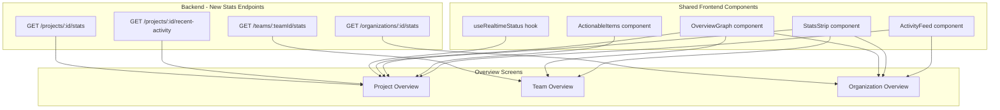

# Phase 10: Overview Screens Overhaul

## Current State

- **ProjectOverviewPage** ([ProjectOverviewPage.tsx](frontend/src/app/pages/ProjectOverviewPage.tsx), 348 lines): All stats and content use hardcoded `DUMMY_`* constants. Only real data is repo info and extraction status polling (3s interval).
- **OrganizationDetailPage** ([OrganizationDetailPage.tsx](frontend/src/app/pages/OrganizationDetailPage.tsx), 358 lines): Has `OrgGetStartedCard`, 4 basic stat cards, recent projects, quick actions, resources. Functional but shallow -- no security posture, no graph, no activity feed.
- **TeamOverviewPage** ([TeamOverviewPage.tsx](frontend/src/app/pages/TeamOverviewPage.tsx), 174 lines): Only a single compliance status card. Barely anything.
- **No Supabase real-time** subscriptions in the frontend ([supabase.ts](frontend/src/lib/supabase.ts) is initialized but only used for auth/storage).
- **No chart library** -- only ReactFlow for graph visualizations.

## Architecture




---

## 10A: Backend Stats Endpoints

New endpoints in [ee/backend/routes/projects.ts](ee/backend/routes/projects.ts) and a new org stats route.

### `GET /api/organizations/:orgId/projects/:projectId/stats`

Returns aggregated project dashboard data in a single call:

```typescript
{
  health_score: number;           // from projects.health_score
  compliance: {
    percent: number;              // compliant deps / total deps * 100
    compliant: number;
    failing: number;
    total: number;
  };
  vulnerabilities: {
    total: number;
    critical: number;
    high: number;
    medium: number;
    low: number;
    reachable_count: number;
  };
  dependencies: {
    total: number;
    direct: number;
    transitive: number;
    outdated: number;             // deps with newer versions available
  };
  sync: {
    status: string;               // from project_repositories.status
    extraction_step: string | null;
    last_synced: string | null;   // project_repositories.updated_at when status=ready
    branch: string;
  };
  action_items: Array<{
    type: 'critical_vuln' | 'high_vuln' | 'non_compliant' | 'policy_violation' | 'outdated_critical';
    title: string;
    description: string;
    count: number;
    link: string;                 // relative path to relevant tab
  }>;
}
```

**Data sources:**

- `projects` table for `health_score`
- `project_dependencies` + compliance utils for compliance stats
- `project_dependency_vulnerabilities` grouped by severity for vuln counts
- `project_dependencies` for dep counts
- `project_repositories` for sync status
- Computed action items from vulns (critical/high with reachability), non-compliant deps, policy violations

### `GET /api/organizations/:orgId/projects/:projectId/recent-activity`

Returns recent project activity (extraction events, dependency changes, vulnerability discoveries):

```typescript
Array<{
  id: string;
  type: 'sync_started' | 'sync_completed' | 'vuln_discovered' | 'vuln_resolved' | 'dep_updated' | 'dep_added' | 'dep_removed' | 'compliance_change';
  title: string;
  description: string;
  metadata: Record<string, any>;
  created_at: string;
}>
```

**Data sources:** Existing `activities` table filtered by `project_id`, plus `project_repositories` status changes and `project_dependency_vulnerabilities` discovery timestamps.

### `GET /api/organizations/:id/stats`

Org-level aggregated stats:

```typescript
{
  projects: {
    total: number;
    healthy: number;    // health_score >= 80
    at_risk: number;    // health_score 50-79
    critical: number;   // health_score < 50
  };
  vulnerabilities: {
    total: number;
    critical: number;
    high: number;
    medium: number;
    low: number;
  };
  compliance: {
    percent: number;
    compliant_projects: number;
    failing_projects: number;
  };
  dependencies_total: number;
  members_count: number;
}
```

**Data sources:** Aggregate from `projects` table joined with `project_dependency_vulnerabilities` and `organization_members`.

### `GET /api/organizations/:orgId/teams/:teamId/stats`

Same shape as org stats but filtered to projects where `team_ids` contains `teamId`.

### `POST /api/organizations/:orgId/projects/:projectId/sync`

Retrigger extraction for a project. Permission: `manage_teams_and_projects` or org owner (same gate as repository connect at [projects.ts line 3818](ee/backend/routes/projects.ts)). Calls existing `queueExtractionJob()` from [redis.ts](ee/backend/lib/redis.ts).

---

## 10B: Shared Frontend Components

### `useRealtimeStatus` hook

New file: `frontend/src/hooks/useRealtimeStatus.ts`

Supabase real-time subscription on `project_repositories` table for a given project. Replaces the 3s polling in [ProjectOverviewPage.tsx lines 114-147](frontend/src/app/pages/ProjectOverviewPage.tsx).

```typescript
function useRealtimeStatus(projectId: string) {
  // Subscribe to postgres_changes on project_repositories
  // where project_id = projectId
  // Returns: { status, extractionStep, lastSynced, isLoading }
  // Auto-cleans up subscription on unmount
}
```

Uses the existing Supabase client from [supabase.ts](frontend/src/lib/supabase.ts). Falls back to polling if real-time connection fails.

### `OverviewGraph` component

New file: `frontend/src/components/OverviewGraph.tsx`

A lightweight ReactFlow mini-graph reusing the existing node/edge patterns from [ProjectVulnerabilitiesPage.tsx](frontend/src/app/pages/ProjectVulnerabilitiesPage.tsx). Three modes:

- **Project mode**: Center = project, ring = direct dependencies, colored by health (green = clean, red = has critical vuln, orange = high, yellow = medium)
- **Team mode**: Center = team, ring = projects, colored by health score
- **Org mode**: Center = org, second ring = teams, outer ring = projects, all colored by health score

No vulnerability nodes, no transitive deps. Fast to load. Clickable nodes navigate to the relevant entity. Rendered inside a card with a "View full graph" link to the Security/Vulnerabilities tab.

Reuses existing custom node types (`ProjectCenterNode` pattern from [ProjectCenterNode.tsx](frontend/src/components/ProjectCenterNode.tsx)) but simplified -- smaller nodes, no detail overlay.

### `StatsStrip` component

New file: `frontend/src/components/StatsStrip.tsx`

Reusable horizontal strip of 4-5 stat cards. Each card: icon, label, value, optional sub-detail (e.g., severity breakdown dots), optional trend indicator. Used by all three overview screens with different data.

### Other shared components

- `**ActionableItems`**: Prioritized list of things needing attention (critical vulns, compliance issues, etc.). Each item has severity indicator, title, description, count, and click-to-navigate.
- `**ActivityFeed`**: Timeline of recent events with icon, description, timestamp. Click expands a slide-out sidebar for details (reuses the sidebar pattern from [OrganizationSettingsPage.tsx](frontend/src/app/pages/OrganizationSettingsPage.tsx) -- `aside` with `sticky top-24`).

---

## 10C: Project Overview Page

**File:** [ProjectOverviewPage.tsx](frontend/src/app/pages/ProjectOverviewPage.tsx) -- full rewrite replacing all dummy data.

### Layout

```
+------------------------------------------------------------------+
| Header: Project Name | Framework | Health Badge | [Sync Button]  |
| Repo: org/repo-name  | Branch: main | Last synced: 2h ago       |
+------------------------------------------------------------------+
| [Creation Banner - shown during extraction with real-time status] |
+------------------------------------------------------------------+
| Stats Strip                                                       |
| [Health 87] [Compliance 94%] [Vulns 12] [Deps 148]              |
+------------------------------------------------------------------+
| Mini Graph (card)          | Actionable Items (card)             |
| ReactFlow: project +      | - 3 critical vulns (reachable)      |
| direct deps colored by    | - 5 non-compliant deps              |
| severity                  | - 2 outdated critical packages      |
|                           | - 1 policy violation                |
+------------------------------------------------------------------+
| Recent Activity                                                   |
| [Sync completed 2h ago] [lodash 4.17.20->4.17.21] [CVE found]  |
| Click any item -> slide-out sidebar with details                 |
+------------------------------------------------------------------+
```

### Key behaviors

- **Sync button** in header: Gated by `manage_teams_and_projects` org permission or org owner. Shows `RefreshCw` icon. Disabled + spinner while sync is in progress. Calls `POST /projects/:id/sync`.
- **Real-time extraction status**: Uses `useRealtimeStatus` hook instead of 3s polling. Status banners update instantly as extraction progresses through steps.
- **Other tabs during creation**: Dependencies, Security, Compliance tabs show a "Project is being set up" banner with spinner and step indicator, content disabled. Uses the same `useRealtimeStatus` hook.
- **Stats strip**: Fetches from `GET /projects/:id/stats`. Shows skeleton loading state while fetching.
- **Mini graph**: `OverviewGraph` in project mode. Direct deps colored by worst vulnerability severity. Click dep navigates to dependency detail. "View full graph" links to Security tab.
- **Actionable items**: From the `action_items` array in the stats response. Each item links to the relevant tab (Security for vulns, Compliance for policy issues).
- **Recent activity**: From `GET /projects/:id/recent-activity`. Shows current sync if in progress (with live status from real-time hook). Click item opens slide-out sidebar with details.
- **Health score badge**: 0-100 in header, color-coded (green >= 80, yellow 50-79, red < 50).

### Skeleton loading

Full skeleton state while stats are loading: skeleton strips for stats, skeleton graph placeholder (reuse `SkeletonProjectCenterNode` pattern), skeleton list items for activity.

---

## 10D: Team Overview Page

**File:** [TeamOverviewPage.tsx](frontend/src/app/pages/TeamOverviewPage.tsx) -- full rewrite from single compliance card.

### Layout

```
+------------------------------------------------------------------+
| Header: Team Name | Member Count | Project Count                 |
+------------------------------------------------------------------+
| Stats Strip                                                       |
| [Projects 8] [Vulns 34] [Compliance 88%] [Deps 420]             |
+------------------------------------------------------------------+
| Mini Graph (card)          | Security Summary (card)              |
| ReactFlow: team center +  | Critical: 5 | High: 12              |
| project nodes colored by  | Medium: 15 | Low: 2                 |
| health score              | Top vulns across team projects       |
+------------------------------------------------------------------+
| Projects Health Table                                             |
| Project | Health | Vulns | Compliance | Sync | Tier              |
| API Svc |  92    | 3     | Passing    | 2h   | Crown Jewels      |
| Web App |  67    | 12    | Failing    | 1d   | External          |
+------------------------------------------------------------------+
```

### Key behaviors

- **Stats strip**: Fetches from `GET /teams/:teamId/stats`. 4 cards: Projects (with health breakdown), Vulnerabilities (severity dots), Compliance (%), Dependencies (total).
- **Mini graph**: `OverviewGraph` in team mode. Center = team, ring = projects colored by health. Click project navigates to project overview.
- **Security summary**: Aggregated vulnerability distribution across all team projects. Top 5 most critical vulns with project attribution. Click navigates to project security tab.
- **Projects health table**: All team projects in a sortable table. Columns: name + framework, health score (color-coded), vuln count (severity breakdown), compliance badge, sync status, asset tier. Click row navigates to project overview.
- **Data source**: `GET /teams/:teamId/stats` for stats strip and security summary. `getProjects()` filtered by `team_ids` for the projects table (already the pattern used in team pages).

---

## 10E: Organization Overview Page

**File:** [OrganizationDetailPage.tsx](frontend/src/app/pages/OrganizationDetailPage.tsx) -- significant enhancement.

### Layout

```
+------------------------------------------------------------------+
| OrgGetStartedCard (if not dismissed)                              |
+------------------------------------------------------------------+
| Stats Strip (enhanced)                                            |
| [Projects 12] [Deps 1,240] [Vulns 89] [Compliance 91%] [Members]|
+------------------------------------------------------------------+
| Mini Graph (card)              | Security Posture (card)          |
| ReactFlow: org center ->      | Critical: 12 | High: 28         |
| teams -> projects              | Medium: 35 | Low: 14           |
| All colored by health          | Top 5 critical vulns across org |
+------------------------------------------------------------------+
| Compliance Overview (card)     | Recent Activity (card)           |
| 11/12 projects compliant       | Org-wide activity feed           |
| [Project X - failing]          | Uses getActivities() API         |
| [Project Y - failing]          | Filterable by type               |
+------------------------------------------------------------------+
| Quick Actions                  | Resources                        |
| [New Project] [Invite]         | [Docs] [Support] [Community]    |
| [View Vulns] [Activity Log]   |                                  |
+------------------------------------------------------------------+
```

### Key behaviors

- **OrgGetStartedCard**: Kept as-is from [OrgGetStartedCard.tsx](frontend/src/components/OrgGetStartedCard.tsx). No changes.
- **Stats strip**: Fetches from `GET /organizations/:id/stats`. 5 cards: Projects (with health breakdown), Total Dependencies, Open Vulnerabilities (severity dots), Compliance (%), Members.
- **Mini graph**: `OverviewGraph` in org mode. Center = org, second ring = teams, outer ring = projects. All nodes colored by health. Teams without projects dimmed. Unassigned projects grouped. Click navigates to team/project.
- **Security posture**: Aggregated vuln distribution from stats endpoint. Top 5 most critical vulns across all projects. Each clickable to navigate to the project's security tab. Requires per-project vuln data -- either from a new endpoint or aggregated frontend-side.
- **Compliance overview**: Compliant vs non-compliant projects. Links to failing projects' compliance pages. Data from stats endpoint.
- **Recent activity**: Uses existing `getActivities(orgId)` API. Shows org-wide events. Filterable by type.
- **Quick actions**: Keep existing but gate by permissions (`manage_members` for invite, etc.).
- **Resources**: Keep existing, move to smaller footer-style section.
- **Permission-based rendering**: Stats and graph visible to all. Action buttons gated by specific permissions.

---

## 10F: Stitch AI Design Prompts

### Prompt 1 -- Project Overview Dashboard

> Design a project overview dashboard for a dark-themed (zinc-950 background) SaaS dependency security platform called "Deptex." Style: ultra-minimal, inspired by Linear and Vercel. **Header:** Project name with framework icon (React/Node/Python), a health score badge (0-100, circular, green/yellow/red), and a "Sync" button (outline, RefreshCw icon, disabled state with spinner). Below: repo name, branch, last synced timestamp. **When project is being created:** Full-width banner with extraction step indicator (cloning -> analyzing -> scanning -> uploading -> completed), animated progress, and step labels. **Stats strip:** 4 compact cards in a row -- Health Score (0-100 with color ring), Compliance Rate (percentage with "X failing" sub-text), Vulnerabilities (total number with colored severity dots: red/orange/yellow/blue), Dependencies (total count with "X outdated" sub-text). **Two-column layout below:** Left: Mini ReactFlow graph in a card showing the project as a center node surrounded by direct dependency nodes, each colored by severity (green=clean, red=critical, orange=high, yellow=medium). No labels on dep nodes, just colored circles. "View full graph" link in card footer. Right: "Action Items" card with a prioritized list -- each item has a severity dot, title (e.g. "3 critical vulnerabilities"), description, and arrow-right icon. Items are clickable. **Below:** "Recent Activity" full-width card as a timeline. Each entry: icon (sync, package, shield), title, description, relative timestamp. Current sync shows animated spinner. Click opens slide-out sidebar. Style: zinc-800 card backgrounds, 1px zinc-700/50 borders, zinc-100 primary text, zinc-400 secondary text, max 8px radius. Dense but breathable.

### Prompt 2 -- Team Overview Dashboard

> Design a team overview dashboard for a dark-themed SaaS platform. **Header:** Team name, member count badge, project count badge. **Stats strip:** 4 cards -- Projects (count with "X healthy, Y at-risk" sub-text), Vulnerabilities (total with severity dots), Compliance (percentage), Dependencies (total count). **Two-column layout:** Left: Mini ReactFlow graph card showing team as center node, project nodes around it colored by health score (green >= 80, yellow 50-79, red < 50). Project names as labels. Click navigates. Right: "Security Summary" card -- severity distribution (horizontal bar segments: critical red, high orange, medium yellow, low blue), then top 5 vulnerabilities across team projects (severity dot, CVE ID, package name, project name, depscore). **Below:** "Projects" table -- columns: Project (name + framework icon), Health (0-100 color-coded number), Vulnerabilities (count with mini severity dots), Compliance (Passing green badge or Failing red badge), Last Sync (relative time), Asset Tier (badge). Sortable columns, hover states. Style: zinc-950 background, zinc-800 cards, zinc-700/50 borders, compact and information-dense.

### Prompt 3 -- Organization Overview Dashboard

> Design an organization overview dashboard for a dark-themed SaaS security platform. **Top:** Optional onboarding card (4 steps with progress bar, dismissible). **Stats strip:** 5 compact cards -- Active Projects (count with "X healthy, Y at-risk, Z critical" sub-text), Total Dependencies (number), Open Vulnerabilities (total with colored severity dots), Compliance (percentage of projects compliant), Members (count). **Two-column layout:** Left (wider): Mini ReactFlow graph in a tall card showing org as center node, teams as second ring, projects as outer ring. All nodes colored by health score. Teams labeled, projects as smaller colored circles. "Unassigned" cluster for projects without a team. Click navigates. Right column stacked: "Security Posture" card with severity distribution bar and top 5 critical vulns across org. Below that: "Compliance" card with compliant/failing project count and links to failing projects. **Below:** Two-column: Left "Recent Activity" feed using org-wide activity API, filterable by type (syncs, vulns, members, compliance). Right: "Quick Actions" grid (New Project, Invite Members, View Vulnerabilities, Activity Log) gated by permissions, plus "Resources" links. Style: zinc-950, zinc-800 cards, zinc-700/50 borders, zinc-100/zinc-400 text.

---

## Files Changed

**New files:**

- `frontend/src/hooks/useRealtimeStatus.ts` -- Supabase real-time hook for extraction status
- `frontend/src/components/OverviewGraph.tsx` -- Mini ReactFlow hierarchy graph (3 modes)
- `frontend/src/components/StatsStrip.tsx` -- Reusable stat cards strip
- `frontend/src/components/ActionableItems.tsx` -- Prioritized action items list
- `frontend/src/components/ActivityFeed.tsx` -- Activity timeline with sidebar

**Modified files:**

- [ProjectOverviewPage.tsx](frontend/src/app/pages/ProjectOverviewPage.tsx) -- Full rewrite, remove all `DUMMY_`* data
- [OrganizationDetailPage.tsx](frontend/src/app/pages/OrganizationDetailPage.tsx) -- Major enhancement with graph, security, activity
- [TeamOverviewPage.tsx](frontend/src/app/pages/TeamOverviewPage.tsx) -- Full rewrite from single card to full dashboard
- [ee/backend/routes/projects.ts](ee/backend/routes/projects.ts) -- New stats, activity, sync endpoints
- [frontend/src/lib/api.ts](frontend/src/lib/api.ts) -- New API methods for stats, activity, sync

**No changes to:**

- [OrgGetStartedCard.tsx](frontend/src/components/OrgGetStartedCard.tsx) -- kept as-is
- [supabase.ts](frontend/src/lib/supabase.ts) -- already initialized, no changes needed
- Route structure -- all routes already exist

## Database

No new tables or columns needed. All data is already available in existing tables:

- `projects` (health_score, is_compliant, dependencies_count)
- `project_dependencies` (for compliance calculation)
- `project_dependency_vulnerabilities` (for severity counts)
- `project_repositories` (for sync status, real-time subscription target)
- `activities` (for activity feed)

The new backend endpoints just aggregate from these existing tables.

## Sequencing

Work proceeds Project -> Team -> Org, with shared components built alongside Project (first consumer).