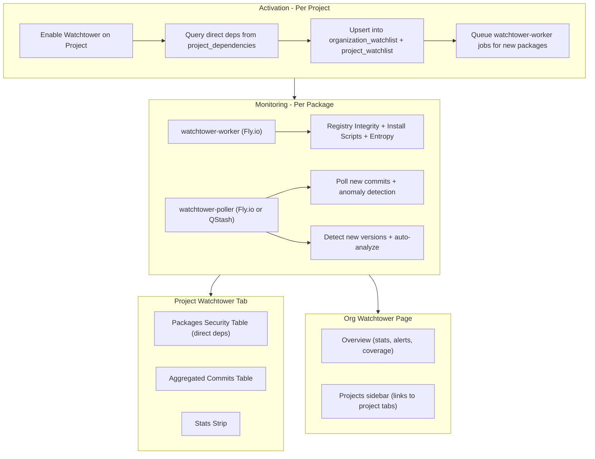

# Phase 10B: Watchtower Refactor -- Per-Project Activation and First-Class Tab

## Current State

Watchtower is buried 3 levels deep: Project -> Dependencies -> click a package -> Watchtower tab. Users enable it one package at a time. For a project with 150 dependencies, this is unusable.

The watchtower-worker and watchtower-poller already run the actual analysis at the package level via Redis queues and `organization_watchlist`. The problem is entirely the activation UX and the absence of an aggregated view.

**Key files being refactored:**

- [DependencyWatchtowerPage.tsx](frontend/src/app/pages/DependencyWatchtowerPage.tsx) -- current per-package UI (1335 lines). Broken apart into reusable components.
- [DependencySidebar.tsx](frontend/src/components/DependencySidebar.tsx) -- remove Watchtower sub-tab.
- [ProjectSidebar.tsx](frontend/src/components/ProjectSidebar.tsx) -- add Watchtower nav item.
- [OrganizationSidebar.tsx](frontend/src/components/OrganizationSidebar.tsx) -- add Watchtower nav item.
- [ee/backend/routes/watchtower.ts](ee/backend/routes/watchtower.ts) -- existing per-package API routes (kept, consumed by new project-level endpoints).
- [ee/backend/routes/projects.ts](ee/backend/routes/projects.ts) -- new project-level Watchtower endpoints.

## Architecture




**Before:** Project -> Dependencies -> lodash -> Watchtower tab (per-package, buried)
**After:** Project -> Watchtower tab (per-project, first-class, all direct deps)

## Scope: Direct Dependencies Only

Watchtower monitors **direct dependencies only** (`is_direct = true` in `project_dependencies`). Rationale:

- Direct deps are what you chose -- you can act on them (bump, replace, remove)
- Transitive deps are controlled by their parent; you can't directly bump a transitive
- A project with 150 total deps typically has ~40-50 direct -- manageable
- Security checks on a direct dep's new version implicitly cover its transitive tree
- Watching all 150+ deps (including transitives) would generate excessive noise

The packages security table shows a note: "Monitoring N direct dependencies. Transitive dependencies are covered through their parent packages."

---

## 10B.A: Project Sidebar -- Add Watchtower Tab

Add "Watchtower" to [ProjectSidebar.tsx](frontend/src/components/ProjectSidebar.tsx) between "Compliance" and "Settings":

```typescript
{ id: 'watchtower', label: 'Watchtower', path: 'watchtower', icon: TowerControl, requiredPermission: null }
```

Visible to all project members. Enable/disable gated by `can_manage_watchtower` project permission (already exists).

**Route:** Add to [routes.tsx](frontend/src/app/routes.tsx) under the project route group:

```typescript
{ path: "watchtower", element: <ProjectWatchtowerPage /> },
```

## 10B.B: Project Watchtower Page

**New file:** `frontend/src/app/pages/ProjectWatchtowerPage.tsx`

Single scrollable page, no sub-navigation. Three states: not enabled, loading, active.

### Not-Enabled State

Full-width CTA screen (reuse the `FeatureCard` pattern from current `DependencyWatchtowerPage`):

- Title: "Watchtower Supply Chain Monitoring"
- Subtitle: "Enable Watchtower to monitor all N direct dependencies in this project for supply chain threats."
- "Enable Watchtower" button (requires `can_manage_watchtower`)
- "Docs" link button -> `/docs/watchtower`
- 4 feature cards: Registry Integrity, Install Script Analysis, Entropy Analysis, Commit Anomaly Detection

### Active State -- Header

- Watchtower status badge ("Active", green)
- "Disable Watchtower" button (outline, requires `can_manage_watchtower`)
- "Docs" link
- Timestamp: "Monitoring since {date}"

### Active State -- Stats Strip

4 compact stat cards:

- **Packages Monitored**: `{analyzed} / {total_direct}` -- some packages may lack GitHub repos and can't be fully analyzed. Thin progress bar showing coverage.
- **Security Alerts**: count of packages with any failed check. Red styling if > 0.
- **Anomalous Commits**: count of commits with anomaly score >= 30 in the last 30 days.
- **Blocked Versions**: count of packages where the next version failed checks or is quarantined.

### Active State -- Packages Security Table

Dense data table showing all direct dependencies and their Watchtower status:

**Columns:**

- **Package**: name + ecosystem icon (npm, PyPI, etc.)
- **Version**: current version in the project
- **Registry Integrity**: pass (green check) / fail (red X) / pending (gray spinner) / n/a (dash, for non-npm packages)
- **Install Scripts**: same statuses
- **Entropy**: same statuses
- **Anomaly**: highest anomaly score from recent commits. Color: green (<30), yellow (30-59), red (>=60). Dash if no data.
- **Next Version**: status badge showing one of:
  - "v1.2.3 Ready" (green) -- new version available, all checks pass, not quarantined
  - "v1.2.3 Blocked" (red) -- new version available but failed checks
  - "v1.2.3 Quarantined" (yellow) -- new version in 7-day quarantine
  - "Latest" (gray) -- already on latest version
  - Dash if no version data
- **Actions**: contextual buttons:
  - "Bump" -- create PR to latest safe version (when next version is Ready)
  - "View PR" -- if a bump/decrease PR already exists
  - Quarantine toggle icon (shield icon, toggles `quarantine_next_release`)

**Table features:**

- Sort by any column (default: alerts first, then alphabetical by name)
- Filter buttons: All / Alerts Only / Blocked Versions / Safe
- Search by package name
- Clicking a row expands inline to show:
  - Check failure reasons (from `summary.registry_integrity_reason`, etc.)
  - Quarantine details (days remaining, quarantine_until date)
  - "Used in N files" import count (from `project_dependency_imports`)
  - List of recent anomalous commits for this package (top 3 by score)
  - Link: "View all commits for this package" (scrolls to commits table with package filter pre-applied)

### Active State -- Aggregated Commits Table

All commits across all watched packages for this project. Same table pattern as current `DependencyWatchtowerPage` but with a **Package** column added:

**Columns:** Package | Author | Message | +/- | Files | Anomaly | My Imports | (Acknowledge button)

**Features:**

- Sort toggle: "Most Recent" (default, grouped by date) / "Anomaly Score" (flat table, highest first)
- Filter toggle: "All commits" / "Touches my imports" / "High anomaly only" (score >= 60)
- Package dropdown filter: "All packages" or select a specific package
- Clicking a commit opens `CommitSidebar` (reused from current code) with Aegis AI analysis
- "Clear Commits" button -- marks all commits across all packages as reviewed
- Infinite scroll with pagination (50 per page for recent, 100 for anomaly sort)

**Reusable components extracted from current `DependencyWatchtowerPage.tsx`:**

- `CommitTableRow` -- move to `frontend/src/components/CommitTableRow.tsx`
- `CommitSidebar` -- already in its own file
- `StatusCard` (the 3-check card) -- extract to `frontend/src/components/WatchtowerStatusCard.tsx`
- `FeatureCard` -- extract to reuse in the not-enabled state
- `isNewerVersion()` -- move to a utility file

## 10B.C: Per-Project Activation -- Backend

### Database Changes

```sql
ALTER TABLE projects ADD COLUMN watchtower_enabled BOOLEAN NOT NULL DEFAULT false;

CREATE TABLE project_watchlist (
  id UUID PRIMARY KEY DEFAULT uuid_generate_v4(),
  project_id UUID NOT NULL REFERENCES projects(id) ON DELETE CASCADE,
  organization_watchlist_id UUID NOT NULL REFERENCES organization_watchlist(id) ON DELETE CASCADE,
  created_at TIMESTAMPTZ DEFAULT NOW(),
  UNIQUE(project_id, organization_watchlist_id)
);

CREATE INDEX idx_project_watchlist_project ON project_watchlist(project_id);
CREATE INDEX idx_project_watchlist_watchlist ON project_watchlist(organization_watchlist_id);
```

`project_watchlist` is a junction table tracking which projects contributed which packages to the org watchlist. This enables clean removal when a project disables Watchtower.

### Enable Endpoint

`POST /api/organizations/:orgId/projects/:projectId/watchtower/toggle`

Request: `{ enabled: boolean }`
Response: `{ watchtower_enabled: boolean, packages_watched: number }`
Permission: `can_manage_watchtower` (project-level)

**Enable flow:**

1. Set `projects.watchtower_enabled = true`
2. Query `project_dependencies WHERE project_id = :projectId AND is_direct = true`
3. For each direct dependency:
  a. Look up the canonical `dependency_id` from `project_dependencies.dependency_id`
   b. UPSERT into `organization_watchlist` (org_id + dependency_id) -- idempotent if already watched
   c. INSERT into `project_watchlist` (project_id + watchlist_id) -- tracks this project's contribution
4. Queue watchtower-worker jobs for all newly-added packages (packages that weren't already in `organization_watchlist`)
5. Return `{ watchtower_enabled: true, packages_watched: count }`

**Disable flow:**

1. Set `projects.watchtower_enabled = false`
2. Get all `project_watchlist` rows for this project
3. For each `organization_watchlist_id`:
  a. Check if any OTHER `project_watchlist` row references this same watchlist entry (from a different project with `watchtower_enabled = true`)
   b. If orphaned (no other project): DELETE from `organization_watchlist` (cascade deletes `project_watchlist` rows)
   c. If still referenced: only DELETE the `project_watchlist` row for this project
4. Return `{ watchtower_enabled: false, packages_watched: 0 }`

## 10B.D: Project-Level API Endpoints

All under `/api/organizations/:orgId/projects/:projectId/watchtower/`:


| Method | Path                               | Purpose                                                                        | Permission              |
| ------ | ---------------------------------- | ------------------------------------------------------------------------------ | ----------------------- |
| POST   | `toggle`                           | Enable/disable Watchtower for the project                                      | `can_manage_watchtower` |
| GET    | `packages`                         | All watched direct deps with check statuses, next version info                 | any project member      |
| GET    | `commits`                          | Aggregated commits across all packages (paginated, sortable, filterable)       | any project member      |
| GET    | `stats`                            | Stats strip data (packages count, alerts, anomalous commits, blocked versions) | any project member      |
| POST   | `clear-commits`                    | Clear all commits for all packages (mark as reviewed)                          | `can_manage_watchtower` |
| POST   | `packages/:watchlistId/quarantine` | Toggle quarantine_next_release for a specific package                          | `can_manage_watchtower` |
| POST   | `packages/:watchlistId/bump`       | Create bump PR for a specific package                                          | `can_manage_watchtower` |
| POST   | `packages/:watchlistId/decrease`   | Create decrease PR for a specific package                                      | `can_manage_watchtower` |


`**GET packages` response shape:**

```typescript
{
  packages: Array<{
    watchlist_id: string;
    dependency_id: string;
    name: string;
    version: string;           // current version in this project
    registry_integrity_status: 'pass' | 'warning' | 'fail' | null;
    registry_integrity_reason: string | null;
    install_scripts_status: 'pass' | 'warning' | 'fail' | null;
    install_scripts_reason: string | null;
    entropy_analysis_status: 'pass' | 'warning' | 'fail' | null;
    entropy_analysis_reason: string | null;
    max_anomaly_score: number | null;     // highest anomaly across recent commits
    latest_version: string | null;        // latest known version
    latest_allowed_version: string | null;
    next_version_status: 'ready' | 'blocked' | 'quarantined' | 'latest' | null;
    quarantine_next_release: boolean;
    quarantine_until: string | null;
    is_current_version_quarantined: boolean;
    bump_pr_url: string | null;
    decrease_pr_url: string | null;
    import_count: number;                 // how many import sites in this project
    analysis_status: 'ready' | 'pending' | 'analyzing';
  }>;
  total_direct_deps: number;
}
```

`**GET commits` query params:** `limit`, `offset`, `sort` (recent|anomaly), `filter` (all|touches_imported|high_anomaly), `package` (optional package name filter)

Implementation: aggregates across all `organization_watchlist` entries linked to this project via `project_watchlist`, calling the existing per-package `/api/watchtower/:packageName/commits` under the hood or querying `package_commits` directly with a JOIN.

## 10B.E: Remove Dependency-Level Watchtower Tab

### DependencySidebar

In [DependencySidebar.tsx](frontend/src/components/DependencySidebar.tsx), remove "Watchtower" from the tab list. Tabs become: **Overview | Supply Chain | Notes**.

### Route Changes

Remove `/dependencies/:dependencyId/watchtower` route from [routes.tsx](frontend/src/app/routes.tsx). Add a redirect to the project Watchtower tab:

```typescript
{ path: "dependencies/:dependencyId/watchtower", element: <Navigate to="../../../watchtower" replace /> }
```

### Dependency Overview Badge

In the dependency Overview tab, if `projects.watchtower_enabled = true`, add a compact inline status indicator:

- 3 small colored dots (one per check: registry, scripts, entropy) with a label
- "Watchtower: All checks passing" or "Watchtower: 1 check failed"
- Clickable: navigates to project Watchtower tab with this package's row highlighted/filtered

### File Cleanup

- Archive [DependencyWatchtowerPage.tsx](frontend/src/app/pages/DependencyWatchtowerPage.tsx)
- Extract before archiving:
  - `CommitTableRow` -> `frontend/src/components/CommitTableRow.tsx`
  - `StatusCard` -> `frontend/src/components/WatchtowerStatusCard.tsx`
  - `FeatureCard` -> `frontend/src/components/WatchtowerFeatureCard.tsx`
  - `isNewerVersion()` -> `frontend/src/lib/watchtower-utils.ts`
- Update [WatchtowerSkeleton.tsx](frontend/src/components/WatchtowerSkeleton.tsx) for the new project-level layout

## 10B.F: Organization Sidebar -- Add Watchtower

Add to [OrganizationSidebar.tsx](frontend/src/components/OrganizationSidebar.tsx) between "Compliance" and "Settings":

```typescript
{ id: 'watchtower', label: 'Watchtower', path: 'watchtower', icon: TowerControl, requiredPermission: null }
```

Visible to all org members. Management actions (enable/disable from org page) gated by `manage_watchtower` org permission (10B.L).

## 10B.G: Organization Watchtower Page

**New file:** `frontend/src/app/pages/OrganizationWatchtowerPage.tsx`

**Layout:** Sidebar + content (same pattern as [ProjectCompliancePage.tsx](frontend/src/app/pages/ProjectCompliancePage.tsx)):

```
<div className="flex min-h-[calc(100vh-3rem)]">
  <WatchtowerSidepanel activeSection={section} projects={...} />
  <div className="flex-1 min-w-0 px-6 py-6 overflow-auto">
    {section === 'overview' ? <OrgWatchtowerOverview /> : null}
  </div>
</div>
```

**New file:** `frontend/src/components/WatchtowerSidepanel.tsx`

Sidebar contents:

- Header: "WATCHTOWER" (uppercase xs text, zinc-400)
- "Overview" nav item (always first, active by default)
- Divider
- List of **projects** with Watchtower enabled:
  - Project name (truncated if long)
  - Status dot: green (all packages pass), red (any alerts), yellow (analyzing), gray (inactive)
  - Package count: "48 pkgs" in secondary text
  - Clicking a project navigates to `/organizations/:orgId/projects/:projectId/watchtower`

**Routes** in [routes.tsx](frontend/src/app/routes.tsx):

```typescript
{ path: "watchtower", element: <OrganizationWatchtowerPage /> },
{ path: "watchtower/:section", element: <OrganizationWatchtowerPage /> },
```

## 10B.H: Org Watchtower Overview

### Stats Strip

- **Projects Active**: `{enabled} / {total}` projects with Watchtower enabled
- **Packages Monitored**: deduplicated count across all projects (same package in 2 projects counts once)
- **Active Alerts**: total failed checks + high-anomaly commits across all projects
- **Blocked Versions**: total packages with blocked next version across all projects

### Projects Summary Table


| Project     | Tier         | Packages | Alerts | Blocked | Status   | Actions |
| ----------- | ------------ | -------- | ------ | ------- | -------- | ------- |
| API Service | Crown Jewels | 48       | 3      | 1       | Active   | View    |
| Web App     | External     | 62       | 0      | 0       | Active   | View    |
| Mobile App  | External     | 35       | --     | --      | Inactive | Enable  |


- All org projects listed with Watchtower status
- "Enable" button on inactive projects (requires `manage_watchtower`)
- "View" links to the project's Watchtower tab
- Sortable by alerts count (default: most alerts first, then inactive)

### Active Alerts Section

Aggregated alerts across all watched projects:

- Failed security checks: package name, check name, project name, timestamp
- High-anomaly commits: package name, author, score, project name
- Blocked versions: package name, version, which check failed, project name

Each alert links to the relevant project's Watchtower tab.

### Package Coverage Analysis

Top packages across the org by usage (from `project_dependencies` grouped by `dependency_id`):

- Package name, used in N projects, watched (yes/no)
- For unwatched high-usage packages: "Enable Watchtower on [Project] to monitor this package"
- Helps identify coverage gaps

## 10B.I: Organization API Endpoints


| Method | Path                                                           | Purpose                             | Permission          |
| ------ | -------------------------------------------------------------- | ----------------------------------- | ------------------- |
| GET    | `/api/organizations/:id/watchtower/overview`                   | Org stats, aggregated alerts        | any org member      |
| GET    | `/api/organizations/:id/watchtower/projects`                   | All projects with Watchtower status | any org member      |
| GET    | `/api/organizations/:id/watchtower/package-usage`              | Cross-project package analysis      | any org member      |
| POST   | `/api/organizations/:id/watchtower/projects/:projectId/toggle` | Enable/disable from org page        | `manage_watchtower` |


The org-level toggle endpoint (`POST .../toggle`) calls the same backend logic as the project-level toggle (10B.C) but requires org-level `manage_watchtower` instead of project-level `can_manage_watchtower`.

## 10B.J: Auto-Sync Watchlist on Extraction

When an extraction completes for a project with `watchtower_enabled = true`, sync the watchlist with the current dependency set.

**In the extraction pipeline** ([ee/backend/routes/workers.ts](ee/backend/routes/workers.ts)), after deps are synced to `project_dependencies`:

**New dependencies added (in extraction diff):**

1. For each new direct dep (`is_direct = true`):
  a. UPSERT into `organization_watchlist` (org_id + dependency_id)
   b. INSERT into `project_watchlist` (project_id + watchlist_id)
   c. Queue watchtower-worker job for the new package
2. Log: "Watchtower: added N new packages to watchlist"

**Dependencies removed (in extraction diff):**

1. For each removed direct dep:
  a. Find the `project_watchlist` row and DELETE it
   b. Check if orphaned in `organization_watchlist` (no other `project_watchlist` references)
   c. If orphaned: DELETE from `organization_watchlist`
2. Log: "Watchtower: removed N packages from watchlist"

**Edge case:** Extraction changes a dep from direct to transitive (or vice versa). If a previously-direct dep becomes transitive, treat it as "removed" from Watchtower scope. If a transitive becomes direct, treat it as "added."

## 10B.K: Docs Page for Watchtower

Add to the Features group in [docsConfig.ts](frontend/src/app/pages/docsConfig.ts):

```typescript
{ label: "Watchtower", slug: "watchtower", description: "Supply chain monitoring and forensic analysis" }
```

Add content in [DocsPage.tsx](frontend/src/app/pages/DocsPage.tsx) under the `watchtower` case:

- **What is Watchtower** -- proactive supply chain defense. Enable per-project to automatically monitor all direct dependencies.
- **Registry Integrity Check** -- compares npm tarball vs git source. Catches tampered publishes where code is modified between repository and registry. A failure means the published package contains code not present in the git repository.
- **Install Script Analysis** -- scans preinstall/install/postinstall scripts for: network access (`http`, `https`, `net`, `dns`), shell execution (`exec`, `spawn`, `execSync`), dangerous operations (`eval`, `Function()`, base64 decoding, `rm -rf`, `chmod 777`). Install scripts run automatically on `npm install` -- malicious scripts exploit this for code execution.
- **Entropy Analysis** -- computes Shannon entropy of JS/TS files. Normal code: entropy 3.5-5.0. Obfuscated/encoded payloads: entropy > 5.5. High-entropy files suggest hidden malicious code using string encoding, variable mangling, or packed payloads.
- **Commit Anomaly Detection** -- scores each commit against the contributor's historical baseline: files changed (10-15 pts if 2-3+ std dev above mean), lines changed (10-15 pts), unusual commit time (5 pts), unusual day (5 pts), message length anomaly (5 pts), insert/delete ratio shift (5 pts), new files worked on (10 pts per new file, max 30). Total score: 0-100. Mild >= 30, High >= 60.
- **Quarantine System** -- hold new versions for 7 days before allowing upgrades. Automatic quarantine can be toggled per-package. During quarantine, bump PRs are blocked.
- **Version Blocking** -- when security checks fail on a new version, the version is blocked. PRs that attempt to upgrade to a blocked version are rejected by PR guardrails.
- **How to Enable** -- go to your project's Watchtower tab, click "Enable Watchtower." All direct dependencies are automatically monitored. New deps added via future extractions are auto-included.

Update the not-enabled hero screen in `ProjectWatchtowerPage.tsx` to link to `/docs/watchtower` with button text "Docs".

## 10B.L: `manage_watchtower` Org Permission

Add to `RolePermissions` in [api.ts](frontend/src/lib/api.ts):

```typescript
manage_watchtower?: boolean;
```

Backend: Add to the org roles `permissions` JSONB schema.

**What this permission gates:**

- Enabling/disabling Watchtower on projects from the **org** Watchtower page (10B.I toggle endpoint)
- Viewing the org Watchtower page is open to all org members

**What the existing `can_manage_watchtower` project permission gates (unchanged):**

- Enabling/disabling Watchtower from the **project** Watchtower tab
- Toggling quarantine on individual packages
- Creating bump/decrease PRs
- Clearing commits

**Permission hierarchy:**

- Org `manage_watchtower` allows managing Watchtower across all projects from the org page
- Project `can_manage_watchtower` allows managing Watchtower within a specific project
- Both can enable/disable; the org permission is a superset for org-wide management
- Any org/project member can **view** Watchtower data (no permission required for read)

## 10B.M: PR Guardrails Integration

When PR guardrails (Phase 8) evaluate a dependency upgrade in a PR:

1. Check if the project has `watchtower_enabled = true`
2. For each dependency being upgraded in the PR:
  a. Is the package in `organization_watchlist` (i.e., is it a watched direct dep)?
   b. Look up the TARGET version's security check status from `dependency_versions` or the Watchtower summary
   c. If any check status is `'fail'`: **block the PR**
   d. If the target version is quarantined (`is_current_version_quarantined` or `quarantine_until` is in the future): **block the PR**
3. PR check failure message examples:
  - "Blocked by Watchtower: [axios@1.7.0](mailto:axios@1.7.0) failed registry integrity check. The published package differs from the git source."
  - "Blocked by Watchtower: [lodash@4.18.0](mailto:lodash@4.18.0) is in quarantine (5 days remaining). Quarantine expires on Mar 6, 2026."

**Integration point:** In the PR check evaluation logic (Phase 8), add a `checkWatchtowerStatus()` step after the policy check. This is a fast DB query (no sandbox execution needed).

## 10B.N: Notification Preset

In [NotificationRulesSection.tsx](frontend/src/app/pages/NotificationRulesSection.tsx), add a "Watchtower Alerts" preset when creating a new rule.

Auto-generates trigger code:

```javascript
const watchEvents = [
  'security_analysis_failure',
  'supply_chain_anomaly',
  'new_version_available'
];
if (!watchEvents.includes(context.event.type)) return false;
return true;
```

No new event types needed -- Phase 9 already defines these Watchtower-related events in the event catalog (9A).

## 10B.O: Cloud Deployment -- Worker and Poller

### Current State

- **watchtower-worker**: Has Dockerfile + fly.toml (`deptex-watchtower-worker`, shared-cpu-1x, 512MB, `min_machines_running = 1`). Runs 24/7 polling Redis queues. Already deployable to Fly.io.
- **watchtower-poller**: Has NO Dockerfile or fly.toml. Runs locally as `npm start`. Not cloud-ready.

### Watchtower Worker (no changes needed)

The worker's fly.toml is already configured for always-on (`min_machines_running = 1`, `auto_stop_machines = false`). This is correct -- the worker needs to continuously poll Redis for jobs. 512MB RAM is sufficient for registry checks, git operations, and entropy analysis.

One fix needed: the fly.toml defines `[http_service]` but the worker has no HTTP server. Remove the `[http_service]` section.

### Watchtower Poller (needs deployment plan)

Two options:

**Option A: Deploy as Fly.io machine (simple, matches worker pattern)**

Create `backend/watchtower-poller/Dockerfile` and `backend/watchtower-poller/fly.toml`:

- App: `deptex-watchtower-poller`
- VM: `shared-cpu-1x`, 256MB RAM (very lightweight -- just checks Redis and queries Supabase)
- `min_machines_running = 1`, `auto_stop_machines = false`
- Cost: ~$2/month (always-on shared CPU)

**Option B: Replace with QStash cron (more efficient, no idle machine)**

The poller checks every 60 seconds but only fires the daily poll once per 24 hours. This is wasteful. Replace with:

1. QStash cron schedule: `0 4 * * *` (runs daily at 4 AM UTC)
2. Triggers `POST /api/workers/watchtower-daily-poll` on the backend
3. The endpoint runs `runDependencyRefresh()` + `runPollSweep()` synchronously (or queues them)
4. No dedicated machine needed -- runs on the main backend

Recommendation: **Option B** for the daily poll (it's a once-per-day job, not worth a 24/7 machine). If more frequent polling is needed in the future, add a second QStash schedule.

The existing poller's `runDependencyRefresh()` and `runPollSweep()` functions would be extracted into a shared library and called from the QStash consumer endpoint.

### Impact on Phase 10B

Phase 10B doesn't need to implement the full deployment -- that's Phase 2's domain. But Phase 10B should:

1. Fix the watchtower-worker fly.toml (remove `[http_service]`)
2. Ensure all new Watchtower endpoints work with the existing worker/poller architecture
3. Document that the poller needs either a Fly.io machine or QStash cron migration as part of Phase 2 deployment

---

## Edge Cases and Error Handling

### Activation Edge Cases

1. **Enable on a project with 0 dependencies**: Show "No dependencies found. Run an extraction first to discover your project's dependencies." Disable the enable button if `dependencies_count = 0`.
2. **Enable on a project with only transitive dependencies (no direct)**: Possible if extraction couldn't distinguish direct vs transitive (SBOM pipeline fallback). Show warning: "No direct dependencies detected. Watchtower monitors direct dependencies only. Re-run extraction with a lockfile for better results."
3. **Enable when all direct deps are already watched by another project**: All packages are already in `organization_watchlist`. Just create `project_watchlist` junction rows. No new worker jobs needed. Show: "All 48 packages are already being monitored by Watchtower."
4. **Disable when another project shares watched packages**: Only remove packages unique to this project. Packages shared with other watchtower-enabled projects stay in the watchlist.
5. **Enable concurrently on two projects (race condition)**: `organization_watchlist` UPSERT is idempotent (unique constraint on org_id + dependency_id). `project_watchlist` has unique constraint on project_id + watchlist_id. Both operations are safe for concurrent execution.
6. **Project deleted while Watchtower is enabled**: `project_watchlist` has `ON DELETE CASCADE` from projects. The orphan cleanup should run: check all `organization_watchlist` entries that lost their only `project_watchlist` reference and remove them.

### Packages Table Edge Cases

1. **Package has no GitHub repo**: Registry integrity check requires a git source. Status shows "n/a" (not applicable) for registry integrity. Install scripts and entropy can still run on the tarball. Show tooltip: "Registry integrity check unavailable -- no linked repository."
2. **Package analysis is pending (just enabled)**: Show "Analyzing..." spinner in all check columns. The stats strip shows "N / M packages analyzed."
3. **Package was removed from registry (unpublished)**: Worker returns error. Show "Package unavailable" status. This is actually a critical alert -- an unpublished package can be re-registered by an attacker (dependency confusion).
4. **Very large project (500+ direct deps)**: Table should use virtual scrolling or pagination. API uses cursor-based pagination. Enable button shows warning: "This will queue analysis for 500+ packages. This may take several hours to complete."

### Commits Table Edge Cases

1. **No commits found for any package**: Show "No commits data available yet. Watchtower is analyzing your dependencies -- commits will appear as they're processed."
2. **Package has 10,000+ commits**: Individual package commit queries are already paginated (50/100 per page). The aggregated view adds a package filter to keep the UI responsive.
3. **Commit data missing for some packages**: Some packages may not have git history (private repos, or registry-only packages). Show commits only for packages that have data; don't show empty rows.

### Sync Edge Cases

1. **Extraction adds 50 new direct deps at once**: Batch UPSERT into `organization_watchlist` and `project_watchlist`. Queue all 50 watchtower-worker jobs. The worker processes them in order (5-second polling interval).
2. **Extraction removes all direct deps**: All `project_watchlist` rows are removed. Orphaned `organization_watchlist` entries are cleaned up. Project shows "0 packages monitored" but Watchtower remains enabled (ready for next extraction).
3. **Extraction fails mid-way**: Watchtower sync only runs AFTER successful dependency sync. If extraction fails, no watchlist changes are made.

### Permission Edge Cases

1. **User without `can_manage_watchtower` visits Watchtower tab**: They can see all data (packages table, commits, stats). Enable/disable button, quarantine toggles, bump buttons, and clear commits are hidden or disabled.
2. **Org admin with `manage_watchtower` but not project `can_manage_watchtower`**: Can enable/disable from the org page. Cannot manage per-package quarantine from the project page (that requires project-level permission). This is intentional -- org admins set the overall posture, project owners manage the details.

### PR Guardrails Edge Cases

1. **PR upgrades a package not on Watchtower**: Skip the Watchtower check for this package. Only checked packages block PRs.
2. **PR upgrades to a version that hasn't been analyzed yet**: Don't block (fail-open). The version may be very new. Log a warning: "Watchtower has not yet analyzed [package]@[version]. PR allowed pending analysis."
3. **PR downgrades a package**: Watchtower checks the TARGET version's status, regardless of direction. If downgrading to a version with failed checks, still block.
4. **PR adds a brand-new dependency not in the project**: This is a new dep, not an upgrade. Watchtower doesn't block new additions -- that's the policy engine's job (Phase 4). After the PR merges and extraction runs, the new dep will be auto-added to the watchlist if Watchtower is enabled.

---

## Cross-Phase Integration Points


| Phase                   | Integration              | Details                                                                                                                                                            |
| ----------------------- | ------------------------ | ------------------------------------------------------------------------------------------------------------------------------------------------------------------ |
| Phase 2 (Fly.io)        | Worker/poller deployment | watchtower-worker already has fly.toml. Poller needs Dockerfile + fly.toml OR QStash cron migration. Fix worker fly.toml (remove [http_service]).                  |
| Phase 4 (Policy)        | Policy engine context    | Policy evaluation context could include `watchtower_status` for the dependency (pass/fail/pending), enabling policy rules like "block if Watchtower check failed." |
| Phase 5 (Compliance)    | Compliance status        | Watchtower check failures could contribute to compliance violations if configured in the policy.                                                                   |
| Phase 8 (PR Webhooks)   | PR guardrails            | 10B.M adds a Watchtower check step to the PR evaluation pipeline. Blocks upgrades to failed/quarantined versions.                                                  |
| Phase 9 (Notifications) | Event types              | `security_analysis_failure`, `supply_chain_anomaly`, `new_version_available` events already defined. 10B.N adds a preset template.                                 |
| Phase 12 (Docs)         | Documentation            | 10B.K adds the Watchtower docs page. Phase 12 may expand or refine it.                                                                                             |
| Phase 13 (Billing)      | Plan limits              | `watchtower_limit` in `organization_plans` table caps how many projects can have Watchtower enabled per plan tier.                                                 |


