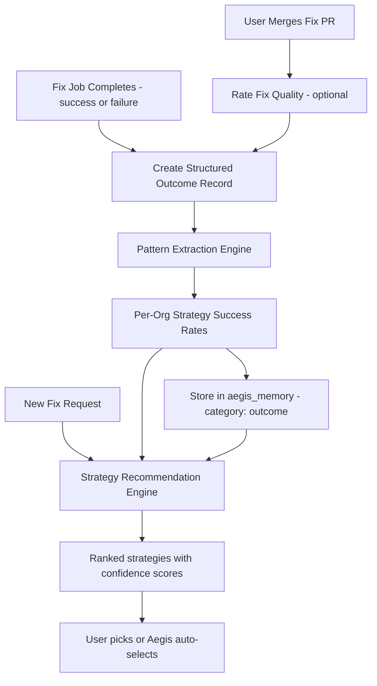

## Phase 16: Aegis Outcome-Based Learning

**Goal:** Make Aegis smarter over time by systematically learning from every fix outcome. Instead of always defaulting to version bump, Aegis builds a per-organization knowledge base: "For prototype pollution CVEs in npm packages, version bump succeeds 94% of the time. For SQL injection Semgrep findings in Express apps, code_patch succeeds 78% but takes 3x longer than expected." This transforms Aegis from a stateless tool executor into an adaptive system that gets better the longer an organization uses it.

**Prerequisites:** Phase 7 (fix engine with `project_security_fixes` tracking), Phase 7B (Aegis memory system + task system), Phase 6B (reachability context for richer outcome data).

**Timeline:** ~2-3 weeks. The fix infrastructure already tracks outcomes -- this phase adds structured learning on top.

### How It Works (Overview)



### 16A: Structured Fix Outcome Records

Every fix job completion (success or failure) creates a structured outcome record that captures everything needed for learning:

```sql
CREATE TABLE fix_outcomes (
  id UUID PRIMARY KEY DEFAULT uuid_generate_v4(),
  organization_id UUID NOT NULL REFERENCES organizations(id) ON DELETE CASCADE,
  fix_job_id UUID NOT NULL REFERENCES project_security_fixes(id) ON DELETE CASCADE,
  
  -- What was fixed
  fix_type TEXT NOT NULL,            -- 'vulnerability', 'semgrep', 'secret'
  strategy TEXT NOT NULL,            -- 'bump_version', 'code_patch', etc.
  
  -- Context dimensions (used for pattern matching)
  ecosystem TEXT NOT NULL,           -- 'npm', 'pip', 'maven', etc.
  vulnerability_type TEXT,           -- 'prototype-pollution', 'sql-injection', 'xss', etc. (from CWE mapping)
  cwe_id TEXT,                       -- CWE identifier if available
  severity TEXT,                     -- 'critical', 'high', 'medium', 'low'
  package_name TEXT,                 -- the affected package
  is_direct_dep BOOLEAN,            -- direct vs transitive
  has_reachability_data BOOLEAN,     -- was atom data available?
  reachability_level TEXT,           -- 'confirmed', 'data_flow', 'module', 'unreachable'
  
  -- Outcome
  success BOOLEAN NOT NULL,
  failure_reason TEXT,               -- categorized: 'breaking_changes', 'no_safe_version', 'build_error',
                                     -- 'test_failure', 'timeout', 'api_error', 'empty_diff', etc.
  failure_detail TEXT,               -- raw error context for Aegis to reference
  
  -- Performance metrics
  duration_seconds INTEGER,
  tokens_used INTEGER,
  estimated_cost NUMERIC(6, 4),
  files_changed INTEGER,
  lines_added INTEGER,
  lines_removed INTEGER,
  
  -- Post-fix quality (populated later)
  pr_merged BOOLEAN,                 -- was the PR actually merged?
  pr_merged_at TIMESTAMPTZ,
  human_quality_rating INTEGER,      -- 1-5, optional user feedback
  introduced_new_vulns BOOLEAN DEFAULT false,
  fix_reverted BOOLEAN DEFAULT false, -- was the fix PR reverted after merge?
  
  -- Follow-up outcomes
  previous_attempt_id UUID REFERENCES fix_outcomes(id), -- if this was a retry, link to the failed attempt
  led_to_strategy TEXT,              -- if this failed, what strategy was tried next?
  
  created_at TIMESTAMPTZ DEFAULT NOW()
);

CREATE INDEX idx_fo_org_ecosystem ON fix_outcomes(organization_id, ecosystem);
CREATE INDEX idx_fo_org_strategy ON fix_outcomes(organization_id, strategy);
CREATE INDEX idx_fo_org_vuln_type ON fix_outcomes(organization_id, vulnerability_type);
CREATE INDEX idx_fo_org_success ON fix_outcomes(organization_id, success);
```

**Outcome creation flow** (added to fix engine completion handler in `ai-fix-engine.ts`):

After every fix job reaches `completed` or `failed` status:

1. Extract vulnerability type from CWE IDs (map CWE to category: prototype-pollution, sql-injection, xss, path-traversal, etc.)
2. Gather context dimensions from the fix request and project data
3. Categorize failure reason (parse error logs into predefined categories)
4. Create `fix_outcomes` record
5. If this was a retry, link to the previous attempt via `previous_attempt_id`
6. Trigger pattern extraction (16B)

**PR merge tracking** (extends Phase 7J):

When a fix PR is merged (webhook from Phase 8):
1. Update `fix_outcomes.pr_merged = true`, `pr_merged_at = NOW()`
2. Optionally prompt the user for quality feedback (16D)
3. If the PR is later reverted (detected via subsequent webhook): set `fix_reverted = true`

### 16B: Pattern Extraction Engine

The pattern engine aggregates outcomes to compute strategy success rates across multiple dimensions. Runs after each new outcome and periodically (daily) for batch recomputation.

```sql
CREATE TABLE strategy_patterns (
  id UUID PRIMARY KEY DEFAULT uuid_generate_v4(),
  organization_id UUID NOT NULL REFERENCES organizations(id) ON DELETE CASCADE,
  
  -- Pattern dimensions (any combination, nulls = wildcard)
  ecosystem TEXT,                    -- null = all ecosystems
  vulnerability_type TEXT,           -- null = all vuln types
  strategy TEXT NOT NULL,
  is_direct_dep BOOLEAN,             -- null = both
  
  -- Computed metrics
  total_attempts INTEGER NOT NULL DEFAULT 0,
  successes INTEGER NOT NULL DEFAULT 0,
  success_rate NUMERIC(5, 4) NOT NULL DEFAULT 0, -- 0.0000 to 1.0000
  avg_duration_seconds INTEGER,
  avg_cost NUMERIC(6, 4),
  avg_quality_rating NUMERIC(3, 2),  -- from human feedback
  pr_merge_rate NUMERIC(5, 4),       -- % of successful fixes where PR was actually merged
  revert_rate NUMERIC(5, 4),         -- % of merged PRs that were reverted
  
  -- Confidence
  confidence TEXT NOT NULL DEFAULT 'low', -- 'low' (<5 samples), 'medium' (5-20), 'high' (>20)
  sample_count INTEGER NOT NULL DEFAULT 0,
  
  -- Failure analysis
  common_failure_reasons JSONB,      -- { "breaking_changes": 3, "build_error": 2, ... }
  best_followup_strategy TEXT,       -- when this strategy fails, what works next?
  followup_success_rate NUMERIC(5, 4),
  
  last_computed_at TIMESTAMPTZ DEFAULT NOW(),
  created_at TIMESTAMPTZ DEFAULT NOW(),
  UNIQUE(organization_id, ecosystem, vulnerability_type, strategy, is_direct_dep)
);

CREATE INDEX idx_sp_org_lookup ON strategy_patterns(organization_id, ecosystem, vulnerability_type);
```

**Pattern computation logic:**

```typescript
async function recomputePatterns(orgId: string) {
  // Compute patterns at multiple granularity levels:
  // 1. Most specific: ecosystem + vuln_type + strategy + dep_type
  // 2. Medium: ecosystem + strategy
  // 3. Broad: strategy only (org-wide)
  
  // For each combination, aggregate from fix_outcomes:
  const patterns = await supabase.rpc('compute_strategy_patterns', { p_org_id: orgId });
  
  // Compute confidence levels
  for (const pattern of patterns) {
    pattern.confidence = pattern.sample_count >= 20 ? 'high' :
                         pattern.sample_count >= 5 ? 'medium' : 'low';
  }
  
  // Compute follow-up strategies (when X fails, what works?)
  // Join fix_outcomes ON previous_attempt_id to find retry chains
  const followups = await supabase.rpc('compute_followup_strategies', { p_org_id: orgId });
  
  // Upsert all patterns
  await supabase.from('strategy_patterns').upsert(patterns);
}
```

**Confidence levels:**
- **Low** (< 5 outcomes): Pattern exists but sample size too small. Show to user but mark as "limited data."
- **Medium** (5-20 outcomes): Reasonably reliable. Aegis uses these for recommendations.
- **High** (> 20 outcomes): Strong signal. Aegis confidently recommends based on these.

### 16C: Strategy Recommendation Engine

When a user clicks "Fix with AI" or Aegis plans a fix, the strategy selector queries `strategy_patterns` to rank strategies by predicted success rate:

```typescript
interface StrategyRecommendation {
  strategy: string;
  predictedSuccessRate: number;  // 0-1
  confidence: 'low' | 'medium' | 'high';
  basedOnSamples: number;
  avgDuration: number;           // seconds
  avgCost: number;               // USD
  reasoning: string;             // human-readable explanation
  warnings?: string[];           // e.g., "High revert rate (15%) after merge"
}

async function recommendStrategies(
  orgId: string,
  ecosystem: string,
  vulnType: string | null,
  isDirect: boolean,
  availableStrategies: string[]
): Promise<StrategyRecommendation[]> {
  // 1. Query strategy_patterns at most specific level first
  //    ecosystem + vulnType + strategy + isDirect
  // 2. Fall back to broader levels if no data at specific level
  // 3. Fall back to global defaults if no org data exists at all
  // 4. Rank by: success_rate * confidence_multiplier (high=1.0, medium=0.8, low=0.5)
  // 5. Generate reasoning strings
}
```

**Global defaults** (used when org has no outcome data yet):

```typescript
const GLOBAL_DEFAULTS: Record<string, number> = {
  'bump_version': 0.75,    // most reliable, works for most cases
  'pin_transitive': 0.70,  // reliable for transitive deps
  'remove_unused': 0.90,   // very reliable when atom confirms unused
  'code_patch': 0.55,      // moderate, depends on complexity
  'add_wrapper': 0.50,     // moderate, depends on isolation
  'fix_semgrep': 0.65,     // moderate, depends on rule category
  'remediate_secret': 0.85, // reliable (simple env var replacement)
};
```

**Frontend -- Strategy recommendation cards:**

In the pre-fix confirmation (Phase 7, section 7D), replace the simple strategy selector with a ranked recommendation card:

- Each strategy shown as a row with: strategy name + predicted success rate (bar chart or percentage) + confidence badge (green/amber/gray) + avg cost + avg duration
- Top recommendation highlighted with green border
- If a strategy has warnings (high revert rate, common failure mode), show amber warning text
- "Why this ranking?" expandable: shows the reasoning string and sample counts
- User can override and pick any strategy regardless of recommendation

**Aegis integration:**

When Aegis auto-selects a strategy (for sprints or autopilot mode):
- Always pick the highest-ranked strategy with medium+ confidence
- If top strategy has < 60% predicted success rate, Aegis mentions the uncertainty: "I'll try a version bump, though my success rate for this type of issue is 58%. If it fails, code_patch has worked 72% of the time as a follow-up."
- After a failure, Aegis automatically checks `best_followup_strategy` and suggests it

### 16D: Human Feedback Loop

After a fix PR is merged (detected via Phase 8 webhook), optionally prompt the user for quality feedback:

**Trigger:** 24 hours after PR merge, show a subtle in-app notification:

"You merged Aegis's fix for CVE-2024-XXXX. How was the fix quality?"

Five-star rating with optional labels:
- 1: Reverted / broke things
- 2: Required significant manual changes  
- 3: Needed minor tweaks
- 4: Good, merged as-is with minor review
- 5: Perfect, merged immediately

**Storage:** Updates `fix_outcomes.human_quality_rating`. This feeds into `strategy_patterns.avg_quality_rating`, which Aegis uses to differentiate between strategies that "succeed" (Aider produces a PR) but produce low-quality code vs ones that produce merge-ready fixes.

**Not intrusive:** The feedback prompt is a small card in the in-app inbox, not a modal. It auto-dismisses after 7 days if not acted on. Never shown more than once per fix. Users can disable fix feedback in their profile settings.

### 16E: Learning Dashboard

New tab in the Aegis Management Console (7B-K): "Learning" (between "Memory" and "Incidents" tabs).

**Sections:**

1. **Strategy Performance Matrix**: Table showing all strategies vs ecosystems. Cells contain success rate (color-coded), sample count, avg cost. Highlights the best strategy per ecosystem.

2. **Learning Curve Chart**: Line chart showing Aegis's overall fix success rate over time (monthly). Demonstrates improvement as more outcomes are recorded. Powerful for ROI conversations.

3. **Failure Analysis**: Bar chart of most common failure reasons across all fix attempts. Helps identify systemic issues (e.g., if "build_error" is #1, maybe the org needs better test infrastructure).

4. **Follow-up Chains**: Sankey diagram or table showing: "When bump_version fails, code_patch succeeds 72% of the time. When code_patch fails, manual intervention is needed 80% of the time." Helps users understand the escalation path.

5. **Quality Insights**: Average human quality rating per strategy. Highlights strategies that succeed (Aider makes changes) but produce low-quality output.

**Stitch AI Prompt for Learning Tab:**

> Design a "Learning" tab inside the Aegis AI management console for Deptex (dark theme: bg #09090b, cards #18181b, borders #27272a 1px, text #fafafa, secondary #a1a1aa, accent green #22c55e). This tab is one of 9 tabs in the management console. The content area is ~900px wide. Font: Inter body, JetBrains Mono for numbers/stats. 8px border-radius. No gradients, no shadows. Ultra-minimal Linear/Vercel style.
>
> **Section 1 -- "Strategy Performance Matrix"** card (zinc-900 bg, zinc-800 border, rounded-lg, p-5):
>
> - Header: "Strategy Performance" 15px semibold left. Right: ecosystem filter dropdown (zinc-800 bg, "All Ecosystems" default, options: npm, pip, maven, go, cargo, etc.) and time range picker ("Last 30 days" / "Last 90 days" / "All time").
> - Table layout. Rows are strategies (7 rows): bump_version, code_patch, add_wrapper, pin_transitive, remove_unused, fix_semgrep, remediate_secret. Columns: "Strategy" (left, 13px semibold zinc-300, JetBrains Mono), "Success Rate" (horizontal bar + percentage -- bar is green-500 fill proportional to rate, 120px wide, 6px tall, rounded-full, bg zinc-800), "Samples" (count in zinc-400, 12px JetBrains Mono), "Confidence" (pill badge: "High" green-500/15 bg green-500 text, "Medium" amber-500/15 bg amber-500 text, "Low" zinc-700 bg zinc-400 text), "Avg Cost" ($X.XX in JetBrains Mono 12px zinc-400), "Avg Duration" (Xm in zinc-400 12px).
> - Best strategy per ecosystem highlighted with subtle green-500/5 row background.
> - Rows: zinc-800/50 border between. Hover: bg-zinc-800/30.
>
> **Section 2 -- "Learning Curve"** card:
>
> - Header: "Fix Success Rate Over Time" 15px semibold left. Right: "Aegis has improved 18% since first month" in 13px green-500.
> - Line chart (full width, 200px height, zinc-900 bg). X-axis: months (12px zinc-500). Y-axis: percentage 0-100% (12px zinc-500). Line: green-500, 2px, smooth curve. Area fill: green-500/10. Data points: small green-500 dots (6px) on the line at each month. Tooltip on hover: "Month: 78% (42/54 fixes)".
> - Horizontal dashed reference line at 50% in zinc-700 with "50% baseline" label in 11px zinc-600.
> - If fewer than 3 months of data: show empty state "Not enough data yet. Aegis will learn from fix outcomes over time." in 14px zinc-500 centered, with a sparkle icon above.
>
> **Section 3 -- "Failure Analysis"** card:
>
> - Header: "Common Failure Reasons" 15px semibold left. Right: total failures count in zinc-400 12px.
> - Horizontal bar chart. Each bar = a failure reason. Labels left: "Breaking Changes", "Build Error", "No Safe Version", "Timeout", "Test Failure", "Empty Diff", "API Error" (13px zinc-300). Bars: red-500/70 fill, rounded-sm on right end. Value right of bar: count + percentage ("12 (23%)" in JetBrains Mono 12px zinc-400). Bars sorted by count descending.
> - Max 8 bars shown. If more: "Show all" link at bottom (zinc-400, 12px).
>
> **Section 4 -- "Follow-up Chains"** card:
>
> - Header: "When a Strategy Fails, What Works Next?" 15px semibold left.
> - Table layout. Columns: "Failed Strategy" (JetBrains Mono 13px, red-400), right arrow icon (zinc-600), "Best Follow-up" (JetBrains Mono 13px, green-400), "Follow-up Success Rate" (bar + percentage like Section 1), "Samples" (count in zinc-400).
> - Rows: one per strategy that has follow-up data (e.g., "bump_version -> code_patch: 72%", "code_patch -> manual: 80%").
> - If a strategy has no follow-up data: row shows "No data yet" in zinc-600 italic.
>
> **Section 5 -- "Quality Insights"** card:
>
> - Header: "Human Quality Ratings" 15px semibold left. Right: "Based on X ratings" in zinc-400 12px.
> - Per-strategy row: strategy name (JetBrains Mono 13px zinc-300), star rating display (5 stars, filled stars in amber-400, empty in zinc-700, 14px), average rating number (JetBrains Mono 14px zinc-200, e.g., "4.2"), rating count ("from 18 reviews" in zinc-500 12px).
> - Below each row: thin bar showing rating distribution (1-5, stacked horizontal segments, each segment width proportional to count, colors: 1=red-400, 2=amber-400, 3=yellow-400, 4=green-400, 5=green-500).
> - If no ratings: empty state "No feedback collected yet. Users will be prompted to rate fix quality after PR merges." in 14px zinc-500 centered.

### 16F: Phase 16 Test Suite

#### Backend Tests (`backend/src/__tests__/aegis-learning.test.ts`)

Tests 1-8 (Outcome Recording):
1. Successful fix creates `fix_outcomes` record with correct dimensions
2. Failed fix creates record with categorized `failure_reason`
3. Retry links to previous attempt via `previous_attempt_id`
4. PR merge updates `pr_merged = true` and `pr_merged_at`
5. PR revert detected and sets `fix_reverted = true`
6. Human quality rating stored correctly (1-5)
7. CWE-to-vulnerability-type mapping produces correct categories
8. Failure reason categorization handles all known error patterns

Tests 9-16 (Pattern Extraction):
9. Pattern computed correctly at ecosystem + vuln_type + strategy level
10. Pattern falls back to broader level when specific data is sparse
11. Confidence levels assigned correctly: low (<5), medium (5-20), high (>20)
12. `common_failure_reasons` JSONB aggregates correctly
13. `best_followup_strategy` computed from retry chains
14. Pattern recomputation handles new outcomes incrementally
15. Patterns scoped per-org (org A's data never leaks to org B)
16. Daily batch recomputation produces same results as incremental

Tests 17-24 (Strategy Recommendations):
17. Strategies ranked by success_rate * confidence_multiplier
18. Global defaults used when org has zero outcome data
19. Most specific pattern level takes priority over broader levels
20. Strategy with high revert rate includes warning in recommendation
21. Aegis auto-selects highest-ranked medium+ confidence strategy
22. Aegis suggests `best_followup_strategy` after failure
23. Recommendations update after new outcomes (not stale)
24. All available strategies shown even if no pattern data (with low confidence)

Tests 25-28 (Human Feedback):
25. Feedback prompt shown 24h after PR merge (not before)
26. Feedback stored in `fix_outcomes.human_quality_rating`
27. Feedback auto-dismissed after 7 days without interaction
28. Feedback never shown twice for same fix

#### Frontend Tests (`frontend/src/__tests__/aegis-learning-ui.test.ts`)

Tests 29-35 (UI):
29. Pre-fix confirmation shows strategy recommendations ranked by predicted success rate
30. Top strategy highlighted with green border and confidence badge
31. "Why this ranking?" expandable shows reasoning and sample counts
32. User can override recommendation and pick any strategy
33. Learning dashboard Strategy Performance Matrix renders correct data
34. Learning Curve chart shows improvement trend over time
35. Failure Analysis chart renders common failure reasons correctly
