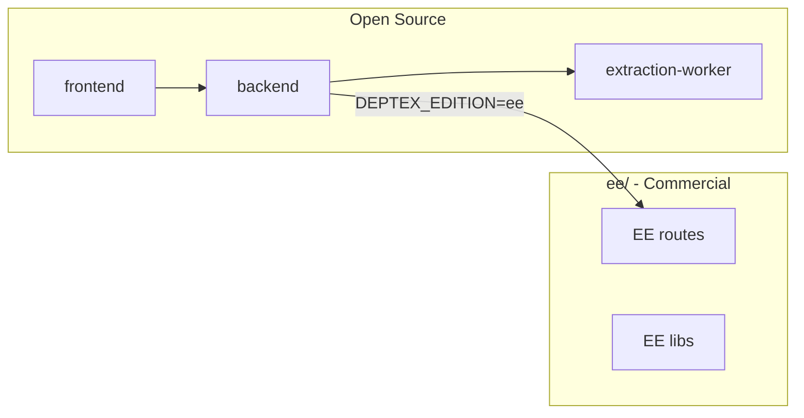

# Developing Deptex

This guide helps you set up a local development environment for Deptex.

---

## Prerequisites

- **Node.js** 18+ (check [backend/package.json](./backend/package.json) and [frontend/package.json](./frontend/package.json))
- **Git**
- **Supabase** account (or self-hosted Postgres with Supabase Auth) for auth and database
- **npm** or **pnpm**

---

## Quick Start

### 1. Clone the repo

```bash
git clone https://github.com/deptex/deptex.git
cd deptex
```

### 2. Backend setup

```bash
cd backend
npm install
cp .env.example .env   # or create .env with required vars
```

**Required env vars** (see `.env.example`):

- `SUPABASE_URL`, `SUPABASE_SERVICE_ROLE_KEY`, `SUPABASE_ANON_KEY`
- For EE features: `UPSTASH_REDIS_URL`, `UPSTASH_REDIS_TOKEN`, `QSTASH_`*, GitHub App credentials, etc.

### 3. Run the backend

**Full (EE) mode** (default — orgs, teams, integrations, Aegis):

```bash
cd backend
npm run dev
```

Backend runs at `http://localhost:3001`.

### 4. Frontend setup

```bash
cd frontend
npm install
```

Create `.env` with:

```
VITE_API_URL=http://localhost:3001
VITE_SUPABASE_URL=<your-supabase-url>
VITE_SUPABASE_ANON_KEY=<your-supabase-anon-key>
```

### 5. Run the frontend

```bash
cd frontend
npm run dev
```

Frontend runs at `http://localhost:3000` (or the port Vite assigns).

### 6. Extraction worker (optional)

For dependency extraction (clone, SBOM, dep-scan):

```bash
cd backend/extraction-worker
npm install
# Set SUPABASE_* and optionally REDIS in .env
npm run dev
```

---

## Project Structure




| Directory                    | Purpose                                               |
| ---------------------------- | ----------------------------------------------------- |
| `backend/`                   | Express API, core libs, CE routes                     |
| `backend/extraction-worker/` | Clone, cdxgen, SBOM, dep-scan pipeline                |
| `ee/backend/`                | EE routes (orgs, teams, integrations, Aegis, workers) |
| `frontend/`                  | React dashboard                                       |
| `backend/database/`          | SQL migrations                                        |


---

## Running Tests

```bash
cd backend
npm run test
```

Tests run with `DEPTEX_EDITION=ee` so EE routes are available. Use mocks for external services (Supabase, GitHub, etc.).

---

## Environment Modes


| Variable                     | Effect                                              |
| ---------------------------- | --------------------------------------------------- |
| `DEPTEX_EDITION=ee` or unset | Full mode — EE routes loaded                        |
| `NODE_PATH=node_modules`     | Required for EE modules to resolve (set in scripts) |


---

## Database

- Migrations live in `backend/database/`
- Core tables: `projects`, `project_repositories`, `dependencies`, `dependency_versions`, `project_dependencies`, `dependency_vulnerabilities`, etc.
- EE tables: `organizations`, `teams`, `organization_integrations`, `aegis_*`, etc.
- See [ee/database/README.md](./ee/database/README.md) for EE migration notes

---

## Common Tasks

- **Add a CE route**: Add to `backend/src/routes/` and register in `backend/src/index.ts` (outside the `if (isEeEdition())` block)
- **Add an EE route**: Add to `ee/backend/routes/` and register inside the `if (isEeEdition())` block in `backend/src/index.ts`
- **Add a core lib**: Add to `backend/src/lib/` — keep it free of EE imports

---

## Create a Pull Request

1. Fork the repo
2. Create a branch
3. Make changes, run tests
4. Open a PR — see [CONTRIBUTING.md](./CONTRIBUTING.md)

---

## Troubleshooting

- **"Cannot find module" for EE libs**: Ensure `NODE_PATH=node_modules` when running (scripts set this)
- **404 on /api/organizations**: You're in CE mode; use `npm run dev` (not `dev:ce`) for full features
- **Supabase errors**: Check `.env` has correct Supabase URL and keys

