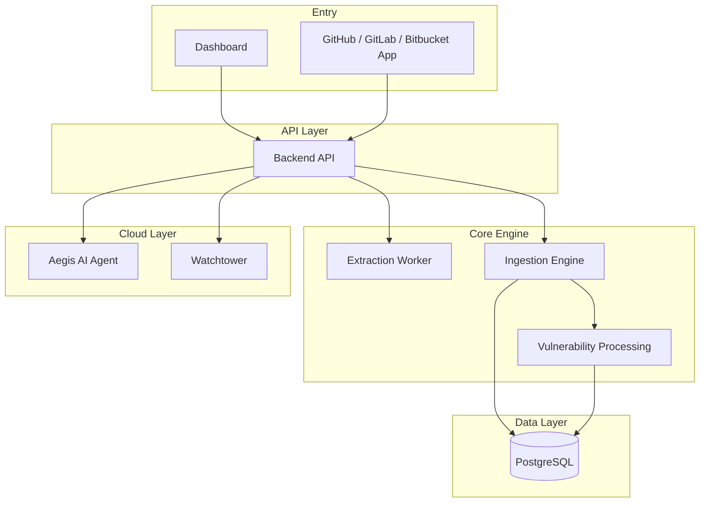

# Deptex

The AI-powered Open Source Security Platform.  
Automate dependency intelligence, vulnerability analysis, and supply-chain anomaly detection.

---

## Overview

Deptex is a security and compliance platform that helps organizations understand, monitor, and protect their codebases. It combines **dependency intelligence**, **continuous monitoring**, and an **autonomous AI security agent** to automate the hardest parts of modern software security.

**Documentation:** [deptex.ca/docs](http://deptex.ca/docs)

---

## How it works

Deptex uses open-source tools and builds on top of a core extraction and analysis pipeline. You sign up, connect your repos, and start getting dependency intelligence and vulnerability insights without installing anything.

### Architecture

### Core components

| Component | Description |
|-----------|-------------|
| **Dashboard** | React UI for projects, dependencies, vulnerabilities, and compliance. Connects to your repos and displays the dependency graph, CVE reachability, and license info. |
| **Backend API** | Express API that orchestrates ingestion, triggers extraction jobs, and serves data to the frontend. Handles auth, webhooks, and routing. |
| **Extraction Worker** | Clones repos, runs cdxgen for SBOM generation, dep-scan for vulnerability detection, and AST analysis. Produces dependency trees and metadata. |
| **Ingestion Engine** | Processes SBOMs, normalizes packages across ecosystems, builds the dependency graph, and stores everything in PostgreSQL. |
| **Vulnerability Processing** | Matches dependencies to CVEs (via GHSA and NVD), analyzes reachability, and computes impact. Powers the vulnerability dashboard. |
| **Aegis AI** | Autonomous security agent — PR comments, patch suggestions, background audits. (Cloud) |
| **Watchtower** | Upstream anomaly detection for supply-chain risks. (Cloud) |

### Key features

- **Vulnerability scanning** — CVE reachability, impact analysis
- **License auditing** — Policy enforcement
- **Dependency graph** — Transitive analysis, reachability
- **SBOM** — Automatic generation, drift detection
- **Watchtower** — Upstream anomaly detection (Cloud)
- **Aegis AI** — PR reviews, patch suggestions, background audits (Cloud)

---

## Open core

Deptex uses an open-core model: the core engine (extraction, ingestion, vulnerability processing) is open source; the cloud platform (organizations, teams, integrations, Aegis, Watchtower) is commercial.

| Layer | What | License |
|-------|------|---------|
| **Core** | backend/, frontend/, extraction-worker | Apache 2.0 |
| **Cloud** | ee/ (orgs, teams, GitHub App, Aegis, Watchtower) | Proprietary |

---

## Community & Support

- **GitHub Issues** — Bug reports, feature requests
- **Contributing** — [CONTRIBUTING.md](./CONTRIBUTING.md)
- **Email** — For infrastructure or enterprise needs

---

## License

- **Core**: Apache 2.0 — see [LICENSE](./LICENSE)
- **ee/**: Proprietary — see [ee/LICENSE](./ee/LICENSE)

