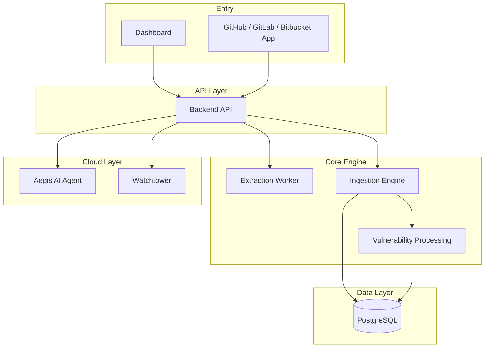

# Deptex

The AI-powered, source-available security platform.  
Automate dependency intelligence, vulnerability analysis, and supply-chain security.

---

## Overview

Deptex is a security and compliance platform that helps organizations understand, monitor, and protect their codebases. It combines **dependency intelligence**, **continuous monitoring**, and an **autonomous AI security agent** to automate the hardest parts of modern software security.

**Documentation:** [deptex.dev/docs](http://deptex.dev/docs)

---

## How it works

Deptex uses open-source tools and builds on top of a core extraction and analysis pipeline. You sign up, connect your repos, and start getting dependency intelligence and vulnerability insights without installing anything.

### Architecture

```mermaid
flowchart TB
    subgraph Entry [Entry]
        Frontend[Dashboard]
        GitHubApp[GitHub / GitLab / Bitbucket App]
    end

    subgraph API [API Layer]
        Backend[Backend API]
    end

    subgraph Core [Core Engine]
        Extraction[Extraction Worker]
        Ingestion[Ingestion Engine]
        Vuln[Vulnerability Processing]
    end

    subgraph Data [Data Layer]
        Postgres[(PostgreSQL)]
    end

    subgraph EE [Cloud Layer]
        Aegis[Aegis AI Agent]
        Watchtower[Watchtower]
    end

    Frontend --> Backend
    GitHubApp --> Backend
    Backend --> Extraction
    Backend --> Ingestion
    Ingestion --> Vuln
    Ingestion --> Postgres
    Vuln --> Postgres
    Backend --> Aegis
    Backend --> Watchtower
```

### Core components

| Component | Description |
|-----------|-------------|
| **Dashboard** | React UI for projects, dependencies, vulnerabilities, and compliance. Connects to your repos and displays the dependency graph, CVE reachability, and license info. |
| **Backend API** | Express API that orchestrates ingestion, triggers extraction jobs, and serves data to the frontend. Handles auth, webhooks, and routing. |
| **Extraction Worker** | Clones repos, runs cdxgen for SBOM generation, dep-scan for vulnerability detection, and AST analysis. Produces dependency trees and metadata. |
| **Ingestion Engine** | Processes SBOMs, normalizes packages across ecosystems, builds the dependency graph, and stores everything in PostgreSQL. |
| **Vulnerability Processing** | Matches dependencies to CVEs (via GHSA and NVD), analyzes reachability, and computes impact. Powers the vulnerability dashboard. |
| **Aegis AI** | Autonomous security agent — investigates findings, plans fixes you approve, opens draft PRs. (Cloud) |
| **Watchtower** | Daily upstream monitoring — new releases and advisories. (Cloud) |

### Key features

- **Vulnerability scanning** — CVE reachability, impact analysis
- **License auditing** — Policy enforcement
- **Dependency graph** — Transitive analysis, reachability
- **SBOM** — Automatic generation, drift detection
- **Watchtower** — Upstream release & advisory monitoring (Cloud)
- **Aegis AI** — Investigation, fix planning, draft-PR remediation (Cloud)

---

## License model

Deptex is **open source** under the [GNU Affero General Public License v3.0 (AGPL-3.0)](./LICENSE) — use, modify, self-host, and redistribute it freely. AGPL's network copyleft means anyone who runs a modified version as a service must make their source available under the same license. Organizations that need different terms can obtain a commercial license; contributions are accepted under a [CLA](./CLA.md) so we can offer both.

Running it yourself? See [**docs/self-hosting.md**](./docs/self-hosting.md).

---

## Community & Support

- **GitHub Issues** — Bug reports, feature requests
- **Contributing** — [CONTRIBUTING.md](./CONTRIBUTING.md)
- **Email** — For infrastructure or enterprise needs

---

## License

Licensed under the [GNU Affero General Public License v3.0](./LICENSE) (AGPL-3.0-or-later). Copyright © 2026 Henry Ruckman-Utting. Contributions are accepted under the [Contributor License Agreement](./CLA.md).

